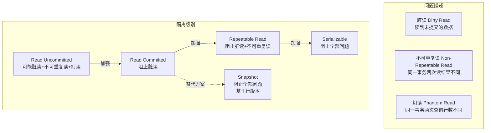
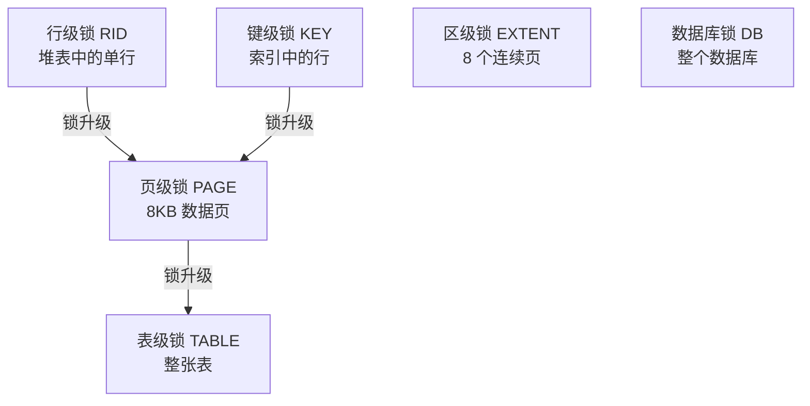
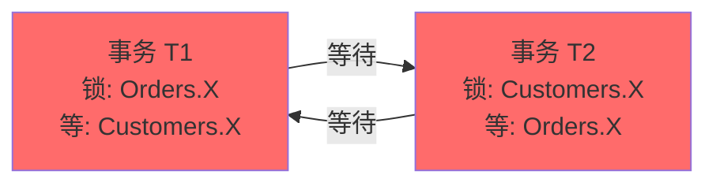
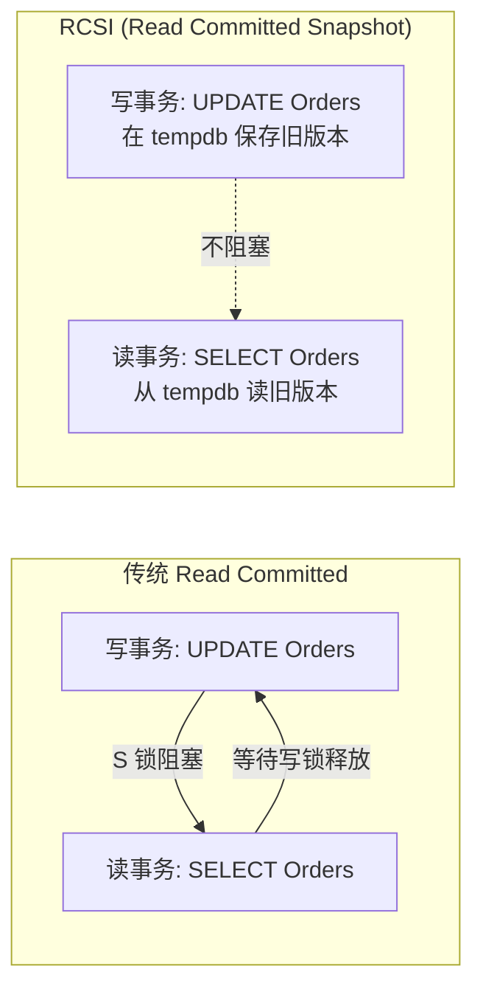

# 事务隔离与锁机制

> **并发控制是数据库最复杂的话题之一。** SQL Server 通过锁和行版本两种机制实现事务隔离，理解它们是写出高并发应用的前提。

---

## 一、事务隔离级别

SQL Server 支持 5 种隔离级别，按一致性从弱到强排列：

| 隔离级别 | 脏读 | 不可重复读 | 幻读 | 实现机制 |
|----------|------|-----------|------|----------|
| Read Uncommitted | ✅ 可能 | ✅ 可能 | ✅ 可能 | 不请求任何锁 |
| **Read Committed（默认）** | ❌ 阻止 | ✅ 可能 | ✅ 可能 | 共享锁读完即释 |
| Repeatable Read | ❌ 阻止 | ❌ 阻止 | ✅ 可能 | 共享锁持到事务结束 |
| Serializable | ❌ 阻止 | ❌ 阻止 | ❌ 阻止 | 键范围锁 |
| **Snapshot** | ❌ 阻止 | ❌ 阻止 | ❌ 阻止 | 行版本（tempdb） |



### 1.1 Read Uncommitted

```sql
-- 等同于 NOLOCK 提示：读不加锁，可能读到脏数据
SET TRANSACTION ISOLATION LEVEL READ UNCOMMITTED;

SELECT * FROM Orders;  -- 可能读到其他事务未提交的修改
```

::: warning 脏读风险
Read Uncommitted 可能读到逻辑上不存在的数据（如事务回滚前的中间状态）。只在报表/统计分析等可容忍不精确的场景使用。
:::

### 1.2 Read Committed（默认）

```sql
-- SQL Server 默认隔离级别
SET TRANSACTION ISOLATION LEVEL READ COMMITTED;

-- 读操作获取共享锁（S），读完后立即释放
-- 写操作获取排他锁（X），持到事务结束
BEGIN TRANSACTION;
    SELECT * FROM Orders WHERE OrderId = 1001;  -- 加 S 锁，读完后释放
    -- 此处其他事务可修改 OrderId=1001
    SELECT * FROM Orders WHERE OrderId = 1001;  -- 可能读到不同的值！
COMMIT;
```

### 1.3 Repeatable Read

```sql
SET TRANSACTION ISOLATION LEVEL REPEATABLE READ;

BEGIN TRANSACTION;
    SELECT * FROM Orders WHERE OrderId = 1001;  -- 加 S 锁，持到事务结束
    -- 其他事务不能修改 OrderId=1001
    SELECT * FROM Orders WHERE OrderId = 1001;  -- 保证读到相同值
COMMIT;  -- 释放 S 锁
```

### 1.4 Serializable

```sql
SET TRANSACTION ISOLATION LEVEL SERIALIZABLE;

BEGIN TRANSACTION;
    SELECT * FROM Orders WHERE Amount > 10000;  -- 加键范围锁
    -- 其他事务不能 INSERT Amount > 10000 的新行（防幻读）
    SELECT * FROM Orders WHERE Amount > 10000;  -- 保证结果集完全相同
COMMIT;
```

### 1.5 Snapshot（RCSI）

```sql
-- 启用数据库级别的 Snapshot 隔离
ALTER DATABASE MyDB SET ALLOW_SNAPSHOT_ISOLATION ON;

SET TRANSACTION ISOLATION LEVEL SNAPSHOT;

BEGIN TRANSACTION;
    -- 读操作从 tempdb 版本存储中读取事务开始时的数据快照
    -- 不加共享锁，不阻塞写操作
    SELECT * FROM Orders WHERE OrderId = 1001;
COMMIT;
```

```sql
-- 更推荐：READ_COMMITTED_SNAPSHOT（RCSI）
-- 将默认的 Read Committed 改为基于行版本
ALTER DATABASE MyDB SET READ_COMMITTED_SNAPSHOT ON;

-- 此后 Read Committed 不再加 S 锁，而是读行版本
-- 效果类似 Oracle 的读一致性
SET TRANSACTION ISOLATION LEVEL READ COMMITTED;  -- 行为已变为快照读
```

::: important RCSI vs Snapshot
- **RCSI**：只影响 READ COMMITTED 隔离级别的读操作，语句级快照
- **SNAPSHOT**：需要显式设置隔离级别，事务级快照
- RCSI 更推荐：无需修改应用代码，直接在数据库级别开启
- 两者都使用 tempdb 版本存储，高更新负载时 tempdb 可能成为瓶颈
:::

---

## 二、锁类型与粒度

### 2.1 锁类型

| 锁类型 | 缩写 | 说明 |
|--------|------|------|
| 共享锁 | S | 读操作，允许多个并发读 |
| 更新锁 | U | 防止死锁的中间状态（读→改） |
| 排他锁 | X | 写操作，独占资源 |
| 意向共享 | IS | 下层有 S 锁的意向标记 |
| 意向排他 | IX | 下层有 X 锁的意向标记 |
| 意向排他共享 | SIX | 下层有 S 和 IX 锁 |
| 架构稳定性 | Sch-S | 编译查询时持有，不阻塞 DML |
| 架构修改 | Sch-M | 修改表结构时持有，阻塞一切 |
| 键范围 | RangeS-S 等 | Serializable 隔离级别，防止幻读 |
| 批量更新 | BU | 批量导入时持有 |

### 2.2 锁粒度与升级



```sql
-- 查看当前锁信息
SELECT
    request_session_id AS SessionId,
    resource_type AS ResourceType,
    resource_database_id AS DBId,
    DB_NAME(resource_database_id) AS DBName,
    resource_associated_entity_id AS ResourceId,
    request_mode AS LockMode,
    request_status AS Status
FROM sys.dm_tran_locks
WHERE resource_type = 'OBJECT';

-- 更友好的锁查看
EXEC sp_lock;
-- 或 SQL Server 2016+
SELECT * FROM sys.dm_tran_locks WHERE request_session_id = @@SPID;
```

::: tip 锁升级阈值
当单个语句在同一对象上持有 > 5000 个行/键级锁时，SQL Server 自动升级为表级锁。这可能在不知不觉中从行锁变为表锁，导致并发性骤降。可通过跟踪标志 1211/1224 禁用锁升级（谨慎使用）。
:::

---

## 三、死锁

### 3.1 死锁原理



```sql
-- 事务 T1
BEGIN TRANSACTION;
    UPDATE Orders SET Amount = 500 WHERE OrderId = 1001;  -- 持有 Orders.X
    WAITFOR DELAY '00:00:05';
    UPDATE Customers SET LastOrderDate = GETDATE() WHERE CustomerId = 1;  -- 等待 Customers.X
COMMIT;

-- 事务 T2（并发执行）
BEGIN TRANSACTION;
    UPDATE Customers SET TotalOrders = TotalOrders + 1 WHERE CustomerId = 1;  -- 持有 Customers.X
    WAITFOR DELAY '00:00:05';
    UPDATE OrderDetails SET Quantity = 2 WHERE OrderId = 1001;  -- 等待 Orders.X
COMMIT;
-- SQL Server 检测到死锁，选择代价较小的事务作为牺牲者
```

### 3.2 死锁诊断

```sql
-- 方法 1：跟踪标志 1222（将死锁图写入错误日志）
DBCC TRACEON(1222, -1);  -- 全局开启
-- 死锁发生后在错误日志中查看
EXEC xp_readerrorlog 0, 1, N'deadlock';

-- 方法 2：Extended Events（2012+ 推荐）
-- SQL Server 默认已创建 system_health 会话，自动捕获死锁图
SELECT XEvent.query('(event/data/value/deadlock)[1]') AS DeadlockGraph
FROM (
    SELECT CAST(target_data AS XML) AS TargetData
    FROM sys.dm_xe_session_targets st
    JOIN sys.dm_xe_sessions s ON s.address = st.event_session_address
    WHERE s.name = 'system_health'
) AS Data
CROSS APPLY TargetData.nodes('//RingBufferTarget/event') AS XEventData(XEvent)
WHERE XEvent.value('@name', 'varchar(4000)') = 'xml_deadlock_report';

-- 方法 3：SQL Server Profiler（旧方法，不推荐新项目使用）
-- Deadlock Graph 事件类
```

### 3.3 死锁预防策略

```sql
-- 1. 按固定顺序访问表（最根本的解决方案）
-- 所有事务都按 Customers → Orders → OrderDetails 顺序访问

-- 2. 减少事务范围和持续时间
-- ❌ 错误：事务中有外部调用
BEGIN TRANSACTION;
    UPDATE Orders SET Amount = 500 WHERE OrderId = 1001;
    EXEC xp_sendmail ...;  -- 外部调用，可能很慢！
COMMIT;

-- ✅ 正确：事务只包含必要的数据库操作
BEGIN TRANSACTION;
    UPDATE Orders SET Amount = 500 WHERE OrderId = 1001;
COMMIT;

-- 3. 使用 UPDLOCK 提前获取更新锁
BEGIN TRANSACTION;
    -- 用 UPDLOCK 读取并锁定，防止后续 UPDATE 死锁
    SELECT * FROM Inventory WITH (UPDLOCK) WHERE ProductId = 1;
    UPDATE Inventory SET Stock = Stock - 1 WHERE ProductId = 1;
COMMIT;

-- 4. 设置死锁优先级
SET DEADLOCK_PRIORITY LOW;  -- 发生死锁时，此事务优先被牺牲
```

---

## 四、锁提示（Lock Hints）

```sql
-- NOLOCK：读不加锁（等同于 Read Uncommitted）
SELECT * FROM Orders WITH (NOLOCK) WHERE OrderId = 1001;

-- UPDLOCK：读取时加更新锁，准备后续修改
SELECT * FROM Inventory WITH (UPDLOCK) WHERE ProductId = 1;

-- XLOCK：加排他锁，即使只是读取
SELECT * FROM Orders WITH (XLOCK) WHERE OrderId = 1001;

-- HOLDLOCK：持锁到事务结束（等同于 Serializable）
SELECT * FROM Orders WITH (HOLDLOCK) WHERE OrderId = 1001;

-- ROWLOCK / PAGLOCK / TABLOCK：指定锁粒度
UPDATE Orders WITH (ROWLOCK) SET Amount = 500 WHERE OrderId = 1001;

-- READPAST：跳过被锁的行
SELECT * FROM Orders WITH (READPAST) WHERE CustomerId = 1;
```

::: warning NOLOCK 的危险
- 可能读到脏数据（未提交的修改）
- 可能读到同一页上两次的行（页分裂时）
- 可能完全漏掉行（页分裂时）
- 只在明确可容忍数据不准确的场景使用（如报表统计）
:::

---

## 五、乐观并发：READ_COMMITTED_SNAPSHOT



```sql
-- 启用 RCSI
ALTER DATABASE MyDB SET READ_COMMITTED_SNAPSHOT ON;

-- 验证
SELECT name, is_read_committed_snapshot_on
FROM sys.databases
WHERE name = 'MyDB';

-- RCSI 下的读写行为
-- 写事务：修改行时，旧行版本保存到 tempdb 版本存储
-- 读事务：遇到 X 锁时，从 tempdb 读取最近已提交版本
-- 结果：读不阻塞写，写不阻塞读
```

::: tip RCSI 是 SQL Server 的最佳实践
- Azure SQL Database 默认已开启 RCSI
- 消除了读写互相阻塞的问题
- 代价：tempdb 空间增加、写入延迟微增（需维护版本链）
- ABP Framework 的 SQL Server 使用建议也推荐开启 RCSI
:::

---

## 六、ABP Framework 的事务管理

[ABP Framework](https://github.com/abpframework/abp) 提供了统一的事务管理抽象：

```csharp
// ABP 的 Unit of Work 模式
// 源码参考: Volo.Abp.Uow

[UnitOfWork]
public async Task CreateOrderAsync(CreateOrderDto input)
{
    // ABP 自动开启事务
    var order = new Order(input.CustomerId, input.Amount);
    await _orderRepository.InsertAsync(order);

    foreach (var item in input.Items)
    {
        await _orderItemRepository.InsertAsync(new OrderItem(order.Id, item));
    }
    // 方法结束时自动提交，异常时自动回滚
}

// 手动控制事务隔离级别
[UnitOfWork(isTransactional: true, isolationLevel: IsolationLevel.ReadCommitted)]
public async Task TransferAsync(TransferDto input)
{
    await _accountService.DebitAsync(input.FromAccountId, input.Amount);
    await _accountService.CreditAsync(input.ToAccountId, input.Amount);
}
```

```sql
-- ABP 默认使用 Read Committed 隔离级别
-- 生产环境建议开启 RCSI：
ALTER DATABASE AbpProject SET READ_COMMITTED_SNAPSHOT ON;

-- ABP 的审计日志表（高并发写入）
SELECT TOP 5 * FROM AbpAuditLogs ORDER BY ExecutionTime DESC;
-- 如果写入阻塞严重，考虑 RCSI
```

---

## 七、面试技巧

::: tip 面试高频考点
1. **5 种隔离级别**：能说出每种阻止哪些问题，默认是 Read Committed
2. **RCSI 原理**：基于 tempdb 行版本，读写不阻塞，Azure SQL 默认开启
3. **死锁三要素**：互斥、持有等待、不可抢占 → 循环等待图
4. **锁升级**：> 5000 行锁自动升级为表锁
5. **NOLOCK 危害**：脏读 + 可能读到两次/漏掉行
6. **乐观 vs 悲观**：SQL Server 的 RCSI/Snapshot 是乐观，传统锁是悲观
:::

::: warning 易错点
- "Snapshot 隔离级别不会阻塞"——❌，写写之间仍然用 X 锁互斥
- "RCSI 和 Snapshot 隔离级别一样"——❌，RCSI 是语句级快照，Snapshot 是事务级快照
- "锁升级只能发生在表级别"——✅，SQL Server 的锁升级直接从行/页跳到表
- "SERIALIZABLE 是最好的隔离级别"——❌，一致性最强但并发最差，极少使用
:::

---

## 参考资料

- [Transaction Isolation Levels](https://learn.microsoft.com/en-us/sql/relational-databases/sql-server-transaction-locking-and-row-versioning-guide)
- [Deadlock Detection](https://learn.microsoft.com/en-us/sql/relational-databases/sql-server-deadlock-guide)
- [Row Versioning-based Isolation Levels](https://learn.microsoft.com/en-us/sql/relational-databases/sql-server-transaction-isolation-levels)
- [ABP Framework GitHub](https://github.com/abpframework/abp)
