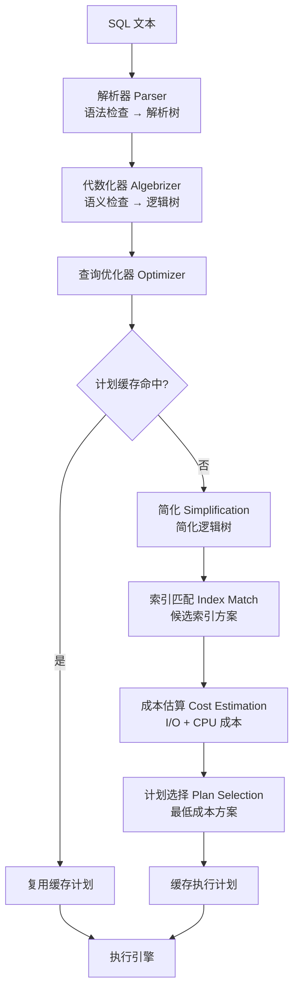
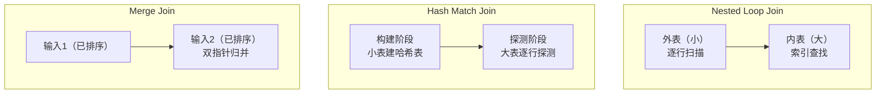
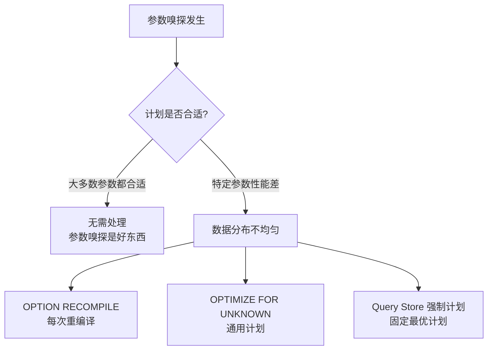

# 执行计划深度解读

> **读懂执行计划，就像拥有了 SQL Server 的 X 光机。** 不看执行计划的调优，等于蒙眼开车。

---

## 一、查询优化管线



::: important 优化器是成本驱动的
SQL Server 优化器基于 **成本估算（Cost-Based）** 选择执行计划，而非"最优"。它依赖统计信息估算行数和成本，统计信息不准确时，可能选择次优计划。
:::

---

## 二、核心算子解读

### 2.1 扫描 vs 查找

| 算子 | 含义 | 成本 | 场景 |
|------|------|------|------|
| **Table Scan** | 全表扫描 | 高 | 堆表无索引 |
| **Clustered Index Scan** | 聚集索引全扫 | 高 | 无合适索引 |
| **Clustered Index Seek** | 聚集索引查找 | 低 | ✅ 理想 |
| **Non-Clustered Index Scan** | 非聚集索引全扫 | 中 | 索引不够精确 |
| **Non-Clustered Index Seek** | 非聚集索引查找 | 低 | ✅ 理想 |
| **Key Lookup** | 回表查聚集索引 | 中高 | 非聚集索引未覆盖 |

```sql
-- 演示 Seek vs Scan
-- 1. 没有索引 → Clustered Index Scan
SELECT * FROM Orders WHERE CustomerId = 1001;

-- 2. 创建非聚集索引 → Index Seek + Key Lookup
CREATE INDEX IX_Orders_CustomerId ON Orders(CustomerId);
SELECT * FROM Orders WHERE CustomerId = 1001;
-- 执行计划: Index Seek (IX_Orders_CustomerId) → Key Lookup (PK_Orders)

-- 3. 覆盖索引 → 纯 Index Seek
CREATE INDEX IX_Orders_CustId_Cover ON Orders(CustomerId)
INCLUDE (OrderDate, Amount);
SELECT CustomerId, OrderDate, Amount FROM Orders WHERE CustomerId = 1001;
-- 执行计划: Index Seek（无 Key Lookup）
```

### 2.2 连接算子

| 算子 | 最佳场景 | 复杂度 | 内存 |
|------|----------|--------|------|
| **Nested Loop Join** | 小表驱动大表，有索引 | O(N×M) | 极少 |
| **Hash Match Join** | 大表×大表，无索引 | O(N+M) | 多 |
| **Merge Join** | 两个输入都已排序 | O(N+M) | 极少 |



```sql
-- Nested Loop：小表（10行）驱动大表（100万行），内表有索引
SELECT o.OrderId, c.CustomerName
FROM Customers c  -- 小表：外表
JOIN Orders o ON o.CustomerId = c.CustomerId  -- 大表：内表，CustomerId 有索引
WHERE c.CustomerId = 1001;
-- 10次 Index Seek，极快

-- Hash Match：两个大表连接，无索引
SELECT o.OrderId, p.ProductName
FROM Orders o
JOIN OrderItems oi ON o.OrderId = oi.OrderId
JOIN Products p ON oi.ProductId = p.ProductId
WHERE o.OrderDate >= '2024-01-01';
-- 先对一个输入建哈希表，再逐行探测另一个输入

-- Merge Join：两输入都已排序
SELECT o.OrderId, od.OrderId
FROM Orders o
JOIN OrderDetails od ON o.OrderId = od.OrderId
-- 如果两个输入都按 OrderId 排序，优化器选择 Merge Join
```

### 2.3 聚合与排序

| 算子 | 说明 |
|------|------|
| **Hash Aggregate** | 哈希聚合，适合大数据量、无排序输入 |
| **Stream Aggregate** | 流聚合，输入已排序时可逐行累加，省内存 |
| **Sort** | 排序，可能溢出到 tempdb（Spill to TempDB） |
| **Spool** | 缓存中间结果，避免重复计算 |

---

## 三、SET STATISTICS IO / TIME

```sql
-- 开启 I/O 和时间统计
SET STATISTICS IO ON;
SET STATISTICS TIME ON;

SELECT o.OrderId, c.CustomerName, o.Amount
FROM Orders o
JOIN Customers c ON o.CustomerId = c.CustomerId
WHERE o.OrderDate >= '2024-01-01'
ORDER BY o.Amount DESC;

-- 输出示例：
-- SQL Server 执行时间:
--    CPU 时间 = 15 ms，占用时间 = 12 ms
-- 表 'Orders'。扫描计数 1，逻辑读取 42 次，物理读取 0 次，预读 0 次
-- 表 'Customers'。扫描计数 1，逻辑读取 8 次，物理读取 0 次，预读 0 次
```

| 指标 | 含义 | 关注 |
|------|------|------|
| 逻辑读取 | 从 Buffer Pool 读取的页数 | ✅ 最核心的指标 |
| 物理读取 | 从磁盘读取的页数 | 冷查询时关注 |
| 预读 | 预读到 Buffer Pool 的页数 | 大扫描时关注 |
| 扫描计数 | 访问表的次数 | Nested Loop 时关注 |
| CPU 时间 | CPU 消耗 | 排序/哈希时关注 |
| 占用时间 | 实际耗时（含等待） | 含锁等待等 |

::: tip 调优看逻辑读取
逻辑读取是评价查询效率的最稳定指标——不受缓存状态影响。同样的查询，逻辑读取越少越好。
:::

---

## 四、实际执行计划 vs 估算执行计划

```sql
-- 估算执行计划（不实际执行）
-- SSMS: Ctrl+L
-- 不执行查询，只看优化器的估算

-- 实际执行计划（执行后查看）
-- SSMS: Ctrl+M
SET STATISTICS PROFILE ON;
SELECT * FROM Orders WHERE CustomerId = 1001;
-- 返回实际行数 vs 估算行数，差异大说明统计信息不准确
```

| 维度 | 估算计划 | 实际计划 |
|------|----------|----------|
| 是否执行 | ❌ | ✅ |
| 行数 | 估算值 | 实际值 |
| 成本 | 估算值 | 实际 I/O/CPU |
| 用途 | 开发时预览 | 性能诊断 |
| 可靠性 | 可能偏差大 | ✅ 真实 |

---

## 五、参数嗅探（Parameter Sniffing）

参数嗅探是 SQL Server 优化器根据第一次传入的参数值生成执行计划并缓存，后续不同参数复用同一计划——但不同参数可能需要不同的最优计划。

```sql
-- 场景：Orders 表 CustomerId 分布不均匀
-- CustomerId=1 有 100万订单，CustomerId=9999 只有 5 订单

-- 第一次调用：CustomerId=9999（少量数据）
EXEC sp_executesql
    N'SELECT * FROM Orders WHERE CustomerId = @CustId',
    N'@CustId INT', @CustId = 9999;
-- 优化器选择 Index Seek + Key Lookup（少量数据，回表划算）

-- 第二次调用：CustomerId=1（大量数据）
EXEC sp_executesql
    N'SELECT * FROM Orders WHERE CustomerId = @CustId',
    N'@CustId INT', @CustId = 1;
-- 复用了上面的 Seek + Lookup 计划！
-- 但 100万行回表比全表扫描更慢！

-- 解决方案 1：OPTION (RECOMPILE) 每次重编译
EXEC sp_executesql
    N'SELECT * FROM Orders WHERE CustomerId = @CustId OPTION (RECOMPILE)',
    N'@CustId INT', @CustId = 1;
-- 每次重新生成最优计划，代价是编译开销

-- 解决方案 2：OPTION (OPTIMIZE FOR UNKNOWN)
SELECT * FROM Orders WHERE CustomerId = @CustId
OPTION (OPTIMIZE FOR UNKNOWN);
-- 不使用参数值，用统计信息的平均值生成通用计划

-- 解决方案 3：OPTION (OPTIMIZE FOR) 指定参数值
SELECT * FROM Orders WHERE CustomerId = @CustId
OPTION (OPTIMIZE FOR (@CustId = 1));
-- 按指定值优化（适合已知典型参数分布）

-- 解决方案 4：本地变量"去嗅探"
DECLARE @LocalCustId INT = @CustId;
SELECT * FROM Orders WHERE CustomerId = @LocalCustId;
-- 本地变量不会被嗅探，优化器使用通用估算
```



::: important 参数嗅探是双刃剑
- **好处**：避免每次编译，计划缓存复用效率高
- **坏处**：数据分布不均时，"通用计划"可能对某些参数很差
- **判断方法**：Query Store 的 Regressed Queries 报告
:::

---

## 六、Query Store

SQL Server 2016+ 的 Query Store 是执行计划管理的革命性功能。

```sql
-- 启用 Query Store
ALTER DATABASE MyDB SET QUERY_STORE = ON;
ALTER DATABASE MyDB SET QUERY_STORE (
    OPERATION_MODE = READ_WRITE,
    MAX_STORAGE_SIZE_MB = 1000,
    QUERY_CAPTURE_MODE = AUTO
);

-- 查找性能回归的查询
SELECT
    qs.query_id,
    qt.query_sql_text,
    rp.plan_id AS RegressedPlanId,
    fp.plan_id AS ForcedPlanId,
    rs.avg_duration AS RegressedDuration,
    fs.avg_duration AS ForcedDuration
FROM sys.query_store_query qs
JOIN sys.query_store_query_text qt ON qs.query_text_id = qt.query_text_id
JOIN sys.query_store_plan rp ON qs.query_id = rp.query_id
JOIN sys.query_store_runtime_stats rs ON rp.plan_id = rs.plan_id
CROSS APPLY (
    SELECT TOP 1 p.plan_id, s.avg_duration
    FROM sys.query_store_plan p
    JOIN sys.query_store_runtime_stats s ON p.plan_id = s.plan_id
    WHERE p.query_id = qs.query_id
    ORDER BY s.avg_duration ASC
) fp (plan_id, avg_duration)
JOIN sys.query_store_runtime_stats fs ON fp.plan_id = fs.plan_id
WHERE rs.avg_duration > fs.avg_duration * 5;  -- 回归超过5倍

-- 强制使用特定执行计划
EXEC sp_query_store_force_plan @query_id = 42, @plan_id = 108;

-- 取消强制计划
EXEC sp_query_store_unforce_plan @query_id = 42, @plan_id = 108;
```

---

## 七、缺失索引 DMV

```sql
-- SQL Server 自动建议的缺失索引
SELECT TOP 10
    ROUND(migs.avg_total_user_cost * migs.avg_user_impact * (migs.user_seeks + migs.user_scans), 2) AS ImprovementMeasure,
    mid.statement AS TableName,
    mid.equality_columns,
    mid.inequality_columns,
    mid.included_columns,
    migs.user_seeks,
    migs.user_scans,
    migs.avg_total_user_cost,
    migs.avg_user_impact
FROM sys.dm_db_missing_index_details mid
JOIN sys.dm_db_missing_index_groups mig ON mid.index_handle = mig.index_handle
JOIN sys.dm_db_missing_index_group_stats migs ON mig.index_group_handle = migs.group_handle
ORDER BY ImprovementMeasure DESC;

-- 生成创建索引语句
SELECT
    'CREATE INDEX IX_' + REPLACE(REPLACE(COALESCE(equality_columns, '') +
        CASE WHEN equality_columns IS NOT NULL AND inequality_columns IS NOT NULL THEN '_' ELSE '' END +
        COALESCE(inequality_columns, ''), ',', '_'), ' ', '') +
    ' ON ' + statement +
    ' INCLUDE (' + COALESCE(included_columns, '') + ')' AS CreateIndexSQL
FROM sys.dm_db_missing_index_details mid
JOIN sys.dm_db_missing_index_groups mig ON mid.index_handle = mig.index_handle
JOIN sys.dm_db_missing_index_group_stats migs ON mig.index_group_handle = migs.group_handle
WHERE migs.avg_total_user_cost * migs.avg_user_impact * (migs.user_seeks + migs.user_scans) > 100;
```

::: warning 缺失索引建议的局限
1. 不考虑索引维护成本（写入开销）
2. 多个建议可能有重叠
3. 建议的索引可能太大（INCLUDE 列太多）
4. 需要人工审查后决定是否创建
5. 实例重启后 DMV 数据清零
:::

---

## 八、实战：找到最慢的查询

```sql
-- 1. 找到 CPU 最高的查询
SELECT TOP 10
    total_worker_time / execution_count AS AvgCpuMicroseconds,
    execution_count,
    total_worker_time / 1000000 AS TotalCpuSeconds,
    SUBSTRING(st.text, (qs.statement_start_offset / 2) + 1,
        (CASE qs.statement_end_offset WHEN -1 THEN DATALENGTH(st.text)
         ELSE qs.statement_end_offset END - qs.statement_start_offset) / 2 + 1) AS QueryText,
    qp.query_plan
FROM sys.dm_exec_query_stats qs
CROSS APPLY sys.dm_exec_sql_text(qs.sql_handle) st
CROSS APPLY sys.dm_exec_query_plan(qs.plan_handle) qp
ORDER BY AvgCpuMicroseconds DESC;

-- 2. 找到逻辑读取最多的查询
SELECT TOP 10
    total_logical_reads / execution_count AS AvgLogicalReads,
    execution_count,
    total_logical_reads AS TotalLogicalReads,
    SUBSTRING(st.text, (qs.statement_start_offset / 2) + 1,
        (CASE qs.statement_end_offset WHEN -1 THEN DATALENGTH(st.text)
         ELSE qs.statement_end_offset END - qs.statement_start_offset) / 2 + 1) AS QueryText
FROM sys.dm_exec_query_stats qs
CROSS APPLY sys.dm_exec_sql_text(qs.sql_handle) st
ORDER BY AvgLogicalReads DESC;

-- 3. 找到执行时间最长的查询
SELECT TOP 10
    total_elapsed_time / execution_count / 1000 AS AvgDurationMs,
    execution_count,
    total_elapsed_time / 1000 AS TotalElapsedMs,
    SUBSTRING(st.text, (qs.statement_start_offset / 2) + 1,
        (CASE qs.statement_end_offset WHEN -1 THEN DATALENGTH(st.text)
         ELSE qs.statement_end_offset END - qs.statement_start_offset) / 2 + 1) AS QueryText
FROM sys.dm_exec_query_stats qs
CROSS APPLY sys.dm_exec_sql_text(qs.sql_handle) st
ORDER BY AvgDurationMs DESC;
```

---

## 九、面试技巧

::: tip 面试高频考点
1. **Seek vs Scan**：Seek 是查找（快），Scan 是扫描（慢），理解何时发生
2. **Key Lookup**：非聚集索引未覆盖查询时回表，消除方法是 INCLUDE 列
3. **三种 Join 算子**：Nested Loop（小×大+索引）、Hash（大×大）、Merge（已排序）
4. **参数嗅探**：定义、影响、4 种解决策略
5. **Query Store**：强制计划、回归检测，2016+ 推荐功能
6. **逻辑读取**：调优最核心的指标，不受缓存影响
7. **缺失索引 DMV**：SQL Server 自动建议索引，但要人工审查
:::

::: warning 易错点
- "估算计划和实际计划一样"——❌，行数估算偏差可能导致错误的算子选择
- "Hash Join 一定比 Nested Loop 慢"——❌，大数据量无索引时 Hash 最优
- "Query Store 只能看不能操作"——❌，可以强制计划和回退
- "参数嗅探一定是坏事"——❌，大部分情况下参数嗅探提高了计划复用率
:::

---

## 参考资料

- [Execution Plans](https://learn.microsoft.com/en-us/sql/relational-databases/performance/execution-plans)
- [Query Processing Architecture Guide](https://learn.microsoft.com/en-us/sql/relational-databases/query-processing-architecture-guide)
- [Query Store](https://learn.microsoft.com/en-us/sql/relational-databases/performance/monitoring-performance-by-using-the-query-store)
- [Missing Index DMVs](https://learn.microsoft.com/en-us/sql/relational-databases/system-dynamic-management-views/sys-dm-db-missing-index-details-transact-sql)
