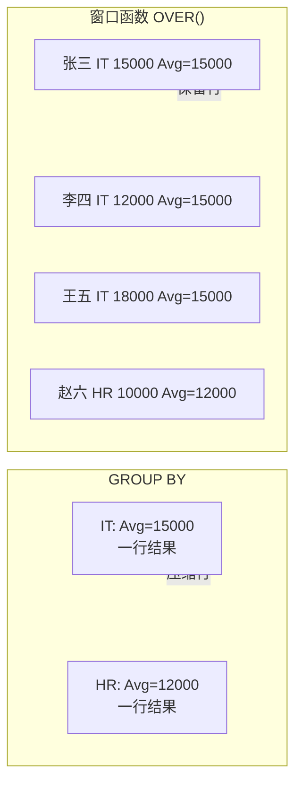
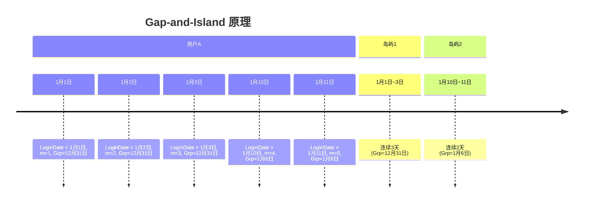

# 窗口函数

> **窗口函数让 SQL 的表达能力跃升一个维度——既能看个体，又能看整体，互不干扰。** 这是 SQL 从"会用"到"精通"的分水岭。

::: tip 与现有内容的关系
本篇聚焦 SQL Server 窗口函数的完整语法与性能优化。更深入的窗口函数实战练习，参考 [SQL Server 进阶 · 窗口函数精通](/后端开发/ASP.NET_Core/SQL%20Server进阶/01.窗口函数精通.md)。
:::

---

## 一、窗口函数 vs GROUP BY

```sql
-- GROUP BY：压缩行，每个组一行
SELECT Department, AVG(Salary) AS AvgSalary
FROM Employees
GROUP BY Department;
-- 结果：IT / 15000, HR / 12000

-- 窗口函数：保留所有行，附加聚合值
SELECT EmployeeId, Name, Department, Salary,
       AVG(Salary) OVER(PARTITION BY Department) AS DeptAvgSalary
FROM Employees;
-- 结果：每行都有部门平均工资，但原始行不丢失
```



---

## 二、排序窗口函数

### 2.1 ROW_NUMBER / RANK / DENSE_RANK / NTILE

```sql
-- 示例数据：同部门同薪水的情况
-- IT部: 张三=15000, 李四=15000, 王五=18000
-- HR部: 赵六=10000, 钱七=12000

SELECT Name, Department, Salary,
    ROW_NUMBER() OVER(PARTITION BY Department ORDER BY Salary DESC) AS rn,
    RANK()       OVER(PARTITION BY Department ORDER BY Salary DESC) AS rnk,
    DENSE_RANK() OVER(PARTITION BY Department ORDER BY Salary DESC) AS drnk,
    NTILE(2)     OVER(PARTITION BY Department ORDER BY Salary DESC) AS bucket
FROM Employees;

-- IT 部结果：
-- 王五 18000  rn=1  rnk=1  drnk=1  bucket=1
-- 张三 15000  rn=2  rnk=2  drnk=2  bucket=1
-- 李四 15000  rn=3  rnk=2  drnk=2  bucket=2  ← 注意差异
-- HR 部结果：
-- 钱七 12000  rn=1  rnk=1  drnk=1  bucket=1
-- 赵六 10000  rn=2  rnk=2  drnk=2  bucket=2
```

| 函数 | 相同值处理 | 示例（同值 15000） |
|------|-----------|-------------------|
| `ROW_NUMBER` | 不同编号 | 1, 2, 3 |
| `RANK` | 同编号，跳号 | 1, 2, 2, 4 |
| `DENSE_RANK` | 同编号，不跳号 | 1, 2, 2, 3 |
| `NTILE(n)` | 分 n 组 | 1, 1, 2, 2 |

---

## 三、聚合窗口函数

```sql
-- SUM / COUNT / AVG / MIN / MAX OVER()
SELECT
    OrderId, CustomerId, OrderDate, Amount,
    -- 累计金额（按日期排序）
    SUM(Amount) OVER(ORDER BY OrderDate
        ROWS BETWEEN UNBOUNDED PRECEDING AND CURRENT ROW) AS RunningTotal,
    -- 部门内累计
    SUM(Amount) OVER(PARTITION BY CustomerId ORDER BY OrderDate
        ROWS BETWEEN UNBOUNDED PRECEDING AND CURRENT ROW) AS CustRunningTotal,
    -- 所有订单总金额
    SUM(Amount) OVER() AS GrandTotal,
    -- 当前金额占比
    CAST(Amount AS FLOAT) / SUM(Amount) OVER() * 100 AS PctOfTotal
FROM Orders
ORDER BY OrderDate;
```

### 3.1 Frame 规范

```sql
-- ROWS vs RANGE 的区别
SELECT OrderDate, Amount,
    -- ROWS：物理行数
    SUM(Amount) OVER(ORDER BY OrderDate
        ROWS BETWEEN 1 PRECEDING AND 1 FOLLOWING) AS RowsFrame,
    -- RANGE：逻辑范围（同值视为一组）
    SUM(Amount) OVER(ORDER BY OrderDate
        RANGE BETWEEN UNBOUNDED PRECEDING AND CURRENT ROW) AS RangeFrame
FROM Orders;
```

| Frame 规范 | 含义 |
|------------|------|
| `ROWS BETWEEN UNBOUNDED PRECEDING AND CURRENT ROW` | 从第一行到当前行（累计） |
| `ROWS BETWEEN 1 PRECEDING AND 1 FOLLOWING` | 当前行的前1行到后1行 |
| `ROWS BETWEEN 7 PRECEDING AND CURRENT ROW` | 最近8行（移动窗口） |
| `RANGE BETWEEN UNBOUNDED PRECEDING AND CURRENT ROW` | 默认值，同值行一起计算 |

::: warning ROWS vs RANGE 性能差异
- **ROWS**：基于物理行号，可以用优化器的高效算法
- **RANGE**：基于逻辑值，当 ORDER BY 列有重复值时，同值行一起计算，可能触发 Sort + Table Spool，性能差
- **建议**：如果不需要 RANGE 语义，优先使用 ROWS
:::

---

## 四、偏移函数

### 4.1 LAG / LEAD

```sql
-- 同环比分析
SELECT
    OrderDate,
    Amount,
    -- 前一天金额
    LAG(Amount, 1) OVER(ORDER BY OrderDate) AS PrevDayAmount,
    -- 后一天金额
    LEAD(Amount, 1) OVER(ORDER BY OrderDate) AS NextDayAmount,
    -- 日环比增长率
    CAST(Amount - LAG(Amount, 1) OVER(ORDER BY OrderDate) AS FLOAT)
        / NULLIF(LAG(Amount, 1) OVER(ORDER BY OrderDate), 0) * 100 AS DayOverDayPct,
    -- 上月同日金额
    LAG(Amount, 30) OVER(ORDER BY OrderDate) AS PrevMonthAmount
FROM DailySales
ORDER BY OrderDate;
```

### 4.2 FIRST_VALUE / LAST_VALUE

```sql
SELECT
    Department,
    EmployeeId,
    Name,
    Salary,
    -- 部门最高薪
    FIRST_VALUE(Salary) OVER(PARTITION BY Department ORDER BY Salary DESC
        ROWS BETWEEN UNBOUNDED PRECEDING AND UNBOUNDED FOLLOWING) AS DeptMaxSalary,
    -- ⚠️ LAST_VALUE 的常见错误
    LAST_VALUE(Salary) OVER(PARTITION BY Department ORDER BY Salary DESC) AS WrongLastValue,
    -- ✅ 正确写法：必须指定完整 Frame
    LAST_VALUE(Salary) OVER(PARTITION BY Department ORDER BY Salary DESC
        ROWS BETWEEN UNBOUNDED PRECEDING AND UNBOUNDED FOLLOWING) AS DeptMinSalary
FROM Employees;
```

::: important LAST_VALUE 的陷阱
`LAST_VALUE` 默认 Frame 是 `RANGE BETWEEN UNBOUNDED PRECEDING AND CURRENT ROW`，所以 "最后一个值" 实际是当前行！必须显式指定 `ROWS BETWEEN UNBOUNDED PRECEDING AND UNBOUNDED FOLLOWING` 才能获取真正的最后一个值。
:::

---

## 五、经典问题

### 5.1 去重：保留每组最新记录

```sql
-- 每个客户保留最新一条订单
;WITH RankedOrders AS (
    SELECT *,
        ROW_NUMBER() OVER(PARTITION BY CustomerId ORDER BY OrderDate DESC) AS rn
    FROM Orders
)
SELECT * FROM RankedOrders WHERE rn = 1;
```

### 5.2 Gap-and-Island（间隙与岛屿）

```sql
-- 找出用户连续登录的天数段
;WITH DailyLogins AS (
    SELECT DISTINCT UserId, CAST(LoginTime AS DATE) AS LoginDate
    FROM UserLogins
),
Grouped AS (
    SELECT UserId, LoginDate,
        DATEADD(DAY, -ROW_NUMBER() OVER(PARTITION BY UserId ORDER BY LoginDate), LoginDate) AS Grp
    FROM DailyLogins
)
SELECT UserId,
    MIN(LoginDate) AS StartDate,
    MAX(LoginDate) AS EndDate,
    DATEDIFF(DAY, MIN(LoginDate), MAX(LoginDate)) + 1 AS ConsecutiveDays
FROM Grouped
GROUP BY UserId, Grp
HAVING DATEDIFF(DAY, MIN(LoginDate), MAX(LoginDate)) + 1 >= 3
ORDER BY ConsecutiveDays DESC;
```



### 5.3 Top-N per Group

```sql
-- 每个部门工资前3名的员工
;WITH RankedSalaries AS (
    SELECT *,
        DENSE_RANK() OVER(PARTITION BY Department ORDER BY Salary DESC) AS drnk
    FROM Employees
)
SELECT * FROM RankedSalaries WHERE drnk <= 3;
```

---

## 六、移动平均与累计统计

```sql
-- 7日移动平均 + 月累计
SELECT
    OrderDate,
    Amount,
    -- 7日移动平均
    AVG(Amount) OVER(ORDER BY OrderDate
        ROWS BETWEEN 6 PRECEDING AND CURRENT ROW) AS MovingAvg7,
    -- 30日移动平均
    AVG(Amount) OVER(ORDER BY OrderDate
        ROWS BETWEEN 29 PRECEDING AND CURRENT ROW) AS MovingAvg30,
    -- 月累计
    SUM(Amount) OVER(PARTITION BY YEAR(OrderDate), MONTH(OrderDate)
        ORDER BY OrderDate
        ROWS BETWEEN UNBOUNDED PRECEDING AND CURRENT ROW) AS MonthRunningTotal
FROM DailySales
ORDER BY OrderDate;
```

---

## 七、年同比对比报表

```sql
-- 年度销售同比分析
;WITH YearlySales AS (
    SELECT
        YEAR(OrderDate) AS SalesYear,
        MONTH(OrderDate) AS SalesMonth,
        SUM(Amount) AS MonthlyAmount
    FROM Orders
    GROUP BY YEAR(OrderDate), MONTH(OrderDate)
)
SELECT
    s.SalesYear,
    s.SalesMonth,
    s.MonthlyAmount,
    prev.MonthlyAmount AS PrevYearAmount,
    s.MonthlyAmount - prev.MonthlyAmount AS YoYDiff,
    CAST(s.MonthlyAmount - prev.MonthlyAmount AS FLOAT)
        / NULLIF(prev.MonthlyAmount, 0) * 100 AS YoYGrowthPct
FROM YearlySales s
LEFT JOIN YearlySales prev
    ON s.SalesMonth = prev.SalesMonth
    AND prev.SalesYear = s.SalesYear - 1
ORDER BY s.SalesYear, s.SalesMonth;
```

---

## 八、性能优化

### 8.1 索引策略

```sql
-- 窗口函数的最优索引 = PARTITION BY 列 + ORDER BY 列
-- 例：OVER(PARTITION BY Department ORDER BY Salary DESC)
CREATE INDEX IX_Employees_Dept_Salary ON Employees(Department, Salary DESC);

-- 例：OVER(ORDER BY OrderDate)
CREATE INDEX IX_Orders_OrderDate ON Orders(OrderDate);
```

::: tip 窗口函数索引法则
`PARTITION BY` 的列放前面，`ORDER BY` 的列放后面。这样 SQL Server 可以对每个分区做 Index Seek + 有序扫描，避免 Sort 算子。
:::

### 8.2 避免不必要的排序

```sql
-- ❌ 多个窗口函数排序不同 → 多次 Sort
SELECT
    ROW_NUMBER() OVER(ORDER BY OrderDate) AS rn1,
    ROW_NUMBER() OVER(ORDER BY Amount DESC) AS rn2
FROM Orders;
-- 执行计划: Sort(OrderDate) + Sort(Amount DESC) 两次排序

-- ✅ 尽量让多个窗口函数共享排序
SELECT
    ROW_NUMBER() OVER(PARTITION BY CustomerId ORDER BY OrderDate DESC) AS rn1,
    DENSE_RANK() OVER(PARTITION BY CustomerId ORDER BY OrderDate DESC) AS drnk
FROM Orders;
-- 执行计划: 只需一次 Sort
```

---

## 九、面试技巧

::: tip 面试高频考点
1. **ROW_NUMBER vs RANK vs DENSE_RANK**：相同值的处理和编号是否跳号
2. **窗口函数 vs GROUP BY**：保留行 vs 压缩行
3. **ROWS vs RANGE**：物理行 vs 逻辑值，ROWS 性能更好
4. **LAST_VALUE 陷阱**：默认 Frame 到当前行，必须显式指定完整范围
5. **Gap-and-Island**：日期减行号得到常量分组键
6. **Top-N per Group**：ROW_NUMBER + PARTITION BY + WHERE rn <= N
7. **移动平均**：ROWS BETWEEN N PRECEDING AND CURRENT ROW
:::

::: warning 易错点
- "窗口函数在 WHERE 之后执行"——❌，窗口函数在 GROUP BY/HAVING 之后、ORDER BY 之前，不能在 WHERE 中引用窗口函数列
- "RANGE 和 ROWS 结果一样"——不一定，ORDER BY 列有重复值时不同
- "PARTITION BY 可以省略"——✅，省略时整表作为一个分区
:::

---

## 参考资料

- [OVER Clause](https://learn.microsoft.com/en-us/sql/t-sql/queries/select-over-clause-transact-sql)
- [Window Functions (Transact-SQL)](https://learn.microsoft.com/en-us/sql/t-sql/functions/window-functions-transact-sql)
- [SQL Server 进阶 · 窗口函数精通](/后端开发/ASP.NET_Core/SQL%20Server进阶/01.窗口函数精通.md)
