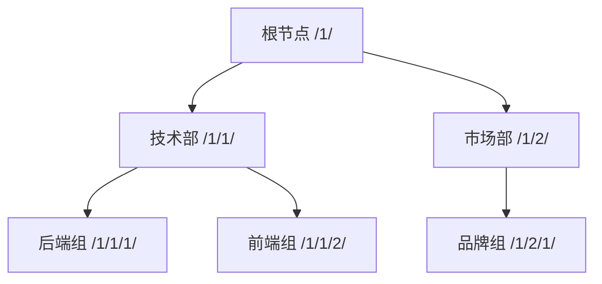
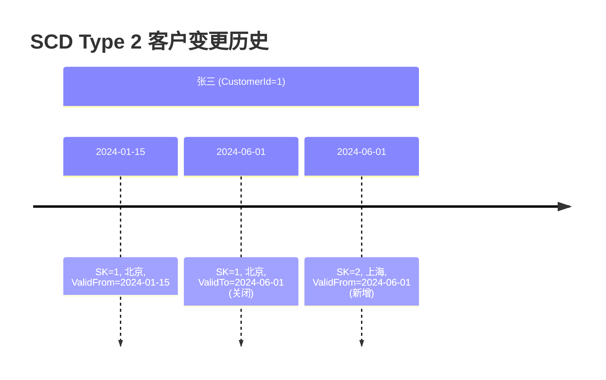
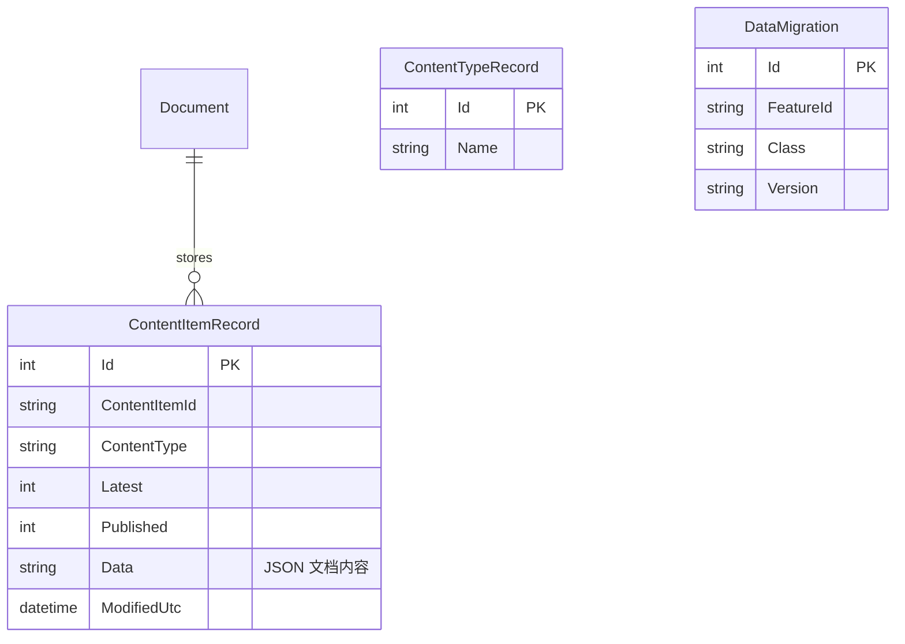

# 复杂业务 SQL 建模

> **现实业务从不简单——树形结构、历史追踪、多维报表、灵活扩展。** 本篇汇集最常见的复杂业务建模模式，用 SQL Server 的特性优雅解决。

::: tip 与现有内容的关系
本篇聚焦 SQL Server 特性的业务建模方案。更多 SQL 建模方法论，参考 [SQL Server 进阶 · 复杂业务 SQL 建模](/后端开发/ASP.NET_Core/SQL%20Server进阶/05.复杂业务SQL建模.md)。
:::

---

## 一、树形/层级数据建模

### 1.1 四种建模方案对比

| 方案 | 查询子树 | 查询路径 | 插入 | 移动子树 | 深层级 |
|------|----------|----------|------|----------|--------|
| 邻接表 (ParentId) | ❌ 慢 | ❌ 慢 | ✅ O(1) | ✅ O(1) | 无限 |
| 路径枚举 (Path) | ✅ LIKE | ✅ 快 | ⚠️ 需维护路径 | ❌ 更新所有子路径 | 有限 |
| 嵌套集 (Lft/Rgt) | ✅ 快 | ✅ 快 | ❌ O(N) | ❌ O(N) | 无限 |
| **HIERARCHYID** | ✅ 极快 | ✅ 极快 | ⚠️ 中等 | ❌ 更新所有子节点 | 无限 |



### 1.2 邻接表（Adjacency List）

```sql
-- 最常见的树形方案：每个节点存储父节点 ID
CREATE TABLE Categories (
    CategoryId INT IDENTITY(1,1) PRIMARY KEY,
    CategoryName NVARCHAR(100) NOT NULL,
    ParentId INT NULL FOREIGN KEY REFERENCES Categories(CategoryId)
);

INSERT INTO Categories VALUES
    ('电子产品', NULL),      -- 1
    ('手机', 1),             -- 2
    ('电脑', 1),             -- 3
    ('iPhone', 2),           -- 4
    ('Android', 2),          -- 5
    ('笔记本', 3),           -- 6
    ('台式机', 3);           -- 7

-- 查询直接子节点：简单
SELECT * FROM Categories WHERE ParentId = 1;

-- 查询所有子孙：需要递归 CTE
;WITH CategoryTree AS (
    SELECT CategoryId, CategoryName, ParentId, 0 AS Level
    FROM Categories WHERE CategoryId = 1
    UNION ALL
    SELECT c.CategoryId, c.CategoryName, c.ParentId, ct.Level + 1
    FROM Categories c JOIN CategoryTree ct ON c.ParentId = ct.CategoryId
)
SELECT * FROM CategoryTree;
```

### 1.3 HIERARCHYID（推荐）

```sql
-- 使用 SQL Server 内置的 HIERARCHYID 类型
CREATE TABLE OrgStructure (
    NodeId INT IDENTITY(1,1) PRIMARY KEY,
    NodePath HIERARCHYID NOT NULL,
    NodeName NVARCHAR(100) NOT NULL,
    NodeLevel AS NodePath.GetLevel() PERSISTED
);

-- 插入节点
INSERT INTO OrgStructure (NodePath, NodeName) VALUES
    (HIERARCHYID::Parse('/'), '总公司'),
    (HIERARCHYID::Parse('/1/'), '技术部'),
    (HIERARCHYID::Parse('/2/'), '市场部'),
    (HIERARCHYID::Parse('/1/1/'), '后端组'),
    (HIERARCHYID::Parse('/1/2/'), '前端组'),
    (HIERARCHYID::Parse('/2/1/'), '品牌组');

-- 查询所有子孙
DECLARE @Parent HIERARCHYID = (SELECT NodePath FROM OrgStructure WHERE NodeName = '技术部');
SELECT NodeName, NodePath.ToString() AS Path, NodeLevel
FROM OrgStructure
WHERE NodePath.IsDescendantOf(@Parent) = 1;

-- 查询祖先路径
SELECT NodeName, NodePath.ToString() AS Path
FROM OrgStructure
WHERE @Parent.IsDescendantOf(NodePath) = 1;

-- 直接子节点
SELECT * FROM OrgStructure WHERE NodePath.GetAncestor(1) = @Parent;

-- 在两个节点之间插入新节点
DECLARE @FirstChild HIERARCHYID = (SELECT NodePath FROM OrgStructure WHERE NodeName = '后端组');
DECLARE @LastChild HIERARCHYID = (SELECT NodePath FROM OrgStructure WHERE NodeName = '前端组');
INSERT INTO OrgStructure (NodePath, NodeName)
VALUES (@FirstChild.GetReparentedValue(@FirstChild, @LastChild.GetAncestor(1).GetDescendant(@FirstChild, @LastChild)), '运维组');
```

---

## 二、时态数据建模

### 2.1 系统版本化时态表

```sql
-- 自动记录数据变更历史
CREATE TABLE EmployeeSalary (
    EmployeeId INT NOT NULL,
    Salary DECIMAL(18,2) NOT NULL,
    Department NVARCHAR(50) NOT NULL,
    ValidFrom DATETIME2(2) GENERATED ALWAYS AS ROW START HIDDEN,
    ValidTo DATETIME2(2) GENERATED ALWAYS AS ROW END HIDDEN,
    PERIOD FOR SYSTEM_TIME (ValidFrom, ValidTo),
    PRIMARY KEY (EmployeeId, ValidFrom)
)
WITH (SYSTEM_VERSIONING = ON (HISTORY_TABLE = dbo.EmployeeSalaryHistory));

-- 修改数据
INSERT INTO EmployeeSalary (EmployeeId, Salary, Department) VALUES (1, 10000, 'IT');
UPDATE EmployeeSalary SET Salary = 15000 WHERE EmployeeId = 1;
UPDATE EmployeeSalary SET Department = '管理' WHERE EmployeeId = 1;

-- 查询某时间点的数据
SELECT EmployeeId, Salary, Department
FROM EmployeeSalary
FOR SYSTEM_TIME AS OF '2024-03-01T00:00:00'
WHERE EmployeeId = 1;

-- 查询某段时间内的所有变更
SELECT EmployeeId, Salary, Department, ValidFrom, ValidTo
FROM EmployeeSalary
FOR SYSTEM_TIME BETWEEN '2024-01-01' AND '2024-12-31'
WHERE EmployeeId = 1;
```

### 2.2 时态表查询语法

| 语法 | 含义 |
|------|------|
| `FOR SYSTEM_TIME AS OF` | 某时间点的状态 |
| `FOR SYSTEM_TIME BETWEEN ... AND ...` | 时间段内存在过的行 |
| `FOR SYSTEM_TIME FROM ... TO ...` | 时间段内活跃的行 |
| `FOR SYSTEM_TIME CONTAINED IN (...)` | 完全包含在时间段内的行 |
| `FOR SYSTEM_TIME ALL` | 所有历史版本 |

---

## 三、多维报表：ROLLUP / CUBE / GROUPING SETS

```sql
-- 示例数据：按年份、部门、级别的薪资统计
SELECT
    YEAR(HireDate) AS HireYear,
    Department,
    Level,
    SUM(Salary) AS TotalSalary,
    AVG(Salary) AS AvgSalary,
    COUNT(*) AS HeadCount,
    GROUPING(HireYear) AS GYear,      -- 1=汇总行, 0=数据行
    GROUPING(Department) AS GDept,
    GROUPING(Level) AS GLevel
FROM Employees
GROUP BY GROUPING SETS (
    (HireYear, Department, Level),   -- 最细粒度
    (HireYear, Department),           -- 按年+部门
    (HireYear),                       -- 按年
    ()                                -- 总计
)
ORDER BY GYear DESC, HireYear, GDept DESC, Department, GLevel DESC, Level;
```

```sql
-- ROLLUP：层级汇总（等价于 GROUPING SETS 的层级版）
SELECT Department, Level, SUM(Salary) AS TotalSalary
FROM Employees
GROUP BY ROLLUP (Department, Level);
-- 生成: (Dept, Level), (Dept), ()

-- CUBE：全组合汇总
SELECT Department, Level, SUM(Salary) AS TotalSalary
FROM Employees
GROUP BY CUBE (Department, Level);
-- 生成: (Dept, Level), (Dept), (Level), ()
```

| 语法 | 生成分组 | 适用场景 |
|------|----------|----------|
| `ROLLUP(A, B, C)` | (A,B,C), (A,B), (A), () | 层级报表（年→月→日） |
| `CUBE(A, B)` | (A,B), (A), (B), () | 交叉报表 |
| `GROUPING SETS(...)` | 自定义任意组合 | 灵活报表 |

---

## 四、缓慢变化维度（SCD）

数据仓库中的维度数据随时间缓慢变化，需要不同策略处理历史追踪。

### 4.1 SCD 类型一览

| 类型 | 策略 | 历史追踪 | 实现复杂度 |
|------|------|----------|-----------|
| **Type 1** | 直接覆盖 | ❌ | 低 |
| **Type 2** | 新增行（有效时间段） | ✅ | 中 |
| **Type 3** | 新增列（旧值列） | 部分（仅上次） | 低 |
| **Type 4** | 历史表分离 | ✅ | 中 |
| **Type 6** | 1+2+3 混合 | ✅ | 高 |

### 4.2 SCD Type 2 实现

```sql
-- 客户维度表（Type 2：新增行追踪历史）
CREATE TABLE DimCustomer (
    CustomerSK INT IDENTITY(1,1) PRIMARY KEY,  -- 代理键
    CustomerId INT NOT NULL,                    -- 业务键
    CustomerName NVARCHAR(100) NOT NULL,
    City NVARCHAR(50) NOT NULL,
    ValidFrom DATETIME2(2) DEFAULT SYSDATETIME(),
    ValidTo DATETIME2(2) DEFAULT '9999-12-31',
    IsCurrent BIT DEFAULT 1
);

-- 初始加载
INSERT INTO DimCustomer (CustomerId, CustomerName, City)
VALUES (1, '张三', '北京');

-- 张三搬到上海：关闭旧行，新增新行
UPDATE DimCustomer
SET ValidTo = SYSDATETIME(), IsCurrent = 0
WHERE CustomerId = 1 AND IsCurrent = 1;

INSERT INTO DimCustomer (CustomerId, CustomerName, City)
VALUES (1, '张三', '上海');

-- 查询当前有效数据
SELECT * FROM DimCustomer WHERE IsCurrent = 1;

-- 查询某时间点的数据
SELECT * FROM DimCustomer
WHERE CustomerId = 1
  AND ValidFrom <= '2024-06-01'
  AND ValidTo > '2024-06-01';
```



---

## 五、JSON 列实现灵活 Schema

```sql
-- CMS 内容管理：用 JSON 列存储动态属性
CREATE TABLE ContentItems (
    ContentItemId UNIQUEIDENTIFIER DEFAULT NEWID() PRIMARY KEY,
    ContentType NVARCHAR(50) NOT NULL,
    Title NVARCHAR(500) NOT NULL,
    -- 核心数据用结构化列
    CreatedUtc DATETIME2(2) DEFAULT SYSDATETIME(),
    Published BIT DEFAULT 0,
    -- 灵活属性用 JSON（类似 Orchard Core 的文档模式）
    Data NVARCHAR(MAX) NOT NULL
        CONSTRAINT CK_Data_IsJSON CHECK (ISJSON(Data) = 1)
);

-- 不同内容类型的 JSON 数据
INSERT INTO ContentItems (ContentType, Title, Data) VALUES
('BlogPost', N'ASP.NET Core 入门',
 N'{"Author":"张三","Tags":["ASP.NET","教程"],"WordCount":5000}'),
('Product', N'Surface Pro',
 N'{"Price":8999,"Color":"铂金","Storage":"256GB"}'),
('Event', N'Tech Summit 2024',
 N'{"Location":"上海","Capacity":500,"Speakers":["李四","王五"]}');

-- 查询特定属性
SELECT Title, JSON_VALUE(Data, '$.Author') AS Author
FROM ContentItems
WHERE ContentType = 'BlogPost';

-- 查询嵌套属性
SELECT Title, JSON_VALUE(Data, '$.Price') AS Price
FROM ContentItems
WHERE ContentType = 'Product'
  AND CAST(JSON_VALUE(Data, '$.Price') AS DECIMAL) > 5000;

-- 更新 JSON 属性
UPDATE ContentItems
SET Data = JSON_MODIFY(Data, '$.Published', 1)
WHERE ContentType = 'BlogPost';

-- 打开 JSON 数组
SELECT c.Title, tag.Value AS Tag
FROM ContentItems c
CROSS APPLY OPENJSON(c.Data, '$.Tags') tag
WHERE c.ContentType = 'BlogPost';
```

::: tip JSON vs 结构化列
- **频繁查询/过滤/排序的字段**：用结构化列 + 索引
- **偶尔查询、变化频繁的字段**：用 JSON 列
- **混合策略**：关键属性提为结构化列，其余存 JSON
- Orchard Core 采用的就是这种混合模式
:::

---

## 六、列存储用于分析

```sql
-- 订单事实表使用列存储索引
CREATE TABLE FactOrder (
    OrderDate DATE NOT NULL,
    CustomerId INT NOT NULL,
    ProductId INT NOT NULL,
    Quantity INT NOT NULL,
    Amount DECIMAL(18,2) NOT NULL,
    Region NVARCHAR(50) NOT NULL
);

-- 创建聚集列存储索引
CREATE CLUSTERED COLUMNSTORE INDEX CCI_FactOrder ON FactOrder;

-- 分析查询：列存储只读取需要的列
SELECT
    Region,
    YEAR(OrderDate) AS OrderYear,
    SUM(Amount) AS TotalAmount,
    AVG(Amount) AS AvgAmount,
    COUNT(DISTINCT CustomerId) AS UniqueCustomers
FROM FactOrder
GROUP BY Region, YEAR(OrderDate)
ORDER BY TotalAmount DESC;
-- 列存储只读 Amount + OrderDate + Region + CustomerId 四列
-- 不读 Quantity 和 ProductId，I/O 大幅减少
```

---

## 七、索引视图（物化视图）

```sql
-- 创建索引视图：预先计算并物化聚合结果
CREATE VIEW dbo.vw_DepartmentSalarySummary
WITH SCHEMABINDING  -- ✅ 必须 SCHEMABINDING
AS
SELECT
    Department,
    COUNT_BIG(*) AS EmployeeCount,  -- ✅ 必须 COUNT_BIG
    SUM(Salary) AS TotalSalary,
    AVG(CAST(Salary AS BIGINT)) AS AvgSalary
FROM dbo.Employees
GROUP BY Department;

-- 创建唯一聚集索引 → 物化视图
CREATE UNIQUE CLUSTERED INDEX IX_vw_DeptSalary_Dept
ON dbo.vw_DepartmentSalarySummary(Department);

-- 查询自动使用物化视图（优化器自动匹配）
SELECT Department, TotalSalary
FROM dbo.vw_DepartmentSalarySummary;
-- 不需要每次重新聚合，直接读取物化数据
```

::: warning 索引视图限制
- 必须 `WITH SCHEMABINDING`
- 不能包含：OUTER JOIN、子查询、CROSS APPLY、UNION、DISTINCT、TOP
- 聚合必须用 `COUNT_BIG(*)`
- 所有引用必须用两段式名称（dbo.Table）
- 基表修改时需要更新物化视图（写入开销增加）
:::

---

## 八、Orchard Core 内容项建模

[Orchard Core](https://github.com/OrchardCMS/OrchardCore) 的内容管理采用文档-关系混合模式：



```sql
-- Orchard Core 的核心表查询
-- 所有内容项的文档数据存储在 Document 表
SELECT TOP 5 Id, Type, Content
FROM Orchard_Framework_Document;

-- 内容项的版本管理
SELECT ContentItemId, ContentType, Latest, Published, ModifiedUtc
FROM Orchard_Framework_ContentItemRecord
WHERE ContentType = 'BlogPost'
ORDER BY ModifiedUtc DESC;

-- 数据迁移版本跟踪（类似 EF Core 的 __EFMigrationsHistory）
SELECT FeatureId, Class, Version
FROM Orchard_Framework_DataMigration;

-- Orchard Core 的设计模式：
-- 1. Document 表 = JSON 文档存储（类似 MongoDB on SQL Server）
-- 2. ContentItemRecord = 版本和发布状态管理
-- 3. DataMigration = 模块级别的迁移追踪
-- 4. 所有表名以 Orchard_ 为前缀（可配置）
```

---

## 九、面试技巧

::: tip 面试高频考点
1. **树形建模方案**：能说出邻接表/路径枚举/嵌套集/HIERARCHYID 的优缺点
2. **SCD Type 2**：数据仓库最常用，通过有效时间段追踪历史
3. **GROUPING SETS vs ROLLUP vs CUBE**：自定义 vs 层级 vs 全组合
4. **JSON 列**：灵活 Schema 场景，CHECK(ISJSON) 约束
5. **列存储索引**：分析场景首选，只读需要的列
6. **索引视图**：物化聚合结果，但有严格限制
7. **时态表**：SQL Server 2016+ 自动追踪变更历史
:::

::: warning 易错点
- "HIERARCHYID 可以高效移动子树"——❌，移动子树需要更新所有子节点路径
- "索引视图和普通视图一样"——❌，索引视图是物化的，数据实际存储
- "JSON 列可以建索引"——❌，JSON 列本身不能建索引，但可以创建计算列提取 JSON 值再索引
- "SCD Type 1 不需要历史表"——✅，直接覆盖，无历史追踪
:::

---

## 参考资料

- [HIERARCHYID](https://learn.microsoft.com/en-us/sql/t-sql/data-types/hierarchyid-data-type-method-reference)
- [Temporal Tables](https://learn.microsoft.com/en-us/sql/relational-databases/tables/temporal-tables)
- [GROUPING SETS](https://learn.microsoft.com/en-us/sql/t-sql/queries/select-group-by-transact-sql)
- [Columnstore Indexes](https://learn.microsoft.com/en-us/sql/relational-databases/indexes/columnstore-indexes-overview)
- [Indexed Views](https://learn.microsoft.com/en-us/sql/relational-databases/views/create-indexed-views)
- [Orchard Core GitHub](https://github.com/OrchardCMS/OrchardCore)
