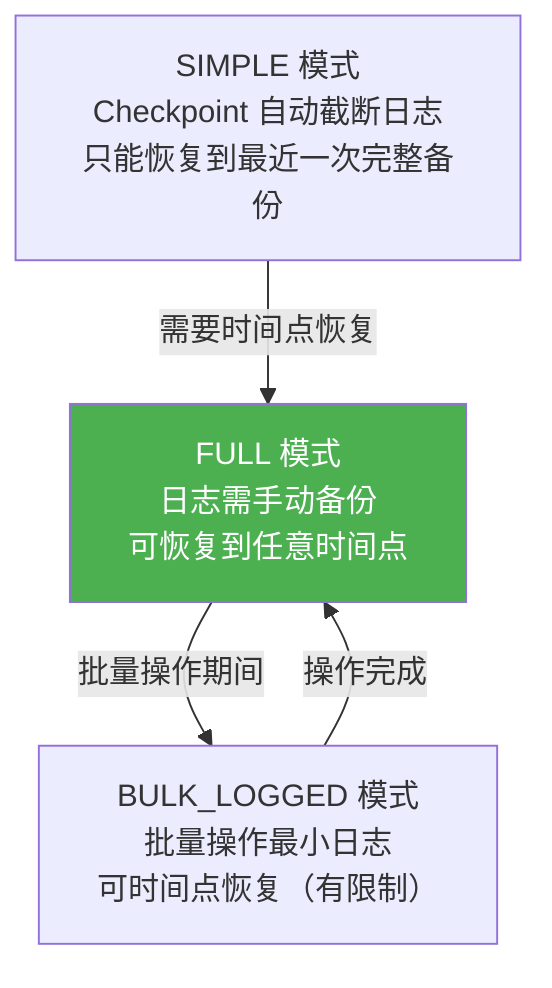
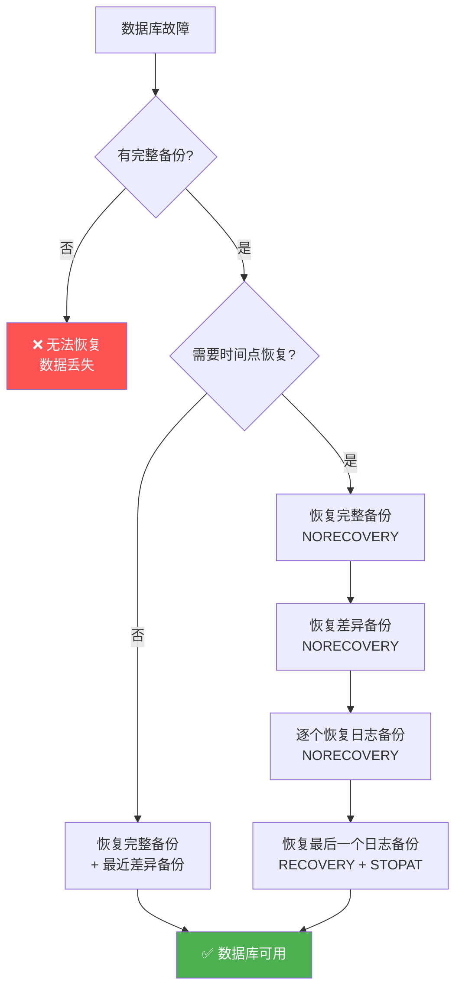

# 备份与恢复

> **没有备份的数据库，就像没有安全带的汽车。** 备份策略决定了你的 RPO（数据丢失量）和 RTO（恢复时间），是 DBA 最重要的职责。

---

## 一、恢复模式（Recovery Model）

### 1.1 三种恢复模式

| 恢复模式 | 日志截断 | 时间点恢复 | 日志大小 | 适用场景 |
|----------|----------|-----------|----------|----------|
| **SIMPLE** | Checkpoint 自动截断 | ❌ | 小 | 开发/测试、可容忍数据丢失 |
| **FULL** | 需要日志备份 | ✅ | 大（需定期备份） | **生产环境标配** |
| **BULK_LOGGED** | 需要日志备份 | 有限 | 中 | 批量操作期间临时切换 |

```sql
-- 查看当前恢复模式
SELECT name, recovery_model_desc
FROM sys.databases
WHERE name = 'MyDB';

-- 设置恢复模式
ALTER DATABASE MyDB SET RECOVERY FULL;   -- 生产环境
ALTER DATABASE MyDB SET RECOVERY SIMPLE; -- 开发环境
```



::: warning SIMPLE 模式的风险
SIMPLE 模式下，如果数据库在周一做了完整备份，周三崩溃，**周二到周三的所有数据修改都会丢失**。生产环境绝不能用 SIMPLE。
:::

### 1.2 批量操作与 BULK_LOGGED

```sql
-- 大批量导入时临时切换到 BULK_LOGGED，减少日志量
ALTER DATABASE MyDB SET RECOVERY BULK_LOGGED;

-- 批量操作（最小日志记录）
BULK INSERT Orders FROM 'D:\Data\orders.csv'
WITH (FIELDTERMINATOR = ',', ROWTERMINATOR = '\n', TABLOCK);

-- SELECT INTO（最小日志记录）
SELECT * INTO Orders_Archive FROM Orders WHERE OrderDate < '2023-01-01';

-- 切回 FULL
ALTER DATABASE MyDB SET RECOVERY FULL;

-- ⚠️ 切换后立即做一次完整备份！
BACKUP DATABASE MyDB TO DISK = 'D:\Backup\MyDB_AfterBulk.bak';
```

---

## 二、备份类型

### 2.1 完整备份（Full Backup）

```sql
-- 完整备份：数据库的所有数据 + 足够的日志
BACKUP DATABASE MyDB
TO DISK = 'D:\Backup\MyDB_Full_20240615.bak'
WITH
    COMPRESSION,           -- 压缩（节省空间、加快速度）
    CHECKSUM,              -- 校验和（检测损坏）
    STATS = 10,            -- 每 10% 报告进度
    DESCRIPTION = 'Weekly full backup',
    NAME = 'MyDB-Full Backup';

-- 镜像备份：同时写两份
BACKUP DATABASE MyDB
TO DISK = 'D:\Backup\MyDB_Full.bak'
MIRROR TO DISK = 'E:\Mirror\MyDB_Full.bak'
WITH FORMAT, COMPRESSION;
```

### 2.2 差异备份（Differential Backup）

```sql
-- 差异备份：自上次完整备份以来的所有变更
BACKUP DATABASE MyDB
TO DISK = 'D:\Backup\MyDB_Diff_20240616.bak'
WITH DIFFERENTIAL, COMPRESSION;
```

### 2.3 事务日志备份（Transaction Log Backup）

```sql
-- 日志备份：截断非活动日志，允许时间点恢复
BACKUP LOG MyDB
TO DISK = 'D:\Backup\MyDB_Log_20240616_1200.trn'
WITH COMPRESSION;

-- FULL 模式下必须定期备份日志，否则日志文件会无限增长！
-- 建议频率：每 15~30 分钟一次（取决于 RPO 要求）
```

```mermaid
timeline
    title 备份链示例
    section 周日
        00:00 : 完整备份 Full
    section 周一
        06:00 : 差异备份 Diff1
        12:00 : 日志备份 Log1
        18:00 : 日志备份 Log2
    section 周二
        06:00 : 差异备份 Diff2
        12:00 : 日志备份 Log3
        18:00 : 日志备份 Log4
```

### 2.4 Copy-Only 备份

```sql
-- Copy-Only：不影响差异备份基线
-- 适合：日常巡检、数据提取，不打破备份链
BACKUP DATABASE MyDB
TO DISK = 'D:\Backup\MyDB_Copy_20240615.bak'
WITH COPY_ONLY, COMPRESSION;
```

---

## 三、恢复操作

### 3.1 完整恢复

```sql
-- 步骤 1：恢复完整备份（NORECOVERY 表示还有后续恢复）
RESTORE DATABASE MyDB
FROM DISK = 'D:\Backup\MyDB_Full_20240615.bak'
WITH NORECOVERY, REPLACE;

-- 步骤 2：恢复差异备份（NORECOVERY）
RESTORE DATABASE MyDB
FROM DISK = 'D:\Backup\MyDB_Diff_20240616.bak'
WITH NORECOVERY;

-- 步骤 3：恢复日志备份（RECOVERY 表示完成，数据库可用）
RESTORE LOG MyDB
FROM DISK = 'D:\Backup\MyDB_Log_20240616_1200.trn'
WITH RECOVERY;
```

### 3.2 时间点恢复（Point-in-Time Recovery）

```sql
-- 恢复到 2024-06-16 11:30:00 的时间点
RESTORE DATABASE MyDB
FROM DISK = 'D:\Backup\MyDB_Full_20240615.bak'
WITH NORECOVERY, REPLACE;

RESTORE DATABASE MyDB
FROM DISK = 'D:\Backup\MyDB_Diff_20240616.bak'
WITH NORECOVERY;

RESTORE LOG MyDB
FROM DISK = 'D:\Backup\MyDB_Log_20240616_1200.trn'
WITH RECOVERY, STOPAT = '2024-06-16T11:30:00';
-- 只恢复到指定时间点之前的日志记录
```

### 3.3 恢复到标记点

```sql
-- 在日志中标记事务
BEGIN TRANSACTION Mark1 WITH MARK 'Before critical update';
    UPDATE Orders SET Status = 'Processed' WHERE OrderDate < '2024-01-01';
COMMIT TRANSACTION Mark1;

-- 备份日志
BACKUP LOG MyDB TO DISK = 'D:\Backup\MyDB_Log_marked.trn' WITH COMPRESSION;

-- 恢复到标记点
RESTORE LOG MyDB
FROM DISK = 'D:\Backup\MyDB_Log_marked.trn'
WITH RECOVERY, STOPBEFOREMARK = 'Mark1';
```

---

## 四、备份与恢复流程图



---

## 五、SQL Server Agent 自动化备份

```sql
-- 创建备份作业
USE msdb;

-- 步骤 1：完整备份（每周日 00:00）
EXEC sp_add_job @job_name = N'DBA_FullBackup';
EXEC sp_add_jobstep @job_name = N'DBA_FullBackup',
    @step_name = N'Full Backup',
    @subsystem = N'TSQL',
    @command = N'
        DECLARE @Path NVARCHAR(500) = N''D:\Backup\'' + DB_NAME() + N''_Full_'' +
            REPLACE(REPLACE(REPLACE(CONVERT(NVARCHAR(20), GETDATE(), 120), ''-'', ''''), '':'', ''''), '' '', ''_'') + N''.bak'';
        BACKUP DATABASE MyDB TO DISK = @Path WITH COMPRESSION, CHECKSUM;';
EXEC sp_add_schedule @schedule_name = N'WeeklySunday',
    @freq_type = 8, @freq_interval = 1, @active_start_time = 0;
EXEC sp_attach_schedule @job_name = N'DBA_FullBackup', @schedule_name = N'WeeklySunday';

-- 步骤 2：差异备份（每天 06:00）
EXEC sp_add_job @job_name = N'DBA_DiffBackup';
EXEC sp_add_jobstep @job_name = N'DBA_DiffBackup',
    @step_name = N'Diff Backup',
    @subsystem = N'TSQL',
    @command = N'
        DECLARE @Path NVARCHAR(500) = N''D:\Backup\'' + DB_NAME() + N''_Diff_'' +
            REPLACE(REPLACE(REPLACE(CONVERT(NVARCHAR(20), GETDATE(), 120), ''-'', ''''), '':'', ''''), '' '', ''_'') + N''.bak'';
        BACKUP DATABASE MyDB TO DISK = @Path WITH DIFFERENTIAL, COMPRESSION;';
EXEC sp_add_schedule @schedule_name = N'Daily0600',
    @freq_type = 4, @freq_interval = 1, @active_start_time = 60000;
EXEC sp_attach_schedule @job_name = N'DBA_DiffBackup', @schedule_name = N'Daily0600';

-- 步骤 3：日志备份（每 30 分钟）
EXEC sp_add_job @job_name = N'DBA_LogBackup';
EXEC sp_add_jobstep @job_name = N'DBA_LogBackup',
    @step_name = N'Log Backup',
    @subsystem = N'TSQL',
    @command = N'
        DECLARE @Path NVARCHAR(500) = N''D:\Backup\'' + DB_NAME() + N''_Log_'' +
            REPLACE(REPLACE(REPLACE(CONVERT(NVARCHAR(20), GETDATE(), 120), ''-'', ''''), '':'', ''''), '' '', ''_'') + N''.trn'';
        BACKUP LOG MyDB TO DISK = @Path WITH COMPRESSION;';
EXEC sp_add_schedule @schedule_name = N'Every30Min',
    @freq_type = 4, @freq_interval = 1, @freq_subday_type = 4, @freq_subday_interval = 30;
EXEC sp_attach_schedule @job_name = N'DBA_LogBackup', @schedule_name = N'Every30Min';
```

---

## 六、备份到 Azure Blob Storage

```sql
-- SQL Server 2012+ 支持直接备份到 Azure
-- 1. 创建凭据
CREATE CREDENTIAL AzureBackup
WITH IDENTITY = 'mystorageaccount',
SECRET = 'storage_access_key_here';

-- 2. 备份到 URL
BACKUP DATABASE MyDB
TO URL = 'https://mystorageaccount.blob.core.windows.net/backups/MyDB_Full.bak'
WITH CREDENTIAL = 'AzureBackup', COMPRESSION;

-- 3. 从 URL 恢复
RESTORE DATABASE MyDB
FROM URL = 'https://mystorageaccount.blob.core.windows.net/backups/MyDB_Full.bak'
WITH CREDENTIAL = 'AzureBackup', REPLACE;
```

---

## 七、Ola Hallengren 备份方案

业界最广泛使用的 SQL Server 备份方案：[Ola Hallengren's Maintenance Solution](https://ola.hallengren.com/)

```sql
-- 安装 Ola Hallengren 的维护方案
-- 下载: https://ola.hallengren.com/scripts/MaintenanceSolution.sql

-- 完整备份
EXEC dbo.DatabaseBackup
    @Databases = 'USER_DATABASES',
    @Directory = 'D:\Backup',
    @BackupType = 'FULL',
    @Compress = 'Y',
    @Verify = 'Y',
    @CleanupTime = 168;  -- 清理 7 天前的备份

-- 差异备份
EXEC dbo.DatabaseBackup
    @Databases = 'USER_DATABASES',
    @Directory = 'D:\Backup',
    @BackupType = 'DIFF',
    @Compress = 'Y',
    @CleanupTime = 168;

-- 日志备份
EXEC dbo.DatabaseBackup
    @Databases = 'USER_DATABASES',
    @Directory = 'D:\Backup',
    @BackupType = 'LOG',
    @Compress = 'Y',
    @CleanupTime = 72;  -- 清理 3 天前的日志备份
```

---

## 八、备份验证

```sql
-- 验证备份文件完整性
RESTORE VERIFYONLY
FROM DISK = 'D:\Backup\MyDB_Full_20240615.bak'
WITH CHECKSUM;

-- 检查备份文件信息
RESTORE HEADERONLY
FROM DISK = 'D:\Backup\MyDB_Full_20240615.bak';

-- 检查备份中的文件列表
RESTORE FILELISTONLY
FROM DISK = 'D:\Backup\MyDB_Full_20240615.bak';

-- 查看备份历史
SELECT
    database_name,
    backup_start_date,
    backup_finish_date,
    type AS BackupType,  -- D=Full, I=Differential, L=Log
    backup_size / 1024 / 1024 AS SizeMB,
    is_compressed,
    has_backup_checksums
FROM msdb.dbo.backupset
WHERE database_name = 'MyDB'
ORDER BY backup_start_date DESC;
```

::: important 备份验证是必须的
- **VERIFYONLY**：验证备份文件可读、校验和正确
- **定期恢复测试**：在测试环境定期执行完整恢复，验证备份可用
- 未经验证的备份 = 没有备份
:::

---

## 九、面试技巧

::: tip 面试高频考点
1. **三种恢复模式**：SIMPLE/FULL/BULK_LOGGED 的区别，生产环境用 FULL
2. **备份类型**：完整/差异/日志备份的原理和恢复顺序
3. **NORECOVERY vs RECOVERY**：NORECOVERY 允许继续恢复，RECOVERY 完成恢复使数据库可用
4. **时间点恢复**：STOPAT 语法和日志链
5. **Copy-Only**：不影响差异基线，用于日常数据提取
6. **日志无限增长**：FULL 模式下不备份日志，日志文件会无限增长
7. **Ola Hallengren**：业界标准维护方案
:::

::: warning 易错点
- "SIMPLE 模式不需要备份"——❌，SIMPLE 只是不需要日志备份，仍需完整+差异备份
- "差异备份是自上次差异以来的变更"——❌，差异备份是基于最近完整备份的
- "RESTORE WITH RECOVERY 后还能继续恢复"——❌，RECOVERY 后数据库已可用，不能再恢复
- "备份时数据库不可用"——❌，SQL Server 备份是联机操作
:::

---

## 参考资料

- [Backup Overview](https://learn.microsoft.com/en-us/sql/relational-databases/backup-restore/backup-overview-sql-server)
- [Recovery Models](https://learn.microsoft.com/en-us/sql/relational-databases/backup-restore/recovery-models-sql-server)
- [RESTORE Statements](https://learn.microsoft.com/en-us/sql/t-sql/statements/restore-statements-transact-sql)
- [Ola Hallengren Maintenance Solution](https://ola.hallengren.com/)
