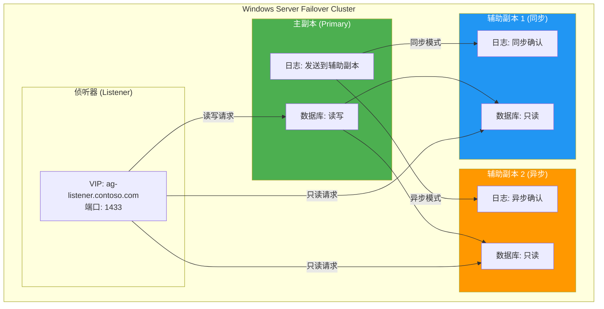
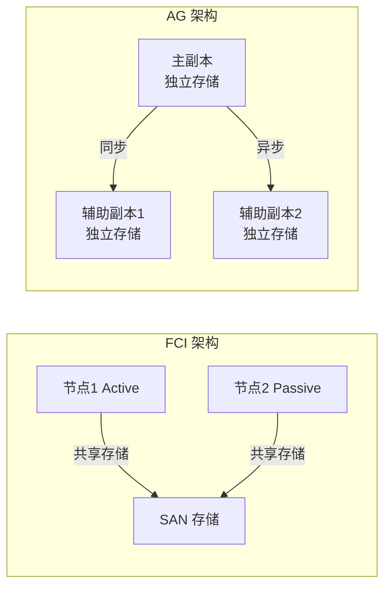

# AlwaysOn 高可用

> **高可用是生产数据库的生命线。** SQL Server 的 AlwaysOn 技术族提供了从故障转移到读写分离的完整解决方案。

---

## 一、AlwaysOn 技术族

| 技术 | 层级 | 副本类型 | 自动故障转移 | 只读副本 |
|------|------|----------|-------------|----------|
| **Availability Groups (AG)** | 数据库级 | 读/写副本 | ✅ | ✅ |
| **Failover Cluster Instance (FCI)** | 实例级 | 共享存储 | ✅ | ❌ |
| **Log Shipping** | 数据库级 | 温备 | ❌ | ❌ |
| **Database Mirroring** | 数据库级 | 热/温备 | ✅(高安全) | ❌(已废弃) |

---

## 二、AlwaysOn 可用性组架构



### 2.1 同步模式

| 模式 | 数据同步 | 零数据丢失 | 性能影响 | 适用场景 |
|------|----------|-----------|----------|----------|
| **同步提交 (Synchronous)** | 主副本等辅助确认 | ✅ | 写入延迟增加 | 同机房/低延迟 |
| **异步提交 (Asynchronous)** | 主副本不等确认 | ❌（可能丢失） | 无影响 | 跨机房/高延迟 |

### 2.2 故障转移模式

| 模式 | 触发方式 | 数据丢失 | 前提条件 |
|------|----------|---------|----------|
| **自动故障转移** | 健康检测 | 零丢失 | 同步模式 + 2个同步副本 |
| **计划手动故障转移** | DBA 手动 | 零丢失 | 同步模式 |
| **强制故障转移** | DBA 手动 | 可能丢失 | 异步模式（灾难恢复） |

---

## 三、创建可用性组

### 3.1 前置条件

```powershell
# 1. 所有节点加入 Windows Server Failover Cluster (WSFC)
# 2. 启用 AlwaysOn 可用性组
# SQL Server Configuration Manager → SQL Server 服务 → 属性 → AlwaysOn 高可用性 → 启用

# 3. 每个节点的 SQL Server 服务账户需要集群权限
```

### 3.2 创建可用性组

```sql
-- 在主副本上创建可用性组
CREATE AVAILABILITY GROUP [AG_MyApp]
FOR
    DATABASE MyDB
REPLICA ON
    N'SQLNODE01' WITH (
        ENDPOINT_URL = N'TCP://SQLNODE01.contoso.com:5022',
        AVAILABILITY_MODE = SYNCHRONOUS_COMMIT,
        FAILOVER_MODE = AUTOMATIC,
        SECONDARY_ROLE(ALLOW_CONNECTIONS = READ_ONLY)
    ),
    N'SQLNODE02' WITH (
        ENDPOINT_URL = N'TCP://SQLNODE02.contoso.com:5022',
        AVAILABILITY_MODE = SYNCHRONOUS_COMMIT,
        FAILOVER_MODE = AUTOMATIC,
        SECONDARY_ROLE(ALLOW_CONNECTIONS = READ_ONLY)
    ),
    N'SQLNODE03' WITH (
        ENDPOINT_URL = N'TCP://SQLNODE03.contoso.com:5022',
        AVAILABILITY_MODE = ASYNCHRONOUS_COMMIT,
        FAILOVER_MODE = MANUAL,
        SECONDARY_ROLE(ALLOW_CONNECTIONS = READ_ONLY)
    );

-- 在辅助副本上加入可用性组
-- 在 SQLNODE02 上执行:
ALTER AVAILABILITY GROUP [AG_MyApp] JOIN;

-- 在 SQLNODE03 上执行:
ALTER AVAILABILITY GROUP [AG_MyApp] JOIN;

-- 创建侦听器
ALTER AVAILABILITY GROUP [AG_MyApp]
ADD LISTENER N'ag-listener' (
    WITH IP ((N'10.0.0.100', N'255.255.255.0')),
    PORT = 1433
);
```

### 3.3 准备数据库

```sql
-- 1. 数据库必须是 FULL 恢复模式
ALTER DATABASE MyDB SET RECOVERY FULL;

-- 2. 做一次完整备份
BACKUP DATABASE MyDB TO DISK = 'D:\Backup\MyDB_AG_Init.bak' WITH COMPRESSION;

-- 3. 做一次日志备份
BACKUP LOG MyDB TO DISK = 'D:\Backup\MyDB_AG_Init.trn' WITH COMPRESSION;

-- 4. 在辅助副本上恢复（NORECOVERY）
-- 在 SQLNODE02 上:
RESTORE DATABASE MyDB
FROM DISK = '\\SQLNODE01\Backup\MyDB_AG_Init.bak'
WITH NORECOVERY, REPLACE;

RESTORE LOG MyDB
FROM DISK = '\\SQLNODE01\Backup\MyDB_AG_Init.trn'
WITH NORECOVERY;

-- 5. 将数据库加入可用性组
ALTER DATABASE MyDB SET HADR AVAILABILITY GROUP = [AG_MyApp];
```

---

## 四、只读路由

```sql
-- 配置只读路由：将只读请求路由到辅助副本
ALTER AVAILABILITY GROUP [AG_MyApp]
MODIFY REPLICA ON N'SQLNODE01' WITH (
    PRIMARY_ROLE(READ_ONLY_ROUTING_LIST = (N'SQLNODE02', N'SQLNODE03'))
);

ALTER AVAILABILITY GROUP [AG_MyApp]
MODIFY REPLICA ON N'SQLNODE02' WITH (
    PRIMARY_ROLE(READ_ONLY_ROUTING_LIST = (N'SQLNODE03', N'SQLNODE01'))
);

-- 只读路由 URL
ALTER AVAILABILITY GROUP [AG_MyApp]
MODIFY REPLICA ON N'SQLNODE02' WITH (
    SECONDARY_ROLE(READ_ONLY_ROUTING_URL = N'TCP://SQLNODE02.contoso.com:1433')
);

ALTER AVAILABILITY GROUP [AG_MyApp]
MODIFY REPLICA ON N'SQLNODE03' WITH (
    SECONDARY_ROLE(READ_ONLY_ROUTING_URL = N'TCP://SQLNODE03.contoso.com:1433')
);
```

```csharp
// 应用连接字符串：指定 ApplicationIntent=ReadOnly
// ABP Framework / Orchard Core 连接配置
var connStr = "Server=ag-listener.contoso.com;Database=MyDB;" +
              "Integrated Security=True;ApplicationIntent=ReadOnly;MultiSubnetFailover=True";
// → 路由到辅助副本

var connStrRW = "Server=ag-listener.contoso.com;Database=MyDB;" +
                "Integrated Security=True;ApplicationIntent=ReadWrite";
// → 连接到主副本
```

::: tip 只读路由的价值
- **报表查询**不占用主副本资源
- **读写分离**在应用层透明，只需修改连接字符串
- **Orchard Core / ABP Framework** 可以将后台任务配置为只读路由
:::

---

## 五、AG vs FCI 对比

| 维度 | Availability Groups | Failover Cluster Instance |
|------|-------------------|--------------------------|
| 故障转移粒度 | 数据库级 | 实例级（所有数据库） |
| 共享存储 | ❌ 每副本独立存储 | ✅ 共享磁盘 |
| 只读副本 | ✅ | ❌ |
| 自动故障转移 | ✅ | ✅ |
| 数据丢失 | 同步零丢失 | 零丢失（共享存储） |
| 存储成本 | 高（每个副本完整拷贝） | 低（共享一份存储） |
| 多数据库 | 需逐个加入 | 所有数据库一起故障转移 |



---

## 六、分布式可用性组（Distributed AG）

SQL Server 2016+ 支持跨 WSFC 的可用性组：

```sql
-- 两个独立 WSFC 之间的 AG
-- WSFC1: SQLNODE01 (Primary) → SQLNODE02 (Secondary)
-- WSFC2: SQLNODE03 (Forwarder) → SQLNODE04 (Secondary)

-- 在 WSFC1 上创建分布式 AG
CREATE AVAILABILITY GROUP [DAG_MyApp]
WITH (DISTRIBUTED)
AVAILABILITY GROUP ON
    N'AG_MyApp_Cluster1' WITH (
        LISTENER_URL = N'TCP://ag-listener1.contoso.com:5022',
        AVAILABILITY_MODE = ASYNCHRONOUS_COMMIT,
        FAILOVER_MODE = MANUAL
    ),
    N'AG_MyApp_Cluster2' WITH (
        LISTENER_URL = N'TCP://ag-listener2.contoso.com:5022',
        AVAILABILITY_MODE = ASYNCHRONOUS_COMMIT,
        FAILOVER_MODE = MANUAL
    );
```

::: tip 分布式 AG 适用场景
- 灾难恢复（跨数据中心）
- 数据库迁移（零停机迁移到新集群）
- 多地域读扩展
:::

---

## 七、监控与故障排查

```sql
-- 查看可用性组状态
SELECT
    ag.name AS AGName,
    ar.replica_server_name,
    ar.availability_mode_desc,
    ar.failover_mode_desc,
    drs.synchronization_state_desc,
    drs.synchronization_health_desc,
    drs.is_suspended,
    drs.suspend_reason_desc
FROM sys.availability_groups ag
JOIN sys.availability_replicas ar ON ag.group_id = ar.group_id
JOIN sys.dm_hadr_database_replica_states drs
    ON ar.replica_id = drs.replica_id
ORDER BY ag.name, ar.replica_server_name;

-- 查看副本延迟
SELECT
    ar.replica_server_name,
    drs.database_id,
    DB_NAME(drs.database_id) AS DatabaseName,
    drs.log_send_queue_size AS SendQueueKB,
    drs.log_send_rate AS SendRateKBps,
    drs.redo_queue_size AS RedoQueueKB,
    drs.redo_rate AS RedoRateKBps
FROM sys.dm_hadr_database_replica_states drs
JOIN sys.availability_replicas ar ON drs.replica_id = ar.replica_id
WHERE drs.is_local = 0;  -- 辅助副本上的信息

-- 检查侦听器状态
SELECT ag.name, agl.dns_name, agl.port, agl.state_desc
FROM sys.availability_groups ag
JOIN sys.availability_group_listeners agl ON ag.group_id = agl.group_id;
```

### 7.1 常见问题

| 问题 | 原因 | 解决 |
|------|------|------|
| 同步挂起 | 辅助副本不可用/网络断开 | 检查网络，RESUME：`ALTER DATABASE MyDB SET HADR RESUME` |
| 发送队列堆积 | 网络带宽不足/辅助副本性能低 | 增加带宽，优化辅助副本 |
| Redo 队列堆积 | 辅助副本重做速度跟不上 | 增加辅助副本资源 |
| 自动故障转移未触发 | 不满足条件（需2个同步副本） | 确保配置正确 |
| 侦听器连接超时 | DNS/网络/防火墙问题 | 检查 DNS 解析和端口 |

---

## 八、面试技巧

::: tip 面试高频考点
1. **AG vs FCI**：数据库级 vs 实例级，独立存储 vs 共享存储
2. **同步 vs 异步**：同步零丢失但延迟高，异步低延迟但可能丢数据
3. **自动故障转移条件**：同步模式 + 至少2个同步副本
4. **只读路由**：ApplicationIntent=ReadOnly，报表查询走辅助副本
5. **分布式 AG**：跨 WSFC 的灾备方案
6. **侦听器**：虚拟网络名 + VIP，客户端连接入口
:::

::: warning 易错点
- "AG 可以自动故障转移任何数据库"——❌，需要同步模式+至少2个同步副本
- "FCI 有只读副本"——❌，FCI 同一时刻只有一个活跃节点
- "异步模式可以零数据丢失"——❌，异步模式在故障转移时可能丢失未同步的数据
- "AG 的辅助副本可以直接写入"——❌，辅助副本只读（除了系统数据库和临时表）
:::

---

## 参考资料

- [AlwaysOn Availability Groups](https://learn.microsoft.com/en-us/sql/database-engine/availability-groups/windows/overview-of-always-on-availability-groups-sql-server)
- [Failover Cluster Instances](https://learn.microsoft.com/en-us/sql/sql-server/failover-clusters/windows/always-on-failover-cluster-instances-sql-server)
- [Read-Only Routing](https://learn.microsoft.com/en-us/sql/database-engine/availability-groups/windows/configure-read-only-routing-for-an-availability-group-sql-server)
- [Distributed Availability Groups](https://learn.microsoft.com/en-us/sql/database-engine/availability-groups/windows/distributed-availability-groups)
