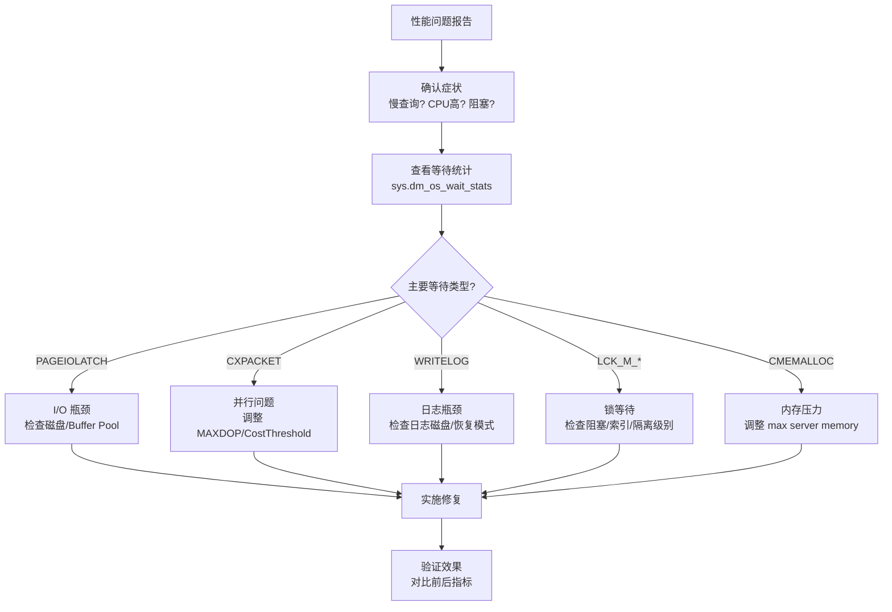

# 性能调优

> **性能调优不是玄学，而是系统化的排查方法。** 从等待统计到执行计划，从内存到 tempdb——本篇给你一套完整的调优方法论。

---

## 一、性能调优方法论



---

## 二、核心 DMV

### 2.1 查询性能

```sql
-- 1. 最耗 CPU 的查询
SELECT TOP 10
    total_worker_time / execution_count AS AvgCpuUs,
    execution_count,
    total_worker_time / 1000000 AS TotalCpuSec,
    total_elapsed_time / execution_count / 1000 AS AvgDurationMs,
    total_logical_reads / execution_count AS AvgLogicalReads,
    SUBSTRING(st.text, (qs.statement_start_offset / 2) + 1,
        (CASE qs.statement_end_offset WHEN -1 THEN DATALENGTH(st.text)
         ELSE qs.statement_end_offset END - qs.statement_start_offset) / 2 + 1) AS QueryText
FROM sys.dm_exec_query_stats qs
CROSS APPLY sys.dm_exec_sql_text(qs.sql_handle) st
ORDER BY AvgCpuUs DESC;

-- 2. 逻辑读取最多的查询
SELECT TOP 10
    total_logical_reads / execution_count AS AvgLogicalReads,
    execution_count,
    total_logical_reads AS TotalLogicalReads,
    SUBSTRING(st.text, (qs.statement_start_offset / 2) + 1,
        (CASE qs.statement_end_offset WHEN -1 THEN DATALENGTH(st.text)
         ELSE qs.statement_end_offset END - qs.statement_start_offset) / 2 + 1) AS QueryText
FROM sys.dm_exec_query_stats qs
CROSS APPLY sys.dm_exec_sql_text(qs.sql_handle) st
ORDER BY AvgLogicalReads DESC;

-- 3. 当前正在执行的请求
SELECT
    r.session_id,
    r.status,
    r.command,
    r.cpu_time,
    r.total_elapsed_time / 1000 AS ElapsedSec,
    r.logical_reads,
    r.wait_type,
    r.wait_time,
    r.blocking_session_id,
    SUBSTRING(st.text, (r.statement_start_offset / 2) + 1,
        (CASE r.statement_end_offset WHEN -1 THEN DATALENGTH(st.text)
         ELSE r.statement_end_offset END - r.statement_start_offset) / 2 + 1) AS CurrentStatement
FROM sys.dm_exec_requests r
CROSS APPLY sys.dm_exec_sql_text(r.sql_handle) st
WHERE r.session_id > 50  -- 排除系统会话
ORDER BY r.total_elapsed_time DESC;
```

### 2.2 等待统计

```sql
-- 累计等待统计（需要两次快照计算增量）
-- 快照 1
SELECT wait_type, waiting_tasks_count, wait_time_ms
INTO #WaitStats1
FROM sys.dm_os_wait_stats
WHERE wait_type NOT IN (
    'REQUEST_FOR_DEADLOCK_SEARCH', 'SQLTRACE_INCREMENTAL_FLUSH_SLEEP',
    'SQLTRACE_BUFFER_FLUSH', 'LAZYWRITER_SLEEP', 'XE_TIMER_EVENT',
    'XE_DISPATCHER_WAIT', 'FT_IFTS_SCHEDULER_IDLE_WAIT',
    'LOGMGR_QUEUE', 'CHECKPOINT_QUEUE', 'SLEEP_TASK',
    'SLEEP_SYSTEMTASK', 'BROKER_TASK_STOP', 'BROKER_TO_FLUSH',
    'CLR_AUTO_EVENT', 'DIRTY_PAGE_POLL', 'HADR_FILESTREAM_IOMGR_IOCOMPLETION',
    'ONDEMAND_TASK_QUEUE', 'DBMIRROR_EVENTS_QUEUE', 'DBMIRRORING_CMD',
    'DIAGNOSTICS_CONSUMER_SLEEP', 'SP_SERVER_DIAGNOSTICS_SLEEP'
);

-- 等待一段时间后...

-- 快照 2
SELECT w2.wait_type,
    (w2.waiting_tasks_count - ISNULL(w1.waiting_tasks_count, 0)) AS TaskCount,
    (w2.wait_time_ms - ISNULL(w1.wait_time_ms, 0)) AS WaitTimeMs,
    CASE WHEN (w2.waiting_tasks_count - ISNULL(w1.waiting_tasks_count, 0)) > 0
        THEN (w2.wait_time_ms - ISNULL(w1.wait_time_ms, 0)) /
             (w2.waiting_tasks_count - ISNULL(w1.waiting_tasks_count, 0))
        ELSE 0 END AS AvgWaitMs
FROM sys.dm_os_wait_stats w2
LEFT JOIN #WaitStats1 w1 ON w2.wait_type = w1.wait_type
WHERE w2.wait_type NOT IN (SELECT wait_type FROM #WaitStats1 WHERE wait_time_ms = 0)
    AND (w2.wait_time_ms - ISNULL(w1.wait_time_ms, 0)) > 0
ORDER BY WaitTimeMs DESC;
```

### 2.3 I/O 统计

```sql
-- 数据库文件 I/O 延迟
SELECT
    DB_NAME(fs.database_id) AS DatabaseName,
    mf.physical_name,
    mf.type_desc AS FileType,
    fs.num_of_reads,
    fs.num_of_writes,
    fs.io_stall_read_ms / NULLIF(fs.num_of_reads, 0) AS AvgReadLatencyMs,
    fs.io_stall_write_ms / NULLIF(fs.num_of_writes, 0) AS AvgWriteLatencyMs,
    fs.num_of_bytes_read / 1024 / 1024 AS TotalReadMB,
    fs.num_of_bytes_written / 1024 / 1024 AS TotalWriteMB
FROM sys.dm_io_virtual_file_stats(NULL, NULL) fs
JOIN sys.master_files mf ON fs.database_id = mf.database_id AND fs.file_id = mf.file_id
ORDER BY fs.io_stall_read_ms + fs.io_stall_write_ms DESC;
```

::: warning I/O 延迟参考值
| 延迟 | 评价 |
|------|------|
| < 5ms | 优秀（SSD） |
| 5~20ms | 正常 |
| 20~50ms | 偏高 |
| > 50ms | 需要优化（检查磁盘/Buffer Pool） |
:::

---

## 三、等待类型解读

| 等待类型 | 含义 | 常见原因 | 解决方向 |
|----------|------|----------|----------|
| **PAGEIOLATCH_XX** | 等待从磁盘读取数据页到 Buffer Pool | 内存不足/磁盘慢 | 增加 max server memory / 升级磁盘 |
| **CXPACKET** | 并行查询中线程同步等待 | 并行度过大/数据倾斜 | 调整 MAXDOP / Cost Threshold |
| **WRITELOG** | 等待事务日志写入 | 日志磁盘慢/事务太多 | 升级日志磁盘 / 批量操作用 BULK_LOGGED |
| **LCK_M_X/S** | 等待获取排他/共享锁 | 阻塞/长事务 | 开启 RCSI / 缩短事务 / 优化索引 |
| **CMEMALLOC** | 等待内存分配 | 内存压力 | 增加 max server memory / 优化查询 |
| **SOS_SCHEDULER_YIELD** | CPU 时间片用完等待 | CPU 压力大 | 优化 CPU 密集查询 / 增加 CPU |
| **ASYNC_NETWORK_IO** | 等待客户端消费结果 | 应用端处理慢/网络慢 | 优化应用 / 减少返回行数 |

---

## 四、关键参数配置

```sql
-- 查看当前配置
EXEC sp_configure 'max server memory (MB)';      -- 最大内存
EXEC sp_configure 'max degree of parallelism';    -- 最大并行度
EXEC sp_configure 'cost threshold for parallelism'; -- 并行成本阈值

-- 1. max server memory
-- 留出 OS 和其他进程需要的内存
-- 通常设置为物理内存的 75%~85%
EXEC sp_configure 'max server memory (MB)', 65536;  -- 64GB
RECONFIGURE;

-- 2. max degree of parallelism (MAXDOP)
-- OLTP: 1（避免并行导致CXPACKET）
-- OLAP: 4~8（利用多核加速大查询）
-- 混合负载: 2~4
EXEC sp_configure 'max degree of parallelism', 4;
RECONFIGURE;

-- 3. cost threshold for parallelism
-- 默认 5，太低，大量小查询也会并行
-- 建议提高到 25~50
EXEC sp_configure 'cost threshold for parallelism', 50;
RECONFIGURE;

-- 4. optimize for ad hoc workloads
-- 即席查询不缓存完整计划，只缓存存根（节省计划缓存空间）
EXEC sp_configure 'optimize for ad hoc workloads', 1;
RECONFIGURE;
```

---

## 五、TempDB 优化

```sql
-- 查看当前 tempdb 配置
SELECT name, physical_name, size * 8 / 1024 AS SizeMB, growth
FROM sys.master_files
WHERE database_id = DB_ID('tempdb');

-- 最佳实践：
-- 1. 多个等大小的数据文件（1 per core, max 8）
-- 2. 启用 TF1118（SQL Server 2016+ 默认已启用）
-- 3. 预分配大小，避免自动增长
-- 4. 放在高速 SSD 上

-- 配置多个 tempdb 文件
ALTER DATABASE tempdb
ADD FILE (NAME = tempdev2, FILENAME = 'F:\TempDB\tempdev2.ndf', SIZE = 1GB, FILEGROWTH = 256MB);
ALTER DATABASE tempdb
ADD FILE (NAME = tempdev3, FILENAME = 'F:\TempDB\tempdev3.ndf', SIZE = 1GB, FILEGROWTH = 256MB);
ALTER DATABASE tempdb
ADD FILE (NAME = tempdev4, FILENAME = 'F:\TempDB\tempdev4.ndf', SIZE = 1GB, FILEGROWTH = 256MB);

-- 检查 tempdb 空间使用
SELECT
    SUM(user_object_reserved_page_count) * 8 / 1024 AS UserObjectsMB,
    SUM(internal_object_reserved_page_count) * 8 / 1024 AS InternalObjectsMB,
    SUM(version_store_reserved_page_count) * 8 / 1024 AS VersionStoreMB,
    SUM(unallocated_extent_page_count) * 8 / 1024 AS FreeSpaceMB
FROM sys.dm_db_file_space_usage
WHERE database_id = DB_ID('tempdb');

-- tempdb 争用检测（PAGELATCH 等待在 tempdb 文件上）
SELECT session_id, wait_type, wait_duration_ms, resource_description
FROM sys.dm_os_waiting_tasks
WHERE wait_type LIKE 'PAGELATCH%'
  AND resource_description LIKE '2:%';  -- database_id=2 = tempdb
```

::: important TempDB 文件数规则
- **1 个文件/CPU 核心**，最多 8 个
- 所有文件必须 **等大小**（SQL Server 使用比例填充算法）
- 预分配足够大小，避免自动增长
:::

---

## 六、Extended Events

比 SQL Trace/Profiler 更轻量的追踪方案：

```sql
-- 创建 Extended Events 会话
CREATE EVENT SESSION [QueryPerformance] ON SERVER
ADD EVENT sqlserver.rpc_completed (
    ACTION(sqlserver.sql_text, sqlserver.database_name, sqlserver.client_app_name)
    WHERE duration > 5000000  -- 只捕获执行超过 5 秒的查询
),
ADD EVENT sqlserver.sql_statement_completed (
    ACTION(sqlserver.sql_text, sqlserver.database_name)
    WHERE duration > 5000000
)
ADD TARGET package0.ring_buffer  -- 内存环形缓冲区
(
    SET max_memory = 4096  -- 4MB
)
WITH (
    MAX_MEMORY = 4096KB,
    EVENT_RETENTION_MODE = ALLOW_SINGLE_EVENT_LOSS,
    MAX_DISPATCH_LATENCY = 5 SECONDS
);

-- 启动会话
ALTER EVENT SESSION [QueryPerformance] ON SERVER STATE = START;

-- 查看捕获的事件
SELECT
    n.value('(@name)', 'varchar(50)') AS EventName,
    n.value('(@timestamp)', 'datetime2') AS EventTime,
    n.value('(data[@name="duration"]/value)[1]', 'bigint') / 1000 AS DurationMs,
    n.value('(data[@name="logical_reads"]/value)[1]', 'bigint') AS LogicalReads,
    n.value('(data[@name="cpu_time"]/value)[1]', 'bigint') / 1000 AS CpuMs,
    n.value('(action[@name="sql_text"]/value)[1]', 'nvarchar(max)') AS SqlText
FROM (
    SELECT CAST(target_data AS XML) AS TargetData
    FROM sys.dm_xe_session_targets st
    JOIN sys.dm_xe_sessions s ON s.address = st.event_session_address
    WHERE s.name = 'QueryPerformance'
) AS Data
CROSS APPLY TargetData.nodes('//event') AS XEvent(n)
ORDER BY EventTime DESC;

-- 停止会话
ALTER EVENT SESSION [QueryPerformance] ON SERVER STATE = STOP;

-- 删除会话
DROP EVENT SESSION [QueryPerformance] ON SERVER;
```

---

## 七、Query Store 调优

```sql
-- 启用 Query Store
ALTER DATABASE MyDB SET QUERY_STORE = ON (
    OPERATION_MODE = READ_WRITE,
    MAX_STORAGE_SIZE_MB = 1000,
    QUERY_CAPTURE_MODE = AUTO,
    STALE_QUERY_THRESHOLD_DAYS = 30
);

-- 查找回归查询（最近比过去慢 5 倍以上）
SELECT
    qs.query_id,
    qt.query_sql_text,
    rs1.avg_duration / 1000 AS OldAvgMs,
    rs2.avg_duration / 1000 AS NewAvgMs,
    (rs2.avg_duration - rs1.avg_duration) / 1000 AS DiffMs
FROM sys.query_store_query qs
JOIN sys.query_store_query_text qt ON qs.query_text_id = qt.query_text_id
JOIN sys.query_store_plan p1 ON qs.query_id = p1.query_id
JOIN sys.query_store_runtime_stats rs1 ON p1.plan_id = rs1.plan_id
JOIN sys.query_store_plan p2 ON qs.query_id = p2.query_id
JOIN sys.query_store_runtime_stats rs2 ON p2.plan_id = rs2.plan_id
WHERE rs1.runtime_stats_interval_id < rs2.runtime_stats_interval_id
  AND rs2.avg_duration > rs1.avg_duration * 5
ORDER BY DiffMs DESC;

-- 查看等待统计（Query Store 内置）
SELECT
    qs.query_id,
    qt.query_sql_text,
    w.wait_category_desc,
    SUM(w.total_query_wait_time_ms) AS TotalWaitMs
FROM sys.query_store_wait_stats w
JOIN sys.query_store_plan p ON w.plan_id = p.plan_id
JOIN sys.query_store_query qs ON p.query_id = qs.query_id
JOIN sys.query_store_query_text qt ON qs.query_text_id = qt.query_text_id
GROUP BY qs.query_id, qt.query_sql_text, w.wait_category_desc
ORDER BY TotalWaitMs DESC;
```

---

## 八、索引维护

```sql
-- Ola Hallengren 索引优化方案
EXEC dbo.IndexOptimize
    @Databases = 'MyDB',
    @FragmentationLow = NULL,           -- 低碎片不处理
    @FragmentationMedium = 'INDEX_REORGANIZE',  -- 中等碎片重组
    @FragmentationHigh = 'INDEX_REBUILD_ONLINE', -- 高碎片联机重建
    @FragmentationLevelLow = 5,
    @FragmentationLevelHigh = 30,
    @UpdateStatistics = 'ALL',          -- 同时更新统计信息
    @OnlyModifiedStatistics = 'Y';      -- 只更新已修改的统计信息

-- 手动更新统计信息
UPDATE STATISTICS Orders WITH FULLSCAN;                    -- 单表
EXEC sp_updatestats;                                       -- 整个数据库
UPDATE STATISTICS Orders IX_Orders_CustomerId WITH FULLSCAN; -- 单个索引
```

---

## 九、实战案例

### 案例：订单查询从 30 秒优化到 50 毫秒

```sql
-- 问题查询
SELECT o.OrderId, c.CustomerName, o.OrderDate, o.Amount, oi.ProductName
FROM Orders o
JOIN Customers c ON o.CustomerId = c.CustomerId
JOIN OrderItems oi ON o.OrderId = oi.OrderId
WHERE o.OrderDate >= '2024-01-01'
  AND c.Region = '华东'
ORDER BY o.Amount DESC;

-- Step 1：查看等待统计 → PAGEIOLATCH_SH（I/O 等待）
-- Step 2：查看执行计划 → Orders 表 Clustered Index Scan（全表扫描）
-- Step 3：查看缺失索引 DMV → 建议在 OrderDate 上建索引

-- 优化 1：创建覆盖索引
CREATE NONCLUSTERED INDEX IX_Orders_Date_Cover
ON Orders(OrderDate)
INCLUDE (OrderId, CustomerId, Amount);

-- 优化 2：Customers 表的 Region 索引
CREATE NONCLUSTERED INDEX IX_Customers_Region
ON Customers(Region)
INCLUDE (CustomerId, CustomerName);

-- 优化 3：OrderItems 的覆盖索引
CREATE NONCLUSTERED INDEX IX_OrderItems_OrderId_Cover
ON OrderItems(OrderId)
INCLUDE (ProductName, Quantity, UnitPrice);

-- 优化 4：统计信息更新
UPDATE STATISTICS Orders WITH FULLSCAN;
UPDATE STATISTICS Customers WITH FULLSCAN;

-- 结果：
-- 执行计划: 3个 Index Seek + Nested Loop Join（无 Scan）
-- 逻辑读取: 从 150,000 降到 320
-- 执行时间: 30s → 50ms
```

---

## 十、面试技巧

::: tip 面试高频考点
1. **等待类型**：PAGEIOLATCH=I/O瓶颈，CXPACKET=并行问题，WRITELOG=日志瓶颈
2. **MAXDOP 配置**：OLTP 设1~2，OLAP 设4~8
3. **TempDB 优化**：多文件（1/core, max 8）等大小
4. **Extended Events vs Profiler**：XE 更轻量、更灵活
5. **Query Store**：回归检测 + 强制计划
6. **索引碎片**：>30% REBUILD，10%~30% REORGANIZE
7. **调优方法论**：等→I/O→索引→执行计划→参数
:::

::: warning 易错点
- "max server memory 越大越好"——❌，要留足够内存给 OS
- "MAXDOP 设为 1 就不会有 CXPACKET"——✅，但大查询也失去并行加速能力
- "tempdb 文件越多越好"——❌，最多 8 个，且必须等大小
- "UPDATE STATISTICS 会阻塞查询"——❌，默认采样模式不阻塞
:::

---

## 参考资料

- [Performance Monitoring and Tuning](https://learn.microsoft.com/en-us/sql/relational-databases/performance/monitor-and-tune-for-performance)
- [sys.dm_os_wait_stats](https://learn.microsoft.com/en-us/sql/relational-databases/system-dynamic-management-views/sys-dm-os-wait-stats-transact-sql)
- [Extended Events](https://learn.microsoft.com/en-us/sql/relational-databases/extended-events/extended-events)
- [Query Store](https://learn.microsoft.com/en-us/sql/relational-databases/performance/monitoring-performance-by-using-the-query-store)
- [Ola Hallengren Index Optimize](https://ola.hallengren.com/sql-server-index-and-statistics-maintenance.html)
