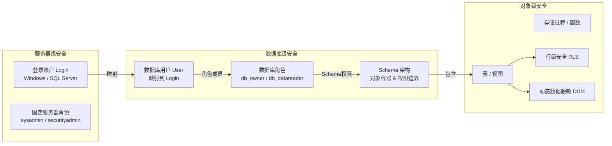

# 安全与权限

> **安全不是可选项，而是底线。** 从认证到行级安全，从数据脱敏到加密——本篇覆盖 SQL Server 安全的完整防护链。

---

## 一、安全模型总览



---

## 二、认证方式

### 2.1 Windows 认证 vs SQL Server 认证

| 维度 | Windows 认证 | SQL Server 认证 |
|------|-------------|----------------|
| 密码管理 | AD 统一管理 | SQL Server 自管理 |
| 安全性 | ✅ 更高（Kerberos） | ⚠️ 较低（凭据在连接字符串中） |
| 单点登录 | ✅ 支持 | ❌ |
| 跨域 | 需要信任关系 | 无限制 |
| 推荐度 | ✅ 生产环境首选 | 仅用于跨域/第三方 |

```sql
-- 创建 Windows 登录
CREATE LOGIN [CONTOSO\Jackie] FROM WINDOWS;

-- 创建 SQL Server 登录
CREATE LOGIN AppUser WITH PASSWORD = 'Str0ng!Pass#2024',
    MUST_CHANGE,                    -- 首次登录必须改密码
    CHECK_EXPIRATION = ON,          -- 密码过期策略
    CHECK_POLICY = ON;              -- 密码复杂度策略

-- 创建数据库用户（映射到登录）
CREATE USER Jackie FOR LOGIN [CONTOSO\Jackie];
CREATE USER AppUser FOR LOGIN AppUser;

-- 创建不含登录的用户（用于包含数据库/RLS）
CREATE USER ReportUser WITHOUT LOGIN;
```

::: important 最小权限原则
永远不要给应用账户 `sysadmin` 或 `db_owner` 角色。只授予完成工作所需的最小权限。
:::

---

## 三、固定角色与自定义角色

### 3.1 服务器级固定角色

| 角色 | 权限 |
|------|------|
| **sysadmin** | 上帝权限，可做任何事 |
| **securityadmin** | 管理登录和权限 |
| **serveradmin** | 服务器配置 |
| **setupadmin** | 链接服务器管理 |
| **processadmin** | 终止进程 |
| **diskadmin** | 磁盘文件管理 |
| **dbcreator** | 创建/修改/删除数据库 |
| **bulkadmin** | 执行 BULK INSERT |

### 3.2 数据库级固定角色

| 角色 | 权限 |
|------|------|
| **db_owner** | 数据库所有者（所有权限） |
| **db_datareader** | 读取所有表 |
| **db_datawriter** | 写入所有表 |
| **db_ddladmin** | 执行 DDL（CREATE/ALTER/DROP） |
| **db_securityadmin** | 管理数据库权限 |
| **db_backupoperator** | 备份数据库 |

### 3.3 自定义数据库角色

```sql
-- 创建自定义角色
CREATE ROLE SalesRole;

-- 授予表级权限
GRANT SELECT, INSERT, UPDATE ON Orders TO SalesRole;
GRANT SELECT ON Customers TO SalesRole;
DENY DELETE ON Orders TO SalesRole;  -- 显式拒绝
GRANT EXECUTE ON dbo.usp_CreateOrder TO SalesRole;

-- 添加成员
ALTER ROLE SalesRole ADD MEMBER AppUser;

-- 查看角色成员
SELECT
    r.name AS RoleName,
    m.name AS MemberName
FROM sys.database_role_members rm
JOIN sys.database_principals r ON rm.role_principal_id = r.principal_id
JOIN sys.database_principals m ON rm.member_principal_id = m.principal_id
ORDER BY r.name, m.name;
```

---

## 四、Schema 与权限边界

```sql
-- Schema 既是对象容器，也是权限边界
CREATE SCHEMA Sales AUTHORIZATION db_owner;
CREATE SCHEMA HR AUTHORIZATION db_owner;
CREATE SCHEMA Audit AUTHORIZATION db_owner;

-- 在 Schema 中创建表
CREATE TABLE Sales.Orders (OrderId INT, Amount DECIMAL(18,2));
CREATE TABLE HR.Employees (EmployeeId INT, Salary DECIMAL(18,2));
CREATE TABLE Audit.Logs (LogId INT, Action NVARCHAR(100));

-- Schema 级权限：一次性授权整个 Schema
GRANT SELECT ON SCHEMA::Sales TO SalesRole;
GRANT SELECT ON SCHEMA::HR TO HRRole;
GRANT SELECT ON SCHEMA::Audit TO AuditRole;

-- 不同角色只能访问自己 Schema 的数据
-- SalesRole 不能 SELECT HR.Employees
```

---

## 五、行级安全（Row-Level Security, RLS）

SQL Server 2016+ 的 RLS 让不同用户只能看到自己有权访问的行。

```sql
-- 场景：销售人员只能看自己区域的订单

-- 1. 创建安全谓词函数
CREATE SCHEMA Security;
GO

CREATE FUNCTION Security.fn_RegionFilter(@Region AS NVARCHAR(50))
RETURNS TABLE
WITH SCHEMABINDING
AS
RETURN
    SELECT 1 AS fn_result
    WHERE @Region = USER_NAME()           -- 用户名=区域名
       OR USER_NAME() = 'SalesManager';   -- 经理看所有
GO

-- 2. 创建安全策略
CREATE SECURITY POLICY SalesFilter
ADD FILTER PREDICATE Security.fn_RegionFilter(Region)
ON dbo.Orders
WITH (STATE = ON);

-- 3. 创建区域用户
CREATE USER East WITHOUT LOGIN;
CREATE USER West WITHOUT LOGIN;
CREATE USER SalesManager WITHOUT LOGIN;

-- 4. 测试
EXECUTE AS USER = 'East';
SELECT * FROM Orders;  -- 只能看到 Region='East' 的行
REVERT;

EXECUTE AS USER = 'SalesManager';
SELECT * FROM Orders;  -- 能看到所有行
REVERT;
```

### 5.1 阻止谓词（Block Predicate）

```sql
-- 阻止谓词：阻止特定操作（不仅仅是过滤读取）
ALTER SECURITY POLICY SalesFilter
ADD BLOCK PREDICATE Security.fn_RegionFilter(Region)
ON dbo.Orders
AFTER INSERT;  -- 不允许插入不属于自己区域的行

-- 现在用户 'East' 不能 INSERT Region='West' 的行
```

| 谓词类型 | 作用 | 操作 |
|----------|------|------|
| FILTER | 过滤读取 | SELECT / UPDATE / DELETE |
| BLOCK AFTER INSERT | 阻止插入 | INSERT |
| BLOCK AFTER UPDATE | 阻止修改 | UPDATE（修改后的值） |
| BLOCK BEFORE UPDATE | 阻止修改 | UPDATE（修改前的值） |
| BLOCK BEFORE DELETE | 阻止删除 | DELETE |

---

## 六、动态数据脱敏（Dynamic Data Masking, DDM）

```sql
-- 对敏感数据自动脱敏，无权用户看不到原始值
CREATE TABLE Customers (
    CustomerId INT IDENTITY(1,1) PRIMARY KEY,
    CustomerName NVARCHAR(100),
    Phone NVARCHAR(20) MASKED WITH (FUNCTION = 'default()'),      -- 根据类型脱敏
    Email NVARCHAR(200) MASKED WITH (FUNCTION = 'email()'),       -- e***@***.com
    CreditCard NVARCHAR(20) MASKED WITH (FUNCTION = 'partial(2,"XXXX-XXXX-XXXX",2)'), -- ViXXXX-XXXX-XXXX04
    BirthDate DATE MASKED WITH (FUNCTION = 'default()'),          -- 1900-01-01
    Salary DECIMAL(18,2) MASKED WITH (FUNCTION = 'default()')    -- 0.00
);

-- 授予脱敏豁免权
GRANT UNMASK TO SalesManager;  -- SalesManager 可以看到原始值

-- 查询结果（无 UNMASK 权限的用户）
-- CustomerId | Name | Phone      | Email            | CreditCard            | BirthDate  | Salary
-- 1          | 张三 | xxxx       | z***@***.com     | ViXXXX-XXXX-XXXX04    | 1900-01-01 | 0.00

-- 查询结果（有 UNMASK 权限的用户）
-- CustomerId | Name | Phone        | Email              | CreditCard       | BirthDate  | Salary
-- 1          | 张三 | 13800138000 | zhang@example.com  | Visa-1234-5678-04| 1990-05-15 | 15000.00
```

::: warning DDM 不是加密
- DDM 是 **查询时脱敏**，数据在磁盘上是明文
- 有足够权限的用户（如 sysadmin）仍可看到原始值
- **不能替代加密**，只是减少无意暴露的风险
- SQL Server 2022+ 支持基于角色的脱敏权限
:::

---

## 七、Always Encrypted

Always Encrypted 在客户端加密，SQL Server 只存储密文，连 DBA 也无法看到明文。

```sql
-- 1. 创建列主密钥（CMK）— 存储在应用端的密钥存储中
CREATE COLUMN MASTER KEY CMK_Customer
WITH (
    KEY_STORE_PROVIDER_NAME = 'MSSQL_CERTIFICATE_STORE',
    KEY_PATH = 'CurrentUser/My/CustomerKey'
);

-- 2. 创建列加密密钥（CEK）— 被 CMK 加密保护
CREATE COLUMN ENCRYPTION KEY CEK_Customer
WITH VALUES (
    COLUMN_MASTER_KEY = CMK_Customer,
    ALGORITHM = 'RSA_OAEP',
    ENCRYPTED_VALUE = 0x0123456789ABCDEF...  -- CMK 加密后的 CEK
);

-- 3. 创建加密列
CREATE TABLE SecureCustomers (
    CustomerId INT IDENTITY(1,1) PRIMARY KEY,
    CustomerName NVARCHAR(100),                              -- 明文
    SSN NVARCHAR(11) COLLATE Latin1_General_BIN2             -- 确定性加密
        ENCRYPTED WITH (
            ENCRYPTION_TYPE = DETERMINISTIC,
            ALGORITHM = 'AEAD_AES_256_CBC_HMAC_SHA_256',
            COLUMN_ENCRYPTION_KEY = CEK_Customer
        ),
    CreditCard NVARCHAR(20) COLLATE Latin1_General_BIN2     -- 随机加密
        ENCRYPTED WITH (
            ENCRYPTION_TYPE = RANDOMIZED,
            ALGORITHM = 'AEAD_AES_256_CBC_HMAC_SHA_256',
            COLUMN_ENCRYPTION_KEY = CEK_Customer
        )
);
```

| 加密类型 | 特点 | 支持操作 |
|----------|------|----------|
| **DETERMINISTIC** | 相同明文→相同密文 | 等值比较、JOIN、GROUP BY |
| **RANDOMIZED** | 相同明文→不同密文 | 更安全，但不能比较/排序/分组 |

::: tip Always Encrypted 使用场景
- DBA 不应看到敏感数据（合规要求）
- 数据库被入侵后密文不可读
- 密钥在客户端，SQL Server 始终只处理密文
- ABP Framework 通过 EF Core 连接字符串 `Column Encryption Setting=Enabled` 支持
:::

---

## 八、透明数据加密（TDE）

```sql
-- TDE：加密整个数据库文件（.mdf/.ndf/.ldf），对应用透明
-- 1. 创建数据库主密钥
CREATE MASTER KEY ENCRYPTION BY PASSWORD = 'Str0ng!MasterKey#2024';

-- 2. 创建服务器证书
CREATE CERTIFICATE TDE_Cert WITH SUBJECT = 'TDE Certificate';

-- 3. 启用 TDE
CREATE DATABASE ENCRYPTION KEY
WITH ALGORITHM = AES_256
ENCRYPTION BY SERVER CERTIFICATE TDE_Cert;

ALTER DATABASE MyDB SET ENCRYPTION ON;

-- 查看加密状态
SELECT db_name(database_id) AS DatabaseName, encryption_state_desc, percent_complete
FROM sys.dm_database_encryption_keys;
-- encryption_state: 0=无, 1=未加密, 2=加密中, 3=已加密

-- ⚠️ 备份证书！证书丢失=数据库不可恢复
BACKUP CERTIFICATE TDE_Cert TO FILE = 'D:\Backup\TDE_Cert.cer'
WITH PRIVATE KEY (FILE = 'D:\Backup\TDE_Cert_Key.pvk',
    ENCRYPTION BY PASSWORD = 'CertBackupPassword!2024');
```

| 特性 | Always Encrypted | TDE |
|------|-----------------|-----|
| 加密层级 | 列级 | 数据库级 |
| 加密位置 | 客户端 | 服务器 |
| 密钥管理 | 客户端 | 服务器 |
| DBA 可见明文 | ❌ | ✅ |
| 对应用影响 | 需驱动支持 | 透明 |
| 防护场景 | 恶意 DBA/数据库入侵 | 磁盘丢失/文件窃取 |

---

## 九、SQL Server Audit

```sql
-- 1. 创建服务器审计
CREATE SERVER AUDIT [SecurityAudit]
TO FILE (
    FILEPATH = 'E:\Audit\',
    MAXSIZE = 100 MB,
    MAX_ROLLOVER_FILES = 10,
    RESERVE_DISK_SPACE = OFF
);
ALTER SERVER AUDIT [SecurityAudit] WITH (STATE = ON);

-- 2. 创建服务器审计规范（服务器级事件）
CREATE SERVER AUDIT SPECIFICATION [ServerAuditSpec]
FOR SERVER AUDIT [SecurityAudit]
ADD (SUCCESSFUL_LOGIN_GROUP),        -- 成功登录
ADD (FAILED_LOGIN_GROUP),            -- 登录失败
ADD (SERVER_PRINCIPAL_CHANGE_GROUP); -- 服务器主体变更
ALTER SERVER AUDIT SPECIFICATION [ServerAuditSpec] WITH (STATE = ON);

-- 3. 创建数据库审计规范（数据库级事件）
CREATE DATABASE AUDIT SPECIFICATION [DbAuditSpec]
FOR SERVER AUDIT [SecurityAudit]
ADD (SELECT ON OBJECT::dbo.Customers BY PUBLIC),  -- 谁查了客户表
ADD (INSERT ON OBJECT::dbo.Orders BY PUBLIC),     -- 谁插入了订单
ADD (UPDATE ON OBJECT::dbo.Employees BY PUBLIC);  -- 谁修改了员工表
ALTER DATABASE AUDIT SPECIFICATION [DbAuditSpec] WITH (STATE = ON);

-- 4. 查看审计日志
SELECT event_time, action_id, class_type, server_principal_name,
       database_principal_name, object_name, statement
FROM sys.fn_get_audit_file('E:\Audit\*', DEFAULT, DEFAULT)
WHERE database_name = 'MyDB'
ORDER BY event_time DESC;
```

---

## 十、ABP Framework 权限体系

[ABP Framework](https://github.com/abpframework/abp) 在 SQL Server 安全之上构建了应用级权限系统：

```csharp
// ABP 权限定义
public class AppPermissions
{
    public const string GroupName = "App";

    public class Orders
    {
        public const string Default = GroupName + ".Orders";
        public const string Create = Default + ".Create";
        public const string Delete = Default + ".Delete";
        public const string ViewSalary = Default + ".ViewSalary";  // 敏感字段
    }
}

// 权限授权（ABP 的 AbpPermissionGrants 表）
// 与 SQL Server RLS 结合：
// SQL Server RLS 控制行级数据可见性
// ABP 权限控制功能级操作权限
// 两者互补：RLS 防"看到不该看的行"，ABP 权限防"做不该做的操作"
```

```sql
-- ABP 权限表结构
SELECT TOP 5 *
FROM AbpPermissions
WHERE Name LIKE '%Order%';

-- ABP 角色权限表
SELECT r.Name AS RoleName, p.Name AS PermissionName
FROM AbpRoles r
JOIN AbpRolePermissions rp ON r.Id = rp.RoleId
JOIN AbpPermissions p ON rp.PermissionName = p.Name
WHERE r.Name = 'admin';
```

---

## 十一、面试技巧

::: tip 面试高频考点
1. **认证方式**：Windows vs SQL Server 认证，生产用 Windows
2. **最小权限原则**：不用 sysadmin/db_owner，自定义角色精确授权
3. **RLS 原理**：安全谓词函数 + 安全策略，过滤/阻止谓词
4. **DDM vs 加密**：脱敏是查询时转换，加密是存储时变换
5. **Always Encrypted vs TDE**：客户端加密 vs 服务器加密，防 DBA vs 防磁盘丢失
6. **Schema 权限**：Schema 既是容器也是权限边界
7. **审计**：Server Audit + Database Audit Specification
:::

::: warning 易错点
- "DDM 可以防止有权限的人看数据"——❌，UNMASK 权限可以绕过脱敏
- "TDE 可以防止 DBA 看数据"——❌，TDE 只加密磁盘文件，DBA 查询仍可看明文
- "Always Encrypted 对应用完全透明"——❌，需要驱动支持 + 连接字符串配置
- "RLS 只能过滤 SELECT"——❌，FILTER 影响 SELECT/UPDATE/DELETE，BLOCK 阻止 INSERT/UPDATE/DELETE
:::

---

## 参考资料

- [SQL Server Security Center](https://learn.microsoft.com/en-us/sql/relational-databases/security/security-center-for-sql-server-database-engine-and-azure-sql-database)
- [Row-Level Security](https://learn.microsoft.com/en-us/sql/relational-databases/security/row-level-security)
- [Dynamic Data Masking](https://learn.microsoft.com/en-us/sql/relational-databases/security/dynamic-data-masking)
- [Always Encrypted](https://learn.microsoft.com/en-us/sql/relational-databases/security/encryption/always-encrypted-database-engine)
- [Transparent Data Encryption](https://learn.microsoft.com/en-us/sql/relational-databases/security/encryption/transparent-data-encryption-tde)
- [SQL Server Audit](https://learn.microsoft.com/en-us/sql/relational-databases/security/auditing/sql-server-audit-database-engine)
- [ABP Framework GitHub](https://github.com/abpframework/abp)
