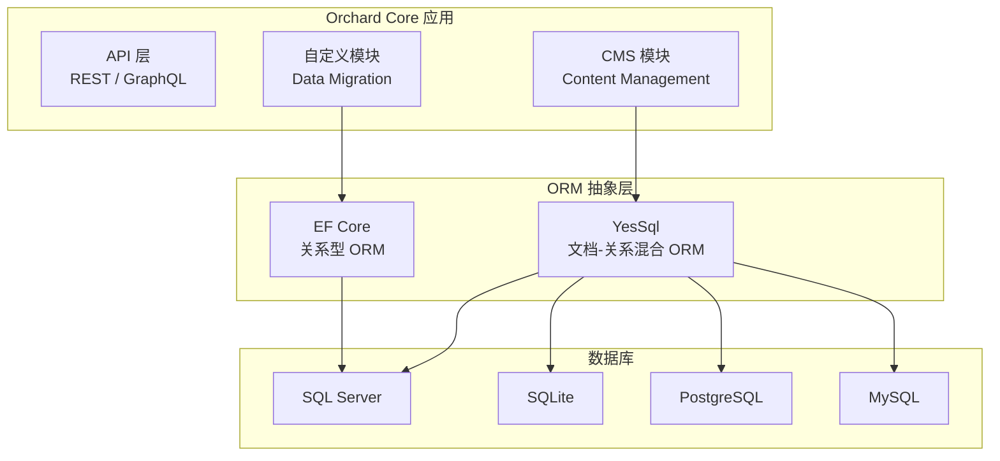
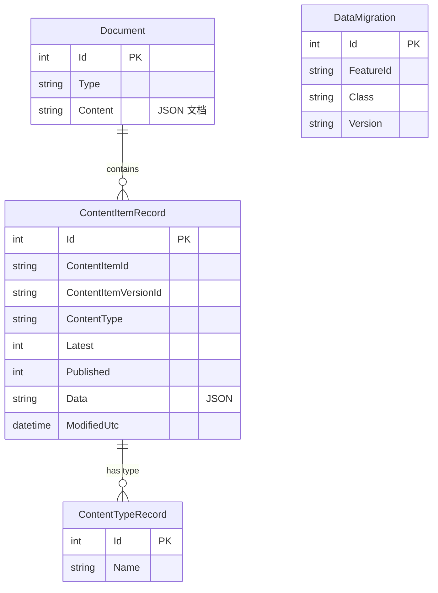
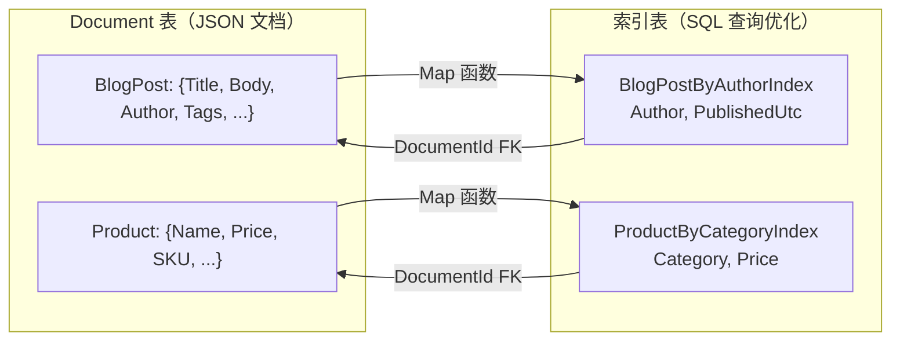

# Orchard Core 数据库实战

> **Orchard Core 是 SQL Server 在真实项目中的最佳学习案例。** 它展示了文档-关系混合存储、模块化数据迁移、多数据库抽象等企业级数据库设计模式。

---

## 一、Orchard Core 概览

[Orchard Core](https://github.com/OrchardCMS/OrchardCore) 是一个基于 ASP.NET Core 的开源 CMS 框架，其数据库设计体现了多个重要的架构决策。



---

## 二、SQL Server 连接与配置

### 2.1 连接字符串

```json
// appsettings.json
{
  "ConnectionStrings": {
    "Default": "Server=localhost;Database=OrchardCore;User Id=sa;Password=YourStr0ng!Pass;TrustServerCertificate=True;MultipleActiveResultSets=True;"
  }
}
```

```csharp
// Startup.cs / Program.cs — Orchard Core 数据库配置
builder.AddOrchardCms()
    .AddSetupFeatures("OrchardCore.Setup")
    .AddDatabaseProvider("SqlConnection", "SQL Server",
        connectionString: builder.Configuration.GetConnectionString("Default"),
        tablePrefix: "Orchard_");
```

### 2.2 Docker 快速启动

```bash
# 1. 启动 SQL Server
docker run -e 'ACCEPT_EULA=Y' -e 'MSSQL_SA_PASSWORD=YourStr0ng!Pass' \
    -p 1433:1433 --name orchard-sql \
    -d mcr.microsoft.com/mssql/server:2022-latest

# 2. 创建数据库
docker exec orchard-sql /opt/mssql-tools/bin/sqlcmd \
    -S localhost -U sa -P 'YourStr0ng!Pass' \
    -Q "CREATE DATABASE OrchardCore"

# 3. 运行 Orchard Core
git clone https://github.com/OrchardCMS/OrchardCore.git
cd OrchardCore
dotnet run --project src/OrchardCore.Cms.Web
# 访问 https://localhost:5001 进行 Setup 向导
```

---

## 三、核心表结构

### 3.1 系统框架表



```sql
-- 查看 Orchard Core 创建的所有表
SELECT TABLE_SCHEMA + '.' + TABLE_NAME AS FullName
FROM INFORMATION_SCHEMA.TABLES
WHERE TABLE_NAME LIKE 'Orchard_%'
ORDER BY TABLE_SCHEMA, TABLE_NAME;

-- 典型输出：
-- dbo.Orchard_Framework_ContentItemRecord
-- dbo.Orchard_Framework_ContentTypeRecord
-- dbo.Orchard_Framework_Document
-- dbo.Orchard_Framework_DataMigration
-- dbo.Orchard_Tokens_Token
-- ...
```

### 3.2 Document 表：文档存储核心

```sql
-- Orchard_Framework_Document：YesSql 的核心表
-- 每一行是一个"文档"（JSON 格式）
SELECT TOP 5 Id, Type, Content
FROM Orchard_Framework_Document;

-- Content 字段示例（BlogPost 类型）：
-- {
--   "TitlePart": { "Title": "Hello Orchard Core" },
--   "BodyPart": { "Body": "<p>First blog post</p>" },
--   "AutoroutePart": { "Path": "blog/hello-orchard-core" },
--   "CommonPart": { "CreatedUtc": "2024-06-15T10:00:00Z" }
-- }
```

### 3.3 ContentItemRecord：版本管理

```sql
-- 内容项的版本控制
SELECT
    ContentItemId,
    ContentItemVersionId,
    ContentType,
    Latest,
    Published,
    ModifiedUtc
FROM Orchard_Framework_ContentItemRecord
WHERE ContentType = 'BlogPost'
ORDER BY ContentItemId, ModifiedUtc DESC;

-- Latest=1: 最新版本
-- Published=1: 已发布版本
-- 同一 ContentItemId 可有多条记录（版本历史）
```

### 3.4 DataMigration：模块迁移追踪

```sql
-- 每个模块的数据迁移版本
SELECT FeatureId, Class, Version
FROM Orchard_Framework_DataMigration
ORDER BY FeatureId;
-- 类似 EF Core 的 __EFMigrationsHistory
-- 但以模块（Feature）为单位，不是整个数据库
```

---

## 四、YesSql ORM 模式

### 4.1 文档-关系混合

```csharp
// YesSql 的核心设计：文档在关系型数据库上的投影
// 源码: https://github.com/sebastienros/yessql

// 1. 定义文档类
public class BlogPost
{
    public string Title { get; set; }
    public string Body { get; set; }
    public string Author { get; set; }
    public DateTime PublishedUtc { get; set; }
    public List<string> Tags { get; set; }
}

// 2. 创建索引类（用于 SQL 查询）
public class BlogPostByAuthorIndex : MapIndex
{
    public string Author { get; set; }
    public DateTime PublishedUtc { get; set; }
}

// 3. 注册索引映射
public class BlogPostIndexProvider : IndexProvider<BlogPost>
{
    public override void Describe(DescribeContext<BlogPost> context)
    {
        context.For<BlogPostByAuthorIndex>()
            .Map(post => new BlogPostByAuthorIndex
            {
                Author = post.Author,
                PublishedUtc = post.PublishedUtc
            });
    }
}

// 4. 查询文档
var posts = await _session.Query<BlogPost, BlogPostByAuthorIndex>(
    x => x.Author == "张三" && x.PublishedUtc > DateTime.UtcNow.AddDays(-30))
    .ListAsync();
```

```sql
-- YesSql 自动生成的索引表
-- Orchard_BlogPostByAuthorIndex
SELECT * FROM Orchard_BlogPostByAuthorIndex
WHERE Author = N'张三'
ORDER BY PublishedUtc DESC;

-- 索引表结构：
-- Id (PK), DocumentId (FK → Document), Author, PublishedUtc
```



::: tip YesSql 的设计哲学
- **写入**：整个文档序列化为 JSON 存入 Document 表
- **查询**：通过索引表做 SQL 查询，再 JOIN Document 获取完整文档
- **优势**：灵活的内容建模（任何类型都可以存），SQL 查询性能不牺牲
- **代价**：索引表需要手动定义和维护
:::

---

## 五、模块数据迁移

```csharp
// Orchard Core 每个模块管理自己的数据迁移
// 源码参考: OrchardCore.Modules/OrchardCore.Contents/Migrations.cs

public class Migrations : DataMigration
{
    // 版本 1：创建初始表
    public int Create()
    {
        SchemaBuilder.CreateTable("ContentItemRecord", table => table
            .Column<int>("Id", c => c.PrimaryKey().Identity())
            .Column<string>("ContentItemId", c => c.NotNull())
            .Column<string>("ContentType", c => c.NotNull())
            .Column<int>("Latest", c => c.WithDefault(1))
            .Column<int>("Published", c => c.WithDefault(0))
            .Column<string>("Data", c => c.Unlimited())
            .Column<DateTime>("ModifiedUtc")
        );

        // 创建索引
        SchemaBuilder.AlterTable("ContentItemRecord", table => table
            .CreateIndex("IX_ContentItemRecord_ContentItemId", "ContentItemId")
        );

        return 1;
    }

    // 版本 2：添加列
    public int UpdateFrom1()
    {
        SchemaBuilder.AlterTable("ContentItemRecord", table => table
            .AddColumn<string>("ContentItemVersionId")
        );

        return 2;
    }
}
```

```sql
-- 迁移版本追踪
SELECT FeatureId, Class, Version
FROM Orchard_Framework_DataMigration
WHERE FeatureId LIKE 'OrchardCore.Contents%';

-- 输出：
-- OrchardCore.Contents, OrchardCore.Contents.Migrations, 2
```

---

## 六、数据库提供程序抽象

```csharp
// Orchard Core 的数据库提供程序抽象
// 支持通过配置切换数据库

// ISession 接口（YesSql）
public interface ISession : IDisposable
{
    Task<T> GetAsync<T>(int id);
    Task SaveAsync(object obj);
    IQuery<T> Query<T>();
    IQuery<T, TIndex> Query<T, TIndex>(Expression<Func<TIndex, bool>> predicate)
        where TIndex : class, IIndex;
}

// IDbConnectionAccessor（底层连接）
public interface IDbConnectionAccessor
{
    DbConnection GetConnection();
}

// SQL Server 实现
public class SqlServerConnectionAccessor : IDbConnectionAccessor
{
    private readonly string _connectionString;
    public DbConnection GetConnection()
        => new SqlConnection(_connectionString);
}
```

```sql
-- Orchard Core 在不同数据库上的表名统一（通过 TablePrefix）
-- SQL Server: Orchard_Framework_Document
-- SQLite:      Orchard_Framework_Document
-- PostgreSQL:  orchard_framework_document
-- MySQL:       orchard_framework_document
-- 前缀可配置，表名通用
```

---

## 七、Orchard Core + EF Core

```csharp
// Orchard Core 模块也可以直接使用 EF Core
// 适用于需要复杂关系查询的场景

public class CustomModuleDbContext : DbContext
{
    public CustomModuleDbContext(DbContextOptions<CustomModuleDbContext> options)
        : base(options) { }

    public DbSet<Product> Products { get; set; }
    public DbSet<Order> Orders { get; set; }

    protected override void OnModelCreating(ModelBuilder modelBuilder)
    {
        // 使用 Orchard 的表前缀约定
        modelBuilder.Entity<Product>().ToTable("Custom_Products");
        modelBuilder.Entity<Order>().ToTable("Custom_Orders");

        modelBuilder.Entity<Product>(entity =>
        {
            entity.HasKey(e => e.Id);
            entity.Property(e => e.Name).IsRequired().HasMaxLength(200);
            entity.HasIndex(e => e.SKU).IsUnique();
        });
    }
}
```

```sql
-- EF Core 生成的表
SELECT TABLE_NAME
FROM INFORMATION_SCHEMA.TABLES
WHERE TABLE_NAME LIKE 'Custom_%';

-- Custom_Products
-- Custom_Orders
-- Custom_OrderItems
```

---

## 八、Schema 检查与诊断

```sql
-- 检查 Orchard Core 数据库健康状态

-- 1. 表大小统计
SELECT
    t.NAME AS TableName,
    p.rows AS RowCounts,
    SUM(a.total_pages) * 8 / 1024 AS TotalSizeMB,
    SUM(a.used_pages) * 8 / 1024 AS UsedSizeMB
FROM sys.tables t
JOIN sys.indexes i ON t.OBJECT_ID = i.object_id
JOIN sys.partitions p ON i.object_id = p.OBJECT_ID AND i.index_id = p.index_id
JOIN sys.allocation_units a ON p.partition_id = a.container_id
WHERE t.NAME LIKE 'Orchard_%'
GROUP BY t.NAME, p.rows
ORDER BY TotalSizeMB DESC;

-- 2. 索引碎片检查
SELECT
    i.name AS IndexName,
    i.type_desc,
    ips.avg_fragmentation_in_percent,
    ips.page_count
FROM sys.indexes i
CROSS APPLY sys.dm_db_index_physical_stats(
    DB_ID(), i.object_id, i.index_id, NULL, 'LIMITED'
) ips
WHERE OBJECT_NAME(i.object_id) LIKE 'Orchard_%'
    AND i.name IS NOT NULL
    AND ips.avg_fragmentation_in_percent > 10
ORDER BY ips.avg_fragmentation_in_percent DESC;

-- 3. 未使用索引
SELECT
    OBJECT_NAME(i.object_id) AS TableName,
    i.name AS IndexName,
    i.type_desc,
    s.user_seeks + s.user_scans + s.user_lookups AS TotalReads,
    s.user_updates AS TotalWrites
FROM sys.indexes i
LEFT JOIN sys.dm_db_index_usage_stats s
    ON i.object_id = s.object_id AND i.index_id = s.index_id
WHERE OBJECT_NAME(i.object_id) LIKE 'Orchard_%'
    AND i.name IS NOT NULL
    AND i.is_primary_key = 0
    AND (s.user_seeks + s.user_scans + s.user_lookups) = 0
ORDER BY OBJECT_NAME(i.object_id);
```

---

## 九、面试技巧

::: tip 面试高频考点
1. **YesSql 模式**：文档存储 + 索引表 = 灵活建模 + SQL 查询性能
2. **Document 表**：JSON 序列化存储，支持任意内容类型
3. **模块迁移**：每个模块独立版本，不依赖全局迁移
4. **数据库抽象**：ISession 接口统一，底层可切换 SQL Server/SQLite/PostgreSQL
5. **Orchard_ 前缀**：可配置的表名前缀，多租户友好
6. **混合 ORM**：YesSql（文档型）+ EF Core（关系型）按需选择
:::

::: warning 易错点
- "Orchard Core 只用 YesSql"——❌，模块可以使用 EF Core
- "YesSql 是 NoSQL"——❌，YesSql 是关系型数据库上的文档投影
- "Document 表的 Content 字段可以用 WHERE 过滤"——不建议，应通过索引表查询
- "模块迁移 = EF Core 迁移"——类似但不相同，以模块为单位而非数据库
:::

---

## 参考资料

- [Orchard Core GitHub](https://github.com/OrchardCMS/OrchardCore)
- [YesSql GitHub](https://github.com/sebastienros/yessql)
- [Orchard Core Documentation](https://docs.orchardcore.net/)
- [SQL Server Official Docs](https://learn.microsoft.com/en-us/sql/sql-server/)
