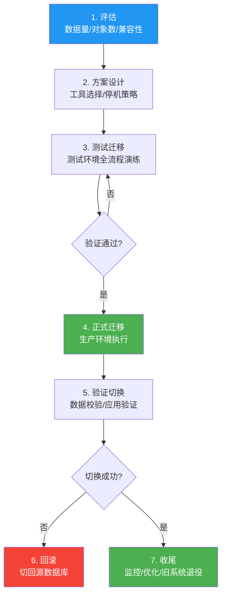
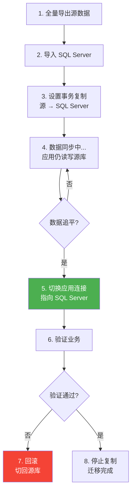

# SQL Server 迁移实战

> **数据库迁移是一场没有退路的战役。** 从数据类型映射到存储过程改造，从零停机切换到回滚预案——本篇给你一套完整的迁移作战方案。

---

## 一、迁移流程总览



---

## 二、迁移工具

### 2.1 SSMA（SQL Server Migration Assistant）

Microsoft 提供的官方迁移工具，支持 MySQL、Oracle、Access 等源数据库。

| 工具 | 源数据库 | 功能 |
|------|----------|------|
| SSMA for MySQL | MySQL 5.x/8.x | 自动迁移表/视图/存储过程 |
| SSMA for Oracle | Oracle 10g+ | 自动迁移表/视图/包/存储过程 |
| SSMA for Access | Access | 迁移表/查询/窗体 |
| DMA (Data Migration Assistant) | 任意 | 评估兼容性、迁移数据 |

### 2.2 BCP 批量导入

```bash
# BCP：SQL Server 自带的大数据量导入导出工具

# 导出数据
bcp MyDB.dbo.Orders OUT Orders.txt -S localhost -U sa -P "YourPass" -c -t "," -r "\n"

# 导入数据
bcp MyDB.dbo.Orders IN Orders.txt -S localhost -U sa -P "YourPass" -c -t "," -r "\n" -b 10000

# 参数说明：
# -c: 字符模式（不用二进制格式）
# -t: 列分隔符
# -r: 行分隔符
# -b: 批大小（每 N 行提交一次）
```

### 2.3 BULK INSERT

```sql
-- 服务器端批量导入
BULK INSERT Orders
FROM 'D:\Data\orders.csv'
WITH (
    FIELDTERMINATOR = ',',
    ROWTERMINATOR = '\n',
    FIRSTROW = 2,           -- 跳过标题行
    BATCHSIZE = 10000,      -- 每批提交
    TABLOCK,                -- 表锁（提高速度）
    CODEPAGE = '65001',     -- UTF-8
    DATAFILETYPE = 'char'
);
```

---

## 三、MySQL → SQL Server 迁移

### 3.1 数据类型映射

| MySQL | SQL Server | 注意事项 |
|-------|-----------|----------|
| `TINYINT` | `TINYINT` | MySQL TINYINT 有符号(-128~127)，SQL Server 无符号(0~255) |
| `SMALLINT` | `SMALLINT` | 直接映射 |
| `INT` | `INT` | 直接映射 |
| `BIGINT` | `BIGINT` | 直接映射 |
| `FLOAT` | `FLOAT` | 直接映射 |
| `DOUBLE` | `FLOAT(53)` | SQL Server FLOAT(53) ≈ MySQL DOUBLE |
| `DECIMAL(p,s)` | `DECIMAL(p,s)` | 直接映射 |
| `VARCHAR(n)` | `NVARCHAR(n)` | ⚠️ SQL Server 默认 Unicode，空间翻倍 |
| `TEXT` | `NVARCHAR(MAX)` | TEXT 已废弃，用 NVARCHAR(MAX) |
| `BLOB` | `VARBINARY(MAX)` | 直接映射 |
| `DATE` | `DATE` | 直接映射 |
| `DATETIME` | `DATETIME2(3)` | ⚠️ SQL Server DATETIME2 精度更高 |
| `TIMESTAMP` | `DATETIME2` | MySQL TIMESTAMP 自动更新，需手动实现 |
| `ENUM` | `NVARCHAR` + CHECK | SQL Server 无 ENUM，用 CHECK 约束替代 |
| `JSON` | `NVARCHAR(MAX)` | SQL Server 用 NVARCHAR + JSON 函数 |
| `AUTO_INCREMENT` | `IDENTITY(1,1)` | ⚠️ 行为差异：IDENTITY 回滚跳号 |
| `UNSIGNED` | ❌ | SQL Server 无 UNSIGNED，需 CHECK 约束 |

### 3.2 SQL 语法差异

```sql
-- 1. 分页
-- MySQL:
SELECT * FROM Orders LIMIT 20 OFFSET 40;
-- SQL Server:
SELECT * FROM Orders ORDER BY OrderId
OFFSET 40 ROWS FETCH NEXT 20 ROWS ONLY;

-- 2. 字符串拼接
-- MySQL:
SELECT CONCAT(FirstName, ' ', LastName) FROM Users;
-- SQL Server: 同样支持 CONCAT，还支持 +
SELECT FirstName + ' ' + LastName FROM Users;

-- 3. IFNULL → ISNULL / COALESCE
-- MySQL:
SELECT IFNULL(Phone, 'N/A') FROM Customers;
-- SQL Server:
SELECT ISNULL(Phone, 'N/A') FROM Customers;
-- 或更通用的 COALESCE
SELECT COALESCE(Phone, Mobile, 'N/A') FROM Customers;

-- 4. 反引号 → 方括号
-- MySQL:
SELECT `Name`, `Order Date` FROM `Order List`;
-- SQL Server:
SELECT [Name], [Order Date] FROM [Order List];

-- 5. GROUP_CONCAT → STRING_AGG
-- MySQL:
SELECT Department, GROUP_CONCAT(Name ORDER BY Name SEPARATOR ', ') FROM Employees GROUP BY Department;
-- SQL Server (2017+):
SELECT Department, STRING_AGG(Name, ', ') WITHIN GROUP (ORDER BY Name) FROM Employees GROUP BY Department;

-- 6. NOW() → GETDATE() / SYSDATETIME()
-- MySQL:
INSERT INTO Orders (Created) VALUES (NOW());
-- SQL Server:
INSERT INTO Orders (Created) VALUES (SYSDATETIME());
```

### 3.3 存储过程迁移

```sql
-- MySQL 存储过程
-- CREATE PROCEDURE GetOrders(IN p_CustId INT, OUT p_Count INT)
-- BEGIN
--     SELECT * FROM Orders WHERE CustomerId = p_CustId;
--     SELECT COUNT(*) INTO p_Count FROM Orders WHERE CustomerId = p_CustId;
-- END

-- SQL Server 等价写法
CREATE PROCEDURE dbo.usp_GetOrders
    @CustomerId INT,
    @OrderCount INT OUTPUT
AS
BEGIN
    SET NOCOUNT ON;

    SELECT * FROM Orders WHERE CustomerId = @CustomerId;

    SELECT @OrderCount = COUNT(*) FROM Orders WHERE CustomerId = @CustomerId;
END

-- 关键差异：
-- 1. IN/OUT → 参数方向在声明时指定
-- 2. BEGIN...END → T-SQL 需要 SET NOCOUNT ON
-- 3. SELECT INTO → SELECT @var = ...
-- 4. DELIMITER $$ → 不需要
-- 5. DECLARE 在 BEGIN 后
-- 6. 错误处理：DECLARE CONTINUE HANDLER → TRY...CATCH
```

---

## 四、PostgreSQL → SQL Server 迁移

### 4.1 数据类型映射

| PostgreSQL | SQL Server | 注意事项 |
|------------|-----------|----------|
| `SERIAL` | `INT IDENTITY(1,1)` | 自增方式不同 |
| `BIGSERIAL` | `BIGINT IDENTITY(1,1)` | 同上 |
| `VARCHAR(n)` | `NVARCHAR(n)` | 注意 Unicode |
| `TEXT` | `NVARCHAR(MAX)` | 直接映射 |
| `BYTEA` | `VARBINARY(MAX)` | 直接映射 |
| `TIMESTAMP` | `DATETIME2(6)` | PostgreSQL 精度默认6位 |
| `TIMESTAMPTZ` | `DATETIMEOFFSET(6)` | 时区信息 |
| `JSONB` | `NVARCHAR(MAX)` | SQL Server 用 JSON 函数处理 |
| `UUID` | `UNIQUEIDENTIFIER` | 直接映射 |
| `ARRAY` | `NVARCHAR(MAX)` + JSON | SQL Server 无数组类型 |
| `HSTORE` | `NVARCHAR(MAX)` + JSON | 用 JSON 替代 |
| `MONEY` | `DECIMAL(18,2)` | 不建议用 SQL Server MONEY |

### 4.2 SQL 语法差异

```sql
-- 1. ILIKE → 不支持，用 COLLATE 或 LOWER()
-- PostgreSQL:
SELECT * FROM Users WHERE Name ILIKE '%john%';
-- SQL Server:
SELECT * FROM Users WHERE Name LIKE '%john%' COLLATE SQL_Latin1_General_CP1_CI_AS;
-- 或
SELECT * FROM Users WHERE LOWER(Name) LIKE '%john%';

-- 2. LIMIT/OFFSET → OFFSET...FETCH
-- PostgreSQL:
SELECT * FROM Orders LIMIT 20 OFFSET 40;
-- SQL Server:
SELECT * FROM Orders ORDER BY OrderId
OFFSET 40 ROWS FETCH NEXT 20 ROWS ONLY;

-- 3. ::type → CAST/CONVERT
-- PostgreSQL:
SELECT created_at::date FROM Orders;
-- SQL Server:
SELECT CAST(CreatedAt AS DATE) FROM Orders;

-- 4. RETURNING → OUTPUT
-- PostgreSQL:
INSERT INTO Orders (CustomerId) VALUES (1) RETURNING OrderId;
-- SQL Server:
INSERT INTO Orders (CustomerId) OUTPUT INSERTED.OrderId VALUES (1);

-- 5. UPSERT → MERGE
-- PostgreSQL:
INSERT INTO Orders (OrderId, Amount) VALUES (1, 100)
ON CONFLICT (OrderId) DO UPDATE SET Amount = EXCLUDED.Amount;
-- SQL Server:
MERGE INTO Orders AS target
USING (SELECT 1 AS OrderId, 100 AS Amount) AS source
ON target.OrderId = source.OrderId
WHEN MATCHED THEN UPDATE SET Amount = source.Amount
WHEN NOT MATCHED THEN INSERT (OrderId, Amount) VALUES (source.OrderId, source.Amount);

-- 6. EXTRACT → DATEPART
-- PostgreSQL:
SELECT EXTRACT(YEAR FROM created_at) FROM Orders;
-- SQL Server:
SELECT DATEPART(YEAR, CreatedAt) FROM Orders;
```

---

## 五、零停机迁移方案



### 5.1 链接服务器（Linked Server）

```sql
-- 创建链接服务器（迁移期间临时使用）
-- 源数据库为 MySQL
EXEC sp_addlinkedserver
    @server = 'MYSQL_SOURCE',
    @srvproduct = 'MySQL',
    @provider = 'MSDASQL',
    @datasrc = 'MySQL_Source_DSN';

-- 通过链接服务器查询源数据
SELECT * FROM MYSQL_SOURCE.mydb...orders;

-- 增量同步
INSERT INTO Orders (OrderId, CustomerId, OrderDate, Amount)
SELECT OrderId, CustomerId, OrderDate, Amount
FROM MYSQL_SOURCE.mydb...orders
WHERE OrderDate > (SELECT ISNULL(MAX(OrderDate), '1900-01-01') FROM Orders);
```

### 5.2 事务复制（Transactional Replication）

```sql
-- SQL Server 事务复制：源数据库为 Publisher
-- 1. 配置 Distribution
EXEC sp_adddistributor @distributor = 'SQLDIST';
EXEC sp_adddistributiondb @database = 'distribution';

-- 2. 配置 Publisher（源 SQL Server）
EXEC sp_replicationdboption @dbname = 'SourceDB', @optname = 'publish', @value = 'true';

-- 3. 创建 Publication
EXEC sp_addpublication @publication = 'MigrationPub', @status = 'active';

-- 4. 添加 Article（要复制的表）
EXEC sp_addarticle @publication = 'MigrationPub',
    @article = 'Orders',
    @source_table = 'Orders';

-- 5. 添加 Subscription（目标 SQL Server）
EXEC sp_addsubscription @publication = 'MigrationPub',
    @subscriber = 'SQLTARGET',
    @destination_db = 'TargetDB';
```

---

## 六、常见陷阱

### 6.1 大小写敏感性

```sql
-- MySQL 默认不区分大小写（取决于排序规则）
-- SQL Server 默认安装的排序规则可能区分大小写

-- 检查当前排序规则
SELECT SERVERPROPERTY('Collation') AS ServerCollation;
SELECT DATABASEPROPERTYEX('MyDB', 'Collation') AS DatabaseCollation;

-- 建议迁移后使用 CI（Case Insensitive）排序规则
-- Chinese_PRC_CI_AS: 中文/不区分大小写/区分重音
ALTER DATABASE MyDB COLLATE Chinese_PRC_CI_AS;
```

### 6.2 保留字冲突

```sql
-- MySQL 中可能是合法的标识符，SQL Server 是保留字
-- 例如: User, Order, Group, Key, Table, Index

-- 解决方案：用方括号引用
SELECT [User], [Order] FROM [Table];

-- 或修改列名（推荐）
ALTER TABLE Users RENAME COLUMN [User] TO UserName;
```

### 6.3 IDENTITY vs AUTO_INCREMENT

```sql
-- MySQL AUTO_INCREMENT: 插入时自动递增
-- SQL Server IDENTITY: 行为类似但有差异

-- 差异 1：回滚跳号
-- MySQL InnoDB: 回滚后 AUTO_INCREMENT 不回退
-- SQL Server IDENTITY: 回滚后同样不回退（行为一致）

-- 差异 2：手动插入
-- MySQL: SET sql_mode = 'NO_AUTO_VALUE_ON_ZERO'; INSERT INTO t (id) VALUES (1);
-- SQL Server: SET IDENTITY_INSERT t ON; INSERT INTO t (id) VALUES (1);

-- 差异 3：重置
-- MySQL: ALTER TABLE t AUTO_INCREMENT = 1;
-- SQL Server: DBCC CHECKIDENT ('t', RESEED, 0);
```

### 6.4 日期函数差异

```sql
-- 常见日期函数对照表
-- MySQL                    → SQL Server
-- NOW()                    → GETDATE() / SYSDATETIME()
-- CURDATE()                → CAST(GETDATE() AS DATE)
-- DATE_ADD(d, INTERVAL n)  → DATEADD(day, n, d)
-- DATEDIFF(d1, d2)        → DATEDIFF(day, d1, d2)  -- ⚠️ 参数顺序相反
-- DATE_FORMAT(d, '%Y-%m')  → FORMAT(d, 'yyyy-MM')
-- YEAR(d)                  → YEAR(d)
-- LAST_DAY(d)              → EOMONTH(d)  -- SQL Server 2012+
```

---

## 七、迁移后验证

```sql
-- 1. 行数校验
SELECT 'Source' AS Source, COUNT(*) AS Cnt FROM SourceDB.dbo.Orders
UNION ALL
SELECT 'Target', COUNT(*) FROM TargetDB.dbo.Orders;

-- 2. 数据校验（关键表的哈希校验）
SELECT CHECKSUM_AGG(CHECKSUM(*)) AS TableChecksum FROM Orders;

-- 3. 对象完整性校验
SELECT
    (SELECT COUNT(*) FROM sys.tables) AS TableCount,
    (SELECT COUNT(*) FROM sys.views) AS ViewCount,
    (SELECT COUNT(*) FROM sys.procedures) AS ProcCount,
    (SELECT COUNT(*) FROM sys.indexes) AS IndexCount;

-- 4. 外键约束验证
SELECT
    OBJECT_NAME(f.parent_object_id) AS TableName,
    COL_NAME(fc.parent_object_id, fc.parent_column_id) AS ColumnName,
    OBJECT_NAME(f.referenced_object_id) AS RefTableName
FROM sys.foreign_keys f
JOIN sys.foreign_key_columns fc ON f.object_id = fc.constraint_object_id
ORDER BY TableName;

-- 5. 应用连接测试
-- 修改连接字符串，执行关键业务查询，验证功能
```

---

## 八、面试技巧

::: tip 面试高频考点
1. **数据类型映射**：VARCHAR→NVARCHAR, DATETIME→DATETIME2, AUTO_INCREMENT→IDENTITY
2. **SQL 语法差异**：LIMIT→OFFSET FETCH, IFNULL→ISNULL, GROUP_CONCAT→STRING_AGG
3. **零停机迁移**：事务复制 + 应用切换方案
4. **SSMA**：官方迁移工具，支持 MySQL/Oracle/Access
5. **大小写敏感性**：排序规则 CI vs CS
6. **保留字**：方括号引用或改名
7. **迁移后验证**：行数校验 + 哈希校验 + 功能验证
:::

::: warning 易错点
- "迁移只是复制数据"——❌，还需要迁移存储过程、视图、触发器、索引等
- "IDENTITY 和 AUTO_INCREMENT 完全一样"——❌，手动插入/重置的语法不同
- "VARCHAR 直接映射到 VARCHAR"——⚠️，中文环境应映射到 NVARCHAR
- "BCP 可以跨数据库类型导入"——❌，BCP 只适用于 SQL Server，跨库用 SSMA
:::

---

## 参考资料

- [SQL Server Migration Assistant](https://learn.microsoft.com/en-us/sql/ssma/sql-server-migration-assistant)
- [Data Migration Assistant](https://learn.microsoft.com/en-us/sql/dma/dma-overview)
- [BCP Utility](https://learn.microsoft.com/en-us/sql/tools/bcp-utility)
- [BULK INSERT](https://learn.microsoft.com/en-us/sql/t-sql/statements/bulk-insert-transact-sql)
- [Linked Servers](https://learn.microsoft.com/en-us/sql/relational-databases/linked-servers/linked-servers-database-engine)
