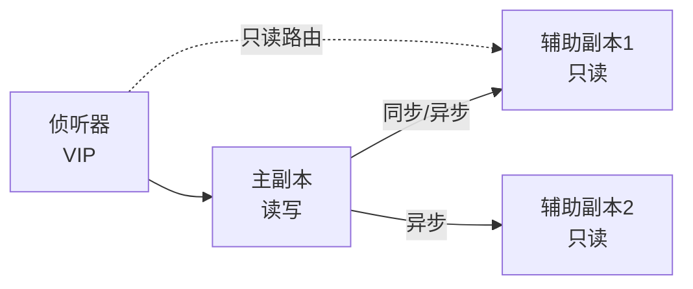

# SQL Server 面试题精选

> **20 道高频 SQL Server 面试题，覆盖基础到进阶。** 每道题给出核心答案和延伸要点，帮你从容应对面试。

::: tip 与现有内容的关系
本文聚焦 SQL Server 特有的面试题。更多通用 SQL 面试题，参考 [SQL 知识库 · 高频 SQL 面试题精选](/后端开发/ASP.NET_Core/SQL知识库/06_面试与深度/01.高频SQL面试题精选.md) 和 [SQL Server vs MySQL 差异对照](/后端开发/ASP.NET_Core/SQL知识库/06_面试与深度/04.SQL%20Server%20vs%20MySQL差异对照.md)。
:::

---

## Q1：聚集索引和非聚集索引有什么区别？

**核心答案：**

| 维度 | 聚集索引 | 非聚集索引 |
|------|----------|-----------|
| 数量 | 每表1个 | 每表最多999个 |
| 叶子节点 | 数据行本身 | 行定位符（聚集键或 RID） |
| 物理顺序 | 数据按索引键物理排列 | 独立结构，不影响数据物理顺序 |
| 存储开销 | 无额外空间 | 额外 B+ 树结构 |

**延伸要点：**
- 非聚集索引的行定位符：堆表是 RID（物理地址），有聚集索引的表是聚集索引键
- 聚集索引键越窄越好——因为所有非聚集索引都包含它
- 主键默认创建聚集索引，但可以用 `PRIMARY KEY NONCLUSTERED` 改为非聚集

```sql
-- 演示
CREATE TABLE Demo (
    Id INT PRIMARY KEY NONCLUSTERED,  -- 非聚集主键
    CreateDate DATETIME2 NOT NULL
);
CREATE CLUSTERED INDEX IX_Demo_CreateDate ON Demo(CreateDate);  -- 聚集索引在日期列
```

---

## Q2：SQL Server 的隔离级别有哪些？默认是什么？

**核心答案：**

5 种隔离级别，默认 **Read Committed**：

| 隔离级别 | 脏读 | 不可重复读 | 幻读 |
|----------|------|-----------|------|
| Read Uncommitted | ✅ | ✅ | ✅ |
| **Read Committed（默认）** | ❌ | ✅ | ✅ |
| Repeatable Read | ❌ | ❌ | ✅ |
| Serializable | ❌ | ❌ | ❌ |
| Snapshot | ❌ | ❌ | ❌ |

**延伸要点：**
- Read Committed 使用共享锁，读完后立即释放
- Repeatable Read 共享锁持到事务结束
- Serializable 使用键范围锁防止幻读
- Snapshot 基于 tempdb 行版本，读写不阻塞
- 生产环境推荐开启 RCSI（READ_COMMITTED_SNAPSHOT）

---

## Q3：什么是参数嗅探？如何解决？

**核心答案：**

参数嗅探是指 SQL Server 优化器根据第一次传入的参数值生成执行计划并缓存，后续不同参数复用同一计划。当数据分布不均匀时，不同参数可能需要不同的最优计划。

**4 种解决策略：**

```sql
-- 1. OPTION (RECOMPILE) — 每次重编译
SELECT * FROM Orders WHERE CustomerId = @CustId
OPTION (RECOMPILE);

-- 2. OPTIMIZE FOR UNKNOWN — 通用计划
SELECT * FROM Orders WHERE CustomerId = @CustId
OPTION (OPTIMIZE FOR UNKNOWN);

-- 3. OPTIMIZE FOR — 指定典型参数值
SELECT * FROM Orders WHERE CustomerId = @CustId
OPTION (OPTIMIZE FOR (@CustId = 1));

-- 4. Query Store 强制计划
EXEC sp_query_store_force_plan @query_id = 42, @plan_id = 108;
```

**延伸要点：**
- 参数嗅探大多数时候是好东西（计划复用率高）
- 问题出在数据分布严重不均时
- 判断方法：Query Store 的 Regressed Queries 报告

---

## Q4：AlwaysOn 可用性组的工作原理？

**核心答案：**



- **主副本**：处理读写请求，将日志发送到辅助副本
- **辅助副本**：接收日志、重做（Redo），可配置为只读访问
- **同步模式**：主副本等待辅助确认 → 零数据丢失
- **异步模式**：主副本不等确认 → 可能丢失数据
- **自动故障转移**：需要同步模式 + 至少2个同步副本
- **侦听器**：虚拟网络名 + VIP，客户端连接入口

**延伸要点：**
- AG 是数据库级故障转移，FCI 是实例级
- 只读路由：ApplicationIntent=ReadOnly → 辅助副本
- 分布式 AG：跨 WSFC 的灾备方案

---

## Q5：DELETE 和 TRUNCATE 的区别？

| 维度 | DELETE | TRUNCATE |
|------|--------|----------|
| 行删除方式 | 逐行删除 | 释放数据页 |
| 日志 | 每行一条日志 | 每页一条日志 |
| 速度 | 慢 | 快 |
| WHERE | ✅ 支持 | ❌ 不支持 |
| 触发器 | ✅ 触发 | ❌ 不触发 |
| 回滚 | ✅ 可以 | ✅ 可以（但日志少） |
| IDENTITY | 不重置 | 重置为初始值 |
| 外键引用 | 不受限 | ❌ 不能 TRUNCATE 被引用的表 |

**延伸要点：**
- TRUNCATE 本质是 DDL（释放页），DELETE 是 DML
- TRUNCATE 后 IDENTITY 重置：`DBCC CHECKIDENT ('t', RESEED, 0)`
- 有外键引用时 TRUNCATE 报错，需先禁用外键或用 DELETE

---

## Q6：什么是死锁？如何预防和排查？

**核心答案：**

死锁是两个事务互相等待对方持有的锁，形成循环等待。

**排查方法：**
```sql
-- 跟踪标志 1222：死锁图写入错误日志
DBCC TRACEON(1222, -1);

-- Extended Events system_health 会话自动捕获
-- 或 SQL Server Profiler 的 Deadlock Graph 事件
```

**预防策略：**
1. 按固定顺序访问表
2. 缩短事务持续时间
3. 使用 UPDLOCK 提前获取更新锁
4. 开启 RCSI 减少读写阻塞
5. 设置合理的索引避免全表扫描

---

## Q7：什么是 RLS（行级安全）？

**核心答案：**

RLS 让不同用户只能看到自己有权访问的行，无需修改应用代码。

```sql
-- 1. 安全谓词函数
CREATE FUNCTION Security.fn_Filter(@Dept NVARCHAR(50))
RETURNS TABLE WITH SCHEMABINDING
AS RETURN SELECT 1 AS fn_result WHERE @Dept = USER_NAME();

-- 2. 安全策略
CREATE SECURITY POLICY DeptFilter
ADD FILTER PREDICATE Security.fn_Filter(Department) ON dbo.Employees
WITH (STATE = ON);
```

**延伸要点：**
- FILTER 谓词：过滤 SELECT/UPDATE/DELETE
- BLOCK 谓词：阻止 INSERT/UPDATE/DELETE
- 性能注意：谓词函数在每行上执行，复杂函数会影响查询性能

---

## Q8：什么是 Query Store？有什么用？

**核心答案：**

Query Store 是 SQL Server 2016+ 的执行计划管理功能，自动记录查询性能历史。

**三大用途：**
1. **回归检测**：自动发现性能变差的查询
2. **强制计划**：锁定最优执行计划，避免参数嗅探问题
3. **等待统计**：查询级别的等待分析

```sql
-- 强制使用特定执行计划
EXEC sp_query_store_force_plan @query_id = 42, @plan_id = 108;
```

---

## Q9：TempDB 优化有哪些要点？

**核心答案：**

1. **多文件**：1 个/CPU 核心，最多 8 个，等大小
2. **预分配**：设置足够初始大小，避免自动增长
3. **高速磁盘**：放在 SSD 上
4. **TF1118**：减少混合区争用（2016+ 默认启用）
5. **监控**：`sys.dm_db_file_space_usage` 查看空间使用

```sql
-- 添加 tempdb 文件
ALTER DATABASE tempdb
ADD FILE (NAME = tempdev2, FILENAME = 'F:\TempDB\tempdev2.ndf', SIZE = 1GB);
```

---

## Q10：Snapshot 隔离级别的工作原理？

**核心答案：**

- 基于 **tempdb 版本存储**的行版本控制
- 读操作从版本存储中获取事务开始时的数据快照
- 不加共享锁，读写互不阻塞
- 写操作仍用排他锁，写写互斥

**RCSI vs Snapshot：**
- RCSI：语句级快照（每条语句读到语句开始时的数据）
- Snapshot：事务级快照（整个事务读到事务开始时的数据）

**代价：** tempdb 空间增加、写入时维护版本链的额外开销

---

## Q11：什么是 SARGability？哪些操作破坏它？

**核心答案：**

SARGable = Search ARGument Able，指查询条件能利用索引查找。

**破坏 SARGability 的操作：**
```sql
-- ❌ 列被函数包裹
WHERE YEAR(OrderDate) = 2024
-- ✅ 改写
WHERE OrderDate >= '2024-01-01' AND OrderDate < '2025-01-01'

-- ❌ 列参与运算
WHERE Salary * 12 > 100000
-- ✅ 改写
WHERE Salary > 100000 / 12

-- ❌ 前导通配符
WHERE Name LIKE '%三'
-- ✅ （无法改写，考虑全文搜索）

-- ❌ ISNULL/COALESCE 包裹列
WHERE ISNULL(Dept, 'IT') = 'IT'
-- ✅ 改写
WHERE Dept = 'IT' OR Dept IS NULL
```

---

## Q12：三种 Join 算子的适用场景？

| 算子 | 适用场景 | 复杂度 |
|------|----------|--------|
| **Nested Loop** | 小表×大表，内表有索引 | O(N×M) |
| **Hash Match** | 大表×大表，无合适索引 | O(N+M) |
| **Merge Join** | 两输入已排序 | O(N+M) |

---

## Q13：SQL Server 的锁升级机制？

**核心答案：**
- 单条语句在同一对象上持有 > 5000 个行/键级锁时，自动升级为表级锁
- 升级路径：行锁 → 页锁 → 表锁（直接跳到表锁）
- 可通过 TF 1211/1224 禁用（谨慎使用）
- 更好的方案：优化查询减少锁数量，或使用分区表

---

## Q14：如何找到最慢的查询？

```sql
-- 按 CPU 排序
SELECT TOP 10
    total_worker_time / execution_count AS AvgCpuUs,
    execution_count,
    SUBSTRING(st.text, (qs.statement_start_offset / 2) + 1,
        (CASE qs.statement_end_offset WHEN -1 THEN DATALENGTH(st.text)
         ELSE qs.statement_end_offset END - qs.statement_start_offset) / 2 + 1) AS QueryText
FROM sys.dm_exec_query_stats qs
CROSS APPLY sys.dm_exec_sql_text(qs.sql_handle) st
ORDER BY AvgCpuUs DESC;

-- 按逻辑读取排序
-- 替换排序字段为 total_logical_reads / execution_count
```

---

## Q15：三种恢复模式有什么区别？

| 模式 | 日志截断 | 时间点恢复 | 场景 |
|------|----------|-----------|------|
| SIMPLE | Checkpoint 自动截断 | ❌ | 开发/测试 |
| FULL | 需日志备份 | ✅ | **生产标配** |
| BULK_LOGGED | 需日志备份 | 有限 | 批量操作期间 |

---

## Q16：什么是 TDE？和 Always Encrypted 有什么区别？

| 维度 | TDE | Always Encrypted |
|------|-----|-----------------|
| 加密层级 | 数据库级 | 列级 |
| 加密位置 | 服务器 | 客户端 |
| DBA 可见明文 | ✅ | ❌ |
| 对应用透明 | ✅ | 需驱动支持 |
| 防护场景 | 磁盘丢失 | 恶意 DBA |

---

## Q17：索引碎片如何处理？

| 碎片率 | 建议 |
|--------|------|
| < 10% | 不处理 |
| 10% ~ 30% | ALTER INDEX ... REORGANIZE |
| > 30% | ALTER INDEX ... REBUILD |

```sql
-- 检查碎片
SELECT i.name, ips.avg_fragmentation_in_percent
FROM sys.indexes i
CROSS APPLY sys.dm_db_index_physical_stats(DB_ID(), i.object_id, i.index_id, NULL, 'LIMITED') ips
WHERE OBJECT_NAME(i.object_id) = 'Orders';
```

---

## Q18：什么是 DDM（动态数据脱敏）？

**核心答案：**
DDM 在查询时自动对敏感数据脱敏，无 UNMASK 权限的用户看不到原始值。

```sql
-- 脱敏函数
Phone MASKED WITH (FUNCTION = 'default()')      -- 根据类型默认脱敏
Email MASKED WITH (FUNCTION = 'email()')         -- z***@***.com
CreditCard MASKED WITH (FUNCTION = 'partial(2,"XXXX",2)') -- ViXXXX04
```

**注意：** DDM 不是加密！数据在磁盘上仍是明文，有足够权限仍可看到原始值。

---

## Q19：sp_executesql 和 EXEC 有什么区别？

| 维度 | sp_executesql | EXEC |
|------|--------------|------|
| 参数化 | ✅ 支持 | ❌ 字符串拼接 |
| SQL 注入 | 安全 | 有风险 |
| 计划缓存 | ✅ 可复用 | 每次生成新计划 |
| 推荐 | ✅ | ❌（仅动态表名/列名时） |

---

## Q20：SQL Server on Linux 和 Windows 版有什么差异？

**核心答案：**
- 功能基本一致，支持多数特性
- 主要差异：
  - AlwaysOn FCI 依赖 Pacemaker（非 WSFC）
  - 文件路径使用 Linux 风格
  - 内存管理方式不同
  - 部分 Windows 特有功能不支持（如 Windows 认证需配置）
- Docker 部署是 Linux 版的常见用法

---

## 面试准备清单

::: important 面试前必会
1. 聚集 vs 非聚集索引（Q1）
2. 5 种隔离级别 + RCSI（Q2、Q10）
3. 参数嗅探 + 解决方案（Q3）
4. AlwaysOn 原理（Q4）
5. DELETE vs TRUNCATE（Q5）
6. 死锁排查（Q6）
7. RLS / DDM / TDE / Always Encrypted（Q7、Q16、Q18）
8. TempDB 优化（Q9）
9. SARGability（Q11）
10. 三种 Join 算子（Q12）
:::

---

## 参考资料

- [SQL Server Documentation](https://learn.microsoft.com/en-us/sql/sql-server/)
- [SQL 知识库 · 高频 SQL 面试题精选](/后端开发/ASP.NET_Core/SQL知识库/06_面试与深度/01.高频SQL面试题精选.md)
- [SQL 知识库 · SQL Server vs MySQL 差异对照](/后端开发/ASP.NET_Core/SQL知识库/06_面试与深度/04.SQL%20Server%20vs%20MySQL差异对照.md)
- [Orchard Core GitHub](https://github.com/OrchardCMS/OrchardCore)
- [ABP Framework GitHub](https://github.com/abpframework/abp)
