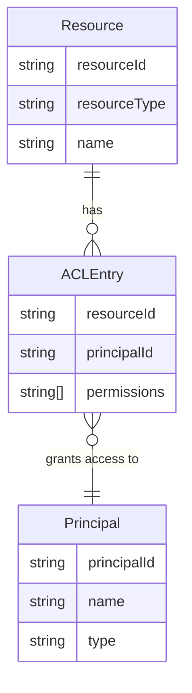

# ACL 访问控制列表

## 💡 概念顿悟

ACL 就像一栋楼的**门禁白名单**：每扇门旁边贴一张纸，上面写着"张三可以进、李四不能进"。管理员要改权限，就去找那扇门的白名单改。

这是最直观的方案，也是最难维护的方案——当楼里有 1000 扇门、10000 个人时，你维护的是 1000 张白名单。

## 核心模型

ACL（Access Control List）为**每个资源**维护一份允许访问的主体列表。



## 数据模型示例

```json
// 文件 /reports/sales-q4.xlsx 的 ACL
{
  "resourceId": "/reports/sales-q4.xlsx",
  "entries": [
    { "principal": "user:zhangsan", "permissions": ["read", "write"] },
    { "principal": "user:lisi",     "permissions": ["read"] },
    { "principal": "group:finance", "permissions": ["read", "write", "delete"] }
  ]
}
```

## C# 实现示例

```csharp
public class AclEntry
{
    public string PrincipalId { get; set; }
    public HashSet<string> Permissions { get; set; } = new();
}

public class AclService
{
    // resourceId -> list of entries
    private readonly Dictionary<string, List<AclEntry>> _acls = new();

    public bool IsAllowed(string principalId, string resourceId, string permission)
    {
        if (!_acls.TryGetValue(resourceId, out var entries))
            return false;

        return entries.Any(e =>
            e.PrincipalId == principalId &&
            e.Permissions.Contains(permission));
    }
}
```

## ACL 的优势与致命痛点

| 维度 | 评价 |
|------|------|
| 直观性 | ✅ 一眼看出"谁能访问这个资源" |
| 实现简单 | ✅ 不需要额外抽象层 |
| 用户视角 | ❌ 无法回答"张三能访问哪些资源"（需要扫描所有 ACL） |
| 扩展性 | ❌ 用户/资源量大时，ACL 条目爆炸式增长 |
| 权限变更 | ❌ 某人离职需要遍历所有资源删除其条目 |

::: warning 适用场景
ACL 适合**资源数量少、主体固定**的场景：操作系统文件权限（Linux `chmod`）、AWS S3 Bucket Policy、网络设备访问控制。

对于业务系统，请直接使用 RBAC 或更高级的模型。
:::

## 历史地位

ACL 是权限系统的"起点"，RBAC 的发明正是为了解决 ACL 的管理困境——与其管理每个资源的白名单，不如管理角色，让用户继承角色的权限。
