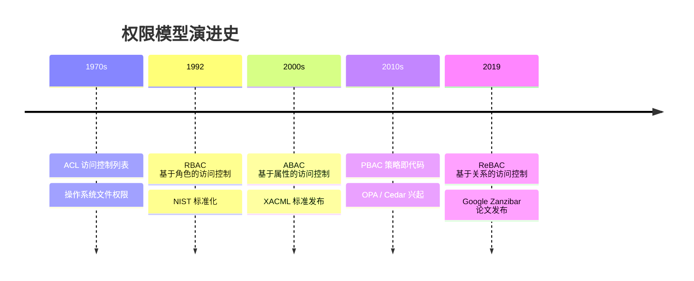
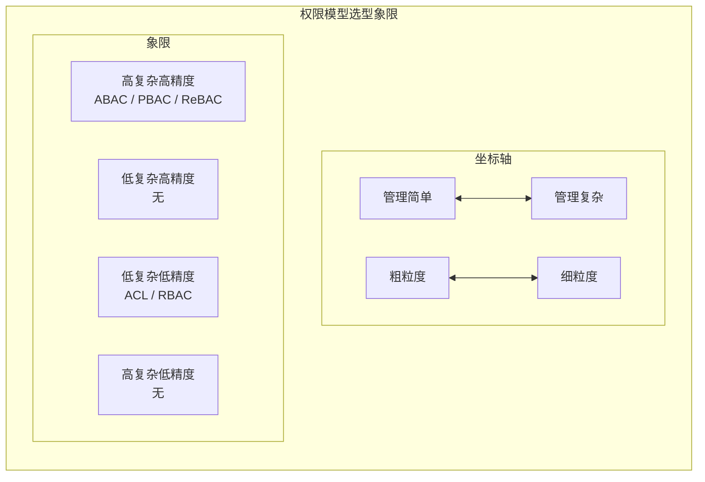
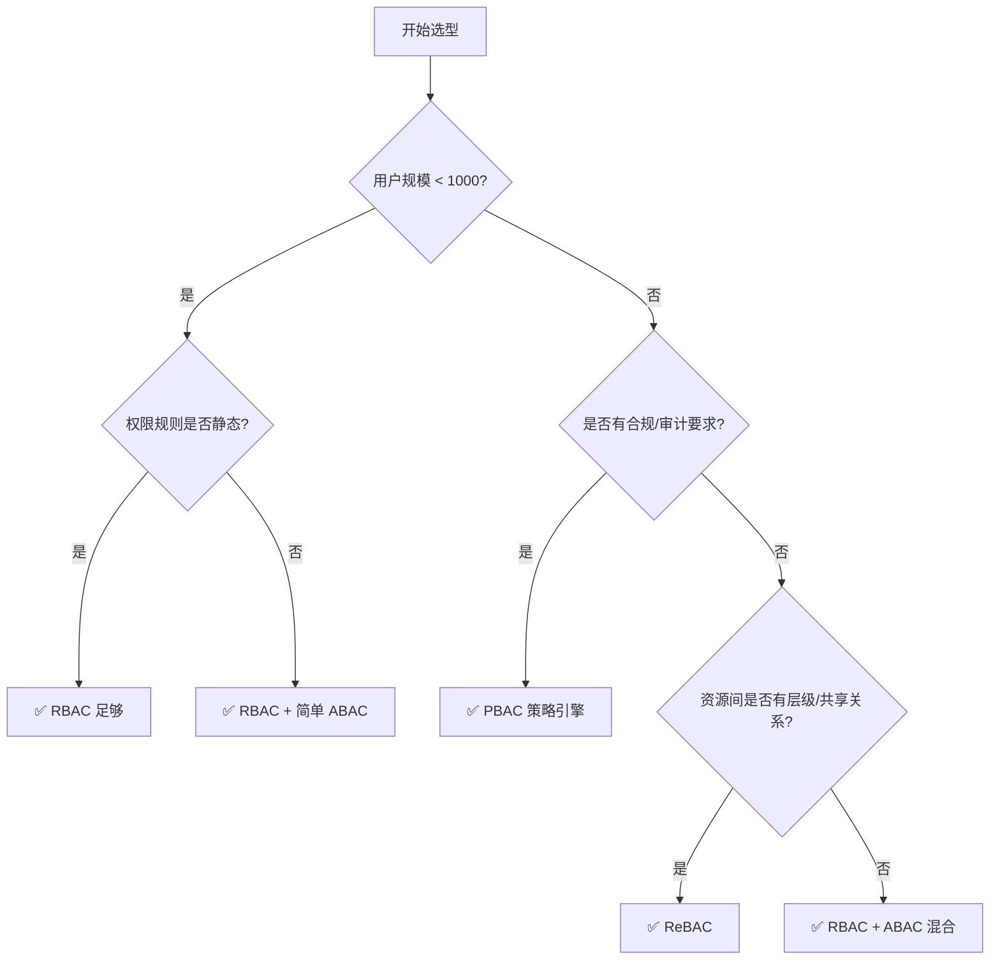

# 权限模型对比全景

## 💡 概念顿悟

权限模型的演进史，本质上是在回答同一个问题：**"在什么条件下，谁可以对什么资源做什么操作？"**

每一代模型都在扩大"条件"的表达能力：
- ACL：条件 = 主体身份
- RBAC：条件 = 主体的角色
- ABAC：条件 = 主体/资源/环境的任意属性组合
- PBAC：条件 = 可版本化、可继承的策略代码
- ReBAC：条件 = 主体与资源之间的关系图

## 演进时间线



## 五大模型横向对比



## 详细对比矩阵

| 维度 | ACL | RBAC | ABAC | PBAC | ReBAC |
|------|-----|------|------|------|-------|
| **核心抽象** | 资源白名单 | 角色 | 属性+策略 | 策略代码 | 关系图 |
| **授权表达式** | 主体 ∈ 资源白名单 | 主体.角色 ⊆ 权限集 | If A∧B∧C then Allow | Policy.evaluate() | 主体→关系→资源 |
| **动态能力** | 无 | 弱（静态角色） | 强 | 最强 | 中（关系变化） |
| **管理粒度** | 资源级 | 角色级 | 属性级 | 策略级 | 关系级 |
| **性能开销** | 低 | 低 | 高 | 高 | 中（图查询） |
| **可解释性** | 高 | 高 | 低 | 中 | 高 |
| **适用规模** | 小型 | 中大型 | 数据密集型 | 合规驱动型 | 社交/协作系统 |
| **.NET 原生支持** | 无 | ✅ `[Authorize(Roles)]` | 需扩展 | 需规则引擎 | 无，需自建 |

## 各模型核心场景

### ACL —— 操作系统、网络设备
```
/data/report.xlsx → [zhangsan:rw, lisi:r, finance-group:rwx]
```

### RBAC —— 企业内部系统
```
zhangsan → Role:SalesManager → Permission:ViewContract, CreateOrder
```

### ABAC —— 数据平台、金融系统
```
IF user.department == resource.department
AND user.level >= 3
AND time.hour BETWEEN 9 AND 18
THEN allow read
```

### PBAC —— 合规驱动型企业
```json
{
  "policy": "sales-contract-read",
  "effect": "Allow",
  "conditions": ["user.role == 'Manager'", "resource.amount < 100000"],
  "version": "2.1"
}
```

### ReBAC —— Google Docs、GitHub 协作
```
zhangsan → owner → document:report
lisi     → viewer → document:report (通过 folder:q4 继承)
```

## 选型决策树



::: tip 架构师建议
现代企业系统的最优解通常是 **RBAC（粗粒度）+ ABAC（细粒度）混合架构**。不要追求"纯粹"的单一模型，业务复杂度决定了混合是常态。
:::
