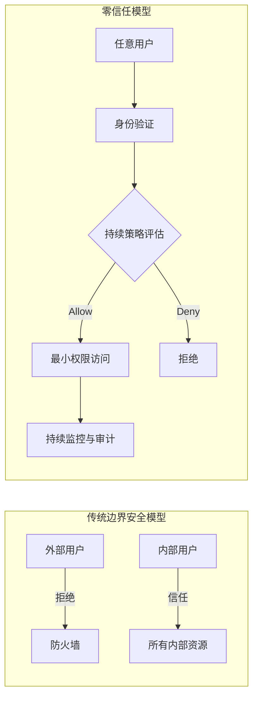
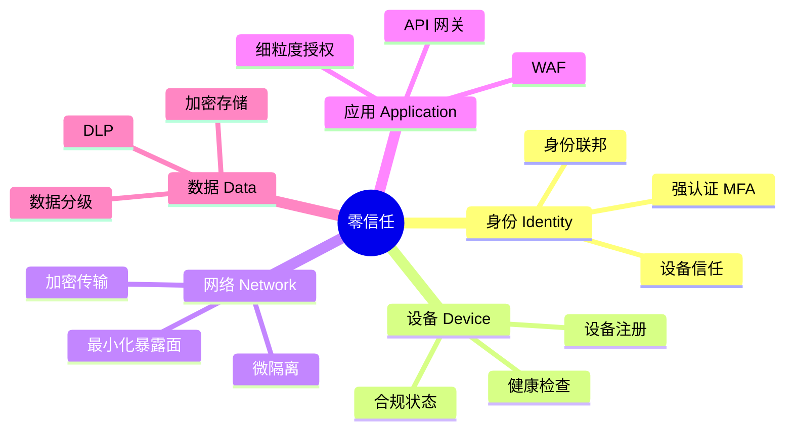

# 零信任架构简介

## 💡 概念顿悟

传统网络安全的思路是"**城堡与护城河**"：城墙外的人是敌人，城墙内的人是自己人，进了城什么都可以访问。

零信任的思路是"**机场安检**"：无论你是员工还是访客，无论你来自内网还是外网，每次通过安检都要验票、看证件、过安检仪。**进了机场不代表你能登上任何飞机。**

核心原则：**Never Trust, Always Verify（永不信任，持续验证）**

## 传统安全 vs 零信任



## 零信任的五大支柱



## 在权限系统中的体现

零信任不是一个具体的权限模型，而是一种**设计哲学**，它对权限系统提出了以下要求：

| 零信任原则 | 在权限系统中的落地 |
|----------|-----------------|
| 持续验证 | 每次 API 调用都鉴权，不依赖 Session |
| 最小权限 | 默认拒绝，只授予完成任务的最小权限集 |
| 假设已泄露 | 即使 Token 泄露，也通过 IP/设备/时间等属性限制影响范围 |
| 显式验证 | 基于全部可用数据点（身份、位置、设备、服务、时间）做决策 |

## .NET 零信任实践要点

```csharp
// 零信任核心：每次请求都重新评估，不信任任何预设状态
public class ZeroTrustMiddleware
{
    public async Task InvokeAsync(HttpContext context)
    {
        var principal = context.User;

        // 1. 验证身份令牌是否仍然有效（可能已被吊销）
        if (!await _tokenValidator.IsValidAsync(principal))
        {
            context.Response.StatusCode = 401;
            return;
        }

        // 2. 验证设备合规性
        var deviceId = context.Request.Headers["X-Device-Id"];
        if (!await _deviceService.IsCompliantAsync(deviceId))
        {
            context.Response.StatusCode = 403;
            return;
        }

        // 3. 评估上下文风险（异常登录地点、时间等）
        var riskScore = await _riskEngine.EvaluateAsync(context);
        if (riskScore > RiskThreshold.High)
        {
            context.Response.StatusCode = 403;
            return;
        }

        await _next(context);
    }
}
```

::: tip 与 ABAC 的关系
零信任架构天然与 ABAC 契合——因为 ABAC 的 Environment Attribute 正好承载了"设备状态、网络位置、风险评分"等零信任所需的上下文信息。零信任是哲学，ABAC 是实现工具之一。
:::
