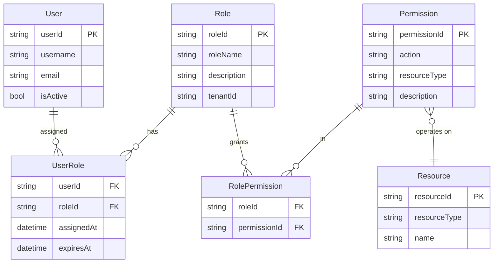
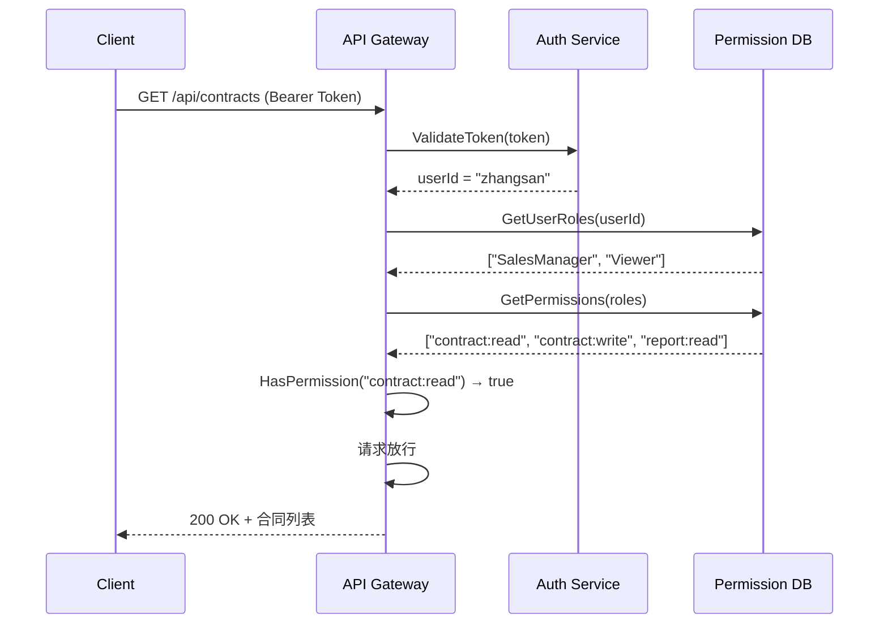

# RBAC 核心模型

## 💡 概念顿悟

RBAC 就是**公司工牌颜色系统**：

- 挂**红牌**的人（运维角色）能进机房
- 挂**蓝牌**的人（员工角色）只能进办公区
- 挂**白牌**的人（访客角色）只能在门厅等候

保安不认识你是谁，**只认牌子颜色**。权限与角色绑定，人通过拥有角色获得权限。

## E-R 模型图



## 标准 RBAC 四大要素

| 要素 | 说明 | 示例 |
|------|------|------|
| **User（用户）** | 系统的操作主体 | 张三、李四 |
| **Role（角色）** | 一组权限的集合，代表职责 | 销售经理、财务审计员 |
| **Permission（权限）** | 对资源的操作授权 | 查看合同、审批报销 |
| **Resource（资源）** | 被保护的系统对象 | 合同表、报销单、菜单 |

## 数据库设计

```sql
-- 用户表
CREATE TABLE users (
    user_id    UNIQUEIDENTIFIER PRIMARY KEY,
    username   NVARCHAR(100) NOT NULL,
    email      NVARCHAR(200) NOT NULL,
    is_active  BIT NOT NULL DEFAULT 1,
    tenant_id  UNIQUEIDENTIFIER NOT NULL
);

-- 角色表
CREATE TABLE roles (
    role_id     UNIQUEIDENTIFIER PRIMARY KEY,
    role_name   NVARCHAR(100) NOT NULL,
    description NVARCHAR(500),
    tenant_id   UNIQUEIDENTIFIER NOT NULL
);

-- 权限表
CREATE TABLE permissions (
    permission_id UNIQUEIDENTIFIER PRIMARY KEY,
    action        NVARCHAR(50) NOT NULL,   -- read / write / delete
    resource_type NVARCHAR(100) NOT NULL,  -- Contract / Order / Report
    description   NVARCHAR(500)
);

-- 用户-角色关联
CREATE TABLE user_roles (
    user_id     UNIQUEIDENTIFIER NOT NULL,
    role_id     UNIQUEIDENTIFIER NOT NULL,
    assigned_at DATETIME2 NOT NULL DEFAULT GETUTCDATE(),
    expires_at  DATETIME2 NULL,
    PRIMARY KEY (user_id, role_id)
);

-- 角色-权限关联
CREATE TABLE role_permissions (
    role_id       UNIQUEIDENTIFIER NOT NULL,
    permission_id UNIQUEIDENTIFIER NOT NULL,
    PRIMARY KEY (role_id, permission_id)
);
```

## 鉴权流程时序图



## RBAC 的优势

- **管理简单**：权限与角色绑定，人员变动只需调整角色分配
- **可审计**：一眼看出"这个角色能干什么"
- **标准化**：NIST RBAC 标准（ANSI/INCITS 359-2004），有成熟工具支持
- **性能好**：只需查角色表，不需要动态计算

## RBAC 的边界

RBAC 无法很好地处理以下场景：

```
❌ "只有北京分公司的销售组长，才能在工作日查看
    本部门金额小于 10 万元的合同"
```

这个需求有 4 个维度的条件：
1. 城市 = 北京（资源属性）
2. 职级 = 组长（用户属性）
3. 时间 = 工作日（环境属性）
4. 金额 < 10 万（资源属性）

用纯 RBAC 实现，你只能发明一个新角色：`北京销售组长_工作日_小额合同查看者`。这就是下一章要讲的**角色爆炸**问题。
