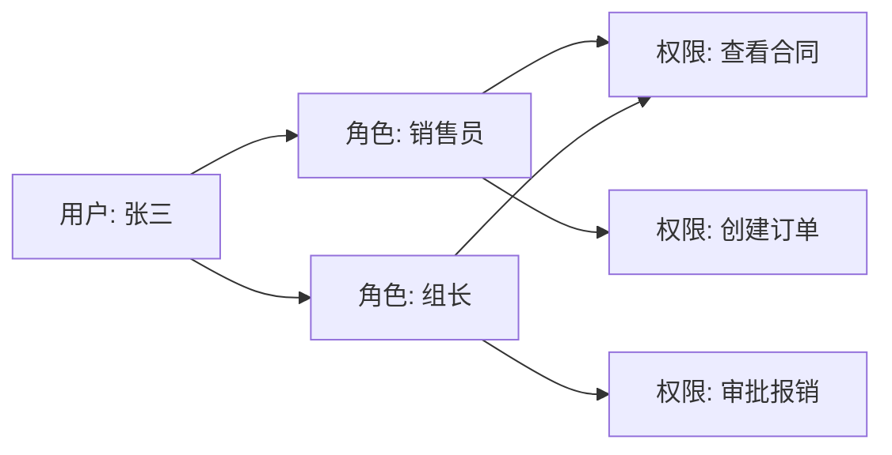
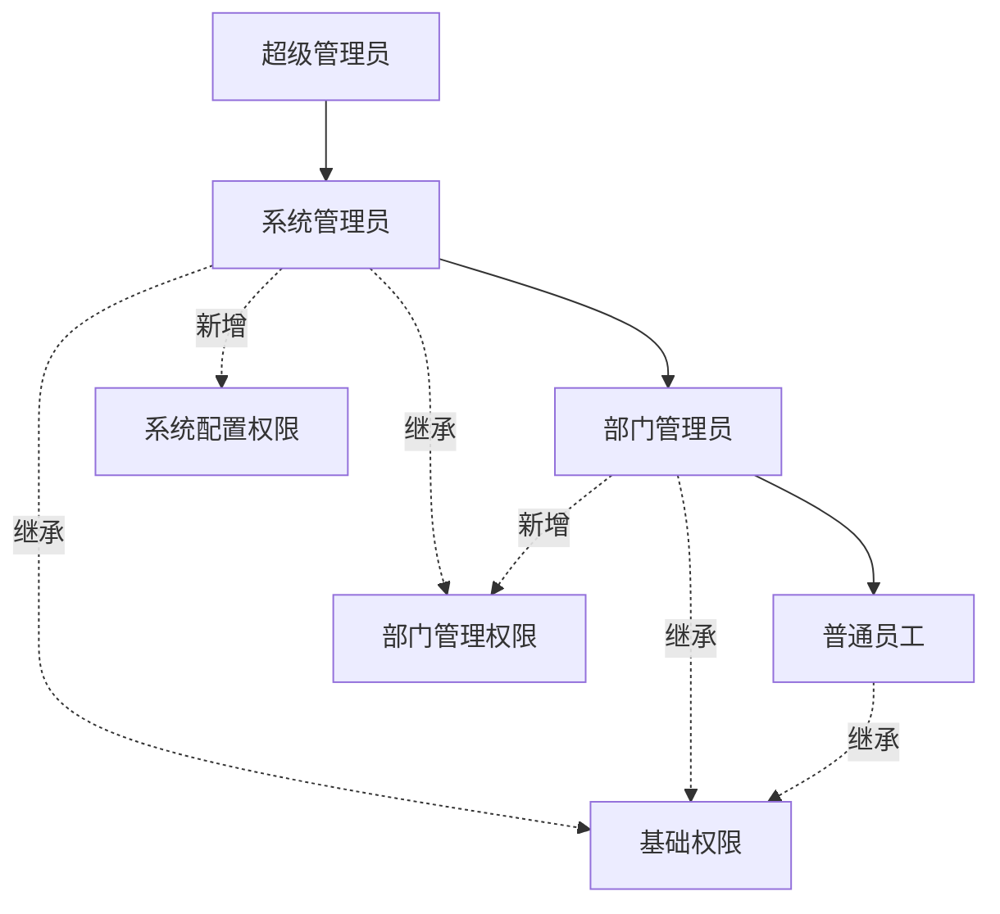
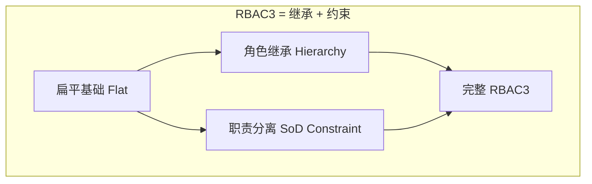

# RBAC 扩展模型

NIST 定义了四级 RBAC 模型，从最基础的扁平结构到支持继承与约束的完整体系。

## RBAC0 —— 核心模型（Flat RBAC）

最基础的形态：用户通过角色获得权限，支持用户同时拥有多个角色。



## RBAC1 —— 角色继承（Hierarchical RBAC）

角色之间可以有**父子关系**，子角色自动继承父角色的所有权限。



**数据库实现**：

```sql
-- 角色表增加 parent_role_id
ALTER TABLE roles ADD parent_role_id UNIQUEIDENTIFIER NULL;

-- 递归查询所有继承权限（SQL Server CTE）
WITH RoleHierarchy AS (
    SELECT role_id, parent_role_id, role_name
    FROM roles WHERE role_id = @targetRoleId

    UNION ALL

    SELECT r.role_id, r.parent_role_id, r.role_name
    FROM roles r
    INNER JOIN RoleHierarchy rh ON r.role_id = rh.parent_role_id
)
SELECT DISTINCT p.*
FROM permissions p
JOIN role_permissions rp ON p.permission_id = rp.permission_id
JOIN RoleHierarchy rh ON rp.role_id = rh.role_id;
```

## RBAC2 —— 约束模型（Constrained RBAC）

在 RBAC1 基础上增加**职责分离（SoD, Separation of Duty）**约束，防止权力过度集中。

### 静态职责分离（Static SoD）

用户**不能同时分配**某些互斥角色：

```csharp
public class SodConstraintService
{
    // 互斥角色对：不能同时拥有
    private readonly List<(string, string)> _mutuallyExclusiveRoles = new()
    {
        ("Purchaser", "Approver"),      // 采购员不能同时是审批员
        ("Accountant", "Auditor"),      // 会计不能同时是审计员
        ("Developer", "ProductionDeploy") // 开发不能同时有生产部署权
    };

    public bool CanAssignRole(string userId, string newRoleId, IEnumerable<string> existingRoleIds)
    {
        foreach (var (roleA, roleB) in _mutuallyExclusiveRoles)
        {
            if (newRoleId == roleA && existingRoleIds.Contains(roleB)) return false;
            if (newRoleId == roleB && existingRoleIds.Contains(roleA)) return false;
        }
        return true;
    }
}
```

### 动态职责分离（Dynamic SoD）

用户**在同一会话中不能同时激活**互斥角色（即使拥有多个角色）：

```csharp
// 同一个请求中，不能同时使用 Purchaser 和 Approver 角色来审批同一张采购单
public class DynamicSodMiddleware
{
    public async Task InvokeAsync(HttpContext context)
    {
        var activeRoles = context.User.FindAll(ClaimTypes.Role).Select(c => c.Value);
        if (HasSodConflict(activeRoles, context.Request.Path))
        {
            context.Response.StatusCode = 403;
            await context.Response.WriteAsync("职责分离约束违反");
            return;
        }
        await _next(context);
    }
}
```

## RBAC3 —— 统一模型（Symmetric RBAC）

RBAC1 + RBAC2 的合集，同时支持角色继承和约束。这是现代企业系统的推荐基础。



## 四级模型对比

| 模型 | 多角色 | 角色继承 | 约束 | 适用场景 |
|------|--------|---------|------|---------|
| RBAC0 | ✅ | ❌ | ❌ | 小型系统 |
| RBAC1 | ✅ | ✅ | ❌ | 有组织层级的系统 |
| RBAC2 | ✅ | ❌ | ✅ | 金融、审计等强合规场景 |
| RBAC3 | ✅ | ✅ | ✅ | 大型企业系统（推荐） |
