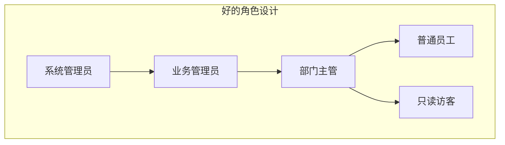

# 角色爆炸问题与应对

## 💡 概念顿悟

角色爆炸就像**衣柜里的衣服越来越多**：你本来只有 T 恤和西装，后来加了"出席婚礼的西装"、"去海边的 T 恤"、"下雨天的西装"……最后衣柜装不下，你还找不到想穿的那件。

RBAC 里，每当业务提出一个"有条件"的权限需求，你就不得不新建一个角色。条件越多，角色越多，最终管理崩溃。

## 角色爆炸的典型症状


**现实中的角色数量警戒线**：

| 角色数量 | 信号 |
|---------|------|
| < 50 | 健康，RBAC 完全够用 |
| 50 ~ 200 | 开始出现上下文相关角色，需要审查 |
| > 200 | 角色爆炸前兆，需要引入 ABAC 补充 |
| > 500 | 角色爆炸，管理已经失控 |

## 根本原因分析

角色爆炸本质上是：**将"动态条件"硬编码进了静态角色名**。

```
❌ 错误做法：把条件编码到角色名
   Role: "北京_销售组长_工作日_小额合同_查看"

✅ 正确做法：角色只表达"职责"，条件交给 ABAC
   Role: "销售组长"
   Policy: user.city == '北京' AND resource.amount < 100000 AND isWorkday()
```

## 应对策略一：重新设计角色层级

角色应该代表**业务职责**，而不是**权限细节**。



**原则**：
1. 角色名用"职责"命名，不用"权限+条件"命名
2. 角色层级不超过 4 级
3. 角色总数控制在 50 个以内（对中型系统）

## 应对策略二：引入上下文角色（Contextual Role）

```csharp
// 普通角色：全局生效
user.Roles = ["SalesManager"];

// 上下文角色：在特定范围内生效
user.ContextualRoles = [
    { Role = "SalesManager", Scope = "Department:BJ-Sales" },
    { Role = "Viewer",       Scope = "Department:SH-Sales" }
];
```

这样"北京销售组长"和"上海普通查看者"就不是两个角色，而是同一个角色在不同作用域的分配。

## 应对策略三：RBAC + ABAC 混合（终极方案）

```mermaid
flowchart LR
    REQ[用户请求] --> RBAC{RBAC 粗过滤\n有"查看合同"权限吗?}
    RBAC --"无"--> DENY1[403 拒绝]
    RBAC --"有"--> ABAC{ABAC 细粒度\n满足上下文条件吗?}
    ABAC --"不满足"--> DENY2[403 拒绝]
    ABAC --"满足"--> ALLOW[200 放行]
```

把"条件"从角色里剥离出来，交给 ABAC 处理：

```csharp
// RBAC 负责："这个人有没有查看合同的基础权限"
[Authorize(Policy = "CanViewContract")]

// ABAC 负责："这个人能不能查看这张具体的合同"
public async Task<IActionResult> GetContract(Guid contractId)
{
    var contract = await _repo.GetAsync(contractId);

    // 动态属性检查
    var requirement = new ContractViewRequirement(contract);
    if (!await _authService.AuthorizeAsync(User, contract, requirement))
        return Forbid();

    return Ok(contract);
}
```

::: tip 核心结论
角色爆炸是一个设计问题，不是系统问题。**当你发现需要把条件写进角色名时，就是引入 ABAC 的时机。**
:::
