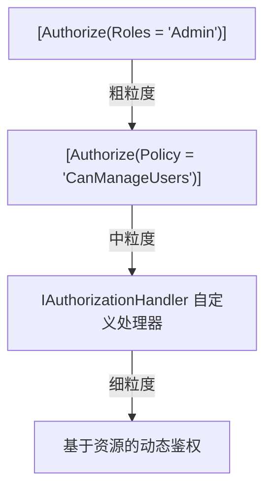

# ASP.NET Core RBAC 实战

## 三层鉴权体系

ASP.NET Core 提供了三层递进的鉴权机制：



## 第一层：Role-based（角色直判）

```csharp
// 最简单的用法，直接检查角色 Claim
[Authorize(Roles = "Admin,SuperAdmin")]
public IActionResult AdminOnly() => Ok();

// 多角色组合（AND 关系需要叠加 Attribute）
[Authorize(Roles = "Manager")]
[Authorize(Roles = "SalesTeam")]
public IActionResult ManagerInSales() => Ok();
```

**Token 中的 Roles Claim**：

```json
{
  "sub": "user-001",
  "name": "张三",
  "roles": ["SalesManager", "Viewer"],
  "tenant_id": "tenant-abc"
}
```

## 第二层：Policy-based（策略声明）

```csharp
// Program.cs 注册策略
builder.Services.AddAuthorization(options =>
{
    // 基于角色的策略（语义化命名）
    options.AddPolicy("CanViewContract", policy =>
        policy.RequireRole("SalesManager", "SalesDirector", "Auditor"));

    options.AddPolicy("CanApproveExpense", policy =>
        policy.RequireRole("DeptManager", "FinanceManager")
              .RequireClaim("department"));  // 还需要有部门 Claim

    // 自定义策略（组合多个需求）
    options.AddPolicy("CanCreateLargeOrder", policy =>
        policy.RequireRole("SeniorSales")
              .Requirements.Add(new MinimumLevelRequirement(level: 3)));
});
```

## 第三层：Resource-based（资源级鉴权）

这是 RBAC 与 ABAC 的衔接点，可以在这一层注入动态属性检查。

```csharp
// 1. 定义需求
public class ContractOperationRequirement : IAuthorizationRequirement
{
    public string Operation { get; }
    public ContractOperationRequirement(string operation) => Operation = operation;
}

// 2. 实现处理器
public class ContractAuthorizationHandler
    : AuthorizationHandler<ContractOperationRequirement, Contract>
{
    protected override Task HandleRequirementAsync(
        AuthorizationHandlerContext context,
        ContractOperationRequirement requirement,
        Contract resource)
    {
        var user = context.User;

        // 角色检查（RBAC 部分）
        if (!user.IsInRole("SalesManager") && !user.IsInRole("SalesDirector"))
        {
            context.Fail();
            return Task.CompletedTask;
        }

        // 数据权限检查（ABAC 部分）
        var userDept = user.FindFirstValue("department");
        if (resource.DepartmentId != userDept)
        {
            context.Fail();
            return Task.CompletedTask;
        }

        context.Succeed(requirement);
        return Task.CompletedTask;
    }
}

// 3. 注册
builder.Services.AddScoped<IAuthorizationHandler, ContractAuthorizationHandler>();

// 4. 在 Controller 中使用
[ApiController]
[Route("api/contracts")]
public class ContractController : ControllerBase
{
    private readonly IAuthorizationService _authorizationService;
    private readonly IContractRepository _repo;

    [HttpGet("{id}")]
    [Authorize(Policy = "CanViewContract")]  // 第一道：角色策略
    public async Task<IActionResult> Get(Guid id)
    {
        var contract = await _repo.GetAsync(id);
        if (contract == null) return NotFound();

        // 第二道：资源级鉴权
        var result = await _authorizationService.AuthorizeAsync(
            User, contract, new ContractOperationRequirement("read"));

        if (!result.Succeeded) return Forbid();

        return Ok(contract);
    }
}
```

## 多租户下的角色隔离

```csharp
// 自定义 ClaimsPrincipal 扩展，确保角色在租户范围内有效
public static class ClaimsPrincipalExtensions
{
    public static bool IsInRoleForTenant(
        this ClaimsPrincipal principal,
        string role,
        string tenantId)
    {
        return principal.Claims.Any(c =>
            c.Type == "tenant_role" &&
            c.Value == $"{tenantId}:{role}");
    }
}

// Token 中的多租户角色 Claim 格式
// "tenant_role": ["tenant-a:Admin", "tenant-b:Viewer"]
```

## 完整配置示例

```csharp
// Program.cs
var builder = WebApplication.CreateBuilder(args);

builder.Services
    .AddAuthentication(JwtBearerDefaults.AuthenticationScheme)
    .AddJwtBearer(options =>
    {
        options.TokenValidationParameters = new TokenValidationParameters
        {
            ValidateIssuer = true,
            ValidIssuer = builder.Configuration["Jwt:Issuer"],
            ValidateAudience = true,
            ValidAudience = builder.Configuration["Jwt:Audience"],
            RoleClaimType = "roles",  // 告诉框架从哪个 Claim 读角色
        };
    });

builder.Services.AddAuthorization(options =>
{
    options.AddPolicy("CanViewContract",
        p => p.RequireRole("SalesManager", "Auditor"));
    options.AddPolicy("CanDeleteContract",
        p => p.RequireRole("Admin").RequireClaim("mfa_verified", "true"));
});

builder.Services.AddScoped<IAuthorizationHandler, ContractAuthorizationHandler>();

var app = builder.Build();
app.UseAuthentication();
app.UseAuthorization();
app.MapControllers();
app.Run();
```
