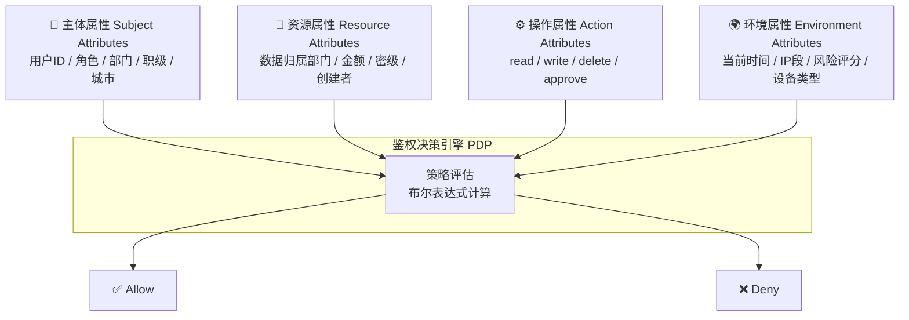
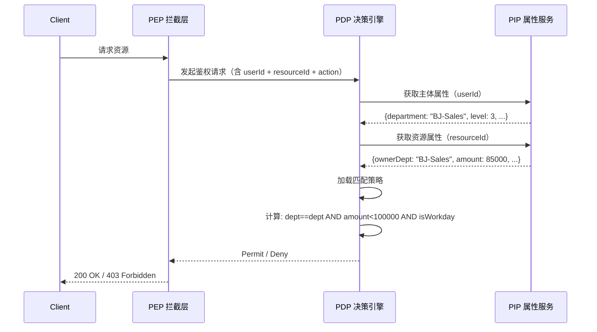

# ABAC 核心概念

## 💡 概念顿悟

ABAC 就是**机场严格的海关审查**：

- 看你的**护照**（主体属性：你是谁、你来自哪里、你的签证类型）
- 看你要去的**国家**（资源属性：目的地的入境政策）
- 看你想**做什么**（操作属性：过境 vs 入境 vs 工作签）
- 看当前的**国际形势**（环境属性：是否有疫情管控、国际制裁）

海关综合评估所有因素，动态给出"放行"或"拒绝"的决定。**没有固定的"白名单"，一切都是实时计算的。**

## 四维属性模型



## 四大属性详解

### 主体属性（Subject Attributes）

描述发起请求的用户/服务的特征：

```json
{
  "userId": "user-001",
  "username": "张三",
  "roles": ["SalesManager"],
  "department": "BJ-Sales",
  "city": "Beijing",
  "level": 3,
  "mfaVerified": true,
  "employeeType": "fulltime"
}
```

### 资源属性（Resource Attributes）

描述被访问数据/资源的特征：

```json
{
  "resourceType": "Contract",
  "contractId": "C-20240115-001",
  "ownerDepartment": "BJ-Sales",
  "amount": 85000,
  "currency": "CNY",
  "status": "Draft",
  "confidentialLevel": "internal",
  "createdBy": "user-002"
}
```

### 操作属性（Action Attributes）

描述请求执行的操作：

```json
{
  "action": "read",
  "httpMethod": "GET",
  "endpoint": "/api/contracts/{id}"
}
```

### 环境属性（Environment Attributes）

描述请求发生时的上下文：

```json
{
  "requestTime": "2024-01-15T10:30:00Z",
  "dayOfWeek": "Monday",
  "isWorkingHour": true,
  "clientIp": "10.0.1.105",
  "ipRegion": "Beijing-Office",
  "deviceType": "CorpLaptop",
  "riskScore": 12
}
```

## ABAC 决策过程



## ABAC vs RBAC 本质区别

| 维度 | RBAC | ABAC |
|------|------|------|
| 授权基础 | 角色（静态） | 属性（动态） |
| 决策方式 | 查表 | 计算 |
| 规则变更 | 修改角色分配 | 修改策略表达式 |
| 数据行权限 | 无法做到 | 天然支持 |
| 可解释性 | 高（角色直观） | 低（策略复杂） |
| 性能 | 高 | 中低（需计算） |

::: warning 选型建议
ABAC 不是 RBAC 的替代品，而是补充。当你需要处理"数据行级权限"、"多维度上下文条件"时，才引入 ABAC；简单场景继续用 RBAC。
:::
