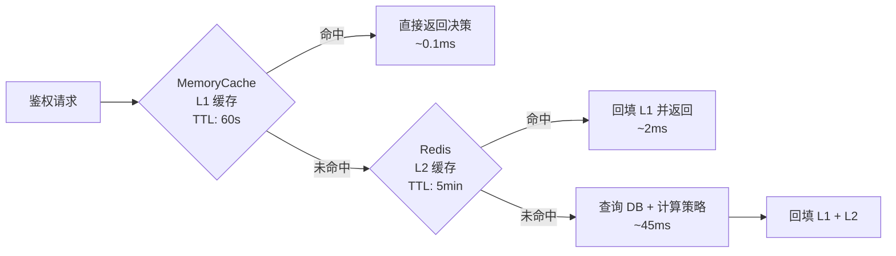

# ABAC 的痛点

## 痛点一：性能瓶颈

### 问题根因

每次 API 请求都需要：
1. 从数据库查询用户属性（PIP 查询）
2. 从数据库查询资源属性（PIP 查询）
3. 加载匹配的策略列表
4. 动态计算策略表达式

**一次鉴权 = 2~3 次额外数据库查询 + CPU 计算**。高并发场景下，这是致命的。

### 性能测试数据

```
场景：10000 QPS 的 API 网关

纯 RBAC 鉴权延迟：  平均 2ms   (只查角色表，有索引)
ABAC 不加缓存：      平均 45ms  (多次 DB 查询 + 策略计算)
ABAC + Redis 缓存：  平均 5ms   (缓存命中率 ~90%)
ABAC + 多级缓存：    平均 3ms   (MemoryCache L1 + Redis L2)
```

### 解决方案：多级缓存



## 痛点二：管理黑盒

### 问题表现

系统管理员无法回答：**"张三到底能访问哪些数据？"**

在 RBAC 里，这个问题很简单：查张三的角色 → 查角色的权限列表。

在 ABAC 里，这个问题很复杂：需要枚举所有策略，代入张三当前的属性，对所有可能的资源做计算——这在计算上几乎不可能穷举。

### 解决方案：权限预览与审计查询

```csharp
// 提供"模拟鉴权"接口，让管理员可以预览权限效果
public class PermissionSimulationService
{
    public async Task<SimulationResult> SimulateAsync(
        string userId,
        string resourceType,
        string action,
        Dictionary<string, object>? resourceAttrsOverride = null)
    {
        var context = await _contextBuilder.BuildForUserAsync(userId);

        // 使用管理员指定的资源属性（用于测试特定场景）
        if (resourceAttrsOverride != null)
            foreach (var kv in resourceAttrsOverride)
                context.Resource[kv.Key] = kv.Value;

        var matchedPolicies = await _policyStore.GetMatchingPoliciesAsync(resourceType, action);
        var decision = _pdp.Evaluate(context, matchedPolicies);

        return new SimulationResult
        {
            Decision = decision.Effect,
            MatchedPolicies = matchedPolicies.Select(p => p.PolicyId).ToList(),
            EvaluationDetails = decision.Details  // 哪条策略决定了最终结果
        };
    }
}
```

## 痛点三：策略调试困难

### 问题表现

策略写错了，用户反馈"我该有权限但是被拒绝了"——你需要调试：是属性取值错误？是策略逻辑错误？是策略版本问题？

### 解决方案：决策日志

```csharp
public class PolicyDecisionLog
{
    public string RequestId { get; set; }
    public string UserId { get; set; }
    public string ResourceId { get; set; }
    public string Action { get; set; }
    public EffectType FinalDecision { get; set; }

    // 关键：记录评估过程
    public List<PolicyEvaluationStep> Steps { get; set; } = new();
    public AttributeContext EvaluatedContext { get; set; }
    public DateTime EvaluatedAt { get; set; }
}

public class PolicyEvaluationStep
{
    public string PolicyId { get; set; }
    public bool Matched { get; set; }
    public EffectType Effect { get; set; }
    public string FailedCondition { get; set; }  // 是哪个条件导致未匹配
}
```

## 痛点四：策略冲突

### 问题表现

同一资源被多条策略覆盖，一条说 Allow，另一条说 Deny，应该以哪个为准？

### 解决方案：明确合并算法 + 优先级

```csharp
public class PolicyDecisionEngine
{
    public DecisionResult Evaluate(AttributeContext context, IEnumerable<AbacPolicy> policies)
    {
        var results = policies
            .OrderByDescending(p => p.Priority)  // 高优先级策略先评估
            .Select(p => EvaluateSinglePolicy(context, p))
            .ToList();

        // deny-overrides: 有任何 Deny 则最终结果为 Deny
        if (results.Any(r => r.Effect == EffectType.Deny))
            return DecisionResult.Deny("Deny-overrides algorithm triggered");

        // 有任何 Allow 则放行
        if (results.Any(r => r.Effect == EffectType.Allow))
            return DecisionResult.Allow();

        // 默认拒绝（零信任原则）
        return DecisionResult.Deny("No matching policy found, default deny");
    }
}
```

## 痛点总结

| 痛点 | 严重程度 | 解决方案 |
|------|---------|---------|
| 性能瓶颈（PIP 查询） | 🔴 高 | 多级缓存 + 预加载 |
| 管理黑盒 | 🟠 中 | 权限模拟接口 + 可视化 |
| 策略调试困难 | 🟠 中 | 结构化决策日志 |
| 策略冲突 | 🟡 低 | 明确合并算法 + 优先级 |

::: tip
这些痛点正是 PBAC（Policy as Code）要解决的问题——通过将策略结构化、版本化、可测试化，让策略管理变得像管理代码一样清晰可控。
:::
