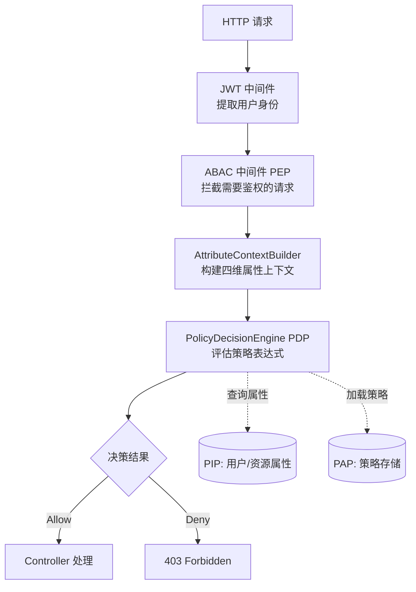

# ASP.NET Core ABAC 实战

## 整体架构



## 核心实现

### 1. 定义 ABAC Requirement

```csharp
// 通用 ABAC 需求，资源类型 + 操作名
public class AbacRequirement : IAuthorizationRequirement
{
    public string ResourceType { get; }
    public string Action { get; }

    public AbacRequirement(string resourceType, string action)
    {
        ResourceType = resourceType;
        Action = action;
    }
}
```

### 2. 实现 ABAC Handler

```csharp
public class AbacAuthorizationHandler<TResource>
    : AuthorizationHandler<AbacRequirement, TResource>
{
    private readonly IAttributeContextBuilder _contextBuilder;
    private readonly IPolicyDecisionEngine _pdp;
    private readonly IPolicyStore _policyStore;
    private readonly ILogger<AbacAuthorizationHandler<TResource>> _logger;

    protected override async Task HandleRequirementAsync(
        AuthorizationHandlerContext context,
        AbacRequirement requirement,
        TResource resource)
    {
        // 1. 构建属性上下文
        var attrContext = await _contextBuilder.BuildAsync(
            context.User, resource, requirement.Action);

        // 2. 加载适用策略
        var policies = await _policyStore.GetPoliciesAsync(
            requirement.ResourceType, requirement.Action);

        // 3. PDP 决策
        var decision = _pdp.Evaluate(attrContext, policies);

        // 4. 记录决策日志
        _logger.LogInformation(
            "ABAC Decision: {Effect} for User={UserId} Resource={ResourceType}/{ResourceId} Action={Action}",
            decision.Effect,
            context.User.FindFirstValue(ClaimTypes.NameIdentifier),
            requirement.ResourceType,
            attrContext.Resource.GetValueOrDefault("id"),
            requirement.Action);

        if (decision.Effect == EffectType.Allow)
            context.Succeed(requirement);
        else
            context.Fail(new AuthorizationFailureReason(this, decision.DenyReason));
    }
}
```

### 3. 简单 PDP 实现（基于 NCalc）

```csharp
// dotnet add package NCalc2
public class NCalcPolicyDecisionEngine : IPolicyDecisionEngine
{
    public DecisionResult Evaluate(AttributeContext ctx, IEnumerable<AbacPolicy> policies)
    {
        var policyList = policies.OrderByDescending(p => p.Priority).ToList();
        var steps = new List<PolicyEvaluationStep>();

        foreach (var policy in policyList)
        {
            var (matched, failedCondition) = EvaluatePolicy(ctx, policy);
            steps.Add(new PolicyEvaluationStep
            {
                PolicyId = policy.PolicyId,
                Matched = matched,
                Effect = policy.Effect,
                FailedCondition = failedCondition
            });

            if (matched && policy.Effect == EffectType.Deny)
                return DecisionResult.Deny(policy.PolicyId, steps);
        }

        var allowStep = steps.FirstOrDefault(s => s.Matched && s.Effect == EffectType.Allow);
        if (allowStep != null)
            return DecisionResult.Allow(allowStep.PolicyId, steps);

        return DecisionResult.Deny("no-matching-policy", steps);
    }

    private (bool matched, string failedCondition) EvaluatePolicy(
        AttributeContext ctx, AbacPolicy policy)
    {
        foreach (var condition in policy.Conditions)
        {
            var expression = BuildExpression(ctx, condition);
            var calc = new NCalc.Expression(expression);

            try
            {
                var result = (bool)calc.Evaluate();
                if (!result)
                    return (false, $"{condition.Attribute} {condition.Operator} {condition.Value}");
            }
            catch (Exception ex)
            {
                return (false, $"Eval error: {ex.Message}");
            }
        }
        return (true, null);
    }

    private string BuildExpression(AttributeContext ctx, PolicyCondition condition)
    {
        // 解析属性路径：subject.department -> ctx.Subject["department"]
        var attrValue = ResolveAttribute(ctx, condition.Attribute);
        var compareValue = ResolveValue(ctx, condition.Value);

        return condition.Operator switch
        {
            "==" => $"{attrValue} == {compareValue}",
            "!=" => $"{attrValue} != {compareValue}",
            ">"  => $"{attrValue} > {compareValue}",
            "<"  => $"{attrValue} < {compareValue}",
            ">=" => $"{attrValue} >= {compareValue}",
            "<=" => $"{attrValue} <= {compareValue}",
            _    => throw new NotSupportedException($"Operator {condition.Operator} not supported")
        };
    }
}
```

### 4. 在 Controller 中使用

```csharp
[ApiController]
[Route("api/contracts")]
public class ContractController : ControllerBase
{
    private readonly IAuthorizationService _auth;
    private readonly IContractRepository _repo;

    // 第一道：RBAC 粗过滤（有"查看合同"的菜单权限）
    [HttpGet("{id}")]
    [Authorize(Policy = "CanViewContract")]
    public async Task<IActionResult> GetContract(Guid id)
    {
        var contract = await _repo.GetAsync(id);
        if (contract == null) return NotFound();

        // 第二道：ABAC 细粒度（能不能看这张具体的合同）
        var result = await _auth.AuthorizeAsync(
            User,
            contract,
            new AbacRequirement("Contract", "read"));

        if (!result.Succeeded) return Forbid();

        return Ok(contract);
    }
}
```

### 5. 注册服务

```csharp
builder.Services.AddAuthorization(options =>
{
    options.AddPolicy("CanViewContract",
        p => p.RequireRole("SalesManager", "Auditor", "Director"));
});

// ABAC 服务注册
builder.Services.AddScoped<IAttributeContextBuilder, AttributeContextBuilder>();
builder.Services.AddScoped<IPolicyDecisionEngine, NCalcPolicyDecisionEngine>();
builder.Services.AddScoped<IPolicyStore, DatabasePolicyStore>();
builder.Services.AddScoped(
    typeof(IAuthorizationHandler),
    typeof(AbacAuthorizationHandler<Contract>));
```

## 数据行级权限（Row-Level Security）

ABAC 的典型应用：在数据查询层自动注入用户属性过滤条件。

```csharp
public class ContractRepository : IContractRepository
{
    private readonly AppDbContext _db;
    private readonly ICurrentUser _currentUser;

    public async Task<List<Contract>> GetListAsync()
    {
        var query = _db.Contracts.AsQueryable();

        // 根据用户角色和属性自动过滤（数据行级权限）
        if (!_currentUser.IsInRole("Auditor"))
        {
            // 非审计员只能看自己部门的合同
            query = query.Where(c => c.DepartmentId == _currentUser.DepartmentId);
        }

        if (_currentUser.IsInRole("SalesManager") && !_currentUser.IsInRole("Director"))
        {
            // 销售经理只能看 100 万以下的合同
            query = query.Where(c => c.Amount <= 1_000_000);
        }

        return await query.ToListAsync();
    }
}
```
