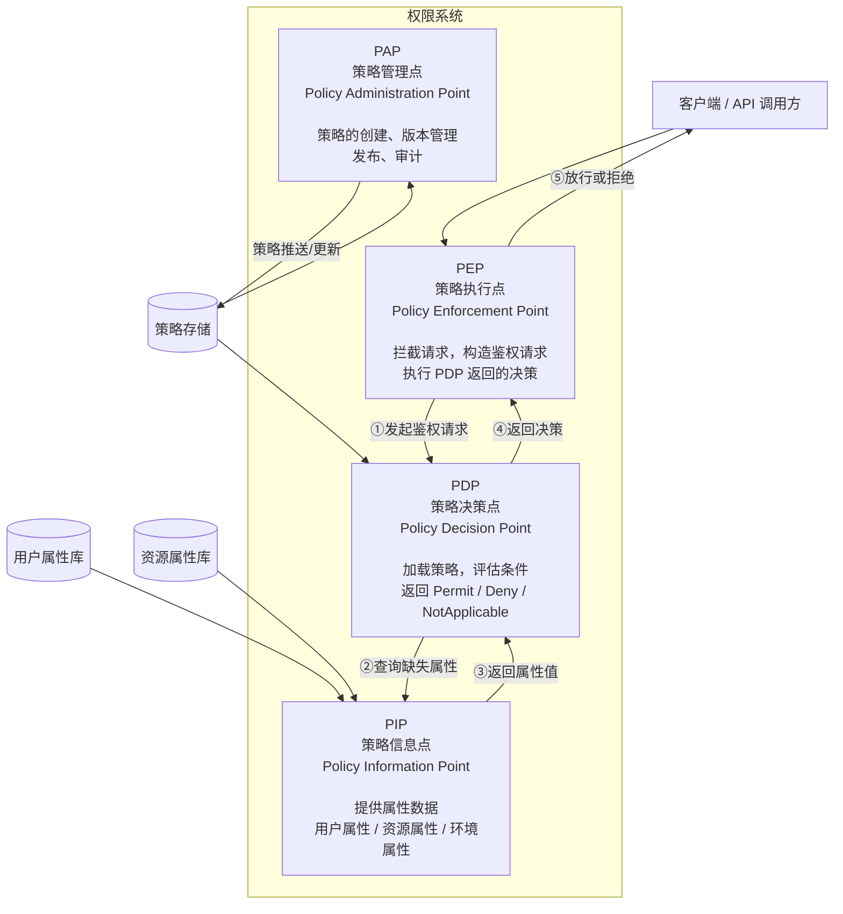

# PBAC 与 XACML 架构

## 💡 概念顿悟

如果 ABAC 是"一个聪明的海关官员根据规则手册做判断"，那么 PBAC 就是"将规则手册本身系统化管理"——可以立法（PAP）、执法（PEP）、司法（PDP）、查档案（PIP）。

**PBAC = ABAC 的工程化形态**，而 XACML 是 PBAC 的标准实现规范。

## XACML 四大核心组件



## 各组件职责详解

### PEP — 策略执行点

PEP 是**唯一的请求入口**，负责：
1. 拦截 HTTP 请求
2. 提取上下文信息（JWT、IP、时间等）
3. 向 PDP 发起鉴权请求
4. 严格执行 PDP 返回的决策（不得绕过）

```csharp
// PEP 实现：ASP.NET Core 中间件形式
public class PepMiddleware
{
    private readonly RequestDelegate _next;
    private readonly IPolicyDecisionEngine _pdp;

    public async Task InvokeAsync(HttpContext context)
    {
        // 跳过不需要鉴权的路径
        if (IsPublicEndpoint(context)) { await _next(context); return; }

        // 构建鉴权请求
        var authRequest = BuildAuthRequest(context);

        // 调用 PDP
        var decision = await _pdp.DecideAsync(authRequest);

        if (decision.Effect == EffectType.Deny)
        {
            context.Response.StatusCode = 403;
            await context.Response.WriteAsJsonAsync(new
            {
                error = "Forbidden",
                reason = decision.DenyReason,
                requestId = context.TraceIdentifier
            });
            return;
        }

        await _next(context);
    }
}
```

### PDP — 策略决策点

PDP 是**鉴权系统的大脑**，负责：
1. 接收来自 PEP 的鉴权请求
2. 从 PAP/策略存储加载适用策略
3. 向 PIP 查询缺失的属性
4. 评估策略条件，返回决策

```csharp
public class PolicyDecisionEngine : IPolicyDecisionEngine
{
    private readonly IPolicyStore _policyStore;
    private readonly IPolicyInformationPoint _pip;
    private readonly IPolicyEvaluator _evaluator;

    public async Task<Decision> DecideAsync(AuthRequest request)
    {
        // 1. 从 PIP 补充属性（PEP 可能没带完整属性）
        var enrichedContext = await _pip.EnrichContextAsync(request.Context);

        // 2. 加载适用策略
        var policies = await _policyStore.FindApplicablePoliciesAsync(
            request.ResourceType, request.Action);

        // 3. 评估所有策略
        return _evaluator.Evaluate(enrichedContext, policies);
    }
}
```

### PIP — 策略信息点

PIP 是**属性数据的统一查询入口**，负责屏蔽各种数据源的差异：

```csharp
public class PolicyInformationPoint : IPolicyInformationPoint
{
    private readonly IUserRepository _userRepo;
    private readonly IResourceAttributeService _resourceSvc;
    private readonly IMemoryCache _cache;

    public async Task<AttributeContext> EnrichContextAsync(AttributeContext ctx)
    {
        var userId = ctx.Subject.GetValueOrDefault("userId")?.ToString();

        // 带缓存的用户属性查询
        var userAttrs = await _cache.GetOrCreateAsync(
            $"pip:user:{userId}",
            async entry =>
            {
                entry.AbsoluteExpirationRelativeToNow = TimeSpan.FromMinutes(5);
                return await _userRepo.GetAttributesAsync(userId);
            });

        // 将额外属性合并到 Subject
        ctx.Subject["department"] = userAttrs.Department;
        ctx.Subject["level"]      = userAttrs.Level;
        ctx.Subject["city"]       = userAttrs.City;

        return ctx;
    }
}
```

### PAP — 策略管理点

PAP 是**策略的生命周期管理系统**，提供：
- 策略的 CRUD 接口
- 策略版本控制
- 策略发布审批流程
- 策略效果预览（模拟鉴权）

```csharp
[ApiController]
[Route("api/admin/policies")]
[Authorize(Roles = "PolicyAdmin")]
public class PapController : ControllerBase
{
    [HttpPost]
    public async Task<IActionResult> CreatePolicy(CreatePolicyRequest request)
    {
        // 策略创建时自动验证语法
        var validationResult = await _policyValidator.ValidateAsync(request.Policy);
        if (!validationResult.IsValid)
            return BadRequest(validationResult.Errors);

        var policy = await _policyStore.CreateAsync(request.Policy);
        return CreatedAtAction(nameof(GetPolicy), new { id = policy.PolicyId }, policy);
    }

    [HttpPost("{id}/simulate")]
    public async Task<IActionResult> Simulate(string id, SimulationRequest request)
    {
        // 模拟鉴权，让管理员预览策略效果
        var result = await _simulation.RunAsync(id, request.Context);
        return Ok(result);
    }
}
```

## XACML 请求/响应格式

```json
// PEP → PDP 鉴权请求
{
  "Request": {
    "Subject": {
      "Attributes": [
        { "AttributeId": "subject:user-id", "Value": "user-001" },
        { "AttributeId": "subject:role", "Value": "SalesManager" }
      ]
    },
    "Resource": {
      "Attributes": [
        { "AttributeId": "resource:type", "Value": "Contract" },
        { "AttributeId": "resource:id", "Value": "C-001" }
      ]
    },
    "Action": {
      "Attributes": [
        { "AttributeId": "action:action-id", "Value": "read" }
      ]
    }
  }
}

// PDP → PEP 决策响应
{
  "Response": {
    "Decision": "Permit",
    "Status": { "StatusCode": { "Value": "urn:oasis:names:tc:xacml:1.0:status:ok" } },
    "PolicyIdentifierList": ["sales-contract-read-v2"]
  }
}
```
