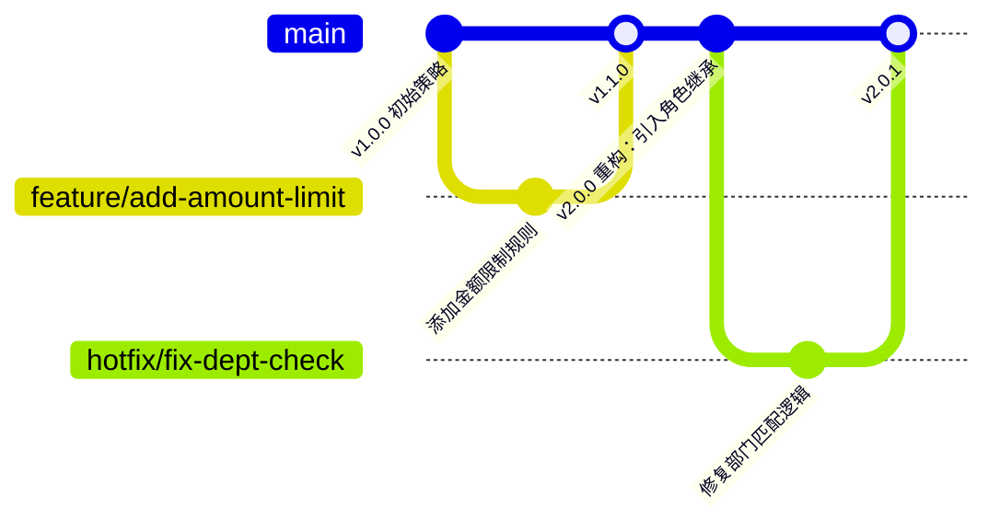

# 策略即代码设计

## 💡 概念顿悟

"策略即代码"就像**公司的法律体系**：

- 法条（Policy）有版本号，修订要走正式流程
- 法条可以继承（特别法优于普通法）
- 法条可以组合（多个条款共同适用）
- 法条可以测试（沙盘推演案例）

把这套思维用到权限策略上，策略就像代码一样可以被 Git 管理、Code Review、CI/CD 部署。

## 策略 JSON 结构设计

```json
{
  "$schema": "iam-policy/v1",
  "policyId": "contract-read-bj-sales",
  "version": "2.3.0",
  "description": "北京销售团队查看本部门合同的权限策略",

  "target": {
    "resourceType": "Contract",
    "actions": ["read", "export"]
  },

  "rules": [
    {
      "ruleId": "rule-dept-match",
      "description": "只能查看本部门合同",
      "effect": "Permit",
      "condition": {
        "operator": "AND",
        "items": [
          {
            "attribute": "subject.department",
            "operator": "==",
            "value": "${resource.ownerDepartment}"
          },
          {
            "attribute": "subject.roles",
            "operator": "CONTAINS",
            "value": "SalesManager"
          }
        ]
      }
    },
    {
      "ruleId": "rule-amount-limit",
      "description": "金额超过 100 万需要总监权限",
      "effect": "Deny",
      "condition": {
        "operator": "AND",
        "items": [
          {
            "attribute": "resource.amount",
            "operator": ">",
            "value": 1000000
          },
          {
            "attribute": "subject.roles",
            "operator": "NOT_CONTAINS",
            "value": "Director"
          }
        ]
      }
    }
  ],

  "combiningAlgorithm": "deny-overrides",
  "priority": 100,
  "inheritFrom": ["base-contract-policy"],

  "metadata": {
    "owner": "security-team",
    "createdAt": "2024-01-15",
    "lastModifiedAt": "2024-03-20",
    "approvedBy": "ciso@company.com",
    "tags": ["sales", "contract", "pii"]
  }
}
```

## 策略版本管理



### 版本控制规范

```csharp
public class PolicyVersion
{
    public int Major { get; }  // 不兼容的破坏性变更
    public int Minor { get; }  // 向后兼容的新规则
    public int Patch { get; }  // Bug 修复，不改变业务逻辑

    // 热更新：Patch 版本自动生效
    // Minor 版本：需要通知相关团队
    // Major 版本：需要走正式审批流程
}
```

## 策略继承

```json
// 基础策略（所有合同操作的公共规则）
{
  "policyId": "base-contract-policy",
  "rules": [
    {
      "ruleId": "require-active-user",
      "effect": "Deny",
      "condition": {
        "attribute": "subject.isActive",
        "operator": "==",
        "value": false
      }
    },
    {
      "ruleId": "require-working-hour-for-export",
      "effect": "Deny",
      "condition": {
        "operator": "AND",
        "items": [
          { "attribute": "action.name", "operator": "==", "value": "export" },
          { "attribute": "environment.isWorkingHour", "operator": "==", "value": false }
        ]
      }
    }
  ]
}

// 子策略继承基础策略
{
  "policyId": "contract-read-bj-sales",
  "inheritFrom": ["base-contract-policy"],  // 自动继承父策略的所有规则
  "rules": [/* 自己的规则 */]
}
```

## 策略单元测试

像测试代码一样测试策略：

```csharp
public class ContractPolicyTests
{
    private readonly PolicyTestHarness _harness = new();

    [Fact]
    public async Task SalesManager_CanView_OwnDeptContract()
    {
        var result = await _harness.EvaluateAsync("contract-read-bj-sales",
            subject: new { roles = new[] { "SalesManager" }, department = "BJ-Sales" },
            resource: new { type = "Contract", ownerDepartment = "BJ-Sales", amount = 50000 },
            action: "read");

        Assert.Equal(EffectType.Allow, result.Effect);
    }

    [Fact]
    public async Task SalesManager_CannotView_OtherDeptContract()
    {
        var result = await _harness.EvaluateAsync("contract-read-bj-sales",
            subject: new { roles = new[] { "SalesManager" }, department = "BJ-Sales" },
            resource: new { type = "Contract", ownerDepartment = "SH-Sales", amount = 50000 },
            action: "read");

        Assert.Equal(EffectType.Deny, result.Effect);
        Assert.Equal("rule-dept-match", result.DenyingRuleId);
    }

    [Fact]
    public async Task SalesManager_CannotView_LargeAmountContract_WithoutDirector()
    {
        var result = await _harness.EvaluateAsync("contract-read-bj-sales",
            subject: new { roles = new[] { "SalesManager" }, department = "BJ-Sales" },
            resource: new { type = "Contract", ownerDepartment = "BJ-Sales", amount = 1_500_000 },
            action: "read");

        Assert.Equal(EffectType.Deny, result.Effect);
        Assert.Equal("rule-amount-limit", result.DenyingRuleId);
    }
}
```

## 策略 CI/CD 流水线

```yaml
# .github/workflows/policy-deploy.yml
name: Policy Validation and Deploy

on:
  push:
    paths: ['policies/**/*.json']

jobs:
  validate:
    steps:
      - name: Validate policy schema
        run: dotnet run --project PolicyValidator -- validate policies/

      - name: Run policy unit tests
        run: dotnet test PolicyTests/

      - name: Check for breaking changes
        run: dotnet run --project PolicyDiffTool -- diff main HEAD

  deploy:
    needs: validate
    steps:
      - name: Deploy to staging
        run: curl -X POST ${{ secrets.PAP_STAGING_URL }}/api/policies/deploy

      - name: Run integration tests
        run: dotnet test IntegrationTests/ --filter Category=Policy

      - name: Deploy to production (manual approval required for Major versions)
        if: startsWith(github.ref, 'refs/tags/v')
```
