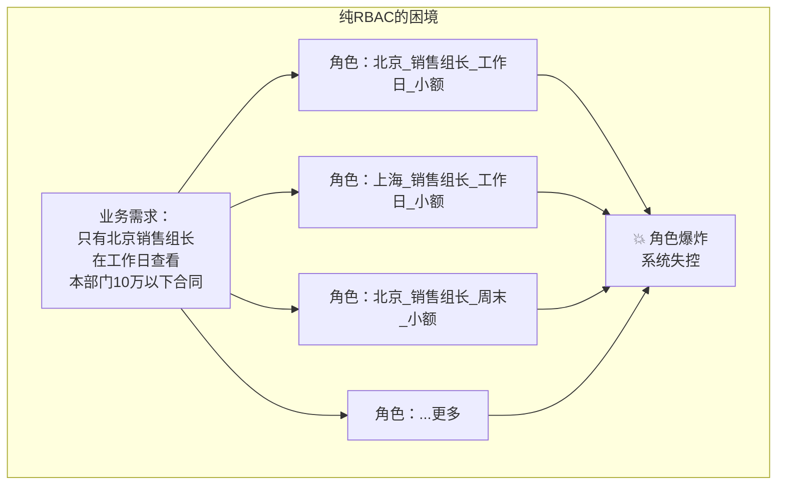
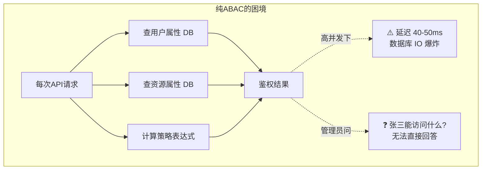
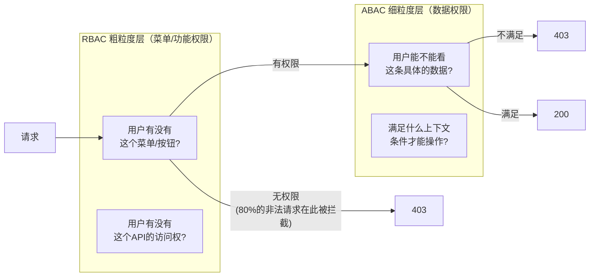

# 混合架构设计理念

## 💡 核心思维

**ABAC 不是用来消灭 RBAC 的，而是用来包容和增强 RBAC 的。**

这是现代企业权限系统最重要的设计共识。许多团队在引入 ABAC 时走入误区，试图用 ABAC 完全重写原有的 RBAC 系统，结果：

- 开发成本翻倍
- 系统性能下降
- 管理员看不懂策略
- 运维噩梦

正确姿势是：**保留 RBAC 做第一层粗过滤，用 ABAC 做第二层精计算。**

## 为什么不能只用 RBAC

## 为什么不能只用 ABAC

## 混合架构的价值

**核心优势**：RBAC 在第一层拦截了 ~80% 的非法请求，只有通过 RBAC 检查的请求才进入 ABAC 引擎，大幅降低了 ABAC 的计算压力。

## 选型决策矩阵

| 场景 | 推荐方案 | 理由 |
|------|---------|------|
| 功能/菜单权限 | 纯 RBAC | 角色已能很好表达，无需动态属性 |
| 数据行级权限（同部门） | RBAC + 简单 ABAC | 用 department 属性过滤 |
| 数据行级权限（多维条件） | 范式一：RBAC + ABAC 双层 | 推荐方案 |
| 需要策略版本化/审计 | 范式一 + PBAC 策略存储 | 加入策略管理层 |
| 权限条件全部基于属性 | 范式二：Role 作为 ABAC Attribute | 统一底层 |
| 资源之间有共享/继承关系 | 考虑 ReBAC | 如 Google Docs 协作 |

::: tip 架构原则
不要为了技术追求而过度设计。RBAC 够用就是最好的选择；引入 ABAC 是因为 **业务有动态属性需求**，而不是为了"显得高级"。
:::
