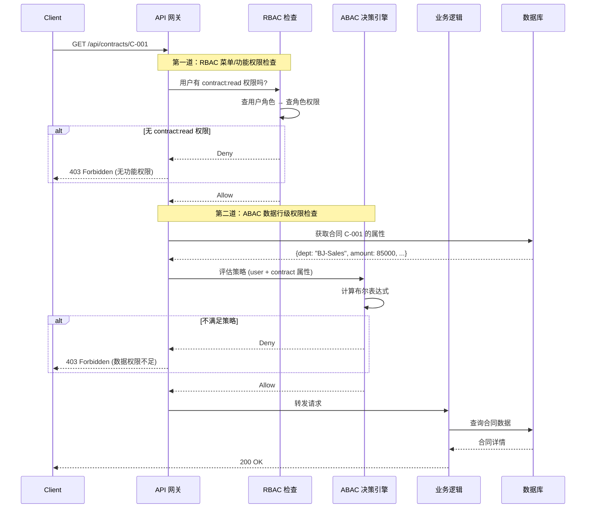

# 范式一：RBAC 粗过滤 + ABAC 精计算

## 架构总览



## 完整 .NET 实现

### 第一层：RBAC Policy（Program.cs）

```csharp
builder.Services.AddAuthorization(options =>
{
    // 功能权限策略（对应菜单/按钮级控制）
    options.AddPolicy("CanViewContract",    p => p.RequireRole("SalesManager", "Auditor", "Director"));
    options.AddPolicy("CanEditContract",    p => p.RequireRole("SalesManager", "Director"));
    options.AddPolicy("CanDeleteContract",  p => p.RequireRole("Director", "Admin"));
    options.AddPolicy("CanExportContract",  p => p.RequireRole("SalesManager", "Auditor").RequireClaim("mfa_verified", "true"));
});
```

### 第二层：ABAC Handler（资源级）

```csharp
public class ContractAbacRequirement : IAuthorizationRequirement
{
    public string Action { get; }
    public ContractAbacRequirement(string action) => Action = action;
}

public class ContractAbacHandler : AuthorizationHandler<ContractAbacRequirement, Contract>
{
    private readonly IUserAttributeService _userSvc;
    private readonly IPolicyDecisionEngine _pdp;
    private readonly IPolicyStore _policyStore;

    protected override async Task HandleRequirementAsync(
        AuthorizationHandlerContext context,
        ContractAbacRequirement requirement,
        Contract resource)
    {
        var userId = context.User.FindFirstValue(ClaimTypes.NameIdentifier);

        // 构建属性上下文
        var userAttrs = await _userSvc.GetAttributesAsync(userId);
        var attrContext = new AttributeContext
        {
            Subject = new()
            {
                ["userId"]     = userId,
                ["roles"]      = context.User.FindAll(ClaimTypes.Role).Select(c => c.Value).ToList(),
                ["department"] = userAttrs.Department,
                ["city"]       = userAttrs.City,
                ["level"]      = userAttrs.Level
            },
            Resource = new()
            {
                ["type"]            = "Contract",
                ["id"]              = resource.Id.ToString(),
                ["ownerDepartment"] = resource.DepartmentId,
                ["amount"]          = resource.Amount,
                ["status"]          = resource.Status,
                ["createdBy"]       = resource.CreatedById
            },
            Action = new() { ["name"] = requirement.Action },
            Environment = new()
            {
                ["isWorkingHour"] = IsWorkingHour(),
                ["requestTime"]   = DateTime.UtcNow
            }
        };

        // 加载策略并决策
        var policies = await _policyStore.GetPoliciesAsync("Contract", requirement.Action);
        var decision = _pdp.Evaluate(attrContext, policies);

        if (decision.Effect == EffectType.Allow)
            context.Succeed(requirement);
        else
            context.Fail(new AuthorizationFailureReason(this, decision.DenyReason));
    }

    private static bool IsWorkingHour()
    {
        var now = DateTime.Now;
        return now.DayOfWeek is not (DayOfWeek.Saturday or DayOfWeek.Sunday)
            && now.Hour is >= 9 and < 18;
    }
}
```

### Controller：两层鉴权组合

```csharp
[ApiController]
[Route("api/contracts")]
public class ContractController : ControllerBase
{
    private readonly IAuthorizationService _auth;
    private readonly IContractRepository _repo;

    /// <summary>
    /// 获取合同详情
    /// 第一层：RBAC 检查（有没有"查看合同"的功能权限）
    /// 第二层：ABAC 检查（能不能看这张具体的合同）
    /// </summary>
    [HttpGet("{id:guid}")]
    [Authorize(Policy = "CanViewContract")]          // ← 第一层 RBAC
    public async Task<IActionResult> GetContract(Guid id)
    {
        var contract = await _repo.GetAsync(id);
        if (contract == null) return NotFound();

        // 第二层 ABAC（基于具体资源实例）
        var result = await _auth.AuthorizeAsync(
            User, contract, new ContractAbacRequirement("read"));

        if (!result.Succeeded)
        {
            // 区分"无功能权限"和"无数据权限"的错误信息
            return Problem(
                statusCode: 403,
                detail: "您没有权限查看该合同，可能是部门或金额限制。",
                title: "数据权限不足");
        }

        return Ok(contract);
    }

    /// <summary>
    /// 获取合同列表（自动应用数据行级过滤）
    /// </summary>
    [HttpGet]
    [Authorize(Policy = "CanViewContract")]
    public async Task<IActionResult> GetContracts([FromQuery] ContractQueryFilter filter)
    {
        // 列表查询：在数据库层直接注入权限过滤条件
        // 避免先查所有数据再逐条 ABAC 检查（性能灾难）
        var contracts = await _repo.GetListWithPermissionFilterAsync(User, filter);
        return Ok(contracts);
    }
}
```

### 列表查询的数据行级过滤（关键优化）

```csharp
public class ContractRepository : IContractRepository
{
    private readonly AppDbContext _db;
    private readonly ICurrentUser _currentUser;

    // 注意：列表查询不能逐条 ABAC 鉴权，必须在 SQL 层过滤
    public async Task<PagedResult<Contract>> GetListWithPermissionFilterAsync(
        ClaimsPrincipal user,
        ContractQueryFilter filter)
    {
        var query = _db.Contracts.AsQueryable();

        // 根据用户角色动态拼接 WHERE 条件（ABAC 逻辑下沉到数据库层）
        if (!user.IsInRole("Auditor") && !user.IsInRole("Admin"))
        {
            // 只能看本部门数据
            var dept = user.FindFirstValue("department");
            query = query.Where(c => c.DepartmentId == dept);
        }

        if (user.IsInRole("SalesManager") && !user.IsInRole("Director"))
        {
            // 销售经理看不到 100 万以上的合同
            query = query.Where(c => c.Amount <= 1_000_000);
        }

        // 应用业务过滤条件
        if (filter.Status.HasValue)
            query = query.Where(c => c.Status == filter.Status.Value);

        var total = await query.CountAsync();
        var items = await query
            .Skip((filter.Page - 1) * filter.PageSize)
            .Take(filter.PageSize)
            .ToListAsync();

        return new PagedResult<Contract>(items, total, filter.Page, filter.PageSize);
    }
}
```

## 性能对比

| 方案 | 1000 QPS 鉴权延迟 | DB 查询次数/请求 |
|------|------------------|--------------------|
| 纯 RBAC | 2ms | 1次（角色表） |
| 纯 ABAC（无缓存） | 45ms | 3-4次 |
| 混合（RBAC先过滤） | 5-8ms | 1次（80%在RBAC拦截）+ 偶尔ABAC |
| 混合 + 多级缓存 | 3ms | 约0.1次（缓存命中） |
