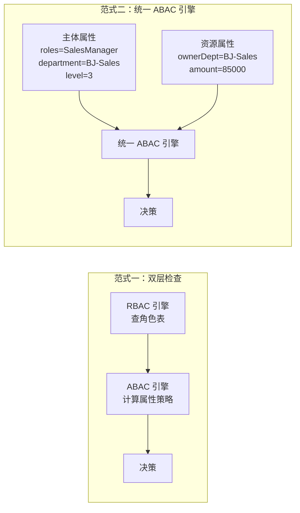

# 范式二：Role 作为 ABAC 的一个 Attribute

## 💡 概念顿悟

这个范式的核心思想是：**角色只是主体的众多属性之一**。

在 ABAC 的视角下，"用户是销售经理"和"用户来自北京分公司"是同等地位的属性，都可以参与策略计算。这样就无需维护独立的 RBAC 层，底层统一为一个 ABAC 引擎。

## 策略写法

```json
// 范式一（RBAC + ABAC 双层）的等效写法：
// 第一层 RBAC: user.Roles.Contains("SalesManager")
// 第二层 ABAC: user.Department == contract.Department

// 范式二（统一 ABAC）的写法：
// 把 Role 纳入 ABAC 策略条件
{
  "policyId": "contract-read-v2",
  "conditions": [
    {
      "attribute": "subject.roles",
      "operator": "CONTAINS_ANY",
      "value": ["SalesManager", "Director"]   // Role 作为属性参与计算
    },
    {
      "attribute": "subject.department",
      "operator": "==",
      "value": "${resource.ownerDepartment}"
    },
    {
      "attribute": "resource.amount",
      "operator": "<=",
      "value": 1000000
    }
  ]
}
```

## 架构图对比



## C# 实现

```csharp
// 范式二中不需要 [Authorize(Roles = "...")] 这类 RBAC 注解
// 所有鉴权都通过 ABAC Policy 完成

// 策略注册时使用 ABAC Handler
builder.Services.AddAuthorization(options =>
{
    // 不再是 RequireRole，而是注册一个 ABAC 需求
    options.AddPolicy("CanViewContract", policy =>
        policy.Requirements.Add(new UnifiedAbacRequirement("Contract", "read")));
});

// 统一 ABAC Handler（Role 被当作主体属性之一）
public class UnifiedAbacHandler : AuthorizationHandler<UnifiedAbacRequirement>
{
    protected override async Task HandleRequirementAsync(
        AuthorizationHandlerContext context,
        UnifiedAbacRequirement requirement)
    {
        // 将 Roles Claim 作为普通属性放入 Subject
        var roles = context.User
            .FindAll(ClaimTypes.Role)
            .Select(c => c.Value)
            .ToList();

        var attrContext = new AttributeContext
        {
            Subject = new()
            {
                ["userId"]     = context.User.FindFirstValue(ClaimTypes.NameIdentifier),
                ["roles"]      = roles,           // ← Role 就是普通属性
                ["department"] = context.User.FindFirstValue("department"),
                ["level"]      = int.Parse(context.User.FindFirstValue("level") ?? "0")
            },
            // ...
        };

        var policies = await _policyStore.GetPoliciesAsync(
            requirement.ResourceType, requirement.Action);

        var decision = _pdp.Evaluate(attrContext, policies);

        if (decision.Effect == EffectType.Allow)
            context.Succeed(requirement);
    }
}
```

## 范式一 vs 范式二 选型指南

| 维度 | 范式一（RBAC + ABAC 双层） | 范式二（统一 ABAC） |
|------|--------------------------|-------------------|
| **适用场景** | 现有 RBAC 系统改造，渐进引入 ABAC | 全新系统，从零设计 |
| **RBAC 兼容** | ✅ 完全兼容，角色管理不变 | ⚠️ 角色变成属性，需要改造管理界面 |
| **管理直观性** | ✅ 管理员仍可看"角色有什么权限" | ❌ 所有权限在策略里，不直观 |
| **引擎复杂度** | ⚠️ 两个引擎，有协调成本 | ✅ 单一引擎，架构更简洁 |
| **迁移成本** | 低（RBAC 不动，加 ABAC 层） | 高（需要重写权限管理界面） |
| **推荐度** | ⭐⭐⭐⭐⭐ | ⭐⭐⭐ |

::: tip 实践建议
对于**已有系统改造**，强烈推荐范式一——保持 RBAC 不变，在其上叠加 ABAC 能力，团队接受度高、迁移风险低。

对于**全新系统**，可以考虑范式二，但要确保提供良好的策略管理界面，否则运维会非常痛苦。
:::
