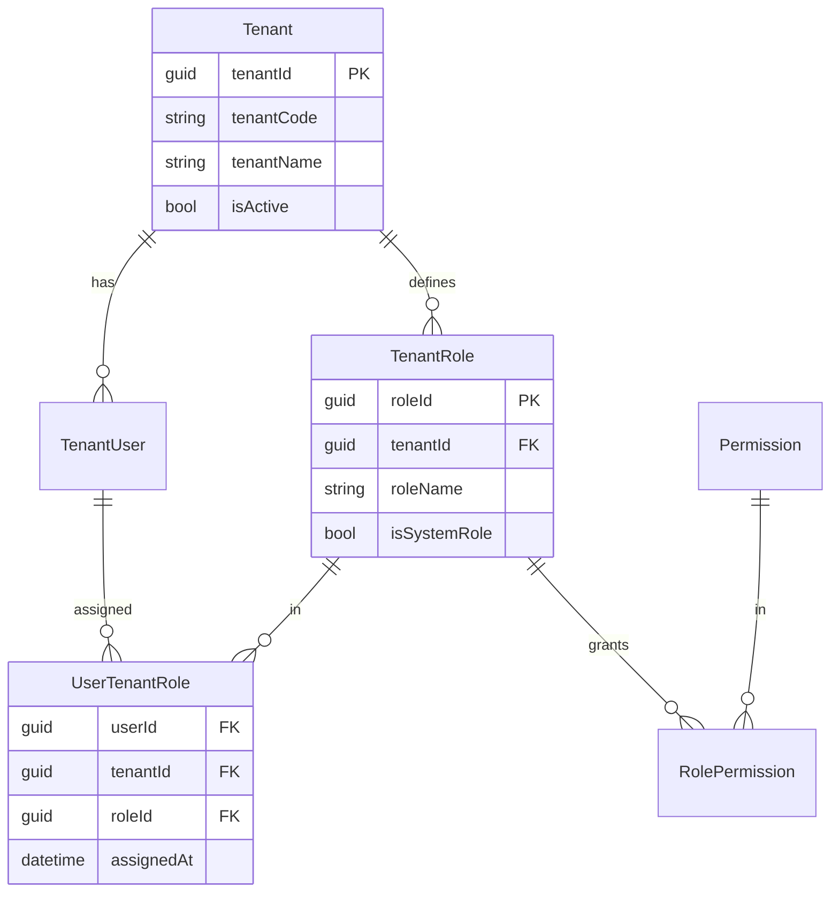

# 多租户权限隔离设计

## 💡 概念顿悟

多租户权限就像**共享办公楼的门禁系统**：

- 楼里有 A、B、C 三家公司（租户）
- 每家公司有自己的门禁卡和权限体系
- A 公司的员工不能进 B 公司的办公室
- 但有些公共区域（电梯、大厅）所有人都能进
- 楼管（平台管理员）可以进任何地方

## 多租户权限隔离模型



## 三层隔离策略

### 第一层：TenantId 强制过滤（数据库层）

```csharp
// EF Core 全局查询过滤器：任何查询自动带上 TenantId 条件
public class AppDbContext : DbContext
{
    private readonly ICurrentTenant _currentTenant;

    protected override void OnModelCreating(ModelBuilder modelBuilder)
    {
        // 对所有实现 ITenantEntity 的实体自动添加 WHERE tenant_id = ?
        foreach (var entityType in modelBuilder.Model.GetEntityTypes())
        {
            if (typeof(ITenantEntity).IsAssignableFrom(entityType.ClrType))
            {
                modelBuilder.Entity(entityType.ClrType)
                    .HasQueryFilter(BuildTenantFilter(entityType.ClrType));
            }
        }
    }

    private LambdaExpression BuildTenantFilter(Type entityType)
    {
        var tenantId = _currentTenant.TenantId;
        var param = Expression.Parameter(entityType, "e");
        var tenantProp = Expression.Property(param, nameof(ITenantEntity.TenantId));
        var tenantValue = Expression.Constant(tenantId);
        var equals = Expression.Equal(tenantProp, tenantValue);
        return Expression.Lambda(equals, param);
    }
}
```

### 第二层：JWT 中的租户 Claim

```json
// Token Payload
{
  "sub": "user-001",
  "tenant_id": "tenant-abc",
  "tenant_roles": [
    "tenant-abc:SalesManager",
    "tenant-abc:Viewer"
  ],
  "platform_roles": []  // 平台级角色（跨租户）
}
```

```csharp
// 提取当前租户信息的服务
public class CurrentTenant : ICurrentTenant
{
    private readonly IHttpContextAccessor _accessor;

    public Guid TenantId => Guid.Parse(
        _accessor.HttpContext?.User.FindFirstValue("tenant_id")
        ?? throw new InvalidOperationException("TenantId claim missing"));

    public bool IsInRoleForCurrentTenant(string role)
    {
        var tenantRole = $"{TenantId}:{role}";
        return _accessor.HttpContext?.User.Claims
            .Any(c => c.Type == "tenant_roles" && c.Value == tenantRole)
            ?? false;
    }
}
```

### 第三层：平台管理员跨租户访问

```csharp
// 平台管理员可以切换到任意租户视角
[HttpPost("admin/switch-tenant/{tenantId}")]
[Authorize(Roles = "PlatformAdmin")]
public IActionResult SwitchTenant(Guid tenantId)
{
    // 生成一个带有目标租户上下文的临时 Token
    var tenantScopedToken = _tokenService.IssueWithTenantScope(
        User.FindFirstValue(ClaimTypes.NameIdentifier),
        tenantId,
        expiresIn: TimeSpan.FromHours(1));

    return Ok(new { token = tenantScopedToken });
}
```

## 跨租户授权（资源共享）

某些场景需要跨租户共享数据，如 B2B SaaS 中供应商向采购方开放报价数据：

```csharp
// 跨租户授权记录
public class CrossTenantAuthorization
{
    public Guid Id { get; set; }
    public Guid SourceTenantId { get; set; }    // 数据拥有者
    public Guid TargetTenantId { get; set; }    // 被授权访问者
    public string ResourceType { get; set; }
    public Guid? ResourceId { get; set; }       // null 表示该类型所有资源
    public string[] Permissions { get; set; }
    public DateTime ExpiresAt { get; set; }
}

// 在 ABAC 策略中支持跨租户检查
public class CrossTenantAbacHandler : AuthorizationHandler<CrossTenantRequirement>
{
    protected override async Task HandleRequirementAsync(
        AuthorizationHandlerContext context,
        CrossTenantRequirement requirement)
    {
        var userTenantId = context.User.FindFirstValue("tenant_id");
        var resourceTenantId = requirement.Resource.TenantId.ToString();

        // 同租户：走普通 ABAC 流程
        if (userTenantId == resourceTenantId)
        {
            context.Succeed(requirement);
            return;
        }

        // 跨租户：检查是否有显式授权记录
        var auth = await _crossTenantAuthStore.FindAsync(
            sourceTenantId: Guid.Parse(resourceTenantId),
            targetTenantId: Guid.Parse(userTenantId),
            resourceType: requirement.ResourceType,
            permission: requirement.Action);

        if (auth != null && auth.ExpiresAt > DateTime.UtcNow)
            context.Succeed(requirement);
    }
}
```

## 租户隔离的数据库设计

```sql
-- 所有业务表都带 tenant_id，并建立复合索引
CREATE TABLE contracts (
    id          UNIQUEIDENTIFIER PRIMARY KEY,
    tenant_id   UNIQUEIDENTIFIER NOT NULL,     -- 隔离键
    -- ... 业务字段
    INDEX IX_contracts_tenant (tenant_id, status, created_at)
);

-- 角色表按租户分组
CREATE TABLE roles (
    role_id    UNIQUEIDENTIFIER PRIMARY KEY,
    tenant_id  UNIQUEIDENTIFIER NOT NULL,
    role_name  NVARCHAR(100) NOT NULL,
    is_system  BIT NOT NULL DEFAULT 0,         -- 系统预置角色不可删除
    UNIQUE (tenant_id, role_name)              -- 同租户内角色名唯一
);
```
