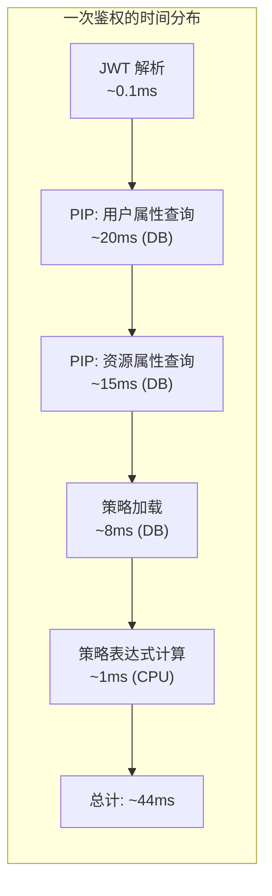
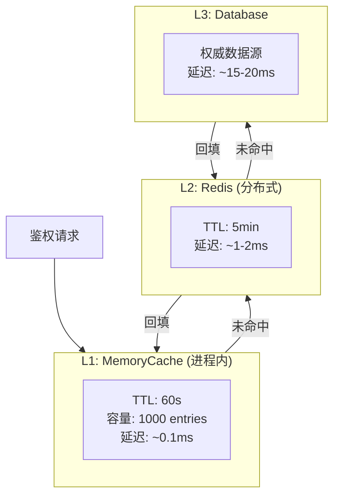

# PIP 查询性能优化

## 性能瓶颈分析

ABAC 鉴权的性能瓶颈 90% 在 **PIP（策略信息点）的属性查询**上。



**目标**：通过多级缓存把鉴权延迟从 44ms 降到 3ms 以内。

## 多级缓存架构



## 实现：多级缓存 PIP

```csharp
public class CachedPolicyInformationPoint : IPolicyInformationPoint
{
    private readonly IMemoryCache _l1;
    private readonly IDistributedCache _l2;
    private readonly IUserRepository _userRepo;
    private readonly JsonSerializerOptions _jsonOptions = new();

    // L1 配置：短 TTL，容量限制，进程内
    private static readonly MemoryCacheEntryOptions L1Options = new()
    {
        AbsoluteExpirationRelativeToNow = TimeSpan.FromSeconds(60),
        Size = 1  // 配合 SizeLimit 使用
    };

    // L2 配置：中等 TTL，分布式共享
    private static readonly DistributedCacheEntryOptions L2Options = new()
    {
        AbsoluteExpirationRelativeToNow = TimeSpan.FromMinutes(5)
    };

    public async Task<UserAttributes> GetUserAttributesAsync(string userId)
    {
        var key = $"pip:user:{userId}";

        // 1. 查 L1（MemoryCache）
        if (_l1.TryGetValue(key, out UserAttributes attrs))
            return attrs;

        // 2. 查 L2（Redis）
        var bytes = await _l2.GetAsync(key);
        if (bytes != null)
        {
            attrs = JsonSerializer.Deserialize<UserAttributes>(bytes, _jsonOptions);
            _l1.Set(key, attrs, L1Options);  // 回填 L1
            return attrs;
        }

        // 3. 查数据库（L3）
        attrs = await _userRepo.GetAttributesAsync(userId);

        // 双写 L1 + L2
        _l1.Set(key, attrs, L1Options);
        await _l2.SetAsync(key,
            JsonSerializer.SerializeToUtf8Bytes(attrs, _jsonOptions),
            L2Options);

        return attrs;
    }

    // 属性更新时主动失效所有层缓存
    public async Task InvalidateUserCacheAsync(string userId)
    {
        var key = $"pip:user:{userId}";
        _l1.Remove(key);
        await _l2.RemoveAsync(key);
    }
}
```

## 属性预热（Cold Start 优化）

```csharp
// 服务启动时预热高频用户的属性缓存
public class AttributeCacheWarmer : IHostedService
{
    private readonly IServiceScopeFactory _scopeFactory;

    public async Task StartAsync(CancellationToken cancellationToken)
    {
        using var scope = _scopeFactory.CreateScope();
        var userRepo = scope.ServiceProvider.GetRequiredService<IUserRepository>();
        var pip = scope.ServiceProvider.GetRequiredService<IPolicyInformationPoint>();

        // 预热最近 7 天活跃的用户
        var activeUsers = await userRepo.GetRecentlyActiveUsersAsync(days: 7, limit: 500);

        await Parallel.ForEachAsync(activeUsers,
            new ParallelOptions { MaxDegreeOfParallelism = 10, CancellationToken = cancellationToken },
            async (userId, ct) => await pip.GetUserAttributesAsync(userId));
    }

    public Task StopAsync(CancellationToken cancellationToken) => Task.CompletedTask;
}
```

## 缓存一致性：基于消息的失效

```csharp
// 用户属性变更时通过 MQ 广播失效事件（确保多实例同步）
public class UserAttributeChangedHandler : IEventHandler<UserAttributeChangedEvent>
{
    private readonly IPolicyInformationPoint _pip;

    public async Task HandleAsync(UserAttributeChangedEvent evt)
    {
        // 失效该用户在所有实例上的 L1 缓存
        // （Redis L2 自动覆盖，L1 通过 MQ 广播失效）
        await _pip.InvalidateUserCacheAsync(evt.UserId);
    }
}

// 使用 Redis Pub/Sub 广播失效通知
public class RedisCacheInvalidationBus
{
    private readonly ISubscriber _subscriber;
    private readonly IMemoryCache _l1;

    public void Subscribe()
    {
        _subscriber.Subscribe("cache:invalidate:pip:user", (channel, userId) =>
        {
            _l1.Remove($"pip:user:{userId}");
        });
    }

    public async Task PublishInvalidationAsync(string userId)
    {
        await _subscriber.PublishAsync("cache:invalidate:pip:user", userId);
    }
}
```

## 性能基线与优化目标

| 指标 | 优化前 | 优化后目标 | 监控告警阈值 |
|------|--------|-----------|------------|
| P50 鉴权延迟 | 44ms | < 3ms | > 10ms |
| P99 鉴权延迟 | 120ms | < 15ms | > 50ms |
| 缓存命中率 | 0% | > 90% | < 80% |
| DB 查询次数/请求 | 3次 | < 0.1次 | > 0.5次 |
