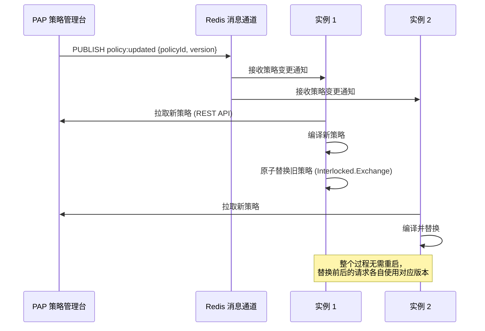

# 策略预编译与热更新

## 为什么需要预编译

每次鉴权如果都要从 JSON 解析策略、构建 NCalc 表达式，会有额外的解析开销：

```
策略 JSON 反序列化：  ~0.5ms
NCalc 表达式解析：    ~2ms
表达式执行：          ~0.1ms
---------------------------------
每次都解析总计：      ~2.6ms  (可优化为 0.1ms)
```

通过预编译，将策略编译为可重复执行的委托，消除解析开销。

## 策略预编译实现

```csharp
// 预编译后的策略：一个可直接执行的委托
public class CompiledPolicy
{
    public string PolicyId { get; set; }
    public string Version { get; set; }
    public EffectType Effect { get; set; }
    public int Priority { get; set; }
    public Func<AttributeContext, bool> Predicate { get; set; }  // 预编译后的委托
    public DateTime CompiledAt { get; set; }
}

public class PolicyCompiler
{
    public CompiledPolicy Compile(AbacPolicy policy)
    {
        // 将策略条件编译为 Expression<Func<AttributeContext, bool>>，再编译为委托
        var parameter = Expression.Parameter(typeof(AttributeContext), "ctx");
        var body = BuildExpression(policy.Conditions, policy.CombiningAlgorithm, parameter);
        var lambda = Expression.Lambda<Func<AttributeContext, bool>>(body, parameter);

        return new CompiledPolicy
        {
            PolicyId    = policy.PolicyId,
            Version     = policy.Version,
            Effect      = policy.Effect,
            Priority    = policy.Priority,
            Predicate   = lambda.Compile(),   // ← 关键：JIT 编译为本机代码
            CompiledAt  = DateTime.UtcNow
        };
    }

    private Expression BuildExpression(
        List<PolicyCondition> conditions,
        CombiningAlgorithm algorithm,
        ParameterExpression parameter)
    {
        var expressions = conditions.Select(c => BuildConditionExpression(c, parameter)).ToList();

        return algorithm == CombiningAlgorithm.And
            ? expressions.Aggregate(Expression.AndAlso)
            : expressions.Aggregate(Expression.OrElse);
    }

    private Expression BuildConditionExpression(PolicyCondition condition, ParameterExpression ctx)
    {
        // 示例：构建 ctx.Subject["department"] == "BJ-Sales" 的表达式树
        var attrPath = condition.Attribute.Split('.'); // ["subject", "department"]
        var dictProp = Expression.Property(ctx, attrPath[0].Capitalize()); // ctx.Subject
        var dictKey  = Expression.Constant(attrPath[1]);
        var getValue = Expression.Call(dictProp, "GetValueOrDefault", null, dictKey);
        var castedValue = Expression.Convert(getValue, condition.ExpectedType);
        var compareValue = Expression.Constant(condition.Value);

        return condition.Operator switch
        {
            "==" => Expression.Equal(castedValue, compareValue),
            "!=" => Expression.NotEqual(castedValue, compareValue),
            ">=" => Expression.GreaterThanOrEqual(castedValue, compareValue),
            "<=" => Expression.LessThanOrEqual(castedValue, compareValue),
            ">"  => Expression.GreaterThan(castedValue, compareValue),
            "<"  => Expression.LessThan(castedValue, compareValue),
            _    => throw new NotSupportedException(condition.Operator)
        };
    }
}
```

## 热更新：无停机策略变更



### 热更新实现

```csharp
public class HotReloadablePolicyEngine : IPolicyDecisionEngine, IDisposable
{
    // 使用 volatile 确保多线程可见性
    private volatile IReadOnlyDictionary<string, List<CompiledPolicy>> _policies;

    private readonly PolicyCompiler _compiler;
    private readonly ISubscriber _subscriber;

    public HotReloadablePolicyEngine(IConnectionMultiplexer redis, PolicyCompiler compiler)
    {
        _compiler = compiler;
        _subscriber = redis.GetSubscriber();

        // 订阅策略变更通知
        _subscriber.Subscribe("policy:updated", async (channel, message) =>
        {
            var update = JsonSerializer.Deserialize<PolicyUpdateMessage>(message);
            await ReloadPolicyAsync(update.PolicyId);
        });
    }

    public Decision Evaluate(AttributeContext ctx, string resourceType, string action)
    {
        // 直接使用预编译委托，无需解析
        var key = $"{resourceType}:{action}";
        if (!_policies.TryGetValue(key, out var policies))
            return Decision.Deny("no-policy");

        foreach (var policy in policies)
        {
            if (policy.Predicate(ctx))
            {
                if (policy.Effect == EffectType.Deny) return Decision.Deny(policy.PolicyId);
                if (policy.Effect == EffectType.Allow) return Decision.Allow(policy.PolicyId);
            }
        }

        return Decision.Deny("default-deny");
    }

    private async Task ReloadPolicyAsync(string policyId)
    {
        var updatedPolicy = await FetchPolicyFromPapAsync(policyId);
        var compiled = _compiler.Compile(updatedPolicy);

        // 原子替换（Copy-On-Write）
        var current = _policies.ToDictionary(kv => kv.Key, kv => kv.Value.ToList());
        var key = $"{updatedPolicy.ResourceType}:{updatedPolicy.Action}";

        if (!current.TryGetValue(key, out var list))
            list = current[key] = new List<CompiledPolicy>();

        var existingIndex = list.FindIndex(p => p.PolicyId == policyId);
        if (existingIndex >= 0) list[existingIndex] = compiled;
        else list.Add(compiled);
        list.Sort((a, b) => b.Priority.CompareTo(a.Priority));

        // volatile 写，确保其他线程立即可见
        _policies = current;
    }

    public void Dispose() => _subscriber.UnsubscribeAll();
}
```

## 灰度发布策略

```csharp
// 新策略先对 5% 的用户生效，验证无误后全量放开
public class GrayscalePolicyEngine : IPolicyDecisionEngine
{
    public Decision Evaluate(AttributeContext ctx, IEnumerable<AbacPolicy> policies)
    {
        var userId = ctx.Subject.GetValueOrDefault("userId")?.ToString();

        foreach (var policy in policies.OrderByDescending(p => p.Priority))
        {
            // 灰度策略：只对 Hash(userId) % 100 < grayscalePercent 的用户生效
            if (policy.IsGrayscale)
            {
                var bucket = Math.Abs(userId.GetHashCode()) % 100;
                if (bucket >= policy.GrayscalePercent) continue;
            }

            if (EvaluatePolicy(ctx, policy, out var reason))
            {
                if (policy.Effect == EffectType.Deny) return Decision.Deny(policy.PolicyId);
                if (policy.Effect == EffectType.Allow) return Decision.Allow(policy.PolicyId);
            }
        }

        return Decision.Deny("default-deny");
    }
}
```
