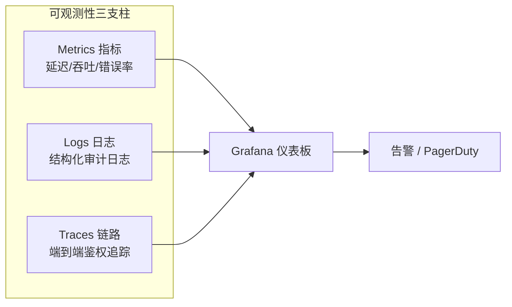

# 权限系统可观测性

## 三大支柱



## 关键指标（Metrics）

```csharp
// 使用 .NET Meters API + OpenTelemetry
public class AuthorizationMetrics
{
    private static readonly Meter _meter = new("IAM.Authorization", "1.0");

    // 鉴权决策延迟直方图
    private static readonly Histogram<double> _decisionLatency =
        _meter.CreateHistogram<double>(
            "iam_auth_decision_duration_ms",
            unit: "ms",
            description: "Authorization decision evaluation time");

    // 决策结果计数器（按 effect / resource_type / policy_id 分维度）
    private static readonly Counter<long> _decisionCounter =
        _meter.CreateCounter<long>(
            "iam_auth_decisions_total",
            description: "Total authorization decisions");

    // 缓存命中率
    private static readonly Counter<long> _cacheHit =
        _meter.CreateCounter<long>("iam_pip_cache_hits_total");
    private static readonly Counter<long> _cacheMiss =
        _meter.CreateCounter<long>("iam_pip_cache_misses_total");

    public static void RecordDecision(
        string effect,
        string resourceType,
        string policyId,
        double latencyMs)
    {
        var tags = new TagList
        {
            { "effect", effect },
            { "resource_type", resourceType },
            { "policy_id", policyId }
        };

        _decisionLatency.Record(latencyMs, tags);
        _decisionCounter.Add(1, tags);
    }

    public static void RecordCacheHit(string cacheLevel, string keyType)
        => _cacheHit.Add(1, new TagList { { "level", cacheLevel }, { "key_type", keyType } });

    public static void RecordCacheMiss(string cacheLevel, string keyType)
        => _cacheMiss.Add(1, new TagList { { "level", cacheLevel }, { "key_type", keyType } });
}
```

## OpenTelemetry 集成

```csharp
// Program.cs
builder.Services.AddOpenTelemetry()
    .WithMetrics(metrics =>
    {
        metrics
            .AddMeter("IAM.Authorization")
            .AddPrometheusExporter();  // 暴露 /metrics 端点
    })
    .WithTracing(tracing =>
    {
        tracing
            .AddSource("IAM.Authorization")
            .AddAspNetCoreInstrumentation()
            .AddOtlpExporter(opts =>
                opts.Endpoint = new Uri(builder.Configuration["Otlp:Endpoint"]));
    });

// 在 PDP 中添加 Trace Span
public class InstrumentedPolicyDecisionEngine : IPolicyDecisionEngine
{
    private static readonly ActivitySource _activitySource = new("IAM.Authorization");
    private readonly IPolicyDecisionEngine _inner;

    public Decision Evaluate(AttributeContext ctx, IEnumerable<AbacPolicy> policies)
    {
        using var activity = _activitySource.StartActivity("PDP.Evaluate");

        var userId = ctx.Subject.GetValueOrDefault("userId")?.ToString();
        var resourceType = ctx.Resource.GetValueOrDefault("type")?.ToString();

        activity?.SetTag("user.id", userId);
        activity?.SetTag("resource.type", resourceType);

        var sw = Stopwatch.StartNew();
        var decision = _inner.Evaluate(ctx, policies);
        sw.Stop();

        activity?.SetTag("auth.decision", decision.Effect.ToString());
        activity?.SetTag("auth.policy_id", decision.MatchedPolicyId);

        // 记录指标
        AuthorizationMetrics.RecordDecision(
            decision.Effect.ToString(),
            resourceType,
            decision.MatchedPolicyId,
            sw.Elapsed.TotalMilliseconds);

        return decision;
    }
}
```

## Grafana 仪表板关键面板

```
Panel 1: 鉴权 P50/P95/P99 延迟趋势（折线图）
  Query: histogram_quantile(0.95, rate(iam_auth_decision_duration_ms_bucket[5m]))
  Alert: P99 > 50ms → PagerDuty

Panel 2: 拒绝率（Deny Rate）
  Query: rate(iam_auth_decisions_total{effect="Deny"}[5m])
       / rate(iam_auth_decisions_total[5m])
  Alert: > 30% → Slack 告警

Panel 3: 缓存命中率
  Query: rate(iam_pip_cache_hits_total[5m])
       / (rate(iam_pip_cache_hits_total[5m]) + rate(iam_pip_cache_misses_total[5m]))
  Alert: < 80% → 触发缓存预热

Panel 4: 按资源类型的决策分布（饼图）
  Query: sum by (resource_type) (rate(iam_auth_decisions_total[5m]))

Panel 5: 高频拒绝的用户 Top 10（表格）
  Query: topk(10, sum by (user_id) (rate(iam_auth_decisions_total{effect="Deny"}[1h])))
  用途：发现暴力探测行为
```

## 告警规则

```yaml
# Prometheus AlertManager 规则
groups:
  - name: iam-authorization
    rules:
      - alert: AuthLatencyHigh
        expr: histogram_quantile(0.99, rate(iam_auth_decision_duration_ms_bucket[5m])) > 50
        for: 2m
        labels:
          severity: warning
        annotations:
          summary: "鉴权 P99 延迟过高: {{ $value }}ms"

      - alert: AuthDenyRateHigh
        expr: |
          rate(iam_auth_decisions_total{effect="Deny"}[5m])
          / rate(iam_auth_decisions_total[5m]) > 0.5
        for: 1m
        labels:
          severity: critical
        annotations:
          summary: "鉴权拒绝率超过 50%，可能有安全事件"

      - alert: CacheHitRateLow
        expr: |
          rate(iam_pip_cache_hits_total[5m])
          / (rate(iam_pip_cache_hits_total[5m]) + rate(iam_pip_cache_misses_total[5m])) < 0.8
        for: 5m
        labels:
          severity: warning
        annotations:
          summary: "PIP 缓存命中率低于 80%，DB 压力上升"
```

::: tip 可观测性优先级
生产环境权限系统的监控优先级：**延迟 > 拒绝率 > 缓存命中率 > 策略评估错误率**。延迟异常通常是最先感知到问题的信号。
:::
