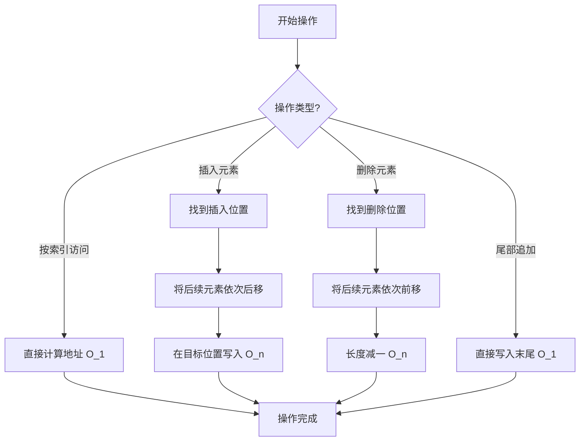

# 数组（Array）

## 1. 算法定位

- **所属分类**：数据结构基础
- **解决的问题**：需要按索引快速随机访问元素的场景
- **知识树位置**：

```
数据结构基础
├── 数组 ◀ 当前位置
├── 链表
├── 栈
├── 队列
├── 双端队列
├── 哈希表
├── 堆
└── 并查集
```

数组是所有数据结构的基石，几乎所有其他数据结构（栈、队列、堆、哈希表）都可以用数组来实现。掌握数组是学习一切算法的第一步。

## 2. 一句话理解

> 数组就是一排连续的格子，每个格子有编号，通过编号可以瞬间找到对应的格子。

## 3. 生活化比喻

想象一排 **火车车厢**：

- 每节车厢紧挨着排列（**连续内存**）。
- 每节车厢都有编号（**索引**），从 0 号车厢开始。
- 你可以直接走到 5 号车厢，不需要从 1 号一节一节走过去（**随机访问 O(1)**）。
- 如果你想在 3 号和 4 号车厢之间加一节新车厢，所有后面的车厢都要往后挪（**插入 O(n)**）。
- 如果你把 3 号车厢拆掉，后面的车厢都要往前补位（**删除 O(n)**）。

## 4. 核心思想

### 为什么需要数组？

当我们需要存储一组相同类型的数据，并且需要**频繁按位置访问**时，数组是最高效的选择。

### 数组的两大核心特征

1. **连续内存**：所有元素在内存中紧挨着存放，没有间隔。
2. **随机访问**：通过 `起始地址 + 索引 × 元素大小` 直接计算出任意元素的内存地址。

```
内存地址计算公式：
元素地址 = 数组首地址 + 索引 × sizeof(元素类型)
```

## 5. 图解推演

### 数组内存布局

```
索引:     [0]    [1]    [2]    [3]    [4]
         +------+------+------+------+------+
数据:    |  10  |  20  |  30  |  40  |  50  |
         +------+------+------+------+------+
地址:   0x100  0x104  0x108  0x10C  0x110
         ↑
       首地址
```

### 插入操作图解：在索引 2 处插入 25

```
初始状态:
[10] [20] [30] [40] [50] [ ]
  0    1    2    3    4    5

第一步：从后往前，将元素依次后移
[10] [20] [30] [40] [50] [50]   ← arr[5] = arr[4]
[10] [20] [30] [40] [40] [50]   ← arr[4] = arr[3]
[10] [20] [30] [30] [40] [50]   ← arr[3] = arr[2]

第二步：在索引 2 处写入新值
[10] [20] [25] [30] [40] [50]   ← arr[2] = 25

最终状态:
[10] [20] [25] [30] [40] [50]
  0    1    2    3    4    5
```

### 删除操作图解：删除索引 2 处的元素

```
初始状态:
[10] [20] [30] [40] [50]
  0    1    2    3    4

第一步：从前往后，将元素依次前移
[10] [20] [40] [40] [50]   ← arr[2] = arr[3]
[10] [20] [40] [50] [50]   ← arr[3] = arr[4]

第二步：长度减 1
[10] [20] [40] [50]
  0    1    2    3

最终状态:
[10] [20] [40] [50]
```

### 操作流程 Mermaid 图



## 6. 执行步骤

### 访问操作
1. 传入索引 `i`
2. 检查 `i` 是否越界（`0 <= i < length`）
3. 直接返回 `arr[i]`，时间 O(1)

### 插入操作（在索引 `i` 处插入值 `val`）
1. 检查数组是否已满
2. 检查 `i` 是否合法
3. 从最后一个元素开始，依次将 `arr[j]` 复制到 `arr[j+1]`（`j` 从 `length-1` 到 `i`）
4. 将 `arr[i]` 设为 `val`
5. 长度加 1

### 删除操作（删除索引 `i` 处的元素）
1. 检查 `i` 是否合法
2. 从 `i+1` 开始，依次将 `arr[j]` 复制到 `arr[j-1]`
3. 长度减 1

## 7. C# 实现

### 基础版：手写动态数组

```csharp
/// <summary>
/// 手写动态数组，模拟 List<T> 的核心功能
/// 帮助理解数组的底层原理
/// </summary>
public class MyArray<T>
{
    // 底层使用固定大小的数组存储数据
    private T[] _data;

    // 记录当前实际存储的元素个数（不是数组容量）
    private int _count;

    /// <summary>
    /// 构造函数：初始化指定容量的数组
    /// </summary>
    /// <param name="capacity">初始容量，默认为 4</param>
    public MyArray(int capacity = 4)
    {
        // 分配固定大小的内存空间
        _data = new T[capacity];
        _count = 0;
    }

    /// <summary>
    /// 当前数组中实际元素的个数
    /// </summary>
    public int Count => _count;

    /// <summary>
    /// 当前数组的总容量
    /// </summary>
    public int Capacity => _data.Length;

    /// <summary>
    /// 索引器：支持通过 arr[i] 的方式访问和修改元素
    /// 时间复杂度：O(1)
    /// </summary>
    public T this[int index]
    {
        get
        {
            // 边界检查：防止访问不存在的元素
            if (index < 0 || index >= _count)
                throw new IndexOutOfRangeException($"索引 {index} 超出范围，有效范围 [0, {_count - 1}]");
            return _data[index];
        }
        set
        {
            if (index < 0 || index >= _count)
                throw new IndexOutOfRangeException($"索引 {index} 超出范围，有效范围 [0, {_count - 1}]");
            _data[index] = value;
        }
    }

    /// <summary>
    /// 在数组末尾追加元素
    /// 均摊时间复杂度：O(1)
    /// </summary>
    public void Add(T item)
    {
        // 如果容量满了，先扩容
        if (_count == _data.Length)
            Resize(_data.Length * 2);

        // 在末尾位置放入新元素
        _data[_count] = item;
        _count++;
    }

    /// <summary>
    /// 在指定索引处插入元素
    /// 时间复杂度：O(n)，因为需要移动后续所有元素
    /// </summary>
    public void Insert(int index, T item)
    {
        // 允许在 [0, _count] 范围内插入（_count 位置表示追加到末尾）
        if (index < 0 || index > _count)
            throw new IndexOutOfRangeException($"插入位置 {index} 不合法");

        // 容量不足时扩容
        if (_count == _data.Length)
            Resize(_data.Length * 2);

        // 核心步骤：从后往前移动元素，腾出 index 位置
        // 注意必须从后往前移，否则会覆盖数据
        for (int i = _count - 1; i >= index; i--)
        {
            _data[i + 1] = _data[i];
        }

        // 将新元素放入目标位置
        _data[index] = item;
        _count++;
    }

    /// <summary>
    /// 删除指定索引处的元素并返回
    /// 时间复杂度：O(n)，因为需要移动后续所有元素
    /// </summary>
    public T RemoveAt(int index)
    {
        if (index < 0 || index >= _count)
            throw new IndexOutOfRangeException($"删除位置 {index} 不合法");

        // 先保存要删除的元素，稍后返回
        T removed = _data[index];

        // 核心步骤：从前往后移动元素，填补空位
        for (int i = index; i < _count - 1; i++)
        {
            _data[i] = _data[i + 1];
        }

        _count--;

        // 将多余位置清空（帮助垃圾回收）
        _data[_count] = default!;

        // 缩容：当元素个数只有容量的 1/4 时，缩小为一半
        // 使用 1/4 而不是 1/2 是为了避免在临界点反复扩缩容（震荡问题）
        if (_count > 0 && _count == _data.Length / 4)
            Resize(_data.Length / 2);

        return removed;
    }

    /// <summary>
    /// 查找元素第一次出现的索引
    /// 时间复杂度：O(n)，最坏要遍历整个数组
    /// </summary>
    public int IndexOf(T item)
    {
        for (int i = 0; i < _count; i++)
        {
            // 使用 Equals 进行值比较
            if (Equals(_data[i], item))
                return i;
        }
        // 没找到返回 -1
        return -1;
    }

    /// <summary>
    /// 数组扩容/缩容
    /// 创建新的更大/更小的数组，将旧数据复制过去
    /// </summary>
    private void Resize(int newCapacity)
    {
        T[] newData = new T[newCapacity];
        // 只复制有效数据（_count 个）
        for (int i = 0; i < _count; i++)
        {
            newData[i] = _data[i];
        }
        _data = newData;
    }

    /// <summary>
    /// 打印数组内容，方便调试
    /// </summary>
    public override string ToString()
    {
        var sb = new System.Text.StringBuilder();
        sb.Append($"MyArray: 长度={_count}, 容量={_data.Length} [");
        for (int i = 0; i < _count; i++)
        {
            sb.Append(_data[i]);
            if (i < _count - 1) sb.Append(", ");
        }
        sb.Append("]");
        return sb.ToString();
    }
}
```

### 使用 C# 内置类型

```csharp
using System;
using System.Collections.Generic;

public class ArrayDemo
{
    public static void Main()
    {
        // ========== 原生数组 ==========
        // 固定大小，声明时必须指定长度
        int[] fixedArr = new int[5];
        fixedArr[0] = 10;
        fixedArr[1] = 20;
        Console.WriteLine($"原生数组：fixedArr[0] = {fixedArr[0]}"); // 10

        // 使用初始化器
        int[] initArr = { 10, 20, 30, 40, 50 };
        Console.WriteLine($"数组长度：{initArr.Length}"); // 5

        // ========== List<T>（动态数组） ==========
        // 底层就是数组 + 自动扩容，等价于我们手写的 MyArray
        List<int> list = new List<int>();

        // 尾部追加：均摊 O(1)
        list.Add(10);
        list.Add(20);
        list.Add(30);

        // 按索引访问：O(1)
        Console.WriteLine($"list[1] = {list[1]}"); // 20

        // 插入：O(n)
        list.Insert(1, 15); // 在索引 1 处插入 15
        // 此时 list = [10, 15, 20, 30]

        // 删除：O(n)
        list.RemoveAt(2); // 删除索引 2 处的 20
        // 此时 list = [10, 15, 30]

        // 查找：O(n)
        int idx = list.IndexOf(15); // 返回 1
        Console.WriteLine($"15 的索引：{idx}");

        // 遍历
        foreach (int val in list)
        {
            Console.Write($"{val} "); // 10 15 30
        }
        Console.WriteLine();
    }
}
```

## 8. 示例演示

用手写的 `MyArray` 执行一系列操作：

```
操作序列：Add(10), Add(20), Add(30), Insert(1, 15), RemoveAt(2)

步骤 1：Add(10)
内部数组: [10, _, _, _]  Count=1, Capacity=4

步骤 2：Add(20)
内部数组: [10, 20, _, _]  Count=2, Capacity=4

步骤 3：Add(30)
内部数组: [10, 20, 30, _]  Count=3, Capacity=4

步骤 4：Insert(1, 15)  — 在索引 1 处插入 15
  移动过程：arr[3]=arr[2]=30, arr[2]=arr[1]=20
  写入：arr[1]=15
内部数组: [10, 15, 20, 30]  Count=4, Capacity=4

步骤 5：RemoveAt(2)  — 删除索引 2 处的元素（20）
  移动过程：arr[2]=arr[3]=30
内部数组: [10, 15, 30, _]  Count=3, Capacity=4
返回值：20
```

## 9. 复杂度分析

| 操作 | 时间复杂度 | 说明 |
|------|-----------|------|
| 按索引访问 | **O(1)** | 直接计算内存地址，最快的操作 |
| 尾部追加 | **均摊 O(1)** | 偶尔触发扩容为 O(n)，但均摊下来是 O(1) |
| 任意位置插入 | **O(n)** | 最坏需要移动所有元素（在头部插入） |
| 任意位置删除 | **O(n)** | 最坏需要移动所有元素（删除头部） |
| 按值查找 | **O(n)** | 最坏需要遍历整个数组 |
| 空间复杂度 | **O(n)** | 存储 n 个元素需要 n 的空间 |

**通俗理解**：
- O(1) 就像"伸手拿眼前的东西"——一步到位。
- O(n) 就像"在一排人中找某个人"——最坏得从头走到尾。

## 10. 易错点

1. **数组越界**：索引从 `0` 开始，最大索引是 `Length - 1`，新手常写成 `arr[arr.Length]`，导致越界异常。

2. **插入方向搞反**：插入时必须**从后往前移动**元素，如果从前往后移会把数据覆盖丢失。

3. **混淆长度和容量**：`Count`（实际元素数）和 `Capacity`（底层数组大小）不同，`new List<int>(100)` 不是创建 100 个元素，而是预分配 100 的容量。

4. **遍历中修改**：在 `foreach` 中调用 `Add` 或 `Remove` 会抛异常，需要用 `for` 循环从后往前删除，或者使用 `RemoveAll`。

5. **扩容性能陷阱**：频繁触发扩容会造成大量内存复制。如果事先知道大概数据量，应通过构造函数预设容量：`new List<int>(预估大小)`。

## 11. 相似数据结构对比

| 特性 | 数组 (Array/List) | 链表 (LinkedList) |
|------|-------------------|-------------------|
| 内存布局 | 连续 | 分散 |
| 随机访问 | **O(1)** | O(n) |
| 头部插入 | O(n) | **O(1)** |
| 尾部追加 | 均摊 O(1) | **O(1)** |
| 中间插入 | O(n) | O(1)（已知节点） |
| 中间删除 | O(n) | O(1)（已知节点） |
| 内存利用率 | 可能有空闲空间 | 每个节点有额外指针开销 |
| 缓存友好性 | **高**（连续内存） | 低（内存分散） |
| 适用场景 | 频繁随机访问 | 频繁增删 |

## 12. 前置知识与延伸学习

### 前置知识
- C# 基础语法
- 泛型基础（`<T>`）
- 内存管理基本概念

### 延伸学习
- **链表**：与数组互补的数据结构
- **栈**：用数组实现的 LIFO 结构
- **队列**：用数组实现的 FIFO 结构
- **哈希表**：数组 + 哈希函数的组合
- **堆**：用数组存储的完全二叉树
- **二分查找**：在有序数组上的高效搜索

## 13. 记忆口诀

> **"数组连续一排站，下标访问一瞬间；插入删除要挪位，增删频繁选链表。"**

## 14. 面试常问点

1. **数组和链表的区别是什么？各自适合什么场景？**
   - 数组连续内存、随机访问 O(1)、增删 O(n)；链表分散内存、增删 O(1)、访问 O(n)。

2. **List\<T\> 的扩容机制是什么？**
   - 默认初始容量为 4，每次扩容翻倍（×2），扩容时创建新数组并复制旧数据。

3. **ArrayList 和 List\<T\> 有什么区别？**
   - `ArrayList` 存 `object`，有装箱拆箱开销；`List<T>` 是泛型版本，类型安全且性能更好。

4. **如何在 O(1) 时间内删除数组中的元素？**
   - 如果不要求保持顺序，可以将要删除的元素与最后一个元素交换，然后删除最后一个。

5. **数组如何实现 O(1) 均摊追加？**
   - 动态扩容策略：每次容量翻倍，虽然单次扩容为 O(n)，但分摊到每次追加只需 O(1)。

## 15. 一页总结

```
╔══════════════════════════════════════════════════╗
║                   数组 Array                      ║
╠══════════════════════════════════════════════════╣
║  核心特征：连续内存 + 随机访问                      ║
║                                                    ║
║  访问：O(1)   ← 最大优势                           ║
║  追加：O(1) 均摊                                   ║
║  插入：O(n)   ← 需要移动元素                       ║
║  删除：O(n)   ← 需要移动元素                       ║
║  查找：O(n)   （有序数组用二分可达 O(log n)）        ║
║                                                    ║
║  C# 对应：int[] / List<T>                          ║
║  适用场景：频繁读取、尾部增删、已知大小              ║
║  不适用：频繁在中间增删                              ║
║                                                    ║
║  记住：数组 = 火车车厢，编号直达，插队要挪人         ║
╚══════════════════════════════════════════════════╝
```
