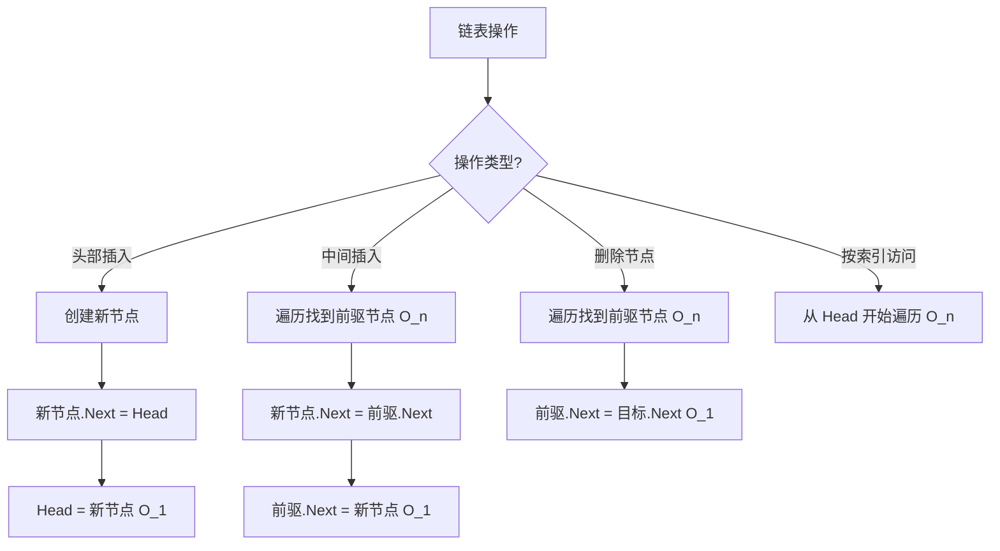

# 链表（LinkedList）

## 1. 算法定位

- **所属分类**：数据结构基础
- **解决的问题**：需要频繁在任意位置插入或删除元素的场景
- **知识树位置**：

```
数据结构基础
├── 数组
├── 链表 ◀ 当前位置
├── 栈
├── 队列
├── 双端队列
├── 哈希表
├── 堆
└── 并查集
```

链表是与数组互补的基础数据结构。数组的随机访问快但增删慢，链表的增删快但随机访问慢。理解链表是理解树、图等复杂数据结构的基础。

## 2. 一句话理解

> 链表就像寻宝游戏——每个宝箱里除了宝物，还有一张纸条写着下一个宝箱的位置。

## 3. 生活化比喻

想象一群小朋友在操场上玩 **"手拉手"** 游戏：

- 每个小朋友知道自己手里拉着谁的手（**指针/引用**），但不知道整个队伍有多长。
- 你要找排在第 5 个的小朋友？只能从第一个开始，沿着手一个一个数过去（**访问 O(n)**）。
- 有新小朋友想插入到第 3 个和第 4 个之间？只需要第 3 个放开手，和新人牵手，新人再和第 4 个牵手——**不需要其他人移动**（**插入 O(1)**）。
- 有人要离开？左右两个人直接牵手，搞定（**删除 O(1)**）。

**双向链表** 就是每个小朋友左手拉前一个人，右手拉后一个人——可以往前走也可以往后走。

## 4. 核心思想

### 为什么需要链表？

数组在中间位置插入/删除时要移动大量元素，效率低。链表通过"节点 + 指针"的方式，让每个元素散落在内存各处，通过指针串联起来，从而实现 O(1) 的增删操作。

### 链表的核心结构

- **节点（Node）**：存储数据 + 指向下一个节点的指针
- **头节点（Head）**：链表的入口，没有它就找不到链表
- **尾节点（Tail）**：最后一个节点，其 `Next` 为 `null`

## 5. 图解推演

### 单向链表结构

```
Head
  ↓
[10|●]──→[20|●]──→[30|●]──→[40|●]──→ null
 节点0     节点1     节点2     节点3

每个节点：[数据|指针]
●  表示指向下一个节点的指针
```

### 双向链表结构

```
null ←──[●|10|●]⇄[●|20|●]⇄[●|30|●]⇄[●|40|●]──→ null
          Head                            Tail

每个节点：[前指针|数据|后指针]
```

### 插入操作图解：在节点 B 和 C 之间插入 X

```
插入前:
  A ──→ B ──→ C ──→ D

第一步：新节点 X 的 Next 指向 C
  A ──→ B ──→ C ──→ D
              ↑
         X ──┘

第二步：B 的 Next 指向 X
  A ──→ B ──→ X ──→ C ──→ D

插入后:
  A ──→ B ──→ X ──→ C ──→ D
```

### 删除操作图解：删除节点 C

```
删除前:
  A ──→ B ──→ C ──→ D

操作：B 的 Next 直接指向 D（跳过 C）
  A ──→ B ──→ D
              ╳ C（被垃圾回收）

删除后:
  A ──→ B ──→ D
```

### 操作流程 Mermaid 图



## 6. 执行步骤

### 头部插入
1. 创建新节点，数据为 `val`
2. 新节点的 `Next` 指向当前 `Head`
3. 更新 `Head` 为新节点

### 在指定节点后插入
1. 找到目标位置的前驱节点 `prev`
2. 创建新节点
3. 新节点的 `Next` = `prev.Next`
4. `prev.Next` = 新节点

### 删除指定节点
1. 找到要删除节点的前驱 `prev`
2. `prev.Next` = `prev.Next.Next`（跳过被删节点）

### 遍历查找
1. 从 `Head` 出发
2. 逐个检查当前节点
3. 沿 `Next` 移动到下一个节点
4. 直到找到目标或 `Next` 为 `null`

## 7. C# 实现

### 手写单向链表

```csharp
/// <summary>
/// 单向链表节点
/// </summary>
public class ListNode<T>
{
    /// <summary>节点存储的数据</summary>
    public T Value;

    /// <summary>指向下一个节点的引用（没有下一个时为 null）</summary>
    public ListNode<T>? Next;

    public ListNode(T value, ListNode<T>? next = null)
    {
        Value = value;
        Next = next;
    }
}

/// <summary>
/// 手写单向链表，实现核心操作
/// </summary>
public class MySinglyLinkedList<T>
{
    // 哨兵节点（虚拟头节点）：简化边界处理
    // 真正的第一个数据节点是 _dummyHead.Next
    private ListNode<T> _dummyHead;
    private int _count;

    public MySinglyLinkedList()
    {
        // 哨兵节点不存储有效数据，仅用于简化操作
        _dummyHead = new ListNode<T>(default!);
        _count = 0;
    }

    public int Count => _count;

    /// <summary>
    /// 在链表头部插入元素
    /// 时间复杂度：O(1)
    /// </summary>
    public void AddFirst(T value)
    {
        // 创建新节点，Next 指向原来的第一个节点
        ListNode<T> newNode = new ListNode<T>(value);
        newNode.Next = _dummyHead.Next;

        // 哨兵节点指向新节点，新节点成为第一个数据节点
        _dummyHead.Next = newNode;
        _count++;
    }

    /// <summary>
    /// 在链表尾部追加元素
    /// 时间复杂度：O(n)，需要遍历到末尾
    /// </summary>
    public void AddLast(T value)
    {
        // 从哨兵节点开始，遍历到最后一个节点
        ListNode<T> current = _dummyHead;
        while (current.Next != null)
        {
            current = current.Next;
        }

        // 在末尾接上新节点
        current.Next = new ListNode<T>(value);
        _count++;
    }

    /// <summary>
    /// 在指定索引处插入元素
    /// 时间复杂度：O(n)，需要先遍历找到前驱
    /// </summary>
    public void Insert(int index, T value)
    {
        if (index < 0 || index > _count)
            throw new ArgumentOutOfRangeException(nameof(index));

        // 找到第 index 个节点的前驱
        // 由于有哨兵节点，前驱就是从哨兵开始走 index 步
        ListNode<T> prev = _dummyHead;
        for (int i = 0; i < index; i++)
        {
            prev = prev.Next!;
        }

        // 插入新节点：先连后面，再连前面
        ListNode<T> newNode = new ListNode<T>(value);
        newNode.Next = prev.Next;  // 新节点指向原位置的节点
        prev.Next = newNode;       // 前驱指向新节点
        _count++;
    }

    /// <summary>
    /// 删除指定索引处的元素
    /// 时间复杂度：O(n)
    /// </summary>
    public T RemoveAt(int index)
    {
        if (index < 0 || index >= _count)
            throw new ArgumentOutOfRangeException(nameof(index));

        // 找到前驱节点
        ListNode<T> prev = _dummyHead;
        for (int i = 0; i < index; i++)
        {
            prev = prev.Next!;
        }

        // 跳过被删节点
        ListNode<T> removed = prev.Next!;
        prev.Next = removed.Next;
        _count--;

        return removed.Value;
    }

    /// <summary>
    /// 获取指定索引处的元素
    /// 时间复杂度：O(n)
    /// </summary>
    public T Get(int index)
    {
        if (index < 0 || index >= _count)
            throw new ArgumentOutOfRangeException(nameof(index));

        // 从第一个数据节点开始，走 index 步
        ListNode<T> current = _dummyHead.Next!;
        for (int i = 0; i < index; i++)
        {
            current = current.Next!;
        }
        return current.Value;
    }

    /// <summary>
    /// 反转链表（经典面试题）
    /// 时间复杂度：O(n)，空间复杂度：O(1)
    /// </summary>
    public void Reverse()
    {
        ListNode<T>? prev = null;        // 前一个节点
        ListNode<T>? current = _dummyHead.Next;  // 当前节点

        while (current != null)
        {
            ListNode<T>? next = current.Next;  // 暂存下一个节点
            current.Next = prev;               // 当前节点指向前一个（反转）
            prev = current;                    // 前指针前进
            current = next;                    // 当前指针前进
        }

        // prev 现在指向新的头节点
        _dummyHead.Next = prev;
    }

    /// <summary>
    /// 打印链表
    /// </summary>
    public override string ToString()
    {
        var sb = new System.Text.StringBuilder();
        sb.Append("链表: ");
        ListNode<T>? current = _dummyHead.Next;
        while (current != null)
        {
            sb.Append(current.Value);
            if (current.Next != null)
                sb.Append(" -> ");
            current = current.Next;
        }
        sb.Append(" -> null");
        return sb.ToString();
    }
}
```

### 手写双向链表

```csharp
/// <summary>
/// 双向链表节点
/// </summary>
public class DoublyNode<T>
{
    public T Value;
    public DoublyNode<T>? Prev;  // 指向前一个节点
    public DoublyNode<T>? Next;  // 指向后一个节点

    public DoublyNode(T value)
    {
        Value = value;
        Prev = null;
        Next = null;
    }
}

/// <summary>
/// 手写双向链表
/// 优势：可以从任意节点往前或往后遍历
/// </summary>
public class MyDoublyLinkedList<T>
{
    // 使用两个哨兵节点简化边界处理
    private DoublyNode<T> _head; // 头哨兵
    private DoublyNode<T> _tail; // 尾哨兵
    private int _count;

    public MyDoublyLinkedList()
    {
        _head = new DoublyNode<T>(default!);
        _tail = new DoublyNode<T>(default!);
        // 初始时头尾哨兵互相指向
        _head.Next = _tail;
        _tail.Prev = _head;
        _count = 0;
    }

    public int Count => _count;

    /// <summary>
    /// 在头部插入，时间 O(1)
    /// </summary>
    public void AddFirst(T value)
    {
        DoublyNode<T> newNode = new DoublyNode<T>(value);

        // 新节点插入到 _head 和 _head.Next 之间
        newNode.Next = _head.Next;
        newNode.Prev = _head;
        _head.Next!.Prev = newNode;
        _head.Next = newNode;
        _count++;
    }

    /// <summary>
    /// 在尾部追加，时间 O(1)（双向链表的优势！）
    /// </summary>
    public void AddLast(T value)
    {
        DoublyNode<T> newNode = new DoublyNode<T>(value);

        // 新节点插入到 _tail.Prev 和 _tail 之间
        newNode.Prev = _tail.Prev;
        newNode.Next = _tail;
        _tail.Prev!.Next = newNode;
        _tail.Prev = newNode;
        _count++;
    }

    /// <summary>
    /// 删除指定节点，时间 O(1)（已知节点引用时）
    /// </summary>
    public void Remove(DoublyNode<T> node)
    {
        // 直接修改前后节点的指针，跳过当前节点
        node.Prev!.Next = node.Next;
        node.Next!.Prev = node.Prev;
        _count--;
    }

    /// <summary>
    /// 打印链表（正向）
    /// </summary>
    public override string ToString()
    {
        var sb = new System.Text.StringBuilder();
        sb.Append("双向链表: HEAD <-> ");
        DoublyNode<T>? current = _head.Next;
        while (current != _tail)
        {
            sb.Append(current!.Value);
            sb.Append(" <-> ");
            current = current.Next;
        }
        sb.Append("TAIL");
        return sb.ToString();
    }
}
```

### 使用 C# 内置 LinkedList

```csharp
using System;
using System.Collections.Generic;

public class LinkedListDemo
{
    public static void Main()
    {
        // C# 内置的 LinkedList<T> 是双向链表
        LinkedList<int> list = new LinkedList<int>();

        // 头部插入：O(1)
        list.AddFirst(20);
        list.AddFirst(10);
        // 链表: 10 <-> 20

        // 尾部追加：O(1)
        list.AddLast(30);
        list.AddLast(40);
        // 链表: 10 <-> 20 <-> 30 <-> 40

        // 在某个节点之后插入
        LinkedListNode<int> node20 = list.Find(20)!;
        list.AddAfter(node20, 25);
        // 链表: 10 <-> 20 <-> 25 <-> 30 <-> 40

        // 删除节点：O(1)（已知节点引用）
        list.Remove(node20);
        // 链表: 10 <-> 25 <-> 30 <-> 40

        // 遍历
        foreach (int val in list)
        {
            Console.Write($"{val} "); // 10 25 30 40
        }
        Console.WriteLine();
    }
}
```

## 8. 示例演示

```
操作序列：AddFirst(10), AddLast(20), AddLast(30), Insert(1, 15), RemoveAt(2)

步骤 1：AddFirst(10)
链表: 10 -> null

步骤 2：AddLast(20)
链表: 10 -> 20 -> null

步骤 3：AddLast(30)
链表: 10 -> 20 -> 30 -> null

步骤 4：Insert(1, 15) — 在索引 1 处插入 15
  找到索引 0 的节点(10)作为前驱
  新节点 15 的 Next 指向 20
  节点 10 的 Next 指向 15
链表: 10 -> 15 -> 20 -> 30 -> null

步骤 5：RemoveAt(2) — 删除索引 2 处的节点(20)
  找到索引 1 的节点(15)作为前驱
  15 的 Next 指向 30（跳过 20）
链表: 10 -> 15 -> 30 -> null
返回值: 20
```

## 9. 复杂度分析

| 操作 | 单向链表 | 双向链表 | 说明 |
|------|---------|---------|------|
| 头部插入/删除 | **O(1)** | **O(1)** | 直接操作头指针 |
| 尾部追加 | O(n) | **O(1)** | 双向链表有尾指针 |
| 按索引访问 | O(n) | O(n) | 必须从头遍历 |
| 按值查找 | O(n) | O(n) | 最坏遍历全部 |
| 已知节点的插入/删除 | **O(1)** | **O(1)** | 只需修改指针 |
| 空间复杂度 | O(n) | O(n) | 每个节点额外存指针 |

**通俗理解**：
- 链表的增删像"解开手链重新串珠子"——只需断开一处重新连接。
- 链表的查找像"数念珠"——必须一颗一颗摸过去。

## 10. 易错点

1. **指针修改顺序错误**：插入时必须先连新节点的 `Next`，再改前驱的 `Next`。顺序反了会丢失后续链表。

2. **忘记处理空链表**：操作前要检查链表是否为空，否则访问 `null.Next` 会报错。

3. **没有使用哨兵节点**：不用哨兵节点时，头部插入/删除需要特殊处理，代码容易出错。建议初学者始终使用哨兵节点。

4. **反转链表时丢失引用**：反转时一定要先暂存 `current.Next`，再修改指针，否则会断链。

5. **内存泄漏概念**：虽然 C# 有垃圾回收，但在某些语言中删除节点后要手动释放内存。

## 11. 相似数据结构对比

| 特性 | 单向链表 | 双向链表 | 数组 |
|------|---------|---------|------|
| 内存布局 | 分散 | 分散 | 连续 |
| 随机访问 | O(n) | O(n) | **O(1)** |
| 头部增删 | **O(1)** | **O(1)** | O(n) |
| 尾部增删 | O(n) | **O(1)** | 均摊 O(1) |
| 反向遍历 | 不支持 | **支持** | 支持 |
| 单个节点内存 | 数据+1指针 | 数据+2指针 | 仅数据 |
| 缓存友好 | 差 | 差 | **好** |

## 12. 前置知识与延伸学习

### 前置知识
- 数组基础
- 引用类型与值类型
- `null` 和可空引用

### 延伸学习
- **栈**：可用链表实现
- **队列**：可用链表实现
- **双端队列**：双向链表天然支持
- **LRU 缓存**：哈希表 + 双向链表的经典应用
- **跳表**：链表上加多级索引，实现 O(log n) 查找
- **二叉树**：每个节点有两个"Next"指针（左右子节点）

## 13. 记忆口诀

> **"链表手拉手，增删解开扣；访问只能数着走，不能像数组跳着走。"**

## 14. 面试常问点

1. **反转链表**（最高频面试题之一）
   - 迭代法：用三个指针 prev/current/next 逐个翻转。
   - 递归法：递归到末尾再回溯翻转。

2. **判断链表是否有环**
   - 快慢指针法：快指针每次走 2 步，慢指针走 1 步，相遇则有环。

3. **找链表的中间节点**
   - 快慢指针：快指针走到末尾时，慢指针正好在中间。

4. **合并两个有序链表**
   - 用哨兵节点 + 双指针比较合并。

5. **链表中倒数第 k 个节点**
   - 双指针：先让一个指针走 k 步，再两个同时走，先出发的到末尾时，后出发的就在倒数第 k 个。

## 15. 一页总结

```
╔══════════════════════════════════════════════════════╗
║               链表 LinkedList                         ║
╠══════════════════════════════════════════════════════╣
║  核心特征：节点 + 指针，内存不连续                      ║
║                                                        ║
║  头部增删：O(1) ← 最大优势                              ║
║  已知节点增删：O(1)                                     ║
║  按索引访问：O(n) ← 最大劣势                            ║
║  按值查找：O(n)                                         ║
║                                                        ║
║  单向链表：每个节点有一个 Next 指针                      ║
║  双向链表：每个节点有 Prev 和 Next 指针                  ║
║                                                        ║
║  C# 对应：LinkedList<T>（双向链表）                      ║
║  适用场景：频繁增删、不需要随机访问                      ║
║  不适用：需要频繁按索引访问                              ║
║                                                        ║
║  核心技巧：哨兵节点、快慢指针、递归                      ║
║  记住：链表 = 手拉手排队，加人减人只需松手重牵            ║
╚══════════════════════════════════════════════════════╝
```
