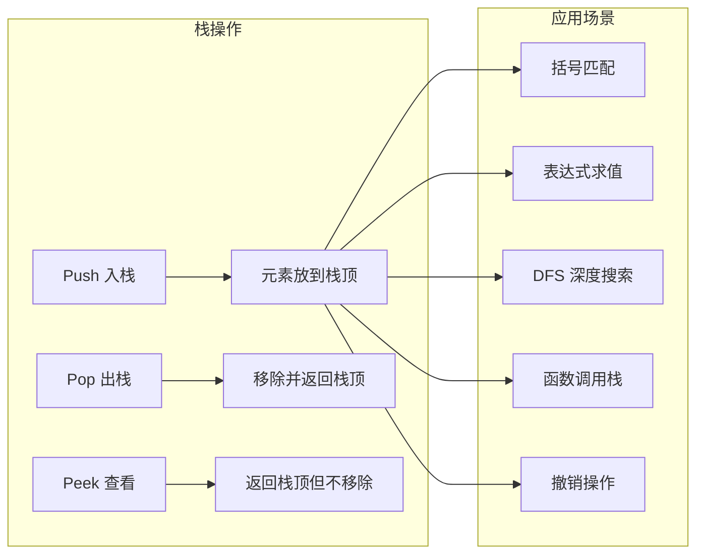

# 栈（Stack）

## 1. 算法定位

- **所属分类**：数据结构基础
- **解决的问题**：需要"后进先出"（LIFO）访问顺序的场景
- **知识树位置**：

```
数据结构基础
├── 数组
├── 链表
├── 栈 ◀ 当前位置
├── 队列
├── 双端队列
├── 哈希表
├── 堆
└── 并查集
```

栈是最简单也最常用的数据结构之一。它是递归、DFS、表达式求值、括号匹配等众多算法的底层支撑。

## 2. 一句话理解

> 栈就是"最后放进去的东西，最先拿出来"——先进后出，后进先出。

## 3. 生活化比喻

想象你在餐厅里叠 **盘子**：

- 洗好一个盘子，放到最上面（**Push 入栈**）。
- 要用盘子时，从最上面拿一个（**Pop 出栈**）。
- 你永远只能操作最上面那个盘子（**栈顶**）。
- 你不能抽掉中间的盘子（不允许随机访问）。
- 最先放进去的盘子在最底下，最后才能拿到（**LIFO**）。

另一个例子：浏览器的 **后退按钮**——每访问一个新页面就"压栈"，点后退就"弹栈"回到上一个页面。

## 4. 核心思想

### LIFO 原则（Last In, First Out）

栈只允许在一端（栈顶）进行插入和删除操作：
- **Push**：将元素压入栈顶
- **Pop**：将栈顶元素弹出并返回
- **Peek**：查看栈顶元素但不弹出

### 为什么栈如此重要？

因为很多问题本身具有"嵌套"或"回溯"结构：
- **递归调用**：函数调用栈就是一个栈
- **括号匹配**：遇到左括号入栈，遇到右括号出栈匹配
- **表达式求值**：运算符和操作数用栈管理优先级
- **DFS 搜索**：用栈模拟递归的深度优先遍历
- **撤销操作**：每次操作入栈，撤销就弹栈

## 5. 图解推演

### 栈的基本操作

```
Push(10)    Push(20)    Push(30)    Pop()       Peek()
                                   返回 30     返回 20
  ┌───┐     ┌───┐     ┌───┐     ┌───┐       ┌───┐
  │   │     │   │     │30 │←顶  │   │       │   │
  ├───┤     ├───┤     ├───┤     ├───┤       ├───┤
  │   │     │20 │←顶  │20 │     │20 │←顶    │20 │←顶 (只看不取)
  ├───┤     ├───┤     ├───┤     ├───┤       ├───┤
  │10 │←顶  │10 │     │10 │     │10 │       │10 │
  └───┘     └───┘     └───┘     └───┘       └───┘
```

### 括号匹配图解

```
输入: "({[]})"

处理 '(' → 入栈        栈: [(]
处理 '{' → 入栈        栈: [(, {]
处理 '[' → 入栈        栈: [(, {, []
处理 ']' → 弹栈'['匹配  栈: [(, {]        ✓ 匹配
处理 '}' → 弹栈'{'匹配  栈: [(]           ✓ 匹配
处理 ')' → 弹栈'('匹配  栈: []            ✓ 匹配

栈为空 → 所有括号匹配成功！
```

### 表达式求值图解

```
计算后缀表达式: 3 4 + 2 *

读入 3 → 入栈           数字栈: [3]
读入 4 → 入栈           数字栈: [3, 4]
读入 + → 弹出 4 和 3    数字栈: []
         计算 3+4=7
         结果入栈        数字栈: [7]
读入 2 → 入栈           数字栈: [7, 2]
读入 * → 弹出 2 和 7    数字栈: []
         计算 7*2=14
         结果入栈        数字栈: [14]

最终结果: 14
```

### 操作流程 Mermaid 图



## 6. 执行步骤

### Push 操作
1. 将新元素放到栈顶位置
2. 栈顶指针上移（如果用数组实现，就是索引 +1）

### Pop 操作
1. 检查栈是否为空
2. 取出栈顶元素
3. 栈顶指针下移
4. 返回取出的元素

### Peek 操作
1. 检查栈是否为空
2. 返回栈顶元素（不移除）

## 7. C# 实现

### 基础版：用数组实现栈

```csharp
/// <summary>
/// 用数组实现的栈
/// 栈顶就是数组的末尾，这样 Push 和 Pop 都是 O(1)
/// </summary>
public class MyStack<T>
{
    private T[] _data;    // 底层数组
    private int _top;     // 栈顶指针，指向下一个可用位置

    public MyStack(int capacity = 8)
    {
        _data = new T[capacity];
        _top = 0; // 初始时栈为空，栈顶在索引 0
    }

    /// <summary>栈中元素个数</summary>
    public int Count => _top;

    /// <summary>栈是否为空</summary>
    public bool IsEmpty => _top == 0;

    /// <summary>
    /// 入栈：将元素压入栈顶
    /// 时间复杂度：均摊 O(1)
    /// </summary>
    public void Push(T item)
    {
        // 容量不足时扩容
        if (_top == _data.Length)
        {
            T[] newData = new T[_data.Length * 2];
            Array.Copy(_data, newData, _top);
            _data = newData;
        }

        // 将元素放到栈顶位置，然后栈顶指针上移
        _data[_top] = item;
        _top++;
    }

    /// <summary>
    /// 出栈：弹出并返回栈顶元素
    /// 时间复杂度：O(1)
    /// </summary>
    public T Pop()
    {
        if (IsEmpty)
            throw new InvalidOperationException("栈为空，无法弹出元素");

        // 栈顶指针先下移，然后取出元素
        _top--;
        T item = _data[_top];

        // 清除引用，帮助垃圾回收
        _data[_top] = default!;
        return item;
    }

    /// <summary>
    /// 查看栈顶元素但不弹出
    /// 时间复杂度：O(1)
    /// </summary>
    public T Peek()
    {
        if (IsEmpty)
            throw new InvalidOperationException("栈为空，无法查看栈顶");

        return _data[_top - 1];
    }
}
```

### 实战应用一：括号匹配

```csharp
/// <summary>
/// 括号匹配验证器
/// 支持 (), [], {} 三种括号的嵌套匹配
/// LeetCode 第 20 题：有效的括号
/// </summary>
public class BracketMatcher
{
    /// <summary>
    /// 检查括号字符串是否合法
    /// 思路：遇到左括号入栈，遇到右括号弹栈匹配
    /// </summary>
    /// <param name="s">待检查的字符串</param>
    /// <returns>括号是否全部正确匹配</returns>
    public static bool IsValid(string s)
    {
        // 使用 C# 内置 Stack<T>
        Stack<char> stack = new Stack<char>();

        foreach (char c in s)
        {
            // 如果是左括号，入栈
            if (c == '(' || c == '[' || c == '{')
            {
                stack.Push(c);
            }
            else
            {
                // 遇到右括号时，栈不能为空
                if (stack.Count == 0)
                    return false;

                // 弹出栈顶的左括号，检查是否匹配
                char top = stack.Pop();
                if (c == ')' && top != '(') return false;
                if (c == ']' && top != '[') return false;
                if (c == '}' && top != '{') return false;
            }
        }

        // 最后栈必须为空，否则有未匹配的左括号
        return stack.Count == 0;
    }
}
```

### 实战应用二：后缀表达式求值

```csharp
/// <summary>
/// 后缀表达式（逆波兰表达式）求值
/// LeetCode 第 150 题
/// </summary>
public class PostfixEvaluator
{
    /// <summary>
    /// 计算后缀表达式的值
    /// 思路：数字入栈，遇到运算符弹出两个数字计算后再入栈
    /// </summary>
    /// <param name="tokens">后缀表达式的各个元素</param>
    /// <returns>计算结果</returns>
    public static int Evaluate(string[] tokens)
    {
        Stack<int> stack = new Stack<int>();

        foreach (string token in tokens)
        {
            // 判断是运算符还是数字
            if (token == "+" || token == "-" || token == "*" || token == "/")
            {
                // 弹出两个操作数（注意顺序！先弹出的是右操作数）
                int right = stack.Pop();  // 右操作数
                int left = stack.Pop();   // 左操作数

                // 根据运算符计算结果
                int result = token switch
                {
                    "+" => left + right,
                    "-" => left - right,
                    "*" => left * right,
                    "/" => left / right,  // 整数除法，向零取整
                    _ => throw new ArgumentException($"未知运算符: {token}")
                };

                // 将计算结果压入栈中，作为后续运算的操作数
                stack.Push(result);
            }
            else
            {
                // 是数字，直接入栈
                stack.Push(int.Parse(token));
            }
        }

        // 最后栈中只剩一个元素，就是最终结果
        return stack.Pop();
    }
}
```

### 实战应用三：用栈实现 DFS

```csharp
/// <summary>
/// 用显式栈模拟 DFS（深度优先搜索）
/// 本质上递归就是使用了系统的调用栈
/// </summary>
public class StackDFS
{
    /// <summary>
    /// 对二叉树进行前序遍历（根-左-右）
    /// 使用栈模拟递归
    /// </summary>
    public static List<int> PreorderTraversal(TreeNode? root)
    {
        List<int> result = new List<int>();
        if (root == null) return result;

        Stack<TreeNode> stack = new Stack<TreeNode>();
        stack.Push(root);

        while (stack.Count > 0)
        {
            // 弹出当前节点并访问
            TreeNode node = stack.Pop();
            result.Add(node.Val);

            // 先压右子节点，再压左子节点
            // 因为栈是 LIFO，先压的后出
            // 这样左子节点会先被弹出处理，实现"根-左-右"的顺序
            if (node.Right != null)
                stack.Push(node.Right);
            if (node.Left != null)
                stack.Push(node.Left);
        }

        return result;
    }
}

/// <summary>简单的二叉树节点</summary>
public class TreeNode
{
    public int Val;
    public TreeNode? Left;
    public TreeNode? Right;
    public TreeNode(int val) { Val = val; }
}
```

## 8. 示例演示

### 括号匹配示例

```
输入: "({[]})"

字符 '(' → Push('(')     栈: ['(']
字符 '{' → Push('{')     栈: ['(', '{']
字符 '[' → Push('[')     栈: ['(', '{', '[']
字符 ']' → Pop()='['     栈: ['(', '{']     ']' 与 '[' 匹配 ✓
字符 '}' → Pop()='{'     栈: ['(']          '}' 与 '{' 匹配 ✓
字符 ')' → Pop()='('     栈: []             ')' 与 '(' 匹配 ✓

栈为空，返回 true

输入: "([)]"

字符 '(' → Push('(')     栈: ['(']
字符 '[' → Push('[')     栈: ['(', '[']
字符 ')' → Pop()='['     ')' 与 '[' 不匹配 ✗

返回 false
```

## 9. 复杂度分析

| 操作 | 时间复杂度 | 说明 |
|------|-----------|------|
| Push | **O(1)** | 直接操作栈顶 |
| Pop | **O(1)** | 直接操作栈顶 |
| Peek | **O(1)** | 只查看不移除 |
| 查找任意元素 | O(n) | 需要逐个弹出（一般不需要） |
| 空间复杂度 | O(n) | 存储 n 个元素 |

**通俗理解**：
- 栈的所有核心操作都是 O(1)，因为永远只操作"最上面那个"。
- 栈不支持随机访问——如果你需要查看中间的元素，说明栈不是合适的数据结构。

## 10. 易错点

1. **空栈弹出**：Pop 之前必须检查 `stack.Count > 0`，否则会抛异常。

2. **括号匹配中弹出顺序**：弹出的是左括号，要和当前的右括号匹配，别搞混。

3. **后缀表达式中操作数顺序**：`left = Pop()` 后 `right = Pop()`？不对！**先弹出的是右操作数**。对于减法和除法，顺序很重要：`5 3 -` 应该是 `5 - 3 = 2`，不是 `3 - 5 = -2`。

4. **用栈做 DFS 时压入顺序**：要先压右子节点、再压左子节点，这样弹出时才是先左后右。

5. **误以为栈能替代所有递归**：虽然理论上可以，但有些递归（如后序遍历）用栈模拟非常复杂，不一定要硬转。

## 11. 相似数据结构对比

| 特性 | 栈（Stack） | 队列（Queue） | 双端队列（Deque） |
|------|------------|--------------|-------------------|
| 访问顺序 | **LIFO** 后进先出 | FIFO 先进先出 | 两端均可 |
| 插入位置 | 栈顶 | 队尾 | 两端 |
| 删除位置 | 栈顶 | 队头 | 两端 |
| 核心操作 | Push/Pop | Enqueue/Dequeue | 两端的增删 |
| 典型应用 | 递归、括号匹配 | BFS、任务调度 | 滑动窗口 |
| C# 类型 | `Stack<T>` | `Queue<T>` | `LinkedList<T>` |

## 12. 前置知识与延伸学习

### 前置知识
- 数组基础（栈的底层实现）
- 链表基础（链表版栈的实现）

### 延伸学习
- **单调栈**：栈中元素保持单调递增/递减，用于"下一个更大元素"等问题
- **最小栈**：O(1) 时间获取栈中最小值
- **用栈实现队列**：两个栈配合使用
- **递归转迭代**：用显式栈替代系统调用栈
- **表达式树**：中缀/前缀/后缀表达式的转换与求值

## 13. 记忆口诀

> **"栈像叠盘子，后放先拿走；Push 压 Pop 弹，Peek 看不摸手。"**

## 14. 面试常问点

1. **用两个栈实现队列**
   - 一个栈负责入队，一个栈负责出队；出队栈为空时，把入队栈全部倒过来。

2. **实现最小栈（MinStack）**
   - 使用辅助栈同步记录当前最小值，每次 Push 时同步压入当前最小值。

3. **下一个更大元素（单调栈）**
   - 维护一个单调递减栈，从右往左遍历，栈顶就是右边第一个更大元素。

4. **有效的括号匹配**
   - 左括号入栈，右括号弹栈匹配，最终栈为空则合法。

5. **中缀表达式转后缀**
   - 使用运算符栈，按优先级决定入栈还是弹栈输出。

## 15. 一页总结

```
╔══════════════════════════════════════════════════╗
║                   栈 Stack                        ║
╠══════════════════════════════════════════════════╣
║  核心原则：LIFO — 后进先出                          ║
║                                                    ║
║  三大操作（全部 O(1)）：                             ║
║    Push  → 压入栈顶                                 ║
║    Pop   → 弹出栈顶                                 ║
║    Peek  → 查看栈顶                                 ║
║                                                    ║
║  底层实现：数组 或 链表                              ║
║  C# 对应：Stack<T>                                  ║
║                                                    ║
║  经典应用：                                         ║
║    ① 括号匹配（左括号入栈，右括号弹栈匹配）          ║
║    ② 表达式求值（后缀表达式用栈计算）                ║
║    ③ DFS 深度搜索（栈模拟递归）                      ║
║    ④ 浏览器后退（页面入栈，后退弹栈）                ║
║    ⑤ 撤销操作（Ctrl+Z）                             ║
║                                                    ║
║  记住：栈 = 叠盘子，只能操作最上面那个               ║
╚══════════════════════════════════════════════════╝
```
