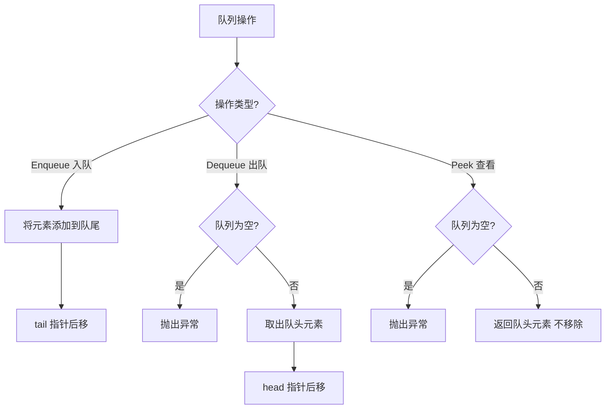

# 队列（Queue）

## 1. 算法定位

- **所属分类**：数据结构基础
- **解决的问题**：需要"先进先出"（FIFO）访问顺序的场景
- **知识树位置**：

```
数据结构基础
├── 数组
├── 链表
├── 栈
├── 队列 ◀ 当前位置
├── 双端队列
├── 哈希表
├── 堆
└── 并查集
```

队列是广度优先搜索（BFS）、任务调度、消息队列等算法和系统的核心数据结构。理解队列是学习图算法的重要前置知识。

## 2. 一句话理解

> 队列就是排队——先来的先走，后来的后走。

## 3. 生活化比喻

想象你在超市 **收银台排队**：

- 来了一位顾客，排到队伍最后面（**Enqueue 入队**）。
- 排在最前面的顾客完成结账，离开队伍（**Dequeue 出队**）。
- 你可以看看谁在最前面（**Peek**），但不能插队。
- 队伍永远从后面加人，从前面走人（**FIFO**）。
- 没有人可以插队或从中间离开（严格的先到先服务）。

再想想 **打印队列**：你发送了三份文档去打印，打印机按你发送的顺序一份一份打，先发的先打。

## 4. 核心思想

### FIFO 原则（First In, First Out）

队列只允许：
- **从队尾插入**（Enqueue）
- **从队头取出**（Dequeue）
- **查看队头**（Peek）

### 为什么需要队列？

当我们需要按顺序处理任务、按层遍历结构时，队列是天然的选择：
- **BFS 广度优先搜索**：按层级逐层扩展
- **任务调度**：先到的任务先处理
- **缓冲区**：生产者-消费者模型
- **消息队列**：按顺序处理消息

### 循环队列

用数组实现队列时，频繁出队会导致前面的空间浪费。**循环队列**通过取模运算让数组"首尾相连"，解决空间浪费问题。

```
普通数组队列的问题:
出队后前面的空间浪费了
[_] [_] [_] [30] [40] [50]
              ↑              ↑
            head            tail

循环队列的解决方案:
把数组想象成一个环，tail 到末尾后回到开头
[60] [_] [_] [30] [40] [50]
      ↑       ↑
    tail     head
```

## 5. 图解推演

### 队列基本操作

```
Enqueue(10)  Enqueue(20)  Enqueue(30)  Dequeue()   Peek()
                                        返回 10    返回 20

  队头→队尾   队头→→队尾   队头→→→队尾
  ┌──┐       ┌──┬──┐     ┌──┬──┬──┐   ┌──┬──┐    ┌──┬──┐
  │10│       │10│20│     │10│20│30│   │20│30│    │20│30│
  └──┘       └──┴──┘     └──┴──┴──┘   └──┴──┘    └──┴──┘
  头 尾       头    尾    头       尾   头   尾    头↑  尾
                                                 只看不取
```

### 循环队列图解

```
初始状态（容量=5）:
┌───┬───┬───┬───┬───┐
│   │   │   │   │   │
└───┴───┴───┴───┴───┘
  ↑
 H/T (head=0, tail=0)

Enqueue(10), Enqueue(20), Enqueue(30):
┌───┬───┬───┬───┬───┐
│10 │20 │30 │   │   │
└───┴───┴───┴───┴───┘
  ↑           ↑
  H           T (head=0, tail=3)

Dequeue() 返回 10, Dequeue() 返回 20:
┌───┬───┬───┬───┬───┐
│   │   │30 │   │   │
└───┴───┴───┴───┴───┘
          ↑   ↑
          H   T (head=2, tail=3)

Enqueue(40), Enqueue(50), Enqueue(60):
┌───┬───┬───┬───┬───┐
│60 │   │30 │40 │50 │
└───┴───┴───┴───┴───┘
      ↑   ↑
      T   H (head=2, tail=1)  ← tail 回到了数组开头！
```

### BFS 使用队列的过程

```
        1
       / \
      2   3
     / \   \
    4   5   6

BFS 遍历顺序: 1 → 2 → 3 → 4 → 5 → 6

步骤 1: 入队根节点 1        队列: [1]
步骤 2: 出队 1，入队 2,3    队列: [2, 3]       输出: 1
步骤 3: 出队 2，入队 4,5    队列: [3, 4, 5]    输出: 1, 2
步骤 4: 出队 3，入队 6      队列: [4, 5, 6]    输出: 1, 2, 3
步骤 5: 出队 4             队列: [5, 6]        输出: 1, 2, 3, 4
步骤 6: 出队 5             队列: [6]           输出: 1, 2, 3, 4, 5
步骤 7: 出队 6             队列: []            输出: 1, 2, 3, 4, 5, 6
```

### Mermaid 流程图



## 6. 执行步骤

### Enqueue 入队
1. 检查队列是否已满（数组实现时）
2. 将元素放在 `tail` 位置
3. `tail` 后移一位（循环队列中 `tail = (tail + 1) % capacity`）
4. 元素计数 +1

### Dequeue 出队
1. 检查队列是否为空
2. 取出 `head` 位置的元素
3. `head` 后移一位（循环队列中 `head = (head + 1) % capacity`）
4. 元素计数 -1
5. 返回取出的元素

## 7. C# 实现

### 基础版：循环队列

```csharp
/// <summary>
/// 用数组实现的循环队列
/// 通过取模运算让数组"首尾相连"，避免空间浪费
/// </summary>
public class MyCircularQueue<T>
{
    private T[] _data;   // 底层数组
    private int _head;   // 队头索引（出队位置）
    private int _tail;   // 队尾索引（下一个入队位置）
    private int _count;  // 当前元素个数

    /// <summary>
    /// 构造函数：创建指定容量的循环队列
    /// </summary>
    public MyCircularQueue(int capacity = 8)
    {
        _data = new T[capacity];
        _head = 0;
        _tail = 0;
        _count = 0;
    }

    /// <summary>队列中元素个数</summary>
    public int Count => _count;

    /// <summary>队列是否为空</summary>
    public bool IsEmpty => _count == 0;

    /// <summary>
    /// 入队：将元素添加到队尾
    /// 时间复杂度：均摊 O(1)
    /// </summary>
    public void Enqueue(T item)
    {
        // 容量不足时扩容
        if (_count == _data.Length)
            Resize(_data.Length * 2);

        // 将元素放在队尾位置
        _data[_tail] = item;

        // 队尾指针后移，用取模实现循环
        _tail = (_tail + 1) % _data.Length;
        _count++;
    }

    /// <summary>
    /// 出队：取出并返回队头元素
    /// 时间复杂度：O(1)
    /// </summary>
    public T Dequeue()
    {
        if (IsEmpty)
            throw new InvalidOperationException("队列为空，无法出队");

        // 取出队头元素
        T item = _data[_head];
        _data[_head] = default!; // 帮助垃圾回收

        // 队头指针后移
        _head = (_head + 1) % _data.Length;
        _count--;

        // 缩容：元素个数为容量的 1/4 时缩小
        if (_count > 0 && _count == _data.Length / 4)
            Resize(_data.Length / 2);

        return item;
    }

    /// <summary>
    /// 查看队头元素但不移除
    /// 时间复杂度：O(1)
    /// </summary>
    public T Peek()
    {
        if (IsEmpty)
            throw new InvalidOperationException("队列为空");

        return _data[_head];
    }

    /// <summary>
    /// 扩容/缩容：创建新数组并按顺序复制元素
    /// </summary>
    private void Resize(int newCapacity)
    {
        T[] newData = new T[newCapacity];

        // 从 head 开始，按队列顺序复制到新数组
        for (int i = 0; i < _count; i++)
        {
            newData[i] = _data[(_head + i) % _data.Length];
        }

        _data = newData;
        _head = 0;            // 重置队头到 0
        _tail = _count;       // 队尾在已有元素之后
    }

    /// <summary>打印队列内容</summary>
    public override string ToString()
    {
        var sb = new System.Text.StringBuilder();
        sb.Append("队列（头→尾）: ");
        for (int i = 0; i < _count; i++)
        {
            sb.Append(_data[(_head + i) % _data.Length]);
            if (i < _count - 1) sb.Append(" → ");
        }
        return sb.ToString();
    }
}
```

### 实战应用：BFS 广度优先搜索

```csharp
using System;
using System.Collections.Generic;

/// <summary>
/// 二叉树的层序遍历（BFS 经典应用）
/// LeetCode 第 102 题
/// </summary>
public class BFSTraversal
{
    /// <summary>
    /// 按层遍历二叉树，返回每层的节点值列表
    /// 思路：用队列保存当前层的所有节点，逐层处理
    /// </summary>
    public static IList<IList<int>> LevelOrder(TreeNode? root)
    {
        IList<IList<int>> result = new List<IList<int>>();
        if (root == null) return result;

        // 使用 C# 内置 Queue<T>
        Queue<TreeNode> queue = new Queue<TreeNode>();
        queue.Enqueue(root);

        while (queue.Count > 0)
        {
            // 当前层的节点数量
            int levelSize = queue.Count;
            List<int> currentLevel = new List<int>();

            // 处理当前层的所有节点
            for (int i = 0; i < levelSize; i++)
            {
                TreeNode node = queue.Dequeue();
                currentLevel.Add(node.Val);

                // 将下一层的节点入队
                if (node.Left != null)
                    queue.Enqueue(node.Left);
                if (node.Right != null)
                    queue.Enqueue(node.Right);
            }

            result.Add(currentLevel);
        }

        return result;
    }
}

/// <summary>
/// 图的 BFS 最短路径（无权图）
/// 应用：迷宫最短路径、社交网络最短关系链
/// </summary>
public class GraphBFS
{
    /// <summary>
    /// 在无权图中，用 BFS 求从 start 到 end 的最短路径长度
    /// BFS 天然按层扩展，第一次到达终点时一定是最短路径
    /// </summary>
    /// <param name="graph">邻接表表示的图</param>
    /// <param name="start">起点</param>
    /// <param name="end">终点</param>
    /// <returns>最短路径长度，不可达返回 -1</returns>
    public static int ShortestPath(Dictionary<int, List<int>> graph, int start, int end)
    {
        if (start == end) return 0;

        Queue<int> queue = new Queue<int>();
        HashSet<int> visited = new HashSet<int>(); // 记录已访问的节点

        queue.Enqueue(start);
        visited.Add(start);
        int distance = 0; // 当前层数（即距离）

        while (queue.Count > 0)
        {
            int levelSize = queue.Count;
            distance++;

            // 处理当前层
            for (int i = 0; i < levelSize; i++)
            {
                int current = queue.Dequeue();

                // 遍历当前节点的所有邻居
                if (graph.ContainsKey(current))
                {
                    foreach (int neighbor in graph[current])
                    {
                        if (neighbor == end)
                            return distance; // 找到目标，返回距离

                        if (!visited.Contains(neighbor))
                        {
                            visited.Add(neighbor);
                            queue.Enqueue(neighbor);
                        }
                    }
                }
            }
        }

        return -1; // 不可达
    }
}
```

### 使用 C# 内置 Queue

```csharp
using System;
using System.Collections.Generic;

public class QueueDemo
{
    public static void Main()
    {
        Queue<string> queue = new Queue<string>();

        // 入队
        queue.Enqueue("任务A");
        queue.Enqueue("任务B");
        queue.Enqueue("任务C");
        Console.WriteLine($"队列大小: {queue.Count}"); // 3

        // 查看队头
        Console.WriteLine($"队头: {queue.Peek()}"); // 任务A

        // 出队
        string first = queue.Dequeue();
        Console.WriteLine($"出队: {first}"); // 任务A

        // 判断是否包含
        Console.WriteLine($"包含任务B: {queue.Contains("任务B")}"); // True

        // 遍历（不会移除元素）
        foreach (string task in queue)
        {
            Console.Write($"{task} "); // 任务B 任务C
        }
        Console.WriteLine();
    }
}
```

## 8. 示例演示

```
循环队列操作演示（容量=4）:

Enqueue(10): head=0, tail=1, 数组=[10, _, _, _]
Enqueue(20): head=0, tail=2, 数组=[10, 20, _, _]
Enqueue(30): head=0, tail=3, 数组=[10, 20, 30, _]

Dequeue()=10: head=1, tail=3, 数组=[_, 20, 30, _]
Dequeue()=20: head=2, tail=3, 数组=[_, _, 30, _]

Enqueue(40): head=2, tail=0, 数组=[_, _, 30, 40]  ← tail 循环到开头
Enqueue(50): head=2, tail=1, 数组=[50, _, 30, 40]  ← 利用了前面的空位

Dequeue()=30: head=3, tail=1, 数组=[50, _, _, 40]
Dequeue()=40: head=0, tail=1, 数组=[50, _, _, _]   ← head 也循环了

队列内容（头→尾）: 50
```

## 9. 复杂度分析

| 操作 | 时间复杂度 | 说明 |
|------|-----------|------|
| Enqueue | **O(1)** | 直接在队尾添加 |
| Dequeue | **O(1)** | 直接从队头取出 |
| Peek | **O(1)** | 只查看队头 |
| 查找任意元素 | O(n) | 需要遍历 |
| 空间复杂度 | O(n) | 存储 n 个元素 |

**通俗理解**：
- 所有核心操作都是 O(1)——因为只操作"队头"和"队尾"两个位置。
- 循环队列避免了普通数组队列出队时 O(n) 的元素移动。

## 10. 易错点

1. **循环队列的满/空判断**：`head == tail` 既可能是空也可能是满。解决方案：维护 `count` 变量，或者浪费一个空间（当 `(tail + 1) % capacity == head` 时认为满）。

2. **BFS 忘记标记已访问**：不标记 `visited` 会导致死循环（节点被重复入队）。

3. **BFS 层序遍历时忘记记录层大小**：处理每层前要先保存 `queue.Count`，因为循环中队列大小会变化。

4. **混淆栈和队列**：栈是 LIFO（后进先出），队列是 FIFO（先进先出），DFS 用栈，BFS 用队列。

5. **数组实现不做循环处理**：直接用数组不做取模，出队后前面空间浪费，最终空间耗尽。

## 11. 相似数据结构对比

| 特性 | 队列（Queue） | 栈（Stack） | 双端队列（Deque） | 优先队列（PriorityQueue） |
|------|-------------|------------|------------------|--------------------------|
| 原则 | **FIFO** | LIFO | 两端均可 | 按优先级出队 |
| 入队位置 | 队尾 | 栈顶 | 两端 | 任意（内部维护顺序） |
| 出队位置 | 队头 | 栈顶 | 两端 | 优先级最高的 |
| 典型应用 | BFS、任务调度 | DFS、括号匹配 | 滑动窗口 | TopK、任务优先调度 |
| C# 类型 | `Queue<T>` | `Stack<T>` | `LinkedList<T>` | `PriorityQueue<T,P>` |

## 12. 前置知识与延伸学习

### 前置知识
- 数组基础（循环队列的底层）
- 链表基础（链表版队列的实现）

### 延伸学习
- **双端队列**：两端都能操作的队列
- **优先队列/堆**：按优先级出队
- **单调队列**：队列中元素保持单调性，用于滑动窗口最大值
- **BFS 相关题目**：二叉树层序遍历、图的最短路径、拓扑排序
- **消息队列**：系统架构中的应用（RabbitMQ、Kafka）

## 13. 记忆口诀

> **"队列排成行，先来先走光；入队站队尾，出队离队头。"**

## 14. 面试常问点

1. **用两个栈实现队列（LeetCode 232）**
   - 入队栈负责接收元素，出队栈负责弹出；出队栈为空时将入队栈元素全部倒过来。

2. **BFS 的模板是什么？**
   - 初始节点入队 → 标记已访问 → 循环出队、处理、将未访问邻居入队。

3. **循环队列如何判满判空？**
   - 用 count 计数最直观；或者浪费一个空间用 `(tail+1)%cap == head` 判满。

4. **队列在操作系统中的应用？**
   - 进程调度（先来先服务 FCFS）、打印队列、I/O 缓冲区。

5. **如何实现一个线程安全的队列？**
   - C# 提供 `ConcurrentQueue<T>`，底层使用无锁算法实现并发安全。

## 15. 一页总结

```
╔══════════════════════════════════════════════════════╗
║                   队列 Queue                          ║
╠══════════════════════════════════════════════════════╣
║  核心原则：FIFO — 先进先出                             ║
║                                                        ║
║  三大操作（全部 O(1)）：                                ║
║    Enqueue → 入队（队尾添加）                           ║
║    Dequeue → 出队（队头取出）                           ║
║    Peek    → 查看队头                                   ║
║                                                        ║
║  实现方式：                                             ║
║    数组实现 → 循环队列（取模避免空间浪费）                ║
║    链表实现 → 头出尾进，天然 O(1)                        ║
║                                                        ║
║  C# 对应：Queue<T>                                     ║
║                                                        ║
║  经典应用：                                             ║
║    ① BFS 广度优先搜索                                   ║
║    ② 二叉树层序遍历                                     ║
║    ③ 任务调度（先来先服务）                              ║
║    ④ 消息队列                                           ║
║                                                        ║
║  记住：队列 = 排队买东西，先到先走                       ║
╚══════════════════════════════════════════════════════╝
```
