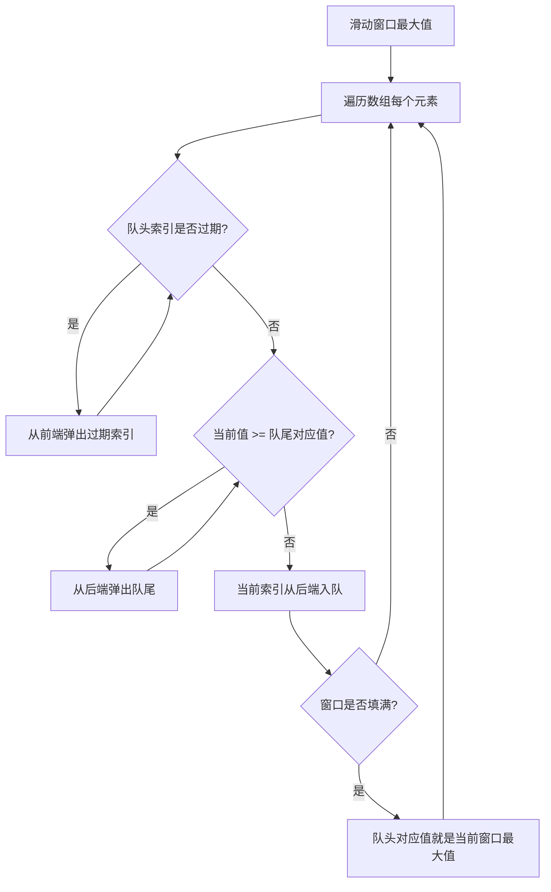

# 双端队列（Deque）

## 1. 算法定位

- **所属分类**：数据结构基础
- **解决的问题**：需要在两端都能高效插入和删除的场景
- **知识树位置**：

```
数据结构基础
├── 数组
├── 链表
├── 栈
├── 队列
├── 双端队列 ◀ 当前位置
├── 哈希表
├── 堆
└── 并查集
```

双端队列（Double-Ended Queue，简称 Deque）是栈和队列的统一体。它可以同时充当栈（LIFO）和队列（FIFO），是滑动窗口最大值等高级算法的基础。

## 2. 一句话理解

> 双端队列就是"两头都能进出的管道"——前面能加能减，后面也能加能减。

## 3. 生活化比喻

想象一条 **双向通行的隧道**：

- 车可以从隧道的**左边**进入，也可以从**右边**进入。
- 车可以从隧道的**左边**出去，也可以从**右边**出去。
- 普通队列就像单行道（左进右出），而双端队列是双向通行的。

再想想 **扑克牌手牌**：
- 你可以在手牌的左边或右边插入一张新牌。
- 你也可以从左边或右边打出一张牌。

## 4. 核心思想

### 双端队列 = 栈 + 队列

| 操作限制 | 等价于 |
|----------|--------|
| 只在一端操作（后进先出） | **栈** |
| 一端进另一端出（先进先出） | **队列** |
| 两端都能进出 | **双端队列** |

### 核心操作

- `AddFirst(item)`：从前端插入
- `AddLast(item)`：从后端插入
- `RemoveFirst()`：从前端删除
- `RemoveLast()`：从后端删除
- `PeekFirst()`：查看前端
- `PeekLast()`：查看后端

### 单调双端队列

双端队列最经典的应用是 **单调队列**：队列中的元素始终保持单调递增或递减。这是解决"滑动窗口最大值/最小值"的利器。

## 5. 图解推演

### 双端队列基本操作

```
初始状态:
    前端                     后端
     ↓                       ↓
    [ 空 ]

AddLast(10):
    前端                     后端
     ↓                       ↓
    [10]

AddLast(20):
    前端                     后端
     ↓                       ↓
    [10] [20]

AddFirst(5):
    前端                     后端
     ↓                       ↓
    [5] [10] [20]

RemoveLast() → 返回 20:
    前端                 后端
     ↓                   ↓
    [5] [10]

RemoveFirst() → 返回 5:
    前端  后端
     ↓    ↓
    [10]
```

### 滑动窗口最大值图解

```
数组: [1, 3, -1, -3, 5, 3, 6, 7]   窗口大小 k=3

窗口位置               窗口内容     最大值    单调队列（存索引）
─────────────────────────────────────────────────────────
[1  3  -1] -3  5  3  6  7    →  3     队列: [1]（索引1对应值3）
 1 [3  -1  -3] 5  3  6  7    →  3     队列: [1]（索引1对应值3）
 1  3 [-1  -3  5] 3  6  7    →  5     队列: [4]（索引4对应值5）
 1  3  -1 [-3  5  3] 6  7    →  5     队列: [4]（索引4对应值5）
 1  3  -1  -3 [5  3  6] 7    →  6     队列: [6]（索引6对应值6）
 1  3  -1  -3  5 [3  6  7]   →  7     队列: [7]（索引7对应值7）

结果: [3, 3, 5, 5, 6, 7]
```

### 单调队列工作原理详解

```
数组: [1, 3, -1, -3, 5]   窗口 k=3
单调队列维护：队列中的值从前到后单调递减

处理 arr[0]=1:
  队列为空，直接加入
  队列（存索引）: [0]    对应值: [1]

处理 arr[1]=3:
  3 > 队尾对应的 1，弹出队尾（1 以后不可能是最大值了）
  加入 3
  队列: [1]              对应值: [3]

处理 arr[2]=-1:
  -1 < 队尾对应的 3，直接加入（-1 可能在 3 滑出后成为最大值）
  队列: [1, 2]           对应值: [3, -1]
  窗口满了！队头就是最大值 → 最大值 = arr[1] = 3

处理 arr[3]=-3:
  检查队头：索引 1 在窗口 [1,3] 内，不过期
  -3 < 队尾对应的 -1，直接加入
  队列: [1, 2, 3]        对应值: [3, -1, -3]
  队头就是最大值 → 最大值 = arr[1] = 3

处理 arr[4]=5:
  检查队头：索引 1 不在窗口 [2,4] 内，过期弹出
  队列: [2, 3]            对应值: [-1, -3]
  5 > 队尾 -3，弹出；5 > 队尾 -1，弹出
  队列为空，加入 5
  队列: [4]               对应值: [5]
  队头就是最大值 → 最大值 = arr[4] = 5
```

### Mermaid 流程图



## 6. 执行步骤

### 滑动窗口最大值算法步骤

1. 创建一个双端队列，存储**数组索引**（不是值）
2. 遍历数组中的每个元素：
   - **清理过期**：如果队头索引不在当前窗口范围内，从前端弹出
   - **维护单调性**：如果当前值 >= 队尾索引对应的值，从后端弹出（因为它们不可能是后续窗口的最大值）
   - **入队**：将当前索引从后端加入
   - **记录结果**：如果已形成完整窗口，队头索引对应的值就是最大值

## 7. C# 实现

### 基础版：用双向链表实现双端队列

```csharp
/// <summary>
/// 手写双端队列，基于双向链表实现
/// 所有操作均为 O(1)
/// </summary>
public class MyDeque<T>
{
    /// <summary>双向链表节点</summary>
    private class Node
    {
        public T Value;
        public Node? Prev;
        public Node? Next;
        public Node(T value) { Value = value; }
    }

    private Node? _head; // 前端节点
    private Node? _tail; // 后端节点
    private int _count;

    public MyDeque()
    {
        _head = null;
        _tail = null;
        _count = 0;
    }

    public int Count => _count;
    public bool IsEmpty => _count == 0;

    /// <summary>
    /// 从前端插入元素
    /// 时间复杂度：O(1)
    /// </summary>
    public void AddFirst(T item)
    {
        Node newNode = new Node(item);

        if (IsEmpty)
        {
            // 第一个元素，既是头也是尾
            _head = _tail = newNode;
        }
        else
        {
            // 新节点接在头部前面
            newNode.Next = _head;
            _head!.Prev = newNode;
            _head = newNode;
        }
        _count++;
    }

    /// <summary>
    /// 从后端插入元素
    /// 时间复杂度：O(1)
    /// </summary>
    public void AddLast(T item)
    {
        Node newNode = new Node(item);

        if (IsEmpty)
        {
            _head = _tail = newNode;
        }
        else
        {
            // 新节点接在尾部后面
            newNode.Prev = _tail;
            _tail!.Next = newNode;
            _tail = newNode;
        }
        _count++;
    }

    /// <summary>
    /// 从前端删除并返回元素
    /// 时间复杂度：O(1)
    /// </summary>
    public T RemoveFirst()
    {
        if (IsEmpty)
            throw new InvalidOperationException("双端队列为空");

        T value = _head!.Value;

        if (_count == 1)
        {
            // 只有一个元素，删除后队列为空
            _head = _tail = null;
        }
        else
        {
            _head = _head.Next;
            _head!.Prev = null;
        }
        _count--;
        return value;
    }

    /// <summary>
    /// 从后端删除并返回元素
    /// 时间复杂度：O(1)
    /// </summary>
    public T RemoveLast()
    {
        if (IsEmpty)
            throw new InvalidOperationException("双端队列为空");

        T value = _tail!.Value;

        if (_count == 1)
        {
            _head = _tail = null;
        }
        else
        {
            _tail = _tail.Prev;
            _tail!.Next = null;
        }
        _count--;
        return value;
    }

    /// <summary>查看前端元素</summary>
    public T PeekFirst()
    {
        if (IsEmpty) throw new InvalidOperationException("双端队列为空");
        return _head!.Value;
    }

    /// <summary>查看后端元素</summary>
    public T PeekLast()
    {
        if (IsEmpty) throw new InvalidOperationException("双端队列为空");
        return _tail!.Value;
    }
}
```

### 实战应用：滑动窗口最大值

```csharp
using System;
using System.Collections.Generic;

/// <summary>
/// 滑动窗口最大值
/// LeetCode 第 239 题：给定数组和窗口大小 k，返回每个窗口中的最大值
/// 这是单调队列的经典应用
/// </summary>
public class SlidingWindowMax
{
    /// <summary>
    /// 使用单调双端队列求滑动窗口最大值
    /// 时间复杂度：O(n)，每个元素最多入队和出队各一次
    /// 空间复杂度：O(k)，队列最多存 k 个元素
    /// </summary>
    /// <param name="nums">输入数组</param>
    /// <param name="k">窗口大小</param>
    /// <returns>每个窗口的最大值数组</returns>
    public static int[] MaxSlidingWindow(int[] nums, int k)
    {
        if (nums == null || nums.Length == 0 || k <= 0)
            return Array.Empty<int>();

        int n = nums.Length;
        int[] result = new int[n - k + 1]; // 结果数组大小 = n - k + 1
        int resultIndex = 0;

        // 双端队列存储的是数组索引（不是值）
        // 队列中索引对应的值从前到后单调递减
        // 这样队头永远是当前窗口的最大值索引
        LinkedList<int> deque = new LinkedList<int>();

        for (int i = 0; i < n; i++)
        {
            // 第一步：清理过期元素
            // 如果队头索引已经不在当前窗口范围 [i-k+1, i] 内，弹出
            while (deque.Count > 0 && deque.First!.Value < i - k + 1)
            {
                deque.RemoveFirst();
            }

            // 第二步：维护单调递减性
            // 如果当前值 >= 队尾索引对应的值，弹出队尾
            // 因为那些较小的值在当前值存在时不可能成为最大值
            while (deque.Count > 0 && nums[deque.Last!.Value] <= nums[i])
            {
                deque.RemoveLast();
            }

            // 第三步：当前索引入队
            deque.AddLast(i);

            // 第四步：记录结果
            // 当 i >= k-1 时，窗口已经填满，可以开始记录最大值
            if (i >= k - 1)
            {
                result[resultIndex++] = nums[deque.First!.Value];
            }
        }

        return result;
    }

    /// <summary>
    /// 演示方法
    /// </summary>
    public static void Main()
    {
        int[] nums = { 1, 3, -1, -3, 5, 3, 6, 7 };
        int k = 3;

        int[] maxValues = MaxSlidingWindow(nums, k);

        Console.Write("输入数组: ");
        Console.WriteLine(string.Join(", ", nums));
        Console.WriteLine($"窗口大小: {k}");
        Console.Write("每个窗口最大值: ");
        Console.WriteLine(string.Join(", ", maxValues));
        // 输出: 3, 3, 5, 5, 6, 7
    }
}
```

### 使用 C# 内置 LinkedList 作为双端队列

```csharp
using System;
using System.Collections.Generic;

/// <summary>
/// C# 没有专门的 Deque 类，但 LinkedList<T> 天然支持双端操作
/// </summary>
public class DequeDemo
{
    public static void Main()
    {
        // LinkedList<T> 是双向链表，天然支持双端操作
        LinkedList<int> deque = new LinkedList<int>();

        // 前端操作
        deque.AddFirst(10);  // 前端插入
        deque.AddFirst(5);   // 前端插入

        // 后端操作
        deque.AddLast(20);   // 后端插入
        deque.AddLast(25);   // 后端插入

        // 此时: 5 <-> 10 <-> 20 <-> 25

        // 查看两端
        Console.WriteLine($"前端: {deque.First!.Value}"); // 5
        Console.WriteLine($"后端: {deque.Last!.Value}");  // 25

        // 从前端移除
        deque.RemoveFirst(); // 移除 5
        // 从后端移除
        deque.RemoveLast();  // 移除 25

        // 此时: 10 <-> 20
        foreach (int val in deque)
        {
            Console.Write($"{val} "); // 10 20
        }
        Console.WriteLine();
    }
}
```

## 8. 示例演示

```
滑动窗口最大值完整推演:
数组 = [1, 3, -1, -3, 5, 3, 6, 7], k = 3

i=0, nums[0]=1:
  队列为空，索引 0 入队
  队列: [0]  对应值: [1]
  窗口未满，不记录

i=1, nums[1]=3:
  3 > 队尾值 1(索引0)，弹出队尾
  队列: []
  索引 1 入队
  队列: [1]  对应值: [3]
  窗口未满，不记录

i=2, nums[2]=-1:
  -1 < 队尾值 3(索引1)，直接入队
  队列: [1, 2]  对应值: [3, -1]
  窗口 [0,2] 满了！最大值 = nums[队头] = nums[1] = 3 ✓

i=3, nums[3]=-3:
  队头索引 1 >= i-k+1=1，未过期
  -3 < 队尾值 -1(索引2)，直接入队
  队列: [1, 2, 3]  对应值: [3, -1, -3]
  窗口 [1,3] 最大值 = nums[1] = 3 ✓

i=4, nums[4]=5:
  队头索引 1 < i-k+1=2，过期！弹出队头
  队列: [2, 3]  对应值: [-1, -3]
  5 > 队尾值 -3(索引3)，弹出；5 > 队尾值 -1(索引2)，弹出
  队列: []
  索引 4 入队
  队列: [4]  对应值: [5]
  窗口 [2,4] 最大值 = nums[4] = 5 ✓

i=5, nums[5]=3:
  3 < 队尾值 5(索引4)，直接入队
  队列: [4, 5]  对应值: [5, 3]
  窗口 [3,5] 最大值 = nums[4] = 5 ✓

i=6, nums[6]=6:
  6 > 队尾值 3(索引5)，弹出；6 > 队尾值 5(索引4)，弹出
  队列: []
  索引 6 入队
  队列: [6]  对应值: [6]
  窗口 [4,6] 最大值 = nums[6] = 6 ✓

i=7, nums[7]=7:
  7 > 队尾值 6(索引6)，弹出
  队列: []
  索引 7 入队
  队列: [7]  对应值: [7]
  窗口 [5,7] 最大值 = nums[7] = 7 ✓

最终结果: [3, 3, 5, 5, 6, 7]
```

## 9. 复杂度分析

### 双端队列基本操作

| 操作 | 时间复杂度 | 说明 |
|------|-----------|------|
| AddFirst | **O(1)** | 前端插入 |
| AddLast | **O(1)** | 后端插入 |
| RemoveFirst | **O(1)** | 前端删除 |
| RemoveLast | **O(1)** | 后端删除 |
| PeekFirst/PeekLast | **O(1)** | 两端查看 |
| 空间复杂度 | O(n) | 存储 n 个元素 |

### 滑动窗口最大值

| 指标 | 复杂度 | 说明 |
|------|--------|------|
| 时间复杂度 | **O(n)** | 每个元素最多入队一次出队一次 |
| 空间复杂度 | **O(k)** | 队列最多存 k 个索引 |

**通俗理解**：
- 虽然有嵌套的 while 循环，但每个元素最多进队一次出队一次，总操作不超过 2n，所以是 O(n)。
- 暴力法需要 O(n*k)，单调队列优化到 O(n)，当 k 很大时提升巨大。

## 10. 易错点

1. **队列存索引还是存值**：滑动窗口问题中，队列必须存**索引**，因为需要判断元素是否过期出窗口。

2. **单调方向搞混**：求最大值用单调递减队列（队头最大），求最小值用单调递增队列（队头最小）。

3. **判断过期条件**：`deque.First < i - k + 1` 表示过期，注意是严格小于，等于时还在窗口内。

4. **维护单调性时用 `<=` 还是 `<`**：一般用 `<=`（等于时也弹出），保证队列中没有重复的无用元素。

5. **忘记在窗口未满时不记录结果**：前 k-1 个元素还不构成完整窗口，不能记录最大值。

## 11. 相似数据结构对比

| 特性 | 双端队列 | 栈 | 队列 | 单调栈 | 单调队列 |
|------|---------|-----|------|--------|---------|
| 操作端 | 两端 | 一端 | 两端（一进一出） | 一端 | 两端 |
| 内部顺序 | 无约束 | 无约束 | 无约束 | 单调 | 单调 |
| 典型应用 | 通用双端操作 | DFS/括号匹配 | BFS | 下一个更大元素 | 滑动窗口极值 |
| 时间复杂度 | O(1) 两端操作 | O(1) 单端 | O(1) 两端 | 均摊 O(1) | 均摊 O(1) |

## 12. 前置知识与延伸学习

### 前置知识
- 链表（双端队列的底层实现）
- 栈和队列（双端队列是它们的泛化）

### 延伸学习
- **单调栈**：维护单调性的栈，解决"下一个更大元素"
- **优先队列/堆**：更复杂的"有序出队"结构
- **滑动窗口技巧**：双指针 + 单调队列的组合
- **区间最值查询**：稀疏表、线段树等更高级结构

## 13. 记忆口诀

> **"双端队列两头通，加减两边都能用；单调队列去废物，滑窗极值一遍清。"**

## 14. 面试常问点

1. **滑动窗口最大值（LeetCode 239）**
   - 使用单调递减双端队列，O(n) 时间解决。

2. **双端队列和队列的区别？**
   - 队列只能一端进另一端出，双端队列两端都能进出。

3. **C# 中如何实现双端队列？**
   - 使用 `LinkedList<T>`，它提供 `AddFirst/AddLast/RemoveFirst/RemoveLast` 全部 O(1) 操作。

4. **单调队列的时间复杂度为什么是 O(n)？**
   - 每个元素最多入队一次出队一次，总操作 2n，均摊到每个元素 O(1)。

5. **双端队列能用数组实现吗？**
   - 可以，用循环数组实现，头尾指针分别管理两端。

## 15. 一页总结

```
╔══════════════════════════════════════════════════════╗
║              双端队列 Deque                           ║
╠══════════════════════════════════════════════════════╣
║  核心特征：两端都能插入和删除，O(1) 操作               ║
║                                                        ║
║  四大操作：                                            ║
║    AddFirst / RemoveFirst → 前端增删                   ║
║    AddLast  / RemoveLast  → 后端增删                   ║
║                                                        ║
║  它是栈和队列的超集：                                   ║
║    只用一端 → 栈                                       ║
║    一端进另一端出 → 队列                                ║
║                                                        ║
║  C# 对应：LinkedList<T>                                ║
║                                                        ║
║  杀手级应用——单调队列：                                 ║
║    队列中元素保持单调递减（或递增）                      ║
║    滑动窗口最大值/最小值 O(n) 搞定                      ║
║    核心思路：新元素入队前，弹出所有不如它的旧元素         ║
║                                                        ║
║  记住：双端队列 = 两头通的管道                          ║
║        单调队列 = 只留有用的，踢掉废物                   ║
╚══════════════════════════════════════════════════════╝
```
