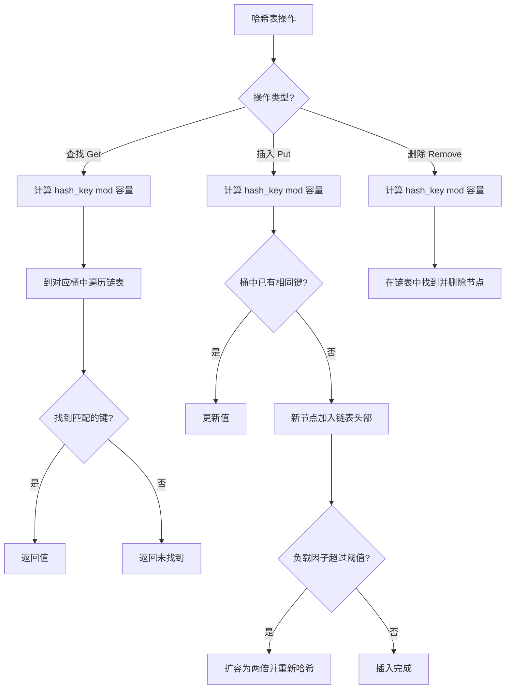

# 哈希表（HashTable）

## 1. 算法定位

- **所属分类**：数据结构基础
- **解决的问题**：需要根据"键"快速查找、插入、删除"值"的场景
- **知识树位置**：

```
数据结构基础
├── 数组
├── 链表
├── 栈
├── 队列
├── 双端队列
├── 哈希表 ◀ 当前位置
├── 堆
└── 并查集
```

哈希表是编程中使用频率最高的数据结构之一。它通过哈希函数将键映射到数组索引，实现接近 O(1) 的查找效率。C# 中的 `Dictionary<TKey, TValue>` 和 `HashSet<T>` 都是基于哈希表实现的。

## 2. 一句话理解

> 哈希表就是一个"超级电话簿"——告诉我名字（键），我立刻告诉你电话号码（值），不需要一页一页翻。

## 3. 生活化比喻

想象一个 **图书馆的分类索引系统**：

- 每本书有一个唯一的书名（**键 Key**）。
- 图书馆有 100 个书架（**数组**）。
- 有一个规则：把书名的笔画数除以 100 取余数，得到的数字就是这本书放在第几号书架（**哈希函数**）。
- 你想找《红楼梦》？算一下笔画数对 100 取余，直接走到那个书架，而不是从第 1 个书架开始一个个找。
- 有时候两本书算出来的书架号一样（**哈希冲突**），就在同一个书架上用小标签区分。

## 4. 核心思想

### 哈希函数：键到索引的映射

```
键 (Key)  →  哈希函数  →  哈希值 (Hash Code)  →  取模  →  数组索引
"apple"   →  hash()    →  96354               →  % 8   →  2
```

一个好的哈希函数应该：
1. **计算快**：O(1) 时间
2. **分布均匀**：尽量让不同的键映射到不同的索引
3. **确定性**：相同的键总是得到相同的哈希值

### 哈希冲突：两个不同的键映射到了同一个索引

两种主流解决方案：

#### 方案一：链地址法（Chaining）
每个数组位置存一个链表，冲突的元素串在一起。

```
索引 0: → [("cat", 3)] → [("dog", 5)] → null
索引 1: → null
索引 2: → [("apple", 1)] → null
索引 3: → [("banana", 2)] → [("cherry", 7)] → null
```

#### 方案二：开放寻址法（Open Addressing）
冲突时向后探测空位，找到空位就放进去。

```
索引 0: ("cat", 3)
索引 1: 空
索引 2: ("apple", 1)
索引 3: ("banana", 2)    ← 本来 "cherry" 也映射到 3
索引 4: ("cherry", 7)    ← 冲突了，往后探测到索引 4 放入
```

## 5. 图解推演

### 哈希表基本结构（链地址法）

```
哈希表（容量=8）

索引    桶（Bucket）
 0  → [空]
 1  → ["ace":100] → ["ink":400] → null
 2  → ["bag":200] → null
 3  → [空]
 4  → ["cup":300] → null
 5  → [空]
 6  → [空]
 7  → ["dog":500] → null

查找 "ink":
  1. hash("ink") % 8 = 1
  2. 到索引 1 的链表中找
  3. "ace" ≠ "ink"，继续
  4. "ink" == "ink"，找到！返回 400
```

### 插入过程图解

```
初始状态（容量=4）:
[0] → null
[1] → null
[2] → null
[3] → null

插入 ("apple", 1):  hash("apple") % 4 = 2
[0] → null
[1] → null
[2] → ["apple":1] → null
[3] → null

插入 ("banana", 2):  hash("banana") % 4 = 3
[0] → null
[1] → null
[2] → ["apple":1] → null
[3] → ["banana":2] → null

插入 ("cherry", 7):  hash("cherry") % 4 = 2  ← 冲突！和 apple 同索引
[0] → null
[1] → null
[2] → ["apple":1] → ["cherry":7] → null   ← 链到 apple 后面
[3] → ["banana":2] → null
```

### 扩容过程图解

```
当负载因子（元素数/容量）超过阈值时，扩容并重新哈希

扩容前（容量=4，3个元素，负载因子=0.75）:
[0] → null
[1] → null
[2] → ["apple":1] → ["cherry":7]
[3] → ["banana":2]

扩容后（容量=8，重新计算所有元素的位置）:
[0] → null
[1] → null
[2] → ["apple":1]   ← hash("apple") % 8 = 2
[3] → null
[4] → null
[5] → ["cherry":7]  ← hash("cherry") % 8 = 5（位置变了！）
[6] → ["banana":2]  ← hash("banana") % 8 = 6（位置也变了！）
[7] → null
```

### Mermaid 流程图



## 6. 执行步骤

### 插入操作（Put）
1. 计算键的哈希值：`hashCode = key.GetHashCode()`
2. 计算数组索引：`index = hashCode % capacity`
3. 在该索引的链表中查找是否已有该键
4. 如果有，更新值
5. 如果没有，在链表头部插入新节点
6. 检查负载因子，必要时扩容

### 查找操作（Get）
1. 计算键的哈希值和数组索引
2. 在该索引的链表中逐个比较键
3. 找到则返回对应的值，否则返回未找到

### 删除操作（Remove）
1. 计算键的哈希值和数组索引
2. 在该索引的链表中找到对应节点
3. 从链表中删除该节点

## 7. C# 实现

### 基础版：手写哈希表（链地址法）

```csharp
using System;
using System.Collections.Generic;

/// <summary>
/// 手写哈希表，使用链地址法解决冲突
/// 帮助理解 Dictionary<TKey, TValue> 的底层原理
/// </summary>
public class MyHashTable<TKey, TValue> where TKey : notnull
{
    /// <summary>
    /// 链表节点：存储键值对
    /// </summary>
    private class Entry
    {
        public TKey Key;
        public TValue Value;
        public Entry? Next; // 指向同一桶中的下一个节点

        public Entry(TKey key, TValue value)
        {
            Key = key;
            Value = value;
            Next = null;
        }
    }

    private Entry?[] _buckets;        // 桶数组（每个桶是一条链表）
    private int _count;               // 当前元素个数
    private const double LoadFactor = 0.75; // 负载因子阈值

    public MyHashTable(int capacity = 16)
    {
        _buckets = new Entry?[capacity];
        _count = 0;
    }

    public int Count => _count;

    /// <summary>
    /// 计算键对应的桶索引
    /// </summary>
    private int GetBucketIndex(TKey key)
    {
        // GetHashCode() 可能返回负数，用 & 0x7FFFFFFF 取绝对值
        int hash = key.GetHashCode() & 0x7FFFFFFF;
        return hash % _buckets.Length;
    }

    /// <summary>
    /// 插入或更新键值对
    /// 平均时间复杂度：O(1)
    /// </summary>
    public void Put(TKey key, TValue value)
    {
        int index = GetBucketIndex(key);

        // 在链表中查找是否已有该键
        Entry? current = _buckets[index];
        while (current != null)
        {
            if (current.Key.Equals(key))
            {
                // 键已存在，更新值
                current.Value = value;
                return;
            }
            current = current.Next;
        }

        // 键不存在，在链表头部插入新节点（头插法，O(1)）
        Entry newEntry = new Entry(key, value);
        newEntry.Next = _buckets[index];
        _buckets[index] = newEntry;
        _count++;

        // 检查是否需要扩容
        if ((double)_count / _buckets.Length > LoadFactor)
        {
            Resize();
        }
    }

    /// <summary>
    /// 根据键获取值
    /// 平均时间复杂度：O(1)
    /// </summary>
    public TValue Get(TKey key)
    {
        int index = GetBucketIndex(key);

        Entry? current = _buckets[index];
        while (current != null)
        {
            if (current.Key.Equals(key))
                return current.Value;
            current = current.Next;
        }

        throw new KeyNotFoundException($"键 '{key}' 不存在");
    }

    /// <summary>
    /// 尝试获取值，不抛异常
    /// </summary>
    public bool TryGet(TKey key, out TValue? value)
    {
        int index = GetBucketIndex(key);

        Entry? current = _buckets[index];
        while (current != null)
        {
            if (current.Key.Equals(key))
            {
                value = current.Value;
                return true;
            }
            current = current.Next;
        }

        value = default;
        return false;
    }

    /// <summary>
    /// 删除指定键的键值对
    /// 平均时间复杂度：O(1)
    /// </summary>
    public bool Remove(TKey key)
    {
        int index = GetBucketIndex(key);

        Entry? prev = null;
        Entry? current = _buckets[index];

        while (current != null)
        {
            if (current.Key.Equals(key))
            {
                // 找到了，从链表中删除
                if (prev == null)
                {
                    // 是链表头节点
                    _buckets[index] = current.Next;
                }
                else
                {
                    // 跳过当前节点
                    prev.Next = current.Next;
                }
                _count--;
                return true;
            }
            prev = current;
            current = current.Next;
        }

        return false; // 键不存在
    }

    /// <summary>
    /// 检查是否包含指定键
    /// </summary>
    public bool ContainsKey(TKey key)
    {
        int index = GetBucketIndex(key);
        Entry? current = _buckets[index];
        while (current != null)
        {
            if (current.Key.Equals(key))
                return true;
            current = current.Next;
        }
        return false;
    }

    /// <summary>
    /// 扩容：容量翻倍，所有元素重新哈希
    /// </summary>
    private void Resize()
    {
        int newCapacity = _buckets.Length * 2;
        Entry?[] newBuckets = new Entry?[newCapacity];

        // 遍历所有旧桶，将每个元素重新哈希到新桶中
        for (int i = 0; i < _buckets.Length; i++)
        {
            Entry? current = _buckets[i];
            while (current != null)
            {
                Entry? next = current.Next; // 先暂存下一个

                // 重新计算在新数组中的位置
                int newIndex = (current.Key.GetHashCode() & 0x7FFFFFFF) % newCapacity;

                // 头插法插入新桶
                current.Next = newBuckets[newIndex];
                newBuckets[newIndex] = current;

                current = next;
            }
        }

        _buckets = newBuckets;
    }
}
```

### 实战应用：两数之和（LeetCode 第 1 题）

```csharp
using System;
using System.Collections.Generic;

/// <summary>
/// 两数之和：在数组中找到两个数，使它们的和等于目标值
/// 这是哈希表最经典的应用之一
/// </summary>
public class TwoSum
{
    /// <summary>
    /// 方法：一次遍历 + 哈希表
    /// 思路：遍历数组，对于每个数 num，检查 target-num 是否已在哈希表中
    /// 时间复杂度：O(n)
    /// 空间复杂度：O(n)
    /// </summary>
    public static int[] FindTwoSum(int[] nums, int target)
    {
        // 键：数组中的值，值：该值的索引
        Dictionary<int, int> map = new Dictionary<int, int>();

        for (int i = 0; i < nums.Length; i++)
        {
            int complement = target - nums[i]; // 需要的"互补数"

            // 检查互补数是否已经在哈希表中
            if (map.ContainsKey(complement))
            {
                // 找到了！返回两个数的索引
                return new int[] { map[complement], i };
            }

            // 将当前数存入哈希表，供后续元素查找
            // 注意：先查后存，避免同一元素用两次
            map[nums[i]] = i;
        }

        throw new ArgumentException("无解");
    }

    /// <summary>演示</summary>
    public static void Main()
    {
        int[] nums = { 2, 7, 11, 15 };
        int target = 9;
        int[] result = FindTwoSum(nums, target);
        Console.WriteLine($"索引: [{result[0]}, {result[1]}]"); // [0, 1]
    }
}
```

### 实战应用：字母异位词分组

```csharp
using System;
using System.Collections.Generic;
using System.Linq;

/// <summary>
/// 字母异位词分组（LeetCode 第 49 题）
/// 将具有相同字母组成的单词归为一组
/// </summary>
public class GroupAnagrams
{
    /// <summary>
    /// 思路：将每个单词排序后作为键，具有相同排序结果的单词是异位词
    /// 时间复杂度：O(n * k * log k)，n 是单词数，k 是最长单词长度
    /// </summary>
    public static IList<IList<string>> Group(string[] strs)
    {
        // 键：排序后的字符串，值：具有相同排序结果的所有原始字符串
        Dictionary<string, IList<string>> map = new Dictionary<string, IList<string>>();

        foreach (string s in strs)
        {
            // 将字符排序后作为键
            // "eat" → "aet"，"tea" → "aet"，它们是异位词
            char[] chars = s.ToCharArray();
            Array.Sort(chars);
            string key = new string(chars);

            // 如果键不存在，创建新列表
            if (!map.ContainsKey(key))
            {
                map[key] = new List<string>();
            }

            // 将原始字符串加入对应的组
            map[key].Add(s);
        }

        // 返回所有分组
        return new List<IList<string>>(map.Values);
    }
}
```

### 使用 C# 内置 Dictionary 和 HashSet

```csharp
using System;
using System.Collections.Generic;

public class HashTableDemo
{
    public static void Main()
    {
        // ===== Dictionary<TKey, TValue>：键值对哈希表 =====
        Dictionary<string, int> scores = new Dictionary<string, int>();

        // 添加
        scores["张三"] = 95;
        scores["李四"] = 87;
        scores.Add("王五", 92); // 键已存在时会抛异常

        // 查找
        if (scores.TryGetValue("张三", out int score))
        {
            Console.WriteLine($"张三的成绩: {score}"); // 95
        }

        // 检查是否存在
        Console.WriteLine($"包含李四: {scores.ContainsKey("李四")}"); // True

        // 删除
        scores.Remove("王五");

        // 遍历
        foreach (var kvp in scores)
        {
            Console.WriteLine($"{kvp.Key}: {kvp.Value}");
        }

        // ===== HashSet<T>：只有键没有值的哈希表 =====
        HashSet<int> set = new HashSet<int>();

        set.Add(1);
        set.Add(2);
        set.Add(3);
        set.Add(2); // 重复元素不会加入

        Console.WriteLine($"集合大小: {set.Count}"); // 3
        Console.WriteLine($"包含 2: {set.Contains(2)}"); // True

        // 集合运算
        HashSet<int> other = new HashSet<int> { 2, 3, 4 };
        set.IntersectWith(other); // 交集: {2, 3}
    }
}
```

## 8. 示例演示

```
两数之和完整推演:
nums = [2, 7, 11, 15], target = 9

i=0, nums[0]=2:
  complement = 9 - 2 = 7
  哈希表中没有 7
  存入: {2: 0}

i=1, nums[1]=7:
  complement = 9 - 7 = 2
  哈希表中有 2！ 索引为 0
  返回 [0, 1]

结果: 索引 0 (值为2) 和索引 1 (值为7) 之和 = 9
```

## 9. 复杂度分析

| 操作 | 平均时间 | 最坏时间 | 说明 |
|------|---------|---------|------|
| 查找 | **O(1)** | O(n) | 最坏所有键都冲突，退化为链表 |
| 插入 | **O(1)** | O(n) | 最坏需要扩容 + 全部重新哈希 |
| 删除 | **O(1)** | O(n) | 最坏遍历整条链 |
| 空间复杂度 | **O(n)** | O(n) | 存储 n 个键值对 |

**通俗理解**：
- **平均 O(1)** 的含义：在好的哈希函数和适当负载因子下，每个桶的链表长度接近 1，查找一步到位。
- **最坏 O(n)** 的含义：如果哈希函数极差，所有键都映射到同一个桶，退化为在链表中线性查找。
- **为什么说是 O(1)**：实际使用中，好的哈希函数+及时扩容，冲突极少，近似 O(1)。

## 10. 易错点

1. **键的 `GetHashCode` 和 `Equals` 不一致**：如果两个对象 `Equals` 返回 `true`，它们的 `GetHashCode` 必须返回相同值。反之不然。自定义类作为键时必须同时重写这两个方法。

2. **遍历中修改字典**：在 `foreach` 中增删字典元素会抛异常。需要先收集要修改的键，再单独操作。

3. **混淆 `[]` 和 `Add`**：`dict[key] = value` 是"有则更新，无则添加"；`dict.Add(key, value)` 在键已存在时会抛异常。

4. **负载因子过高**：不控制负载因子，冲突增多，性能退化为 O(n)。C# 的 `Dictionary` 内部自动管理扩容。

5. **可变对象作为键**：如果键对象在放入字典后被修改，其哈希值改变，导致再也找不到该键。键最好使用不可变类型（`string`、`int` 等）。

## 11. 相似数据结构对比

| 特性 | Dictionary | HashSet | SortedDictionary | List 线性查找 |
|------|-----------|---------|------------------|-------------|
| 存储内容 | 键值对 | 仅键 | 键值对（有序） | 元素 |
| 查找 | **O(1)** | **O(1)** | O(log n) | O(n) |
| 插入 | **O(1)** | **O(1)** | O(log n) | O(1) |
| 是否有序 | 否 | 否 | **是** | 否 |
| 底层实现 | 哈希表 | 哈希表 | 红黑树 | 数组 |
| 适用场景 | 快速键值查找 | 快速去重/判重 | 需要有序遍历 | 数据量小 |

## 12. 前置知识与延伸学习

### 前置知识
- 数组（哈希表的底层存储）
- 链表（链地址法需要）
- 取模运算

### 延伸学习
- **一致性哈希**：分布式系统中的数据分片
- **布隆过滤器**：空间高效的概率判重
- **LRU 缓存**：哈希表 + 双向链表
- **哈希查找**：查找算法体系中的重要成员
- **字符串哈希**：Rabin-Karp 算法

## 13. 记忆口诀

> **"哈希一算定位快，键值配对秒查来；冲突拉链或探测，负载过高要扩开。"**

## 14. 面试常问点

1. **HashMap 和 HashTable 的区别？**（Java 常问，C# 类似）
   - `Dictionary` 是泛型的、非线程安全的；`Hashtable` 是非泛型的、线程安全的（已过时）。

2. **哈希冲突的解决方法？**
   - 链地址法（每个桶一条链表）和开放寻址法（线性探测/二次探测/双重哈希）。

3. **什么时候用 Dictionary，什么时候用 SortedDictionary？**
   - 不需要有序就用 `Dictionary`（O(1)），需要按键排序就用 `SortedDictionary`（O(log n)）。

4. **如何设计一个好的哈希函数？**
   - 分布均匀、计算快速、对不同输入敏感。

5. **两数之和为什么用哈希表？**
   - 暴力法 O(n^2)，哈希表将"查找互补数"从 O(n) 优化到 O(1)，总体 O(n)。

## 15. 一页总结

```
╔══════════════════════════════════════════════════════════╗
║                  哈希表 HashTable                          ║
╠══════════════════════════════════════════════════════════╣
║  核心原理：键 → 哈希函数 → 数组索引 → 值                    ║
║                                                            ║
║  平均复杂度：查找/插入/删除 全部 O(1)                        ║
║  最坏复杂度：O(n)（全部冲突时退化为链表）                     ║
║                                                            ║
║  冲突解决：                                                 ║
║    链地址法 → 每个桶挂链表（C# Dictionary 使用）              ║
║    开放寻址法 → 冲突时探测下一个空位                          ║
║                                                            ║
║  扩容：负载因子超过阈值时，容量翻倍并重新哈希                  ║
║                                                            ║
║  C# 对应：                                                  ║
║    Dictionary<TKey, TValue> → 键值对                        ║
║    HashSet<T> → 仅存键的集合                                ║
║                                                            ║
║  经典应用：                                                  ║
║    ① 两数之和（O(n) 秒解）                                  ║
║    ② 字母异位词分组                                          ║
║    ③ 缓存系统（LRU）                                        ║
║    ④ 去重 / 判重                                             ║
║                                                            ║
║  记住：哈希表 = 超级电话簿，报名字立刻查号码                   ║
╚══════════════════════════════════════════════════════════╝
```
