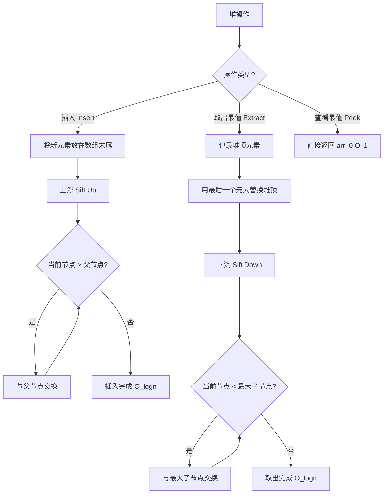

# 堆（Heap）

## 1. 算法定位

- **所属分类**：数据结构基础
- **解决的问题**：需要高效获取最大值/最小值，并支持动态插入的场景
- **知识树位置**：

```
数据结构基础
├── 数组
├── 链表
├── 栈
├── 队列
├── 双端队列
├── 哈希表
├── 堆 ◀ 当前位置
└── 并查集
```

堆是一种特殊的完全二叉树，用数组存储，支持 O(log n) 的插入和 O(log n) 的取出最值。它是优先队列的底层实现，也是堆排序、TopK、合并K个有序链表等问题的核心。

## 2. 一句话理解

> 堆就是一个"自动排好老大"的树——树顶永远是最大（或最小）的那个，取走老大后能迅速选出新老大。

## 3. 生活化比喻

想象一家公司的 **组织架构**：

- **最大堆**：像公司管理层——总裁在最顶上，每个经理都比自己的下属工资高。你想知道工资最高的人？看树顶就行（O(1)）。总裁离职了？从下属中选能力最强的人往上补，逐级递补（O(log n)）。
- **最小堆**：像急诊室排队——病情最严重的人排在最前面优先诊治。

## 4. 核心思想

### 堆的两个核心性质

1. **结构性质（完全二叉树）**：除了最后一层，每层都填满；最后一层从左到右填充。
2. **有序性质（堆序性）**：
   - **最大堆**：每个节点 >= 它的两个子节点
   - **最小堆**：每个节点 <= 它的两个子节点

### 用数组存储完全二叉树

因为完全二叉树的节点排列非常规律，可以用数组紧凑存储，无需指针：

```
对于索引 i 的节点（从 0 开始）：
  父节点索引：  (i - 1) / 2
  左子节点索引：2 * i + 1
  右子节点索引：2 * i + 2
```

### 两个核心操作

- **上浮（Sift Up）**：新插入的元素从底部不断与父节点比较，如果更大（最大堆）则交换，直到满足堆序。
- **下沉（Sift Down）**：取出堆顶后，用最后一个元素填补堆顶，然后不断与子节点比较，向下沉到合适位置。

## 5. 图解推演

### 最大堆的数组存储

```
最大堆（树形）:
            50
          /    \
        30      40
       /  \    /
      10   20 35

数组表示:
索引:  [0]  [1]  [2]  [3]  [4]  [5]
值:    50   30   40   10   20   35

索引关系:
  索引 0 (50) 的左子 = 2*0+1 = 1 (30)，右子 = 2*0+2 = 2 (40)
  索引 1 (30) 的左子 = 2*1+1 = 3 (10)，右子 = 2*1+2 = 4 (20)
  索引 2 (40) 的左子 = 2*2+1 = 5 (35)
```

### 插入操作图解：插入 45

```
步骤 1：将 45 放在数组末尾（索引 6）
            50
          /    \
        30      40
       /  \    /  \
      10   20 35   45   ← 新元素

数组: [50, 30, 40, 10, 20, 35, 45]

步骤 2：上浮 - 45 和父节点 40 比较，45 > 40，交换
            50
          /    \
        30      45   ← 上浮了
       /  \    /  \
      10   20 35   40

数组: [50, 30, 45, 10, 20, 35, 40]

步骤 3：上浮 - 45 和父节点 50 比较，45 < 50，停止
            50
          /    \
        30      45   ← 到位了
       /  \    /  \
      10   20 35   40

最终数组: [50, 30, 45, 10, 20, 35, 40]
```

### 取出堆顶（Extract Max）图解

```
步骤 1：取出堆顶 50，用最后一个元素 40 填补
            40   ← 最后一个元素放到堆顶
          /    \
        30      45
       /  \    /
      10   20 35

数组: [40, 30, 45, 10, 20, 35]

步骤 2：下沉 - 40 和子节点比较，45 最大且 45 > 40，交换
            45   ← 45 上来了
          /    \
        30      40   ← 40 下去了
       /  \    /
      10   20 35

步骤 3：下沉 - 40 和子节点比较，35 < 40，停止
            45
          /    \
        30      40   ← 到位了
       /  \    /
      10   20 35

最终数组: [45, 30, 40, 10, 20, 35]
返回值: 50
```

### Mermaid 流程图



## 6. 执行步骤

### 插入（Insert / Push）
1. 将新元素追加到数组末尾
2. 执行上浮（Sift Up）：
   - 将新元素与其父节点比较
   - 如果新元素更大（最大堆），与父节点交换
   - 重复直到到达堆顶或不再大于父节点

### 取出最值（Extract Max/Min）
1. 记录堆顶元素（即最值）
2. 将数组最后一个元素移到堆顶
3. 数组长度减 1
4. 执行下沉（Sift Down）：
   - 将堆顶元素与其较大的子节点比较
   - 如果子节点更大，交换
   - 重复直到到达叶子或不再小于子节点
5. 返回记录的最值

### 建堆（Heapify）
从最后一个非叶子节点开始，对每个节点执行下沉操作。
- 最后一个非叶子节点索引：`n / 2 - 1`
- 从后往前处理，时间复杂度 O(n)

## 7. C# 实现

### 基础版：手写最大堆

```csharp
using System;
using System.Collections.Generic;

/// <summary>
/// 手写最大堆
/// 堆顶始终是最大元素
/// </summary>
public class MaxHeap<T> where T : IComparable<T>
{
    private List<T> _data; // 用动态数组存储堆

    public MaxHeap()
    {
        _data = new List<T>();
    }

    public int Count => _data.Count;
    public bool IsEmpty => _data.Count == 0;

    /// <summary>获取父节点索引</summary>
    private int Parent(int index) => (index - 1) / 2;

    /// <summary>获取左子节点索引</summary>
    private int LeftChild(int index) => 2 * index + 1;

    /// <summary>获取右子节点索引</summary>
    private int RightChild(int index) => 2 * index + 2;

    /// <summary>交换两个位置的元素</summary>
    private void Swap(int i, int j)
    {
        T temp = _data[i];
        _data[i] = _data[j];
        _data[j] = temp;
    }

    /// <summary>
    /// 查看堆顶元素（最大值），不移除
    /// 时间复杂度：O(1)
    /// </summary>
    public T Peek()
    {
        if (IsEmpty)
            throw new InvalidOperationException("堆为空");
        return _data[0];
    }

    /// <summary>
    /// 插入新元素
    /// 时间复杂度：O(log n)
    /// </summary>
    public void Insert(T item)
    {
        // 第一步：将新元素添加到数组末尾（完全二叉树的最后一个位置）
        _data.Add(item);

        // 第二步：上浮，维护堆序性
        SiftUp(_data.Count - 1);
    }

    /// <summary>
    /// 上浮操作：将指定位置的元素向上调整
    /// 从下往上，如果当前节点大于父节点就交换
    /// </summary>
    private void SiftUp(int index)
    {
        // 当还没到堆顶，且当前节点大于父节点时
        while (index > 0 && _data[index].CompareTo(_data[Parent(index)]) > 0)
        {
            Swap(index, Parent(index));
            index = Parent(index); // 继续往上走
        }
    }

    /// <summary>
    /// 取出并返回堆顶元素（最大值）
    /// 时间复杂度：O(log n)
    /// </summary>
    public T ExtractMax()
    {
        if (IsEmpty)
            throw new InvalidOperationException("堆为空");

        // 记录堆顶（最大值）
        T max = _data[0];

        // 将最后一个元素移到堆顶
        _data[0] = _data[_data.Count - 1];
        _data.RemoveAt(_data.Count - 1);

        // 如果堆不为空，执行下沉
        if (!IsEmpty)
            SiftDown(0);

        return max;
    }

    /// <summary>
    /// 下沉操作：将指定位置的元素向下调整
    /// 每次与较大的子节点交换
    /// </summary>
    private void SiftDown(int index)
    {
        while (true)
        {
            int largest = index; // 假设当前节点最大
            int left = LeftChild(index);
            int right = RightChild(index);

            // 如果左子节点存在且大于当前最大
            if (left < _data.Count && _data[left].CompareTo(_data[largest]) > 0)
                largest = left;

            // 如果右子节点存在且大于当前最大
            if (right < _data.Count && _data[right].CompareTo(_data[largest]) > 0)
                largest = right;

            // 如果最大的不是当前节点，需要交换并继续下沉
            if (largest != index)
            {
                Swap(index, largest);
                index = largest; // 继续在子节点位置下沉
            }
            else
            {
                break; // 已满足堆序，停止
            }
        }
    }

    /// <summary>
    /// 从数组建堆（Heapify）
    /// 时间复杂度：O(n)（不是 O(n log n)！）
    /// </summary>
    public static MaxHeap<T> BuildHeap(T[] array)
    {
        MaxHeap<T> heap = new MaxHeap<T>();
        heap._data = new List<T>(array);

        // 从最后一个非叶子节点开始，逐个下沉
        // 最后一个非叶子节点索引 = n/2 - 1
        for (int i = array.Length / 2 - 1; i >= 0; i--)
        {
            heap.SiftDown(i);
        }

        return heap;
    }
}
```

### 实战应用：TopK 问题

```csharp
using System;
using System.Collections.Generic;

/// <summary>
/// 找出数组中最大的 K 个元素
/// 经典的堆应用
/// </summary>
public class TopK
{
    /// <summary>
    /// 方法：维护一个大小为 K 的最小堆
    /// 思路：
    ///   - 用最小堆保存当前见过的最大的 K 个元素
    ///   - 堆顶是这 K 个元素中最小的
    ///   - 新元素如果比堆顶大，替换堆顶并调整
    ///   - 最终堆中就是最大的 K 个元素
    ///
    /// 时间复杂度：O(n log k)
    /// 空间复杂度：O(k)
    /// </summary>
    public static int[] FindTopK(int[] nums, int k)
    {
        // C# 的 PriorityQueue 默认是最小堆
        PriorityQueue<int, int> minHeap = new PriorityQueue<int, int>();

        foreach (int num in nums)
        {
            if (minHeap.Count < k)
            {
                // 堆还没满，直接入堆
                // 第一个参数是元素，第二个参数是优先级（越小越先出队）
                minHeap.Enqueue(num, num);
            }
            else if (num > minHeap.Peek())
            {
                // 堆已满，且当前元素比堆顶大
                // 弹出堆顶（最小的），加入当前元素
                minHeap.Dequeue();
                minHeap.Enqueue(num, num);
            }
            // 如果 num <= 堆顶，直接跳过
        }

        // 将堆中的元素取出作为结果
        int[] result = new int[k];
        for (int i = 0; i < k; i++)
        {
            result[i] = minHeap.Dequeue();
        }
        return result;
    }

    /// <summary>演示</summary>
    public static void Main()
    {
        int[] nums = { 3, 1, 5, 12, 2, 11, 9, 7 };
        int k = 3;

        int[] topK = FindTopK(nums, k);
        Console.Write($"最大的 {k} 个元素: ");
        Console.WriteLine(string.Join(", ", topK));
        // 输出: 9, 11, 12（顺序可能不同）
    }
}
```

### 实战应用：合并 K 个有序链表

```csharp
using System;
using System.Collections.Generic;

/// <summary>
/// 合并 K 个有序链表（LeetCode 第 23 题）
/// 使用最小堆，每次从堆中取出最小的节点
/// </summary>
public class MergeKSortedLists
{
    public class ListNode
    {
        public int Val;
        public ListNode? Next;
        public ListNode(int val) { Val = val; }
    }

    /// <summary>
    /// 使用最小堆合并 K 个有序链表
    /// 时间复杂度：O(N log K)，N 是所有节点总数，K 是链表数
    /// 空间复杂度：O(K)，堆中最多 K 个元素
    /// </summary>
    public static ListNode? MergeKLists(ListNode?[] lists)
    {
        // 最小堆：按节点值排序
        PriorityQueue<ListNode, int> minHeap = new PriorityQueue<ListNode, int>();

        // 将每个链表的头节点入堆
        foreach (var head in lists)
        {
            if (head != null)
                minHeap.Enqueue(head, head.Val);
        }

        // 虚拟头节点，简化链表操作
        ListNode dummy = new ListNode(0);
        ListNode current = dummy;

        while (minHeap.Count > 0)
        {
            // 取出堆中最小的节点
            ListNode smallest = minHeap.Dequeue();

            // 将该节点接到结果链表上
            current.Next = smallest;
            current = current.Next;

            // 如果该节点还有后续，将后续节点入堆
            if (smallest.Next != null)
            {
                minHeap.Enqueue(smallest.Next, smallest.Next.Val);
            }
        }

        return dummy.Next;
    }
}
```

### 使用 C# 内置 PriorityQueue

```csharp
using System;
using System.Collections.Generic;

public class HeapDemo
{
    public static void Main()
    {
        // C# 10 (.NET 6+) 内置 PriorityQueue<TElement, TPriority>
        // 默认是最小堆（优先级越小越先出队）

        // ===== 最小堆（默认行为） =====
        PriorityQueue<string, int> minHeap = new PriorityQueue<string, int>();

        minHeap.Enqueue("低优先级任务", 3);
        minHeap.Enqueue("高优先级任务", 1);
        minHeap.Enqueue("中优先级任务", 2);

        // 出队顺序：优先级数字小的先出
        while (minHeap.Count > 0)
        {
            Console.WriteLine(minHeap.Dequeue());
        }
        // 输出:
        // 高优先级任务
        // 中优先级任务
        // 低优先级任务

        // ===== 最大堆（通过取负实现） =====
        PriorityQueue<int, int> maxHeap = new PriorityQueue<int, int>();

        int[] values = { 10, 30, 20, 50, 40 };
        foreach (int v in values)
        {
            // 优先级取负数，越大的值负数越小，越先出队
            maxHeap.Enqueue(v, -v);
        }

        Console.Write("最大堆出队顺序: ");
        while (maxHeap.Count > 0)
        {
            Console.Write($"{maxHeap.Dequeue()} ");
        }
        // 输出: 50 40 30 20 10
        Console.WriteLine();
    }
}
```

## 8. 示例演示

```
TopK 问题推演: nums = [3, 1, 5, 12, 2, 11], k = 3

处理 3: 堆未满，入堆   最小堆: [3]
处理 1: 堆未满，入堆   最小堆: [1, 3]
处理 5: 堆未满，入堆   最小堆: [1, 3, 5]        堆满了！

处理 12: 12 > 堆顶 1   弹出 1，入堆 12
         最小堆: [3, 5, 12]

处理 2:  2 < 堆顶 3    跳过
         最小堆: [3, 5, 12]

处理 11: 11 > 堆顶 3   弹出 3，入堆 11
         最小堆: [5, 11, 12]

最终结果: 最大的 3 个元素是 5, 11, 12
```

## 9. 复杂度分析

| 操作 | 时间复杂度 | 说明 |
|------|-----------|------|
| 插入 Insert | **O(log n)** | 上浮最多经过树的高度层 |
| 取出最值 Extract | **O(log n)** | 下沉最多经过树的高度层 |
| 查看最值 Peek | **O(1)** | 直接返回数组第一个元素 |
| 建堆 Heapify | **O(n)** | 看似 O(n log n)，实际是 O(n) |
| 堆排序 | **O(n log n)** | n 次 Extract 操作 |
| 空间复杂度 | **O(n)** | 存储 n 个元素的数组 |

**通俗理解**：
- 堆的高度是 log n（完全二叉树的性质），所以上浮/下沉最多走 log n 步。
- 建堆为什么是 O(n) 而不是 O(n log n)？因为大部分节点在树的底层，下沉距离很短。数学上可以证明总操作次数 <= 2n。

**不同方案求 TopK 的对比**：

| 方案 | 时间复杂度 | 空间复杂度 |
|------|-----------|-----------|
| 全部排序取前 K | O(n log n) | O(1) |
| 最小堆（推荐） | **O(n log k)** | O(k) |
| 快速选择 | O(n) 平均 | O(1) |

## 10. 易错点

1. **索引从 0 还是从 1 开始**：本文使用从 0 开始的索引。如果从 1 开始，公式是 `父=i/2，左子=2i，右子=2i+1`。两种方式都正确，但不要混用。

2. **上浮和下沉方向搞反**：插入时上浮（从底到顶），取出时下沉（从顶到底），不要搞混。

3. **下沉时选错子节点**：最大堆下沉时要选**较大的**子节点交换，不是随便选一个。否则可能违反堆序性。

4. **最大堆和最小堆混淆**：TopK 最大元素用**最小堆**（堆顶是门槛，淘汰最小的），TopK 最小元素用**最大堆**。

5. **C# PriorityQueue 默认是最小堆**：如果需要最大堆，要取负优先级或自定义比较器。

## 11. 相似数据结构对比

| 特性 | 堆（Heap） | 有序数组 | 二叉搜索树（BST） | 哈希表 |
|------|-----------|---------|------------------|--------|
| 获取最值 | **O(1)** | O(1) | O(log n) | O(n) |
| 插入 | **O(log n)** | O(n) | O(log n) | O(1) |
| 删除最值 | **O(log n)** | O(1)尾部/O(n) | O(log n) | O(n) |
| 任意查找 | O(n) | O(log n) | O(log n) | **O(1)** |
| 适用场景 | 频繁取最值 | 有序且少插入 | 有序且需查找 | 快速键值查找 |

## 12. 前置知识与延伸学习

### 前置知识
- 数组（堆的底层存储）
- 完全二叉树的概念
- 递归或循环

### 延伸学习
- **堆排序**：利用堆的性质进行排序，O(n log n)，原地排序
- **优先队列**：堆的抽象，广泛应用于 Dijkstra、A* 算法
- **合并 K 个有序链表**：用最小堆优化
- **中位数维护**：同时维护一个最大堆和一个最小堆
- **索引堆**：支持修改已入堆元素的优先级

## 13. 记忆口诀

> **"堆是完全二叉树，数组存储不用指；上浮插入下沉删，堆顶永远是极值。"**

## 14. 面试常问点

1. **TopK 问题用什么堆？为什么？**
   - 求最大的 K 个用**最小堆**（大小为 K），堆顶是第 K 大的元素，小于它的被淘汰。

2. **建堆的时间复杂度为什么是 O(n)？**
   - 自底向上建堆，底层节点多但下沉距离短，顶层节点少但下沉距离长，总和是 O(n)。

3. **堆排序是稳定排序吗？**
   - 不稳定。堆中交换操作可能改变相同值元素的相对顺序。

4. **PriorityQueue 和 SortedSet 的区别？**
   - `PriorityQueue` 基于堆，只保证堆顶是极值；`SortedSet` 基于红黑树，所有元素有序。

5. **如何用堆求数据流的中位数？**
   - 用一个最大堆存较小的一半，一个最小堆存较大的一半，两个堆顶就能算出中位数。

## 15. 一页总结

```
╔══════════════════════════════════════════════════════════╗
║                     堆 Heap                               ║
╠══════════════════════════════════════════════════════════╣
║  本质：完全二叉树 + 堆序性（父 >= 子 或 父 <= 子）         ║
║  存储：用数组存储，父=_(i-1)/2，左子=2i+1，右子=2i+2       ║
║                                                            ║
║  核心操作：                                                 ║
║    Peek     → O(1)     查看最值                             ║
║    Insert   → O(log n) 末尾插入 + 上浮                      ║
║    Extract  → O(log n) 取出堆顶 + 下沉                      ║
║    Heapify  → O(n)     数组建堆                              ║
║                                                            ║
║  C# 对应：PriorityQueue<TElement, TPriority>（最小堆）      ║
║  最大堆技巧：优先级取负数                                    ║
║                                                            ║
║  经典应用：                                                  ║
║    ① TopK 问题（维护大小为 K 的堆）                          ║
║    ② 合并 K 个有序链表                                      ║
║    ③ 堆排序                                                 ║
║    ④ 数据流中位数                                           ║
║    ⑤ Dijkstra 最短路径                                      ║
║                                                            ║
║  记住：堆 = 自动选老大的树，顶上永远是极值                    ║
╚══════════════════════════════════════════════════════════╝
```
