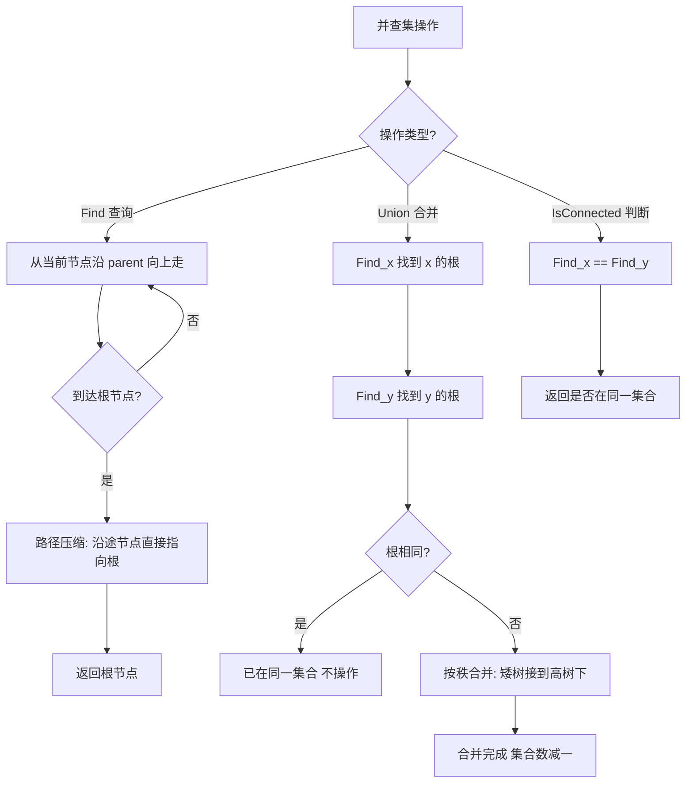

# 并查集（Union-Find）

## 1. 算法定位

- **所属分类**：数据结构基础
- **解决的问题**：高效判断两个元素是否属于同一集合，以及合并两个集合
- **知识树位置**：

```
数据结构基础
├── 数组
├── 链表
├── 栈
├── 队列
├── 双端队列
├── 哈希表
├── 堆
└── 并查集 ◀ 当前位置
```

并查集（Disjoint Set Union，DSU）是解决**动态连通性问题**的专用数据结构。它在图论（连通分量、最小生成树 Kruskal 算法）和社交网络（朋友圈问题）中有广泛应用。

## 2. 一句话理解

> 并查集就是"帮你管理分组"的工具——快速判断两个人是不是一伙的，快速把两个小团体合并成一个大团体。

## 3. 生活化比喻

想象学校里的 **社团管理**：

- 每个社团有一个**社长**（代表元素/根节点）。
- 你想知道小明和小红是不是同一个社团的？分别找到他们各自的社长，社长相同就是同一社团（**Find 查询**）。
- 两个社团要合并？让一个社团的社长"认"另一个社长做上级就行（**Union 合并**）。
- 一开始每个人都是独立的"一人社团"，自己就是社长。
- 找社长时，可能要沿着"谁是我的上级"一层层往上问。**路径压缩**就是找到社长后，让中间所有人直接认社长为上级，下次找就快了。

## 4. 核心思想

### 两个核心操作

1. **Find（查询）**：找到某个元素所属集合的代表（根节点）
2. **Union（合并）**：将两个元素所在的集合合并为一个集合

### 两个核心优化

1. **路径压缩（Path Compression）**：Find 时，将沿途所有节点直接指向根节点，扁平化树结构。
2. **按秩合并（Union by Rank）**：Union 时，将矮的树接到高的树下面，避免退化为链表。

```
没有优化的并查集可能退化为链表（高度 = n）：
0 → 1 → 2 → 3 → 4 → 5   Find 需要 O(n)

路径压缩后变成扁平结构（高度 ≈ 1）：
    0
  / | \ \\ \\
 1  2  3  4  5            Find 近似 O(1)
```

## 5. 图解推演

### 初始状态

```
每个人都是自己的"社长"（自己指向自己）

parent: [0, 1, 2, 3, 4, 5, 6]
         ↑  ↑  ↑  ↑  ↑  ↑  ↑
         0  1  2  3  4  5  6

集合: {0} {1} {2} {3} {4} {5} {6}
```

### Union(1, 2) - 合并 1 和 2

```
让 1 的根指向 2 的根（或反过来）

parent: [0, 2, 2, 3, 4, 5, 6]
             ↑
             1 → 2

集合: {0} {1,2} {3} {4} {5} {6}

树形结构:
  2
  |
  1
```

### Union(3, 4)，Union(4, 5)

```
parent: [0, 2, 2, 4, 4, 5, 6]

Union(3,4):  4     Union(4,5):   5
             |                  / \
             3                 4   (5是根)
                               |
                               3

实际:
  2    5    0    6
  |   / \
  1  4
     |
     3

集合: {0} {1,2} {3,4,5} {6}
```

### Union(1, 5) - 合并 {1,2} 和 {3,4,5}

```
先 Find(1) → 根是 2
再 Find(5) → 根是 5
按秩合并：{3,4,5} 的树更高，所以 2 指向 5

parent: [0, 2, 5, 4, 4, 5, 6]

      5
    / | \
   2  4
   |  |
   1  3

集合: {0} {1,2,3,4,5} {6}
```

### 路径压缩图解

```
执行 Find(3) 之前:
      5
    / | \
   2  4
   |  |
   1  3     ← 从 3 出发，要经过 4 才到 5

Find(3) 的过程: 3 → 4 → 5（找到根是 5）

路径压缩后（3 直接指向 5）:
      5
   / | | \
  2  4  3
  |
  1

下次 Find(3) 直接一步到位！

再执行 Find(1):  1 → 2 → 5（找到根是 5）

路径压缩后（1 和 2 都直接指向 5）:
      5
  / | | | \
 1  2  4  3

现在所有节点都直接指向根，查询全部 O(1)
```

### Mermaid 流程图



## 6. 执行步骤

### Find 操作（带路径压缩）
1. 从节点 x 出发
2. 如果 `parent[x] != x`，说明 x 不是根，递归找 `parent[x]` 的根
3. **路径压缩**：将 `parent[x]` 直接设为根节点
4. 返回根节点

### Union 操作（按秩合并）
1. 分别找到 x 和 y 的根节点 rootX 和 rootY
2. 如果 rootX == rootY，已在同一集合，不操作
3. 比较两棵树的秩（高度的上界）：
   - 秩小的接到秩大的下面
   - 秩相同则任选一个作为新根，秩 +1
4. 集合数量减 1

## 7. C# 实现

### 完整版：带路径压缩和按秩合并的并查集

```csharp
using System;

/// <summary>
/// 并查集（Union-Find）
/// 支持路径压缩和按秩合并两大优化
/// 近似 O(1) 的查询和合并操作
/// </summary>
public class UnionFind
{
    // parent[i] 表示节点 i 的父节点
    // 如果 parent[i] == i，说明 i 是根节点（集合代表）
    private int[] _parent;

    // rank[i] 表示以 i 为根的树的高度上界
    // 用于按秩合并，保证树不会太高
    private int[] _rank;

    // 当前不相交集合的数量
    private int _count;

    /// <summary>
    /// 构造函数：初始化 n 个元素的并查集
    /// 初始时每个元素自成一个集合
    /// </summary>
    /// <param name="n">元素数量（编号 0 到 n-1）</param>
    public UnionFind(int n)
    {
        _parent = new int[n];
        _rank = new int[n];
        _count = n; // 初始有 n 个集合

        for (int i = 0; i < n; i++)
        {
            _parent[i] = i;  // 每个人的"社长"是自己
            _rank[i] = 0;    // 初始高度为 0
        }
    }

    /// <summary>当前集合数量</summary>
    public int Count => _count;

    /// <summary>
    /// 查找操作：找到元素 x 所属集合的根节点（代表元素）
    /// 使用递归 + 路径压缩
    /// 
    /// 路径压缩原理：
    ///   在查找根的过程中，将沿途经过的所有节点直接指向根节点
    ///   这样下次查询这些节点时，一步就能到根
    /// 
    /// 时间复杂度：均摊 O(α(n))，α 是反阿克曼函数，实际近似 O(1)
    /// </summary>
    public int Find(int x)
    {
        // 如果 x 不是根节点
        if (_parent[x] != x)
        {
            // 递归找到根节点，并将 x 直接指向根（路径压缩）
            _parent[x] = Find(_parent[x]);
        }
        return _parent[x];
    }

    /// <summary>
    /// 合并操作：将元素 x 和元素 y 所在的集合合并
    /// 使用按秩合并优化
    /// 
    /// 按秩合并原理：
    ///   将"矮"的树接到"高"的树下面
    ///   这样合并后的树高度不会增加（除非两棵树一样高）
    ///   避免树退化为链表
    /// 
    /// 时间复杂度：均摊 O(α(n))
    /// </summary>
    /// <returns>是否真正进行了合并（如果已在同一集合则返回 false）</returns>
    public bool Union(int x, int y)
    {
        int rootX = Find(x);
        int rootY = Find(y);

        // 如果已经在同一集合中，不需要合并
        if (rootX == rootY)
            return false;

        // 按秩合并：矮树接到高树下面
        if (_rank[rootX] < _rank[rootY])
        {
            // rootX 的树更矮，接到 rootY 下面
            _parent[rootX] = rootY;
        }
        else if (_rank[rootX] > _rank[rootY])
        {
            // rootY 的树更矮，接到 rootX 下面
            _parent[rootY] = rootX;
        }
        else
        {
            // 两棵树一样高，任选一个作为新根，秩 +1
            _parent[rootY] = rootX;
            _rank[rootX]++;
        }

        _count--; // 集合数量减少 1
        return true;
    }

    /// <summary>
    /// 判断两个元素是否在同一集合中
    /// </summary>
    public bool IsConnected(int x, int y)
    {
        return Find(x) == Find(y);
    }
}
```

### 实战应用一：省份数量（连通分量）

```csharp
using System;

/// <summary>
/// 省份数量（LeetCode 第 547 题）
/// 给定城市的连接关系矩阵，求有多少个连通的省份（即多少个连通分量）
/// </summary>
public class NumberOfProvinces
{
    /// <summary>
    /// 使用并查集求连通分量个数
    /// 思路：遍历所有连接关系，用 Union 合并相连的城市，最终集合数就是省份数
    /// 时间复杂度：O(n^2 * α(n))，近似 O(n^2)
    /// </summary>
    /// <param name="isConnected">邻接矩阵，isConnected[i][j]=1 表示城市 i 和 j 相连</param>
    /// <returns>省份数量</returns>
    public static int FindCircleNum(int[][] isConnected)
    {
        int n = isConnected.Length;
        UnionFind uf = new UnionFind(n);

        // 遍历邻接矩阵的上三角（因为是对称的）
        for (int i = 0; i < n; i++)
        {
            for (int j = i + 1; j < n; j++)
            {
                if (isConnected[i][j] == 1)
                {
                    uf.Union(i, j); // 合并相连的城市
                }
            }
        }

        return uf.Count; // 剩余的集合数就是省份数
    }

    /// <summary>演示</summary>
    public static void Demo()
    {
        // 3 个城市的连接关系:
        // 城市 0 和城市 1 相连
        // 城市 2 独立
        int[][] isConnected = new int[][]
        {
            new int[] { 1, 1, 0 },
            new int[] { 1, 1, 0 },
            new int[] { 0, 0, 1 }
        };

        int result = FindCircleNum(isConnected);
        Console.WriteLine($"省份数量: {result}"); // 2
    }
}
```

### 实战应用二：Kruskal 最小生成树

```csharp
using System;
using System.Collections.Generic;

/// <summary>
/// Kruskal 算法求最小生成树（MST）
/// 核心思想：贪心 + 并查集
/// 将所有边按权重排序，依次选择不构成环的最小边
/// </summary>
public class KruskalMST
{
    /// <summary>表示图中的一条边</summary>
    public class Edge : IComparable<Edge>
    {
        public int From;   // 边的起点
        public int To;     // 边的终点
        public int Weight; // 边的权重

        public Edge(int from, int to, int weight)
        {
            From = from;
            To = to;
            Weight = weight;
        }

        // 按权重排序
        public int CompareTo(Edge? other) => Weight.CompareTo(other!.Weight);
    }

    /// <summary>
    /// 使用 Kruskal 算法求最小生成树
    /// 时间复杂度：O(E log E)，E 是边数（排序是瓶颈）
    /// </summary>
    /// <param name="n">节点数量</param>
    /// <param name="edges">所有边</param>
    /// <returns>最小生成树的边集和总权重</returns>
    public static (List<Edge> mstEdges, int totalWeight) FindMST(int n, List<Edge> edges)
    {
        // 第一步：将所有边按权重从小到大排序
        edges.Sort();

        // 第二步：初始化并查集
        UnionFind uf = new UnionFind(n);

        List<Edge> mstEdges = new List<Edge>();
        int totalWeight = 0;

        // 第三步：贪心选择边
        foreach (Edge edge in edges)
        {
            // 如果这条边的两个端点不在同一集合（加入不会成环）
            if (!uf.IsConnected(edge.From, edge.To))
            {
                // 选择这条边，合并两个端点
                uf.Union(edge.From, edge.To);
                mstEdges.Add(edge);
                totalWeight += edge.Weight;

                // 如果已经选了 n-1 条边，树已经完成
                if (mstEdges.Count == n - 1)
                    break;
            }
            // 如果两个端点已在同一集合，加入会成环，跳过
        }

        return (mstEdges, totalWeight);
    }

    /// <summary>演示</summary>
    public static void Demo()
    {
        // 图示:
        //     0 ---2--- 1
        //     |       / |
        //     6     3   5
        //     |   /     |
        //     3 ---1--- 2
        //       \     /
        //        4---
        //
        // 4 个节点，5 条边

        int n = 4;
        List<Edge> edges = new List<Edge>
        {
            new Edge(0, 1, 2),
            new Edge(0, 3, 6),
            new Edge(1, 2, 5),
            new Edge(1, 3, 3),
            new Edge(2, 3, 1)
        };

        var (mstEdges, totalWeight) = FindMST(n, edges);

        Console.WriteLine($"最小生成树总权重: {totalWeight}");
        Console.WriteLine("选中的边:");
        foreach (var edge in mstEdges)
        {
            Console.WriteLine($"  {edge.From} -- {edge.To}  权重: {edge.Weight}");
        }
        // 输出:
        // 最小生成树总权重: 6
        // 选中的边:
        //   2 -- 3  权重: 1
        //   0 -- 1  权重: 2
        //   1 -- 3  权重: 3
    }
}
```

### 实战应用三：冗余连接（找环中的多余边）

```csharp
using System;

/// <summary>
/// 冗余连接（LeetCode 第 684 题）
/// 在一棵树中多加了一条边形成了环，找出这条多余的边
/// </summary>
public class RedundantConnection
{
    /// <summary>
    /// 思路：依次添加每条边，如果两个端点已经在同一集合中
    ///       说明这条边会形成环——它就是多余的边
    /// 时间复杂度：O(n * α(n))，近似 O(n)
    /// </summary>
    public static int[] FindRedundantConnection(int[][] edges)
    {
        int n = edges.Length;
        UnionFind uf = new UnionFind(n + 1); // 节点编号从 1 开始

        foreach (int[] edge in edges)
        {
            int u = edge[0];
            int v = edge[1];

            // 如果 u 和 v 已经连通，再加这条边就成环了
            if (!uf.Union(u, v))
            {
                return edge; // 返回这条多余的边
            }
        }

        return Array.Empty<int>(); // 不会执行到这里
    }

    /// <summary>演示</summary>
    public static void Demo()
    {
        // 树: 1-2-3-4 多了一条 1-4 的边形成环
        int[][] edges = new int[][]
        {
            new int[] { 1, 2 },
            new int[] { 2, 3 },
            new int[] { 3, 4 },
            new int[] { 1, 4 }  // 这条边是多余的
        };

        int[] result = FindRedundantConnection(edges);
        Console.WriteLine($"多余的边: [{result[0]}, {result[1]}]"); // [1, 4]
    }
}
```

## 8. 示例演示

```
完整推演：6 个节点的并查集操作

初始状态:
parent: [0, 1, 2, 3, 4, 5]
rank:   [0, 0, 0, 0, 0, 0]
集合数: 6
集合: {0} {1} {2} {3} {4} {5}

操作 1: Union(0, 1)
  Find(0)=0, Find(1)=1，不同集合
  rank 相同，让 1 指向 0，rank[0]++
  parent: [0, 0, 2, 3, 4, 5]
  rank:   [1, 0, 0, 0, 0, 0]
  集合数: 5    集合: {0,1} {2} {3} {4} {5}

操作 2: Union(2, 3)
  Find(2)=2, Find(3)=3，不同集合
  rank 相同，让 3 指向 2，rank[2]++
  parent: [0, 0, 2, 2, 4, 5]
  rank:   [1, 0, 1, 0, 0, 0]
  集合数: 4    集合: {0,1} {2,3} {4} {5}

操作 3: Union(4, 5)
  Find(4)=4, Find(5)=5，不同集合
  rank 相同，让 5 指向 4，rank[4]++
  parent: [0, 0, 2, 2, 4, 4]
  rank:   [1, 0, 1, 0, 1, 0]
  集合数: 3    集合: {0,1} {2,3} {4,5}

操作 4: Union(0, 2)
  Find(0)=0, Find(2)=2，不同集合
  rank 相同（都是 1），让 2 指向 0，rank[0]++
  parent: [0, 0, 0, 2, 4, 4]
  rank:   [2, 0, 1, 0, 1, 0]
  集合数: 2    集合: {0,1,2,3} {4,5}

操作 5: IsConnected(1, 3)?
  Find(1): parent[1]=0, parent[0]=0 → 根是 0
  Find(3): parent[3]=2, parent[2]=0, parent[0]=0 → 根是 0
  路径压缩后 parent[3] 直接变为 0
  根相同 → true！ 它们在同一集合

操作 6: Union(1, 5)
  Find(1)=0, Find(5)=4，不同集合
  rank[0]=2 > rank[4]=1，让 4 指向 0
  parent: [0, 0, 0, 0, 0, 4]
  rank:   [2, 0, 1, 0, 1, 0]
  集合数: 1    集合: {0,1,2,3,4,5}  全部合并！
```

## 9. 复杂度分析

| 操作 | 时间复杂度 | 说明 |
|------|-----------|------|
| Find | **O(α(n))** | α 是反阿克曼函数，实际 ≤ 4 |
| Union | **O(α(n))** | 内部调用两次 Find |
| IsConnected | **O(α(n))** | 内部调用两次 Find |
| 初始化 | O(n) | 初始化 parent 和 rank 数组 |
| 空间复杂度 | **O(n)** | 两个数组各 n 个元素 |

**通俗理解**：
- **α(n)** 是反阿克曼函数，增长极其缓慢。对于宇宙中原子总数（约 10^80），α(n) 也不超过 4。所以实际上就是 **O(1)**。
- **没有优化**的并查集，Find 最坏 O(n)（退化为链表）。**路径压缩 + 按秩合并**后，每次操作近似 O(1)。

| 优化策略 | Find 复杂度 |
|----------|------------|
| 无优化 | O(n) |
| 仅路径压缩 | O(log n) 均摊 |
| 仅按秩合并 | O(log n) |
| **路径压缩 + 按秩合并** | **O(α(n)) ≈ O(1)** |

## 10. 易错点

1. **初始化忘记让每个元素指向自己**：`parent[i] = i`，不是 `parent[i] = 0`。

2. **Find 忘记路径压缩**：不加路径压缩，大量 Find 操作会退化到 O(n)，性能严重下降。

3. **Union 时直接合并，不查根**：必须先 Find 到各自的根节点再合并，不能直接 `parent[x] = y`。

4. **节点编号从 0 还是从 1 开始**：LeetCode 有些题目节点编号从 1 开始，数组大小要开 `n+1`。

5. **Union 返回值被忽略**：Union 的返回值（是否真正合并了）在某些题目中很重要（比如冗余连接）。

## 11. 相似数据结构对比

| 特性 | 并查集 | DFS/BFS | 邻接表 |
|------|--------|---------|--------|
| 判断连通性 | **O(α(n)) ≈ O(1)** | O(V+E) | 需要遍历 |
| 动态添加边 | **支持** | 需要重新遍历 | 支持但查询慢 |
| 求连通分量数 | **维护 count** | 需完整遍历 | 需完整遍历 |
| 求最短路径 | 不支持 | **BFS 支持** | 配合算法支持 |
| 求所有可达节点 | 不直接支持 | **支持** | 配合遍历支持 |
| 适用场景 | 连通性、集合合并 | 路径搜索、遍历 | 图的通用存储 |

## 12. 前置知识与延伸学习

### 前置知识
- 数组基础
- 树的基本概念
- 递归

### 延伸学习
- **Kruskal 最小生成树**：并查集 + 贪心的经典应用
- **图的连通分量**：DFS/BFS 也能求，但并查集支持动态加边
- **带权并查集**：维护节点到根的距离，解决更复杂的关系问题
- **可持久化并查集**：支持回滚操作的高级版本
- **拓扑排序**：图算法进阶

## 13. 记忆口诀

> **"并查集管分组，Find 找头 Union 并；路径压缩扁平化，按秩合并不退化。"**

## 14. 面试常问点

1. **并查集的两个优化是什么？为什么需要？**
   - 路径压缩（Find 时扁平化树）和按秩合并（Union 时矮接高）。不优化会退化为 O(n)。

2. **并查集能做什么？不能做什么？**
   - 能做：判断连通性、合并集合、求连通分量数。
   - 不能做：求最短路径、分割已合并的集合（只能合并不能拆分）。

3. **如何用并查集判断图中是否有环？**
   - 逐条添加边，如果两端已经在同一集合，说明加这条边会成环。

4. **Kruskal 算法中并查集的作用？**
   - 判断加入某条边是否会形成环：如果边的两端已在同一集合，则跳过。

5. **路径压缩的实现方式有哪些？**
   - 递归版：`parent[x] = Find(parent[x])`
   - 迭代版：两次遍历，第一次找根，第二次将沿途节点指向根

## 15. 一页总结

```
╔══════════════════════════════════════════════════════════╗
║               并查集 Union-Find                           ║
╠══════════════════════════════════════════════════════════╣
║  核心功能：管理不相交集合的合并与查询                       ║
║                                                            ║
║  两个操作：                                                 ║
║    Find(x)    → 找到 x 所属集合的根（代表）                 ║
║    Union(x,y) → 合并 x 和 y 所在的集合                     ║
║                                                            ║
║  两个优化：                                                 ║
║    路径压缩 → Find 时将沿途节点直接指向根                    ║
║    按秩合并 → Union 时矮树接到高树下                         ║
║    优化后每次操作近似 O(1)                                   ║
║                                                            ║
║  底层结构：parent[] 数组 + rank[] 数组                      ║
║  C# 实现：需手写（标准库无内置）                            ║
║                                                            ║
║  经典应用：                                                  ║
║    ① 判断图的连通性                                         ║
║    ② 求连通分量个数（省份/朋友圈）                           ║
║    ③ Kruskal 最小生成树                                     ║
║    ④ 检测图中的环                                           ║
║    ⑤ 冗余连接                                               ║
║                                                            ║
║  记住：并查集 = 社团管理，找社长+合并社团                    ║
╚══════════════════════════════════════════════════════════╝
```
