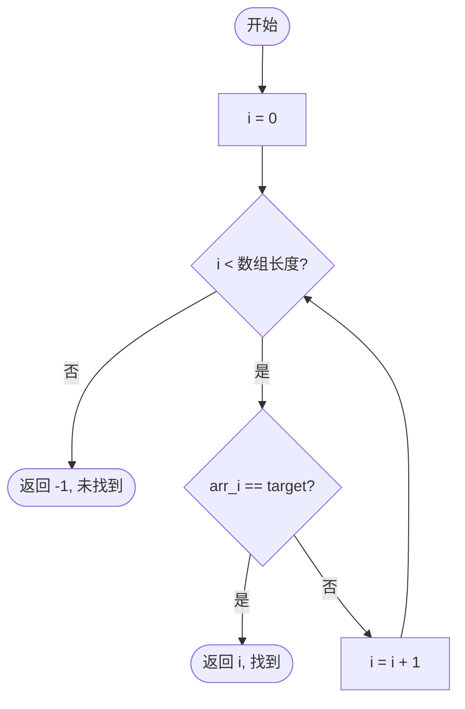

# 线性查找（Linear Search）

## 1. 算法定位

| 维度 | 说明 |
|------|------|
| 所属类别 | 查找算法 — 顺序查找 |
| 解决问题 | 在一个**无序或有序**的集合中，找到某个目标值是否存在，若存在则返回其位置 |
| 适用场景 | 数据量小、数据无序、只查找一次、链表等不支持随机访问的结构 |

## 2. 一句话理解

> 从头到尾，**一个接一个**地检查每个元素，直到找到目标或扫完整个集合。

## 3. 生活化比喻

想象你在一排储物柜前找自己的行李：你不知道行李在哪个柜子里，只能**从第一个柜子开始，依次打开每一个**，直到找到为止。如果储物柜只有 5 个，很快就能找到；但如果有 10000 个，运气不好可能要开到最后一个。

## 4. 核心思想

```
逐个比较，命中即停，未命中则继续，直到遍历结束。
```

- 不对数据做任何假设（不要求有序、不要求可哈希）
- 适用于**任何可迭代的数据结构**
- 是所有查找算法中**最简单、最通用**的

## 5. 图解推演

### 查找目标：在数组 `[4, 7, 2, 9, 1, 5]` 中查找 `9`

```
索引:   0    1    2    3    4    5
数组: [ 4 ][ 7 ][ 2 ][ 9 ][ 1 ][ 5 ]

第 1 步: i=0, arr[0]=4, 4≠9 → 继续
         [*4*][ 7 ][ 2 ][ 9 ][ 1 ][ 5 ]
          ↑

第 2 步: i=1, arr[1]=7, 7≠9 → 继续
         [ 4 ][*7*][ 2 ][ 9 ][ 1 ][ 5 ]
               ↑

第 3 步: i=2, arr[2]=2, 2≠9 → 继续
         [ 4 ][ 7 ][*2*][ 9 ][ 1 ][ 5 ]
                     ↑

第 4 步: i=3, arr[3]=9, 9==9 → 找到！返回索引 3
         [ 4 ][ 7 ][ 2 ][*9*][ 1 ][ 5 ]
                          ↑ ✓ 命中
```

### 查找失败的情况：查找 `8`

```
第 1 步: i=0, 4≠8 → 继续
第 2 步: i=1, 7≠8 → 继续
第 3 步: i=2, 2≠8 → 继续
第 4 步: i=3, 9≠8 → 继续
第 5 步: i=4, 1≠8 → 继续
第 6 步: i=5, 5≠8 → 继续
遍历结束，未找到 → 返回 -1
```

### Mermaid 流程图



## 6. 执行步骤

1. 从集合的**第一个元素**开始
2. 将当前元素与目标值进行**比较**
3. 如果**相等**，返回当前索引，查找成功
4. 如果**不相等**，移动到下一个元素
5. 重复步骤 2~4，直到遍历完所有元素
6. 若遍历结束仍未找到，返回 `-1`，查找失败

## 7. C# 实现

```csharp
using System;
using System.Collections.Generic;

class LinearSearchDemo
{
    /// <summary>
    /// 线性查找（泛型版本）
    /// 在数组中顺序查找目标值，返回第一个匹配元素的索引
    /// </summary>
    /// <typeparam name="T">元素类型，必须实现 IEquatable 接口以支持相等比较</typeparam>
    /// <param name="arr">待查找的数组</param>
    /// <param name="target">目标值</param>
    /// <returns>目标值的索引，未找到返回 -1</returns>
    static int LinearSearch<T>(T[] arr, T target) where T : IEquatable<T>
    {
        // 遍历数组中的每一个元素
        for (int i = 0; i < arr.Length; i++)
        {
            // 如果当前元素等于目标值，立即返回索引
            if (arr[i].Equals(target))
                return i;
        }

        // 遍历结束仍未找到，返回 -1
        return -1;
    }

    /// <summary>
    /// 线性查找所有匹配项（泛型版本）
    /// 返回所有匹配元素的索引列表
    /// </summary>
    static List<int> LinearSearchAll<T>(T[] arr, T target) where T : IEquatable<T>
    {
        // 用列表存储所有匹配的索引
        List<int> results = new List<int>();

        for (int i = 0; i < arr.Length; i++)
        {
            if (arr[i].Equals(target))
                results.Add(i); // 不立即返回，继续查找
        }

        return results;
    }

    /// <summary>
    /// 带哨兵优化的线性查找
    /// 减少循环中的边界判断次数，略微提升性能
    /// </summary>
    static int LinearSearchWithSentinel<T>(T[] arr, T target) where T : IEquatable<T>
    {
        int n = arr.Length;
        if (n == 0) return -1;

        // 保存最后一个元素
        T last = arr[n - 1];

        // 将目标值放在数组末尾作为哨兵
        arr[n - 1] = target;

        int i = 0;
        // 循环中不再需要判断 i < n，因为哨兵保证一定能找到
        while (!arr[i].Equals(target))
            i++;

        // 恢复最后一个元素
        arr[n - 1] = last;

        // 判断找到的是原数组中的元素还是哨兵
        if (i < n - 1 || last.Equals(target))
            return i;

        return -1; // 找到的是哨兵，说明原数组中不存在目标值
    }

    static void Main(string[] args)
    {
        Console.WriteLine("===== 线性查找演示 =====\n");

        // 演示 1：整数数组查找
        int[] intArr = { 4, 7, 2, 9, 1, 5 };
        Console.WriteLine("整数数组: [4, 7, 2, 9, 1, 5]");

        int index1 = LinearSearch(intArr, 9);
        Console.WriteLine($"查找 9 → 索引: {index1}");  // 输出: 3

        int index2 = LinearSearch(intArr, 8);
        Console.WriteLine($"查找 8 → 索引: {index2}");  // 输出: -1

        // 演示 2：字符串数组查找
        string[] strArr = { "苹果", "香蕉", "橘子", "葡萄", "西瓜" };
        Console.WriteLine($"\n字符串数组: [苹果, 香蕉, 橘子, 葡萄, 西瓜]");

        int index3 = LinearSearch(strArr, "橘子");
        Console.WriteLine($"查找 '橘子' → 索引: {index3}");  // 输出: 2

        // 演示 3：查找所有匹配项
        int[] dupArr = { 3, 1, 4, 1, 5, 9, 1, 6 };
        Console.WriteLine($"\n含重复元素数组: [3, 1, 4, 1, 5, 9, 1, 6]");

        List<int> allIndexes = LinearSearchAll(dupArr, 1);
        Console.WriteLine($"查找所有 1 → 索引: [{string.Join(", ", allIndexes)}]");
        // 输出: [1, 3, 6]

        // 演示 4：哨兵优化版本
        int[] sentArr = { 10, 20, 30, 40, 50 };
        Console.WriteLine($"\n哨兵优化版本测试: [10, 20, 30, 40, 50]");

        int index4 = LinearSearchWithSentinel(sentArr, 30);
        Console.WriteLine($"查找 30 → 索引: {index4}");  // 输出: 2
    }
}
```

## 8. 示例演示

### 手动推演：在 `[4, 7, 2, 9, 1, 5]` 中查找 `9`

| 步骤 | i | arr[i] | arr[i] == 9? | 操作 |
|------|---|--------|--------------|------|
| 1 | 0 | 4 | 否 | 继续 |
| 2 | 1 | 7 | 否 | 继续 |
| 3 | 2 | 2 | 否 | 继续 |
| 4 | 3 | 9 | **是** | 返回 3 |

共比较 **4 次**，查找成功。

### 手动推演：在 `[4, 7, 2, 9, 1, 5]` 中查找 `8`

| 步骤 | i | arr[i] | arr[i] == 8? | 操作 |
|------|---|--------|--------------|------|
| 1 | 0 | 4 | 否 | 继续 |
| 2 | 1 | 7 | 否 | 继续 |
| 3 | 2 | 2 | 否 | 继续 |
| 4 | 3 | 9 | 否 | 继续 |
| 5 | 4 | 1 | 否 | 继续 |
| 6 | 5 | 5 | 否 | 继续 |

遍历结束，共比较 **6 次**，返回 -1，查找失败。

## 9. 复杂度分析

| 指标 | 复杂度 | 说明 |
|------|--------|------|
| **最好时间** | O(1) | 目标在第一个位置 |
| **最坏时间** | O(n) | 目标在最后或不存在 |
| **平均时间** | O(n) | 平均需比较 n/2 次 |
| **空间复杂度** | O(1) | 只需常数个辅助变量 |

> n 为数组长度。线性查找的时间复杂度与数据规模成**正比**。

## 10. 易错点

| 易错点 | 说明 |
|--------|------|
| **空数组未判断** | 传入空数组时要正确返回 -1，而非抛出异常 |
| **找到第一个就停** | 如果需要查找所有匹配项，不能在第一次命中时就 `return` |
| **引用类型比较** | 对象比较时要用 `Equals()` 而非 `==`，否则比较的是引用地址 |
| **null 值处理** | 数组中可能包含 null 元素，直接调用 `Equals` 会抛 `NullReferenceException` |
| **哨兵版本的边界** | 哨兵优化时要记得恢复被替换的末尾元素 |

## 11. 相似算法对比

| 对比维度 | 线性查找 | 二分查找 | 哈希查找 |
|----------|----------|----------|----------|
| **前提条件** | 无 | 数据必须有序 | 需要哈希函数 |
| **时间复杂度** | O(n) | O(log n) | O(1) 平均 |
| **空间复杂度** | O(1) | O(1) | O(n) |
| **适用结构** | 数组、链表、任意可迭代 | 数组（支持随机访问） | 哈希表 |
| **实现难度** | 极简单 | 中等（易出 bug） | 中等 |
| **适用场景** | 小数据、无序数据 | 大量有序数据 | 频繁查找的大数据 |

## 12. 前置知识与延伸学习

### 前置知识

- **数组遍历**：理解 `for` 循环逐一访问数组元素
- **泛型基础**：C# 中 `<T>` 泛型方法的定义与约束
- **IEquatable 接口**：自定义类型如何支持相等比较

### 延伸学习

- **二分查找**：当数据有序时，效率从 O(n) 提升到 O(log n)
- **哈希查找**：用空间换时间，平均 O(1) 查找
- **跳跃搜索（Jump Search）**：介于线性和二分之间的折中方案
- **插值搜索（Interpolation Search）**：数据均匀分布时比二分更快

## 13. 记忆口诀

```
线性查找最朴素，
从头到尾逐个数。
找到就停没找到，
扫完全部返负一。
不问有序与无序，
通用百搭第一步。
```

## 14. 面试常问点

1. **线性查找的时间复杂度是多少？最好和最坏情况分别是？**
   - 最好 O(1)，最坏和平均 O(n)

2. **线性查找和二分查找的核心区别？**
   - 线性查找不要求有序，二分查找要求有序；线性 O(n)，二分 O(log n)

3. **什么场景下线性查找优于二分查找？**
   - 数据无序且只查一次（排序本身就要 O(n log n)）
   - 数据量很小（n < 20 左右），两者差距可忽略
   - 数据存储在链表中，不支持随机访问

4. **如何优化线性查找？**
   - **哨兵优化**：减少循环中的边界判断
   - **移至前端**：将查找到的元素移到数组前部，提升后续查找效率
   - **提前退出**：在有序数组中，当前元素大于目标值时可提前终止

5. **如何实现泛型的线性查找？**
   - 使用 `where T : IEquatable<T>` 约束，调用 `Equals` 方法比较

## 15. 一页总结

```
┌─────────────────────────────────────────────────┐
│              线性查找 · 一页总结                  │
├─────────────────────────────────────────────────┤
│                                                  │
│  核心思想: 从头到尾逐一比较，命中即停             │
│                                                  │
│  前提条件: 无（最通用的查找算法）                 │
│                                                  │
│  时间复杂度: O(n)                                │
│  空间复杂度: O(1)                                │
│                                                  │
│  适用场景:                                       │
│    ✓ 数据无序                                    │
│    ✓ 数据量小                                    │
│    ✓ 只查找一次（不值得排序）                     │
│    ✓ 链表等不支持随机访问的结构                   │
│                                                  │
│  关键代码:                                       │
│    for (i = 0; i < n; i++)                       │
│        if (arr[i] == target) return i;           │
│    return -1;                                    │
│                                                  │
│  记忆: 最朴素、最通用、O(n)、不要求有序          │
│                                                  │
└─────────────────────────────────────────────────┘
```
