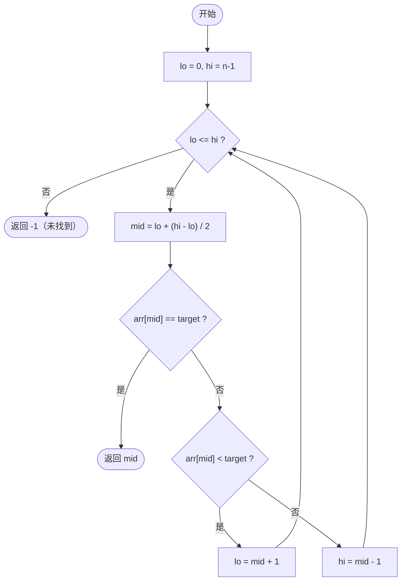

# 二分查找（Binary Search）

## 1. 算法定位

| 维度 | 说明 |
|------|------|
| 所属类别 | 查找算法 — 分治查找 |
| 解决问题 | 在**已排序**的数组中高效查找目标值，或查找满足条件的边界位置 |
| 适用场景 | 有序数组的精确查找、查找左/右边界、查找插入位置、求解单调函数的零点 |

## 2. 一句话理解

> 每次把搜索范围**砍一半**，通过比较中间元素与目标值来决定往左找还是往右找。

## 3. 生活化比喻

想象你在玩"猜数字"游戏：对方心里想了一个 1~100 的数字，你每猜一次，对方会告诉你"大了"或"小了"。

- 最聪明的策略：**每次猜中间值**
- 第 1 次猜 50 → "小了" → 范围缩小为 51~100
- 第 2 次猜 75 → "大了" → 范围缩小为 51~74
- 第 3 次猜 62 → "小了" → 范围缩小为 63~74
- ……最多只需要 **7 次**就能从 100 个数中猜到答案！

这就是二分查找的威力：**每一步排除一半的可能性**。

## 4. 核心思想

```
前提：数据必须有序

每次取中间元素与目标比较：
  - 相等 → 找到
  - 目标更小 → 在左半部分继续找
  - 目标更大 → 在右半部分继续找

搜索范围每次缩小一半，直到找到或范围为空
```

核心公式：**搜索空间每次减半 → O(log n)**

- 1000 个元素最多比较 10 次
- 100 万个元素最多比较 20 次
- 10 亿个元素最多比较 30 次

## 5. 图解推演

### 精确查找：在 `[1, 3, 5, 7, 9, 11, 13, 15]` 中查找 `7`

```
初始状态:
索引:  0   1   2   3   4   5   6   7
数组: [1] [3] [5] [7] [9] [11][13][15]
      lo                          hi

第 1 步: mid = (0+7)/2 = 3, arr[3]=7
索引:  0   1   2   3   4   5   6   7
数组: [1] [3] [5] [7] [9] [11][13][15]
      lo          mid              hi
                   ↑
                 7 == 7 → 命中！返回 3
```

一次就找到了。

### 精确查找：在 `[1, 3, 5, 7, 9, 11, 13, 15]` 中查找 `11`

```
第 1 步: lo=0, hi=7, mid=3, arr[3]=7
[1] [3] [5] [7] [9] [11][13][15]
 lo          mid              hi
              ↑
            7 < 11 → 目标在右半部分，lo = mid + 1 = 4

第 2 步: lo=4, hi=7, mid=5, arr[5]=11
[1] [3] [5] [7] [9] [11][13][15]
                  lo  mid      hi
                       ↑
                     11 == 11 → 命中！返回 5
```

### 查找失败：查找 `6`

```
第 1 步: lo=0, hi=7, mid=3, arr[3]=7
         7 > 6 → hi = mid - 1 = 2

第 2 步: lo=0, hi=2, mid=1, arr[1]=3
         3 < 6 → lo = mid + 1 = 2

第 3 步: lo=2, hi=2, mid=2, arr[2]=5
         5 < 6 → lo = mid + 1 = 3

第 4 步: lo=3 > hi=2 → 范围为空，返回 -1
```

### 范围缩小过程可视化

```
搜索 11 在 [1,3,5,7,9,11,13,15] 中：

第 1 步: [1  3  5  7 | 9  11  13  15]    范围: 8 个元素
                       ←————————————→     取右半

第 2 步:               [9  11 | 13  15]   范围: 4 个元素
                        ←——→              取左半（11在mid处命中）

每一步搜索空间减半: 8 → 4 → 命中
```

### Mermaid 流程图



## 6. 执行步骤

1. 初始化左边界 `lo = 0`，右边界 `hi = n - 1`
2. 当 `lo <= hi` 时，循环执行以下步骤：
   - 计算中间索引 `mid = lo + (hi - lo) / 2`（防溢出写法）
   - 如果 `arr[mid] == target`，返回 `mid`
   - 如果 `arr[mid] < target`，说明目标在右半部分，`lo = mid + 1`
   - 如果 `arr[mid] > target`，说明目标在左半部分，`hi = mid - 1`
3. 循环结束仍未找到，返回 `-1`

## 7. C# 实现

### 7.1 精确查找（基础版本）

```csharp
using System;

class BinarySearchDemo
{
    /// <summary>
    /// 标准二分查找 — 精确匹配
    /// 在有序数组中查找 target，找到返回索引，未找到返回 -1
    /// </summary>
    static int BinarySearch(int[] arr, int target)
    {
        int lo = 0;                  // 左边界（包含）
        int hi = arr.Length - 1;     // 右边界（包含）

        while (lo <= hi)             // 搜索区间 [lo, hi] 不为空
        {
            // 防止 (lo + hi) 整数溢出的写法
            int mid = lo + (hi - lo) / 2;

            if (arr[mid] == target)
            {
                return mid;          // 命中，直接返回
            }
            else if (arr[mid] < target)
            {
                lo = mid + 1;        // 目标在右半部分，收缩左边界
            }
            else
            {
                hi = mid - 1;        // 目标在左半部分，收缩右边界
            }
        }

        return -1;                   // 搜索区间为空，未找到
    }

    static void Main(string[] args)
    {
        int[] arr = { 1, 3, 5, 7, 9, 11, 13, 15 };
        Console.WriteLine("数组: [1, 3, 5, 7, 9, 11, 13, 15]");

        Console.WriteLine($"查找 7  → 索引: {BinarySearch(arr, 7)}");   // 3
        Console.WriteLine($"查找 11 → 索引: {BinarySearch(arr, 11)}");  // 5
        Console.WriteLine($"查找 6  → 索引: {BinarySearch(arr, 6)}");   // -1
    }
}
```

### 7.2 查找左边界（第一个等于 target 的位置）

当数组中有重复元素时，找到**最左边**那个等于 target 的索引。

```
示例: arr = [1, 3, 5, 5, 5, 7, 9]
查找 5 的左边界 → 应返回索引 2（第一个 5）
```

```csharp
using System;

class LeftBoundaryDemo
{
    /// <summary>
    /// 查找左边界：返回第一个等于 target 的索引
    /// 如果不存在返回 -1
    /// </summary>
    static int SearchLeftBound(int[] arr, int target)
    {
        int lo = 0;
        int hi = arr.Length - 1;
        int result = -1;  // 记录最终结果

        while (lo <= hi)
        {
            int mid = lo + (hi - lo) / 2;

            if (arr[mid] == target)
            {
                result = mid;    // 先记录当前位置
                hi = mid - 1;    // 继续向左搜索，看是否有更靠左的
            }
            else if (arr[mid] < target)
            {
                lo = mid + 1;
            }
            else
            {
                hi = mid - 1;
            }
        }

        return result;
    }

    static void Main(string[] args)
    {
        int[] arr = { 1, 3, 5, 5, 5, 7, 9 };
        Console.WriteLine("数组: [1, 3, 5, 5, 5, 7, 9]");
        Console.WriteLine($"5 的左边界（第一个 5） → 索引: {SearchLeftBound(arr, 5)}");
        // 输出: 2

        Console.WriteLine($"4 的左边界 → 索引: {SearchLeftBound(arr, 4)}");
        // 输出: -1（不存在）
    }
}
```

#### 左边界图解

```
数组: [1] [3] [5] [5] [5] [7] [9]
索引:  0   1   2   3   4   5   6

查找 5 的左边界：

第 1 步: lo=0, hi=6, mid=3, arr[3]=5
         5==5 → 记录 result=3, 继续向左 hi=2
         [1] [3] [5] [5] [5] [7] [9]
          lo      hi  ↑
                   result=3

第 2 步: lo=0, hi=2, mid=1, arr[1]=3
         3<5 → lo=2
         [1] [3] [5]
              ↑   hi
             lo=2

第 3 步: lo=2, hi=2, mid=2, arr[2]=5
         5==5 → 记录 result=2, 继续向左 hi=1
         [5]
          ↑
         result=2

第 4 步: lo=2 > hi=1 → 结束，返回 result=2
```

### 7.3 查找右边界（最后一个等于 target 的位置）

```csharp
using System;

class RightBoundaryDemo
{
    /// <summary>
    /// 查找右边界：返回最后一个等于 target 的索引
    /// 如果不存在返回 -1
    /// </summary>
    static int SearchRightBound(int[] arr, int target)
    {
        int lo = 0;
        int hi = arr.Length - 1;
        int result = -1;  // 记录最终结果

        while (lo <= hi)
        {
            int mid = lo + (hi - lo) / 2;

            if (arr[mid] == target)
            {
                result = mid;    // 先记录当前位置
                lo = mid + 1;    // 继续向右搜索，看是否有更靠右的
            }
            else if (arr[mid] < target)
            {
                lo = mid + 1;
            }
            else
            {
                hi = mid - 1;
            }
        }

        return result;
    }

    static void Main(string[] args)
    {
        int[] arr = { 1, 3, 5, 5, 5, 7, 9 };
        Console.WriteLine("数组: [1, 3, 5, 5, 5, 7, 9]");
        Console.WriteLine($"5 的右边界（最后一个 5） → 索引: {SearchRightBound(arr, 5)}");
        // 输出: 4
    }
}
```

### 7.4 查找插入位置（LowerBound）

```csharp
using System;

class InsertPositionDemo
{
    /// <summary>
    /// 查找插入位置：返回第一个大于等于 target 的索引
    /// 等价于 C++ 的 lower_bound
    /// 如果所有元素都小于 target，返回数组长度
    /// </summary>
    static int LowerBound(int[] arr, int target)
    {
        int lo = 0;
        int hi = arr.Length;  // 注意：hi 初始为 arr.Length，不是 arr.Length - 1

        while (lo < hi)       // 注意：是 <，不是 <=
        {
            int mid = lo + (hi - lo) / 2;

            if (arr[mid] < target)
            {
                lo = mid + 1;   // mid 不满足条件，排除
            }
            else
            {
                hi = mid;       // mid 可能是答案，保留
            }
        }

        return lo;  // lo == hi 时就是答案
    }

    /// <summary>
    /// UpperBound：返回第一个严格大于 target 的索引
    /// </summary>
    static int UpperBound(int[] arr, int target)
    {
        int lo = 0;
        int hi = arr.Length;

        while (lo < hi)
        {
            int mid = lo + (hi - lo) / 2;

            if (arr[mid] <= target)  // 注意：这里是 <=
            {
                lo = mid + 1;
            }
            else
            {
                hi = mid;
            }
        }

        return lo;
    }

    static void Main(string[] args)
    {
        int[] arr = { 1, 3, 5, 5, 5, 7, 9 };
        Console.WriteLine("数组: [1, 3, 5, 5, 5, 7, 9]");

        Console.WriteLine($"LowerBound(5) → {LowerBound(arr, 5)}");  // 2
        Console.WriteLine($"UpperBound(5) → {UpperBound(arr, 5)}");  // 5
        Console.WriteLine($"LowerBound(4) → {LowerBound(arr, 4)}");  // 2（插入位置）
        Console.WriteLine($"LowerBound(6) → {LowerBound(arr, 6)}");  // 5

        // 5 出现的次数 = UpperBound - LowerBound
        int count = UpperBound(arr, 5) - LowerBound(arr, 5);
        Console.WriteLine($"5 出现的次数: {count}");  // 3
    }
}
```

### 7.5 递归版本

```csharp
using System;

class RecursiveBinarySearchDemo
{
    /// <summary>
    /// 递归版二分查找
    /// </summary>
    static int BinarySearchRecursive(int[] arr, int target, int lo, int hi)
    {
        // 递归终止条件：搜索范围为空
        if (lo > hi) return -1;

        int mid = lo + (hi - lo) / 2;

        if (arr[mid] == target)
            return mid;                                          // 找到
        else if (arr[mid] < target)
            return BinarySearchRecursive(arr, target, mid + 1, hi);  // 搜索右半部分
        else
            return BinarySearchRecursive(arr, target, lo, mid - 1);  // 搜索左半部分
    }

    static void Main(string[] args)
    {
        int[] arr = { 2, 4, 6, 8, 10, 12, 14, 16 };
        Console.WriteLine("数组: [2, 4, 6, 8, 10, 12, 14, 16]");

        int result = BinarySearchRecursive(arr, 10, 0, arr.Length - 1);
        Console.WriteLine($"递归查找 10 → 索引: {result}");  // 4
    }
}
```

### 7.6 完整综合演示

```csharp
using System;

class BinarySearchComplete
{
    // ===== 精确查找 =====
    static int BinarySearch(int[] arr, int target)
    {
        int lo = 0, hi = arr.Length - 1;
        while (lo <= hi)
        {
            int mid = lo + (hi - lo) / 2;
            if (arr[mid] == target) return mid;
            else if (arr[mid] < target) lo = mid + 1;
            else hi = mid - 1;
        }
        return -1;
    }

    // ===== 左边界 =====
    static int LeftBound(int[] arr, int target)
    {
        int lo = 0, hi = arr.Length - 1, result = -1;
        while (lo <= hi)
        {
            int mid = lo + (hi - lo) / 2;
            if (arr[mid] == target) { result = mid; hi = mid - 1; }
            else if (arr[mid] < target) lo = mid + 1;
            else hi = mid - 1;
        }
        return result;
    }

    // ===== 右边界 =====
    static int RightBound(int[] arr, int target)
    {
        int lo = 0, hi = arr.Length - 1, result = -1;
        while (lo <= hi)
        {
            int mid = lo + (hi - lo) / 2;
            if (arr[mid] == target) { result = mid; lo = mid + 1; }
            else if (arr[mid] < target) lo = mid + 1;
            else hi = mid - 1;
        }
        return result;
    }

    // ===== LowerBound =====
    static int LowerBound(int[] arr, int target)
    {
        int lo = 0, hi = arr.Length;
        while (lo < hi)
        {
            int mid = lo + (hi - lo) / 2;
            if (arr[mid] < target) lo = mid + 1;
            else hi = mid;
        }
        return lo;
    }

    static void Main(string[] args)
    {
        Console.WriteLine("===== 二分查找综合演示 =====\n");

        // 无重复数组
        int[] arr1 = { 1, 3, 5, 7, 9, 11, 13, 15 };
        Console.WriteLine("数组1: [1, 3, 5, 7, 9, 11, 13, 15]");
        Console.WriteLine($"  精确查找 7  → {BinarySearch(arr1, 7)}");   // 3
        Console.WriteLine($"  精确查找 6  → {BinarySearch(arr1, 6)}");   // -1
        Console.WriteLine($"  精确查找 15 → {BinarySearch(arr1, 15)}");  // 7

        // 含重复元素的数组
        int[] arr2 = { 1, 2, 5, 5, 5, 5, 8, 9 };
        Console.WriteLine($"\n数组2: [1, 2, 5, 5, 5, 5, 8, 9]");
        Console.WriteLine($"  5 的左边界 → {LeftBound(arr2, 5)}");    // 2
        Console.WriteLine($"  5 的右边界 → {RightBound(arr2, 5)}");   // 5
        Console.WriteLine($"  5 的个数   → {RightBound(arr2, 5) - LeftBound(arr2, 5) + 1}"); // 4

        // 查找插入位置
        Console.WriteLine($"\n  LowerBound(3) → {LowerBound(arr2, 3)}");  // 2
        Console.WriteLine($"  LowerBound(5) → {LowerBound(arr2, 5)}");    // 2
        Console.WriteLine($"  LowerBound(6) → {LowerBound(arr2, 6)}");    // 6
    }
}
```

## 8. 示例演示

### 手动推演：在 `[2, 5, 8, 12, 16, 23, 38, 56, 72, 91]` 中查找 `23`

| 步骤 | lo | hi | mid | arr[mid] | 与 23 比较 | 操作 |
|------|----|----|-----|----------|-----------|------|
| 1 | 0 | 9 | 4 | 16 | 16 < 23 | lo = 5 |
| 2 | 5 | 9 | 7 | 56 | 56 > 23 | hi = 6 |
| 3 | 5 | 6 | 5 | 23 | 23 == 23 | **找到！返回 5** |

共比较 **3 次**（数组 10 个元素，log2(10) ≈ 3.32）。

### 手动推演左边界：在 `[1, 2, 5, 5, 5, 5, 8, 9]` 中查找 5 的左边界

| 步骤 | lo | hi | mid | arr[mid] | 操作 | result |
|------|----|----|-----|----------|------|--------|
| 1 | 0 | 7 | 3 | 5 | 记录，向左 hi=2 | 3 |
| 2 | 0 | 2 | 1 | 2 | 2<5, lo=2 | 3 |
| 3 | 2 | 2 | 2 | 5 | 记录，向左 hi=1 | **2** |
| 4 | 2 > 1 | - | - | - | 结束 | **返回 2** |

## 9. 复杂度分析

| 指标 | 复杂度 | 说明 |
|------|--------|------|
| **最好时间** | O(1) | 中间元素恰好是目标 |
| **最坏时间** | O(log n) | 每次排除一半 |
| **平均时间** | O(log n) | 平均比较 log2(n) 次 |
| **空间复杂度** | O(1) 迭代 / O(log n) 递归 | 递归版本有栈空间开销 |

### 直观感受 O(log n)

| 数据规模 n | 线性查找最坏比较次数 | 二分查找最坏比较次数 |
|-----------|-------------------|-------------------|
| 10 | 10 | 4 |
| 100 | 100 | 7 |
| 1,000 | 1,000 | 10 |
| 1,000,000 | 1,000,000 | 20 |
| 10 亿 | 10 亿 | 30 |

## 10. 易错点

| 易错点 | 错误写法 | 正确写法 | 说明 |
|--------|---------|---------|------|
| **mid 溢出** | `mid = (lo + hi) / 2` | `mid = lo + (hi - lo) / 2` | 当 lo + hi 超过 int 最大值时会溢出 |
| **边界更新错** | `lo = mid` 或 `hi = mid` | `lo = mid + 1` / `hi = mid - 1` | 不 +1/-1 可能导致死循环 |
| **循环条件混淆** | 精确查找用 `lo < hi` | 精确查找用 `lo <= hi` | `<=` 保证 lo==hi 时的单元素被检查到 |
| **数组未排序** | 对无序数组使用二分 | 先排序或改用线性查找 | 二分查找的前提是有序 |
| **左右边界混用** | 找左边界时 `lo = mid + 1` | 找到时 `hi = mid - 1` 向左逼近 | 左边界找到后应继续向左搜索 |
| **返回值遗漏** | LowerBound 忘记处理越界 | 返回值可能等于 arr.Length | 所有元素都小于 target 时的情况 |

### 死循环陷阱详解

```
错误代码:
  while (lo < hi)
      mid = lo + (hi - lo) / 2
      if (arr[mid] < target)
          lo = mid       // 错误！应该是 mid + 1
      else
          hi = mid

当 lo=3, hi=4 时:
  mid = 3 + (4-3)/2 = 3
  如果 arr[3] < target → lo = 3  (没变！死循环)

正确: lo = mid + 1
```

## 11. 相似算法对比

| 对比维度 | 二分查找 | 线性查找 | 插值查找 | 斐波那契查找 |
|----------|----------|----------|----------|------------|
| **前提** | 有序 | 无要求 | 有序且均匀分布 | 有序 |
| **时间** | O(log n) | O(n) | O(log log n) 均匀时 | O(log n) |
| **思路** | 每次取中间 | 逐一比较 | 按比例估算位置 | 按斐波那契比例分割 |
| **适用** | 通用有序 | 小数据、无序 | 数据均匀分布 | 数据量大且有序 |

### 二分查找的三种写法对比

| 写法 | 循环条件 | hi 初始值 | 找到时 | 未找到时返回 |
|------|---------|----------|--------|------------|
| 精确查找 | `lo <= hi` | `n - 1` | 直接返回 mid | -1 |
| 左边界 | `lo <= hi` | `n - 1` | 记录，继续向左 | -1 |
| LowerBound | `lo < hi` | `n` | hi = mid | lo（插入位置） |

## 12. 前置知识与延伸学习

### 前置知识

- **数组的有序性**：理解升序、降序的含义
- **整数除法**：`7 / 2 = 3`，向下取整
- **搜索区间**：理解 `[lo, hi]` 闭区间的含义
- **递归基础**：用于理解递归版本

### 延伸学习

- **旋转排序数组的搜索**（LeetCode 33）：数组被旋转后如何二分
- **搜索二维矩阵**（LeetCode 74）：将二分扩展到二维
- **寻找峰值**（LeetCode 162）：非严格有序也能二分
- **二分答案**：将优化问题转化为判定问题，如"最小化最大值"类题型
- **三分查找**：在单峰/单谷函数中查找极值
- **实数二分**：在连续区间上二分（如求平方根）

### 实数二分示例

```csharp
using System;

class SqrtByBinarySearch
{
    /// <summary>
    /// 用二分法求平方根（精确到小数点后 6 位）
    /// </summary>
    static double MySqrt(double x)
    {
        double lo = 0, hi = Math.Max(1, x);   // hi 至少为 1（处理 0<x<1 的情况）
        double eps = 1e-7;                      // 精度

        while (hi - lo > eps)
        {
            double mid = lo + (hi - lo) / 2;
            if (mid * mid < x)
                lo = mid;      // 实数二分不需要 +1
            else
                hi = mid;
        }

        return lo;
    }

    static void Main(string[] args)
    {
        Console.WriteLine($"sqrt(2) ≈ {MySqrt(2):F6}");   // 1.414214
        Console.WriteLine($"sqrt(9) ≈ {MySqrt(9):F6}");   // 3.000000
    }
}
```

## 13. 记忆口诀

```
二分查找有三宝：
有序、折半、比中间。

精确查找 lo<=hi，
左边界找到继续左。
右边界找到继续右，
LowerBound 用 lo<hi。

mid 计算防溢出，
lo 加差值除以二。
边界更新别忘加，
加一减一不死循环。
```

## 14. 面试常问点

1. **二分查找的前提条件是什么？**
   - 数据必须**有序**（升序或降序）
   - 数据结构支持**随机访问**（如数组）

2. **为什么 mid = lo + (hi - lo) / 2 而不是 (lo + hi) / 2？**
   - 防止 `lo + hi` 的结果超过 `int.MaxValue`（2,147,483,647），导致整数溢出
   - 例如 `lo = 2,000,000,000`, `hi = 2,000,000,000`，相加就会溢出

3. **二分查找有哪些变体？**
   - 精确查找：找到 target 返回索引
   - 左边界：找第一个等于 target 的位置
   - 右边界：找最后一个等于 target 的位置
   - LowerBound：第一个 >= target 的位置
   - UpperBound：第一个 > target 的位置

4. **循环条件 `lo <= hi` 和 `lo < hi` 的区别？**
   - `lo <= hi`：搜索区间为 `[lo, hi]`，当 lo == hi 时还会检查一个元素
   - `lo < hi`：搜索区间为 `[lo, hi)`，退出时 lo == hi 指向答案

5. **什么是"二分答案"？**
   - 将最优化问题转化为判定问题
   - 对答案值域进行二分，每次判断"mid 是否可行"
   - 典型题：分割数组的最大值、运送包裹的最低运力

6. **递归版和迭代版哪个好？**
   - 迭代版更推荐：空间 O(1)，无栈溢出风险
   - 递归版空间 O(log n)，代码更简洁但在深层递归时可能溢出

7. **如何处理旋转排序数组的二分？**
   - 先判断 mid 在左半段还是右半段
   - 再根据 target 与有序段的关系决定搜索方向

## 15. 一页总结

```
┌──────────────────────────────────────────────────────┐
│               二分查找 · 一页总结                      │
├──────────────────────────────────────────────────────┤
│                                                       │
│  核心思想: 有序数组中，每次取中间比较，范围减半         │
│                                                       │
│  前提条件: 数据有序 + 支持随机访问                     │
│                                                       │
│  时间复杂度: O(log n)    空间复杂度: O(1)             │
│                                                       │
│  四大变体:                                            │
│    1. 精确查找   → lo<=hi, 找到就返回                 │
│    2. 左边界     → 找到后继续往左                     │
│    3. 右边界     → 找到后继续往右                     │
│    4. LowerBound → lo<hi, hi=n, 返回插入位置          │
│                                                       │
│  三大易错:                                            │
│    1. mid 溢出   → 用 lo+(hi-lo)/2                   │
│    2. 死循环     → lo=mid+1 / hi=mid-1 不能省        │
│    3. 条件混淆   → <= 和 < 对应不同搜索区间           │
│                                                       │
│  关键代码:                                            │
│    while (lo <= hi)                                   │
│        mid = lo + (hi - lo) / 2                       │
│        if (arr[mid] == target) return mid              │
│        if (arr[mid] < target) lo = mid + 1            │
│        else hi = mid - 1                              │
│                                                       │
│  记忆: 有序折半 O(log n)，mid防溢出，边界别忘+1       │
│                                                       │
└──────────────────────────────────────────────────────┘
```
