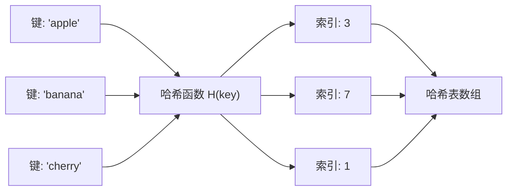
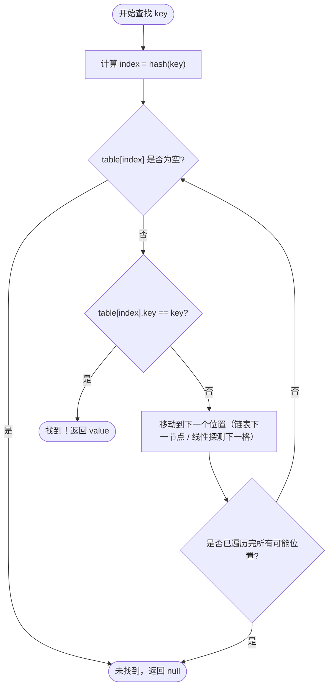

# 哈希查找（Hash Search）

## 1. 算法定位

| 维度 | 说明 |
|------|------|
| 所属类别 | 查找算法 — 基于哈希的查找 |
| 解决问题 | 通过**键（Key）直接定位到值（Value）的存储位置**，实现接近 O(1) 的查找 |
| 适用场景 | 频繁查找、需要快速判断元素是否存在、键值对映射、去重统计 |

## 2. 一句话理解

> 用一个**数学公式（哈希函数）**把键直接变成数组下标，查找时不用逐个比较，**一步到位**。

## 3. 生活化比喻

想象一个有 1000 个格子的快递柜：

- **存快递**：根据你的手机尾号（比如 `6789`），取模运算 `6789 % 1000 = 789`，把快递放在第 789 号格子
- **取快递**：输入手机尾号 `6789`，系统算出 `789`，直接打开第 789 号格子
- **冲突处理**：如果两个人的手机尾号模 1000 都是 789，就需要处理"冲突" — 比如在 789 号格子后面挂一个链条，串联多个快递

不需要一个一个找，**直接算出位置**，这就是哈希查找的核心。

## 4. 核心思想

```
哈希函数: 将任意键 → 映射为数组下标
存储:    arr[hash(key)] = value
查找:    直接访问 arr[hash(key)]

核心问题: 不同的 key 可能映射到相同的下标（哈希冲突）
解决方案: 链地址法（Chaining）或 开放地址法（Open Addressing）
```

### 哈希函数的工作原理



## 5. 图解推演

### 构建哈希表：插入 [12, 25, 36, 20, 18, 5]，表大小 = 7，哈希函数 = key % 7

```
计算每个键的哈希值：
  12 % 7 = 5
  25 % 7 = 4
  36 % 7 = 1
  20 % 7 = 6
  18 % 7 = 4  ← 与 25 冲突！
   5 % 7 = 5  ← 与 12 冲突！

=== 链地址法（Chaining）===

索引 0: [空]
索引 1: [36] →null
索引 2: [空]
索引 3: [空]
索引 4: [25] → [18] →null
索引 5: [12] → [5] →null
索引 6: [20] →null

查找 18:
  1) hash(18) = 18 % 7 = 4
  2) 到索引 4 的链表: [25] → 25≠18, 继续 → [18] → 命中！

查找 10:
  1) hash(10) = 10 % 7 = 3
  2) 索引 3 为空 → 不存在！
```

### 开放地址法（线性探测）

```
插入顺序: 12, 25, 36, 20, 18, 5

12 % 7 = 5 → 索引5空 → 放入
  [_] [_] [_] [_] [_] [12] [_]
   0   1   2   3   4    5   6

25 % 7 = 4 → 索引4空 → 放入
  [_] [_] [_] [_] [25] [12] [_]
   0   1   2   3    4    5   6

36 % 7 = 1 → 索引1空 → 放入
  [_] [36] [_] [_] [25] [12] [_]
   0    1   2   3    4    5   6

20 % 7 = 6 → 索引6空 → 放入
  [_] [36] [_] [_] [25] [12] [20]
   0    1   2   3    4    5    6

18 % 7 = 4 → 索引4已占(25) → 探测5已占(12) → 探测6已占(20) → 探测0空 → 放入
  [18] [36] [_] [_] [25] [12] [20]
   0     1   2   3    4    5    6

5 % 7 = 5 → 索引5已占(12) → 探测6已占(20) → 探测0已占(18) → 探测1已占(36) → 探测2空 → 放入
  [18] [36] [5] [_] [25] [12] [20]
   0     1   2   3    4    5    6
```

### Mermaid 流程图：哈希查找过程



## 6. 执行步骤

### 插入操作

1. 计算键的哈希值：`index = hash(key) % tableSize`
2. 如果 `table[index]` 为空，直接存入
3. 如果 `table[index]` 已被占用（冲突），按冲突解决策略找到新位置
4. 存入键值对

### 查找操作

1. 计算键的哈希值：`index = hash(key) % tableSize`
2. 访问 `table[index]`
3. 如果为空，查找失败
4. 如果不为空，比较键是否相同
5. 相同则查找成功；不同则继续按冲突解决策略查找下一个位置
6. 直到找到或确认不存在

## 7. C# 实现

### 7.1 使用 C# 内置 Dictionary（推荐日常使用）

```csharp
using System;
using System.Collections.Generic;

class DictionaryDemo
{
    static void Main(string[] args)
    {
        Console.WriteLine("===== C# Dictionary 哈希查找演示 =====\n");

        // 创建字典（内部基于哈希表实现）
        Dictionary<string, int> studentScores = new Dictionary<string, int>();

        // 插入键值对
        studentScores["张三"] = 95;
        studentScores["李四"] = 87;
        studentScores["王五"] = 92;
        studentScores["赵六"] = 78;
        studentScores["孙七"] = 88;

        // ===== 查找操作 =====

        // 方式 1：直接用索引器访问（键不存在会抛异常）
        Console.WriteLine($"张三的成绩: {studentScores["张三"]}");  // 95

        // 方式 2：TryGetValue（推荐，安全）
        if (studentScores.TryGetValue("李四", out int score))
        {
            Console.WriteLine($"李四的成绩: {score}");  // 87
        }

        // 方式 3：ContainsKey 判断是否存在
        if (studentScores.ContainsKey("王八"))
        {
            Console.WriteLine("找到了");
        }
        else
        {
            Console.WriteLine("王八不在名单中");  // 输出这行
        }

        // ===== 常用操作 =====

        // 遍历所有键值对
        Console.WriteLine("\n所有学生成绩:");
        foreach (var kvp in studentScores)
        {
            Console.WriteLine($"  {kvp.Key}: {kvp.Value}");
        }

        // 统计数量
        Console.WriteLine($"\n学生总数: {studentScores.Count}");  // 5

        // 删除
        studentScores.Remove("赵六");
        Console.WriteLine($"删除赵六后，学生总数: {studentScores.Count}");  // 4

        // ===== 实际应用：统计字符频率 =====
        Console.WriteLine("\n===== 字符频率统计 =====");
        string text = "hello world";
        Dictionary<char, int> freq = new Dictionary<char, int>();

        foreach (char c in text)
        {
            if (c == ' ') continue;  // 跳过空格

            // 如果字符已存在，计数+1；否则初始化为1
            if (freq.ContainsKey(c))
                freq[c]++;
            else
                freq[c] = 1;
        }

        foreach (var kvp in freq)
        {
            Console.WriteLine($"  '{kvp.Key}': {kvp.Value} 次");
        }
    }
}
```

### 7.2 手动实现哈希表（链地址法）

```csharp
using System;
using System.Collections.Generic;

/// <summary>
/// 手动实现的哈希表（链地址法解决冲突）
/// 用于演示哈希查找的底层原理
/// </summary>
class MyHashTable<TKey, TValue>
{
    /// <summary>
    /// 链表节点，存储键值对
    /// </summary>
    private class Node
    {
        public TKey Key;      // 键
        public TValue Value;  // 值
        public Node Next;     // 指向下一个节点（处理冲突）

        public Node(TKey key, TValue value)
        {
            Key = key;
            Value = value;
            Next = null;
        }
    }

    private Node[] buckets;   // 桶数组（每个桶是一个链表的头节点）
    private int capacity;     // 桶的数量
    private int count;        // 当前存储的键值对数量

    /// <summary>
    /// 构造函数：初始化指定容量的哈希表
    /// </summary>
    public MyHashTable(int capacity = 16)
    {
        this.capacity = capacity;
        this.buckets = new Node[capacity];
        this.count = 0;
    }

    /// <summary>
    /// 哈希函数：将键转化为桶索引
    /// </summary>
    private int GetBucketIndex(TKey key)
    {
        // 使用 key 的 GetHashCode() 取绝对值后对容量取模
        int hash = Math.Abs(key.GetHashCode());
        return hash % capacity;
    }

    /// <summary>
    /// 插入或更新键值对
    /// </summary>
    public void Put(TKey key, TValue value)
    {
        int index = GetBucketIndex(key);
        Node current = buckets[index];

        // 遍历链表，查看 key 是否已存在
        while (current != null)
        {
            if (current.Key.Equals(key))
            {
                current.Value = value;  // key 已存在，更新值
                return;
            }
            current = current.Next;
        }

        // key 不存在，在链表头部插入新节点
        Node newNode = new Node(key, value);
        newNode.Next = buckets[index];  // 新节点指向原链表头
        buckets[index] = newNode;       // 新节点成为链表头
        count++;
    }

    /// <summary>
    /// 查找：根据键获取值
    /// </summary>
    public TValue Get(TKey key)
    {
        int index = GetBucketIndex(key);
        Node current = buckets[index];

        // 遍历该桶的链表
        while (current != null)
        {
            if (current.Key.Equals(key))
                return current.Value;   // 找到，返回值
            current = current.Next;
        }

        // 未找到，抛出异常
        throw new KeyNotFoundException($"键 '{key}' 不存在");
    }

    /// <summary>
    /// 安全查找：类似 TryGetValue
    /// </summary>
    public bool TryGet(TKey key, out TValue value)
    {
        int index = GetBucketIndex(key);
        Node current = buckets[index];

        while (current != null)
        {
            if (current.Key.Equals(key))
            {
                value = current.Value;
                return true;
            }
            current = current.Next;
        }

        value = default;
        return false;
    }

    /// <summary>
    /// 判断键是否存在
    /// </summary>
    public bool ContainsKey(TKey key)
    {
        int index = GetBucketIndex(key);
        Node current = buckets[index];

        while (current != null)
        {
            if (current.Key.Equals(key)) return true;
            current = current.Next;
        }
        return false;
    }

    /// <summary>
    /// 删除键值对
    /// </summary>
    public bool Remove(TKey key)
    {
        int index = GetBucketIndex(key);
        Node current = buckets[index];
        Node prev = null;

        while (current != null)
        {
            if (current.Key.Equals(key))
            {
                if (prev == null)
                    buckets[index] = current.Next;  // 删除的是头节点
                else
                    prev.Next = current.Next;       // 删除的是中间/尾部节点

                count--;
                return true;
            }
            prev = current;
            current = current.Next;
        }

        return false;  // 键不存在
    }

    /// <summary>
    /// 打印哈希表内部结构（用于调试和演示）
    /// </summary>
    public void PrintTable()
    {
        Console.WriteLine($"哈希表 (容量:{capacity}, 元素数:{count}, 负载因子:{(double)count / capacity:F2})");
        for (int i = 0; i < capacity; i++)
        {
            Console.Write($"  桶[{i}]: ");
            Node current = buckets[i];
            if (current == null)
            {
                Console.WriteLine("[空]");
            }
            else
            {
                while (current != null)
                {
                    Console.Write($"[{current.Key}:{current.Value}]");
                    if (current.Next != null) Console.Write(" → ");
                    current = current.Next;
                }
                Console.WriteLine();
            }
        }
    }

    public int Count => count;
}

class HashTableDemo
{
    static void Main(string[] args)
    {
        Console.WriteLine("===== 手动哈希表演示 =====\n");

        // 使用较小的容量以便观察冲突
        MyHashTable<int, string> table = new MyHashTable<int, string>(7);

        // 插入数据
        table.Put(12, "十二");
        table.Put(25, "二十五");
        table.Put(36, "三十六");
        table.Put(20, "二十");
        table.Put(18, "十八");   // 18%7=4，与 25 冲突
        table.Put(5, "五");      // 5%7=5，与 12 冲突

        // 打印哈希表结构
        table.PrintTable();

        // 查找操作
        Console.WriteLine($"\n查找 18: {table.Get(18)}");          // 十八
        Console.WriteLine($"查找 36: {table.Get(36)}");            // 三十六
        Console.WriteLine($"是否包含 10: {table.ContainsKey(10)}"); // False

        // 安全查找
        if (table.TryGet(25, out string val))
            Console.WriteLine($"查找 25: {val}");                  // 二十五

        // 删除操作
        table.Remove(25);
        Console.WriteLine($"\n删除 25 后:");
        table.PrintTable();

        // 验证冲突链上的元素仍然可以查找
        Console.WriteLine($"\n查找 18（与已删除的25曾在同一桶）: {table.Get(18)}");
    }
}
```

### 7.3 手动实现哈希表（开放地址法 — 线性探测）

```csharp
using System;

/// <summary>
/// 开放地址法哈希表（线性探测）
/// 所有元素都直接存在数组中，冲突时向后探测空位
/// </summary>
class OpenAddressHashTable
{
    private int?[] keys;       // 键数组（用 null 表示空位）
    private string[] values;   // 值数组
    private bool[] deleted;    // 标记是否被删除（懒删除）
    private int capacity;
    private int count;

    public OpenAddressHashTable(int capacity = 16)
    {
        this.capacity = capacity;
        this.keys = new int?[capacity];
        this.values = new string[capacity];
        this.deleted = new bool[capacity];
        this.count = 0;
    }

    /// <summary>
    /// 哈希函数
    /// </summary>
    private int Hash(int key)
    {
        return Math.Abs(key) % capacity;
    }

    /// <summary>
    /// 插入键值对
    /// </summary>
    public void Put(int key, string value)
    {
        if (count >= capacity * 0.7)  // 负载因子超过 0.7 应扩容（此处简化省略）
        {
            Console.WriteLine("警告: 负载因子过高，应进行扩容!");
        }

        int index = Hash(key);

        // 线性探测：找到空位或找到相同的 key
        for (int i = 0; i < capacity; i++)
        {
            int probeIndex = (index + i) % capacity;

            // 空位或被删除的位置可以插入
            if (keys[probeIndex] == null || deleted[probeIndex])
            {
                keys[probeIndex] = key;
                values[probeIndex] = value;
                deleted[probeIndex] = false;
                count++;
                return;
            }

            // 如果 key 已存在，更新值
            if (keys[probeIndex] == key && !deleted[probeIndex])
            {
                values[probeIndex] = value;
                return;
            }
        }
    }

    /// <summary>
    /// 查找
    /// </summary>
    public string Get(int key)
    {
        int index = Hash(key);

        for (int i = 0; i < capacity; i++)
        {
            int probeIndex = (index + i) % capacity;

            // 遇到空位说明不存在（注意：被删除的位置不算空位）
            if (keys[probeIndex] == null && !deleted[probeIndex])
                return null;

            // 找到匹配的 key 且未被删除
            if (keys[probeIndex] == key && !deleted[probeIndex])
                return values[probeIndex];
        }

        return null;  // 遍历一圈未找到
    }

    /// <summary>
    /// 删除（懒删除：标记为已删除，不真正移除）
    /// </summary>
    public bool Remove(int key)
    {
        int index = Hash(key);

        for (int i = 0; i < capacity; i++)
        {
            int probeIndex = (index + i) % capacity;

            if (keys[probeIndex] == null && !deleted[probeIndex])
                return false;  // 空位，不存在

            if (keys[probeIndex] == key && !deleted[probeIndex])
            {
                deleted[probeIndex] = true;  // 标记为已删除
                count--;
                return true;
            }
        }

        return false;
    }

    /// <summary>
    /// 打印内部结构
    /// </summary>
    public void PrintTable()
    {
        Console.WriteLine($"开放地址哈希表 (容量:{capacity}, 元素数:{count})");
        for (int i = 0; i < capacity; i++)
        {
            if (keys[i] == null)
                Console.WriteLine($"  [{i}]: [空]");
            else if (deleted[i])
                Console.WriteLine($"  [{i}]: [已删除: {keys[i]}]");
            else
                Console.WriteLine($"  [{i}]: {keys[i]} → \"{values[i]}\"");
        }
    }
}

class OpenAddressDemo
{
    static void Main(string[] args)
    {
        Console.WriteLine("===== 开放地址法（线性探测）演示 =====\n");

        OpenAddressHashTable table = new OpenAddressHashTable(7);

        table.Put(12, "十二");   // 12%7=5
        table.Put(25, "二十五"); // 25%7=4
        table.Put(36, "三十六"); // 36%7=1
        table.Put(20, "二十");   // 20%7=6
        table.Put(18, "十八");   // 18%7=4 → 冲突 → 探测到 0
        table.Put(5, "五");      // 5%7=5 → 冲突 → 探测到 2（经过6,0,1）

        table.PrintTable();

        Console.WriteLine($"\n查找 18: {table.Get(18)}");   // 十八
        Console.WriteLine($"查找 99: {table.Get(99)}");     // (null)
    }
}
```

## 8. 示例演示

### 手动推演：链地址法查找 `18`，哈希表容量为 7

```
哈希表状态:
  桶[0]: [空]
  桶[1]: [36]
  桶[2]: [空]
  桶[3]: [空]
  桶[4]: [25] → [18]
  桶[5]: [12] → [5]
  桶[6]: [20]

查找 18:
  步骤 1: hash(18) = 18 % 7 = 4
  步骤 2: 访问桶[4]，头节点 key=25, 25≠18 → 继续
  步骤 3: 下一节点 key=18, 18==18 → 命中！

比较次数: 2 次
```

### 手动推演：线性探测法查找 `18`

```
哈希表状态:
  [0]: 18    [1]: 36    [2]: 5     [3]: 空
  [4]: 25    [5]: 12    [6]: 20

查找 18:
  步骤 1: hash(18) = 18 % 7 = 4 → arr[4]=25, 25≠18 → 继续探测
  步骤 2: 探测索引 5 → arr[5]=12, 12≠18 → 继续
  步骤 3: 探测索引 6 → arr[6]=20, 20≠18 → 继续
  步骤 4: 探测索引 0 → arr[0]=18, 18==18 → 命中！

比较次数: 4 次（线性探测在冲突多时退化明显）
```

## 9. 复杂度分析

| 指标 | 平均情况 | 最坏情况 | 说明 |
|------|---------|---------|------|
| **查找时间** | O(1) | O(n) | 最坏情况所有键都冲突到同一桶 |
| **插入时间** | O(1) | O(n) | 同上 |
| **删除时间** | O(1) | O(n) | 同上 |
| **空间复杂度** | O(n) | O(n) | 需要额外空间存储哈希表 |

### 负载因子与性能

```
负载因子 α = 元素数量 / 桶数量

α < 0.7  → 性能优秀，冲突较少
α ≈ 0.7  → 应考虑扩容
α > 1.0  → 链地址法仍可工作但性能下降，开放地址法必须扩容

C# Dictionary 默认在 α > 0.72 时自动扩容为约两倍大小
```

## 10. 易错点

| 易错点 | 说明 |
|--------|------|
| **哈希函数选取不当** | 差的哈希函数导致大量冲突，O(1) 退化为 O(n) |
| **忘记处理哈希冲突** | 不同的键可能产生相同的哈希值，必须有冲突解决方案 |
| **开放地址法的删除** | 不能直接置空，否则会断开探测链，应使用"懒删除"标记 |
| **负载因子过高未扩容** | 元素数量接近容量时性能急剧下降 |
| **可变对象作为键** | 如果键对象的 `GetHashCode()` 在插入后发生变化，将无法再找到该元素 |
| **null 键的处理** | C# Dictionary 不允许 null 作为键，会抛出 `ArgumentNullException` |

## 11. 相似算法对比

| 对比维度 | 哈希查找 | 线性查找 | 二分查找 | BST 查找 |
|----------|----------|----------|----------|----------|
| **时间（平均）** | O(1) | O(n) | O(log n) | O(log n) |
| **时间（最坏）** | O(n) | O(n) | O(log n) | O(n) |
| **空间** | O(n) | O(1) | O(1) | O(n) |
| **是否需要有序** | 否 | 否 | 是 | 天然有序 |
| **是否支持范围查询** | 否 | 是 | 是 | 是 |
| **实现复杂度** | 中等 | 简单 | 中等 | 较高 |

### 两种冲突解决策略对比

| 对比维度 | 链地址法（Chaining） | 开放地址法（Open Addressing） |
|----------|---------------------|------------------------------|
| **存储结构** | 数组 + 链表 | 纯数组 |
| **负载因子** | 可 > 1 | 必须 < 1 |
| **删除操作** | 简单（直接删链表节点） | 复杂（需要懒删除） |
| **缓存友好** | 差（链表分散在内存） | 好（连续内存） |
| **适用场景** | 冲突较多、需要频繁删除 | 数据量可预估、冲突较少 |

## 12. 前置知识与延伸学习

### 前置知识

- **取模运算**：理解 `%` 运算符将任意整数映射到固定范围
- **链表基础**：链地址法需要链表操作
- **C# GetHashCode()**：了解 .NET 中对象的哈希值生成机制

### 延伸学习

- **一致性哈希**：分布式系统中的节点映射，解决扩容/缩容时的数据迁移问题
- **布隆过滤器（Bloom Filter）**：用多个哈希函数实现高效的"可能存在/一定不存在"判断
- **完美哈希**：在已知所有键的情况下，构造无冲突的哈希函数
- **加密哈希**（MD5, SHA）：单向不可逆的哈希函数，用于数据完整性校验
- **HashSet**：只存键不存值的哈希结构，用于快速去重和判存

## 13. 记忆口诀

```
哈希查找一步到，
函数映射是关键。
冲突避免两条路：
链表挂接或探测。
负载因子要控制，
七成左右刚刚好。
平均 O(1) 最快速，
空间换来时间省。
```

## 14. 面试常问点

1. **哈希表的查找时间复杂度是多少？为什么可能退化？**
   - 平均 O(1)，最坏 O(n)
   - 所有键都冲突到同一桶时，链表退化为线性查找

2. **链地址法和开放地址法的区别？**
   - 链地址法：冲突的元素挂在链表上，简单但缓存不友好
   - 开放地址法：在数组内探测空位，缓存友好但删除复杂

3. **什么是负载因子？为什么重要？**
   - 负载因子 = 元素数 / 桶数，反映哈希表的拥挤程度
   - 负载因子越高，冲突越频繁，性能越差
   - C# Dictionary 在 72% 时自动扩容

4. **为什么不能用可变对象作为 Dictionary 的键？**
   - 如果对象的 `GetHashCode()` 在插入后改变，哈希值变了，就找不到原来的桶了
   - 推荐使用不可变类型（string、int、自定义的不可变对象）

5. **哈希表 vs 平衡 BST，如何选择？**
   - 哈希表：查找 O(1) 但不支持有序遍历
   - BST：查找 O(log n) 但支持范围查询和有序遍历

6. **如何设计一个好的哈希函数？**
   - 均匀分布：不同的键尽量映射到不同的桶
   - 计算高效：哈希函数本身不能太慢
   - 确定性：相同的键必须始终返回相同的哈希值

## 15. 一页总结

```
┌─────────────────────────────────────────────────┐
│              哈希查找 · 一页总结                  │
├─────────────────────────────────────────────────┤
│                                                  │
│  核心思想: 哈希函数将 key 直接映射为数组下标      │
│           不用比较，一步定位                      │
│                                                  │
│  时间复杂度: 平均 O(1)，最坏 O(n)               │
│  空间复杂度: O(n)                                │
│                                                  │
│  冲突解决:                                       │
│    1. 链地址法 — 同一桶挂链表                    │
│    2. 开放地址法 — 在数组内探测空位              │
│                                                  │
│  关键指标: 负载因子 α = 元素数/桶数              │
│    α < 0.7 性能好，> 0.7 应扩容                  │
│                                                  │
│  C# 对应:                                        │
│    Dictionary<K,V> — 键值对                      │
│    HashSet<T>      — 判存去重                    │
│                                                  │
│  注意: 不支持范围查询，键必须不可变              │
│                                                  │
│  记忆: 一步到位 O(1)，冲突是核心问题            │
│                                                  │
└─────────────────────────────────────────────────┘
```
