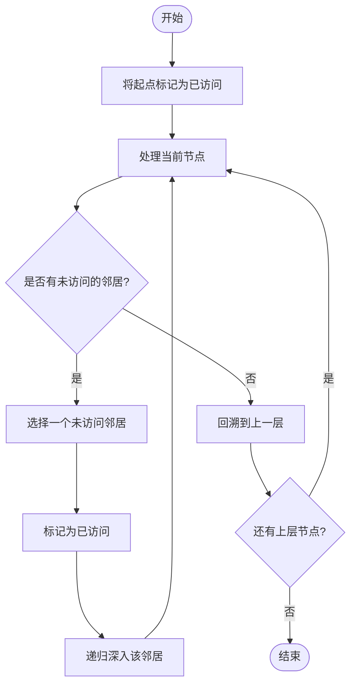

# 深度优先搜索 DFS（Depth-First Search）

## 1. 算法定位

| 维度 | 说明 |
|------|------|
| 所属类别 | 查找/搜索算法 — 图与树的遍历 |
| 解决问题 | 遍历或搜索**树、图**结构中的所有节点，或寻找从起点到目标的路径 |
| 适用场景 | 路径查找、连通性检测、拓扑排序、迷宫求解、回溯问题（全排列、组合、子集） |

## 2. 一句话理解

> 沿着一条路**一直走到底**，走不通了就**退回来换条路**继续走，直到走遍所有地方。

## 3. 生活化比喻

想象你在一个陌生的迷宫里找出口：

- 你在每个岔路口都选择**最左边的路**走下去
- 走到**死胡同**就**原路退回**到上一个岔路口
- 换一条没走过的路继续深入
- 重复以上过程，直到找到出口或走遍整个迷宫

这种"一条路走到黑，不行就退回来"的策略，就是 DFS。

## 4. 核心思想

```
1. 从起点出发，访问当前节点
2. 选择一个未访问的邻居，深入探索
3. 递归地对该邻居执行同样操作
4. 当所有邻居都已访问，回溯到上一层
5. 重复直到所有可达节点都被访问
```

关键特征：
- **后进先出（LIFO）**：最新发现的节点最先被探索
- 实现方式：**递归**（系统栈）或 **显式栈**
- 不保证找到最短路径

## 5. 图解推演

### 5.1 树的 DFS 遍历

```
        1
       / \
      2   3
     / \   \
    4   5   6
   /
  7

DFS 遍历顺序（前序）: 1 → 2 → 4 → 7 → 5 → 3 → 6

推演过程:
  访问 1 → 深入左子树
    访问 2 → 深入左子树
      访问 4 → 深入左子树
        访问 7 → 无子节点，回溯到 4
      4 的右子树为空，回溯到 2
      访问 5 → 无子节点，回溯到 2
    回溯到 1
    访问 3 → 深入右子树
      访问 6 → 无子节点，回溯到 3
    回溯到 1
  结束
```

### 5.2 图的 DFS 遍历

```
图结构:
    0 --- 1
    |     |
    2 --- 3
    |
    4

邻接表:
  0: [1, 2]
  1: [0, 3]
  2: [0, 3, 4]
  3: [1, 2]
  4: [2]

从节点 0 开始 DFS:

步骤 1: 访问 0，标记已访问     栈: [0]       已访问: {0}
步骤 2: 深入到 1               栈: [0, 1]    已访问: {0, 1}
步骤 3: 从 1 深入到 3           栈: [0, 1, 3] 已访问: {0, 1, 3}
步骤 4: 3 的邻居 1 已访问，2 未访问
        深入到 2               栈: [0,1,3,2]  已访问: {0, 1, 3, 2}
步骤 5: 2 的邻居 0,3 已访问，4 未访问
        深入到 4               栈: [0,1,3,2,4] 已访问: {0,1,3,2,4}
步骤 6: 4 无未访问的邻居，回溯  栈: [0,1,3,2]
步骤 7: 2 无未访问邻居，回溯    栈: [0,1,3]
步骤 8: 3 无未访问邻居，回溯    栈: [0,1]
步骤 9: 1 无未访问邻居，回溯    栈: [0]
步骤10: 0 无未访问邻居，结束    栈: []

DFS 访问顺序: 0 → 1 → 3 → 2 → 4
```

### 5.3 DFS 与栈的关系

```
              ┌───┐
              │ 4 │  ← 栈顶（最新发现的节点）
              ├───┤
              │ 2 │
              ├───┤
              │ 3 │
              ├───┤
              │ 1 │
              ├───┤
              │ 0 │  ← 栈底（起点）
              └───┘

DFS 总是先处理栈顶元素 → 后进先出 → 深度优先
```

### Mermaid 流程图



## 6. 执行步骤

### 递归版本

1. 将起始节点标记为**已访问**
2. 处理当前节点（打印 / 记录）
3. 遍历当前节点的所有邻居
4. 对每个**未访问**的邻居，**递归**调用 DFS
5. 当所有邻居都已访问，自动回溯（函数返回）

### 迭代版本（显式栈）

1. 将起始节点压入**栈**
2. 循环直到栈为空：
   - 弹出栈顶节点
   - 如果该节点**未访问**，标记为已访问并处理
   - 将该节点的所有**未访问**邻居压入栈
3. 栈为空时，所有可达节点都已访问

## 7. C# 实现

### 7.1 图的 DFS（递归版）

```csharp
using System;
using System.Collections.Generic;

class DfsRecursiveDemo
{
    // 邻接表表示图
    static Dictionary<int, List<int>> graph = new Dictionary<int, List<int>>();

    // 记录已访问的节点
    static HashSet<int> visited = new HashSet<int>();

    // DFS 访问顺序
    static List<int> order = new List<int>();

    /// <summary>
    /// 递归 DFS
    /// </summary>
    /// <param name="node">当前节点</param>
    static void DFS(int node)
    {
        // 标记当前节点为已访问
        visited.Add(node);
        order.Add(node);

        Console.WriteLine($"  访问节点 {node}，当前路径: [{string.Join(" → ", order)}]");

        // 遍历所有邻居
        if (graph.ContainsKey(node))
        {
            foreach (int neighbor in graph[node])
            {
                // 只访问未访问过的邻居
                if (!visited.Contains(neighbor))
                {
                    DFS(neighbor);  // 递归深入
                }
            }
        }

        // 所有邻居都已访问，自动回溯（函数返回）
    }

    /// <summary>
    /// 添加无向边
    /// </summary>
    static void AddEdge(int u, int v)
    {
        if (!graph.ContainsKey(u)) graph[u] = new List<int>();
        if (!graph.ContainsKey(v)) graph[v] = new List<int>();
        graph[u].Add(v);
        graph[v].Add(u);
    }

    static void Main(string[] args)
    {
        Console.WriteLine("===== DFS 递归版演示 =====\n");

        // 构建图:
        //   0 --- 1
        //   |     |
        //   2 --- 3
        //   |
        //   4
        AddEdge(0, 1);
        AddEdge(0, 2);
        AddEdge(1, 3);
        AddEdge(2, 3);
        AddEdge(2, 4);

        Console.WriteLine("图结构:");
        Console.WriteLine("  0 --- 1");
        Console.WriteLine("  |     |");
        Console.WriteLine("  2 --- 3");
        Console.WriteLine("  |");
        Console.WriteLine("  4\n");

        Console.WriteLine("从节点 0 开始 DFS:");
        DFS(0);

        Console.WriteLine($"\nDFS 完整顺序: [{string.Join(" → ", order)}]");
    }
}
```

### 7.2 图的 DFS（迭代版 — 显式栈）

```csharp
using System;
using System.Collections.Generic;

class DfsIterativeDemo
{
    /// <summary>
    /// 迭代 DFS（使用显式栈）
    /// </summary>
    /// <param name="graph">邻接表</param>
    /// <param name="start">起始节点</param>
    /// <returns>DFS 访问顺序</returns>
    static List<int> DFS(Dictionary<int, List<int>> graph, int start)
    {
        List<int> order = new List<int>();          // 访问顺序
        HashSet<int> visited = new HashSet<int>();  // 已访问集合
        Stack<int> stack = new Stack<int>();        // 显式栈

        // 将起始节点压入栈
        stack.Push(start);

        while (stack.Count > 0)
        {
            // 弹出栈顶节点
            int node = stack.Pop();

            // 如果已经访问过，跳过
            if (visited.Contains(node))
                continue;

            // 标记为已访问并记录
            visited.Add(node);
            order.Add(node);

            // 将未访问的邻居压入栈
            // 注意：为了让左边的邻居先被访问，需要逆序压栈
            if (graph.ContainsKey(node))
            {
                List<int> neighbors = graph[node];
                for (int i = neighbors.Count - 1; i >= 0; i--)
                {
                    if (!visited.Contains(neighbors[i]))
                    {
                        stack.Push(neighbors[i]);
                    }
                }
            }
        }

        return order;
    }

    static void Main(string[] args)
    {
        Console.WriteLine("===== DFS 迭代版（显式栈）演示 =====\n");

        // 构建图
        var graph = new Dictionary<int, List<int>>
        {
            { 0, new List<int> { 1, 2 } },
            { 1, new List<int> { 0, 3 } },
            { 2, new List<int> { 0, 3, 4 } },
            { 3, new List<int> { 1, 2 } },
            { 4, new List<int> { 2 } }
        };

        List<int> result = DFS(graph, 0);
        Console.WriteLine($"DFS 访问顺序: [{string.Join(" → ", result)}]");
        // 输出: 0 → 1 → 3 → 2 → 4
    }
}
```

### 7.3 二叉树的 DFS（前序、中序、后序）

```csharp
using System;
using System.Collections.Generic;

class TreeDfsDemo
{
    /// <summary>
    /// 二叉树节点
    /// </summary>
    class TreeNode
    {
        public int Val;
        public TreeNode Left;
        public TreeNode Right;

        public TreeNode(int val)
        {
            Val = val;
            Left = null;
            Right = null;
        }
    }

    // ===== 三种遍历方式 =====

    /// <summary>
    /// 前序遍历（根 → 左 → 右）
    /// </summary>
    static void PreOrder(TreeNode node, List<int> result)
    {
        if (node == null) return;
        result.Add(node.Val);          // 先访问根
        PreOrder(node.Left, result);   // 再遍历左子树
        PreOrder(node.Right, result);  // 最后遍历右子树
    }

    /// <summary>
    /// 中序遍历（左 → 根 → 右）
    /// </summary>
    static void InOrder(TreeNode node, List<int> result)
    {
        if (node == null) return;
        InOrder(node.Left, result);    // 先遍历左子树
        result.Add(node.Val);          // 再访问根
        InOrder(node.Right, result);   // 最后遍历右子树
    }

    /// <summary>
    /// 后序遍历（左 → 右 → 根）
    /// </summary>
    static void PostOrder(TreeNode node, List<int> result)
    {
        if (node == null) return;
        PostOrder(node.Left, result);  // 先遍历左子树
        PostOrder(node.Right, result); // 再遍历右子树
        result.Add(node.Val);          // 最后访问根
    }

    static void Main(string[] args)
    {
        Console.WriteLine("===== 二叉树 DFS 三种遍历 =====\n");

        // 构建二叉树:
        //        1
        //       / \
        //      2   3
        //     / \   \
        //    4   5   6
        TreeNode root = new TreeNode(1);
        root.Left = new TreeNode(2);
        root.Right = new TreeNode(3);
        root.Left.Left = new TreeNode(4);
        root.Left.Right = new TreeNode(5);
        root.Right.Right = new TreeNode(6);

        Console.WriteLine("二叉树结构:");
        Console.WriteLine("       1");
        Console.WriteLine("      / \\");
        Console.WriteLine("     2   3");
        Console.WriteLine("    / \\   \\");
        Console.WriteLine("   4   5   6\n");

        // 前序遍历
        List<int> preResult = new List<int>();
        PreOrder(root, preResult);
        Console.WriteLine($"前序遍历（根→左→右）: [{string.Join(", ", preResult)}]");
        // 输出: [1, 2, 4, 5, 3, 6]

        // 中序遍历
        List<int> inResult = new List<int>();
        InOrder(root, inResult);
        Console.WriteLine($"中序遍历（左→根→右）: [{string.Join(", ", inResult)}]");
        // 输出: [4, 2, 5, 1, 3, 6]

        // 后序遍历
        List<int> postResult = new List<int>();
        PostOrder(root, postResult);
        Console.WriteLine($"后序遍历（左→右→根）: [{string.Join(", ", postResult)}]");
        // 输出: [4, 5, 2, 6, 3, 1]
    }
}
```

### 7.4 DFS 应用：判断图的连通分量

```csharp
using System;
using System.Collections.Generic;

class ConnectedComponentsDemo
{
    /// <summary>
    /// 使用 DFS 找出图中所有连通分量
    /// </summary>
    static List<List<int>> FindConnectedComponents(Dictionary<int, List<int>> graph, int nodeCount)
    {
        HashSet<int> visited = new HashSet<int>();
        List<List<int>> components = new List<List<int>>();

        // 遍历所有节点
        for (int i = 0; i < nodeCount; i++)
        {
            if (!visited.Contains(i))
            {
                // 发现一个新的连通分量
                List<int> component = new List<int>();
                DFS(graph, i, visited, component);
                components.Add(component);
            }
        }

        return components;
    }

    /// <summary>
    /// DFS 遍历并收集同一连通分量中的所有节点
    /// </summary>
    static void DFS(Dictionary<int, List<int>> graph, int node,
                    HashSet<int> visited, List<int> component)
    {
        visited.Add(node);
        component.Add(node);

        if (graph.ContainsKey(node))
        {
            foreach (int neighbor in graph[node])
            {
                if (!visited.Contains(neighbor))
                    DFS(graph, neighbor, visited, component);
            }
        }
    }

    static void Main(string[] args)
    {
        Console.WriteLine("===== DFS 应用：连通分量 =====\n");

        // 构建图（包含两个连通分量）
        //   0 - 1    3 - 4
        //   |         |
        //   2         5
        var graph = new Dictionary<int, List<int>>
        {
            { 0, new List<int> { 1, 2 } },
            { 1, new List<int> { 0 } },
            { 2, new List<int> { 0 } },
            { 3, new List<int> { 4, 5 } },
            { 4, new List<int> { 3 } },
            { 5, new List<int> { 3 } }
        };

        Console.WriteLine("图结构:");
        Console.WriteLine("  0 - 1    3 - 4");
        Console.WriteLine("  |         |");
        Console.WriteLine("  2         5\n");

        var components = FindConnectedComponents(graph, 6);

        Console.WriteLine($"连通分量个数: {components.Count}");
        for (int i = 0; i < components.Count; i++)
        {
            Console.WriteLine($"  分量 {i + 1}: [{string.Join(", ", components[i])}]");
        }
        // 输出:
        // 连通分量个数: 2
        //   分量 1: [0, 1, 2]
        //   分量 2: [3, 4, 5]
    }
}
```

### 7.5 DFS 应用：路径查找

```csharp
using System;
using System.Collections.Generic;

class PathFindingDemo
{
    /// <summary>
    /// 使用 DFS 查找从 start 到 end 的一条路径
    /// </summary>
    static List<int> FindPath(Dictionary<int, List<int>> graph, int start, int end)
    {
        HashSet<int> visited = new HashSet<int>();
        List<int> path = new List<int>();

        if (DFSPath(graph, start, end, visited, path))
            return path;

        return null;  // 无路径
    }

    /// <summary>
    /// 递归 DFS 查找路径
    /// </summary>
    static bool DFSPath(Dictionary<int, List<int>> graph, int current, int end,
                        HashSet<int> visited, List<int> path)
    {
        visited.Add(current);
        path.Add(current);

        // 到达目标
        if (current == end)
            return true;

        // 尝试每个邻居
        if (graph.ContainsKey(current))
        {
            foreach (int neighbor in graph[current])
            {
                if (!visited.Contains(neighbor))
                {
                    if (DFSPath(graph, neighbor, end, visited, path))
                        return true;  // 找到路径，逐层返回 true
                }
            }
        }

        // 当前路径行不通，回溯：移除当前节点
        path.RemoveAt(path.Count - 1);
        return false;
    }

    static void Main(string[] args)
    {
        Console.WriteLine("===== DFS 应用：路径查找 =====\n");

        var graph = new Dictionary<int, List<int>>
        {
            { 0, new List<int> { 1, 2 } },
            { 1, new List<int> { 0, 3 } },
            { 2, new List<int> { 0, 3, 4 } },
            { 3, new List<int> { 1, 2, 5 } },
            { 4, new List<int> { 2 } },
            { 5, new List<int> { 3 } }
        };

        Console.WriteLine("图结构:");
        Console.WriteLine("  0 - 1");
        Console.WriteLine("  |   |");
        Console.WriteLine("  2 - 3 - 5");
        Console.WriteLine("  |");
        Console.WriteLine("  4\n");

        var path = FindPath(graph, 0, 5);
        if (path != null)
            Console.WriteLine($"从 0 到 5 的路径: [{string.Join(" → ", path)}]");
        else
            Console.WriteLine("无路径");

        // 输出: 从 0 到 5 的路径: [0 → 1 → 3 → 5]
    }
}
```

## 8. 示例演示

### 手动推演：递归 DFS 访问图

```
图:  0 --- 1
     |     |
     2 --- 3
     |
     4

调用 DFS(0):
  访问 0，邻居 [1, 2]
  ├── 调用 DFS(1)
  │     访问 1，邻居 [0, 3]
  │     ├── 0 已访问，跳过
  │     └── 调用 DFS(3)
  │           访问 3，邻居 [1, 2]
  │           ├── 1 已访问，跳过
  │           └── 调用 DFS(2)
  │                 访问 2，邻居 [0, 3, 4]
  │                 ├── 0 已访问，跳过
  │                 ├── 3 已访问，跳过
  │                 └── 调用 DFS(4)
  │                       访问 4，邻居 [2]
  │                       └── 2 已访问，跳过
  │                       回溯
  │                 回溯
  │           回溯
  │     回溯
  └── 2 已访问，跳过
  回溯

最终顺序: 0 → 1 → 3 → 2 → 4
```

## 9. 复杂度分析

| 指标 | 邻接表 | 邻接矩阵 | 说明 |
|------|--------|---------|------|
| **时间复杂度** | O(V + E) | O(V^2) | V=顶点数，E=边数 |
| **空间复杂度** | O(V) | O(V) | visited 集合 + 递归栈/显式栈 |

- **邻接表**：每个顶点和每条边各访问一次 → O(V + E)
- **邻接矩阵**：每个顶点需要扫描一整行来找邻居 → O(V^2)
- **递归深度**：最坏情况为 O(V)（链状图），可能栈溢出

## 10. 易错点

| 易错点 | 说明 |
|--------|------|
| **忘记标记已访问** | 图中有环时会导致无限递归/死循环 |
| **标记时机错误** | 应在**进入节点时**标记，而非退出时，否则同一节点可能被重复入栈 |
| **迭代版邻居入栈顺序** | 如果要保证和递归版顺序一致，邻居需要**逆序**压栈 |
| **递归栈溢出** | 图很深时递归版可能溢出，应改用迭代版 |
| **树 vs 图** | 树没有环不需要 visited，但图必须要 |
| **非连通图遗漏** | 如果图不连通，需要对所有节点尝试 DFS，而非只从一个起点出发 |

## 11. 相似算法对比

| 对比维度 | DFS（深度优先） | BFS（广度优先） |
|----------|----------------|----------------|
| **数据结构** | 栈（递归栈/显式栈） | 队列 |
| **搜索策略** | 尽可能深入 | 逐层扩展 |
| **最短路径** | 不保证 | 保证（无权图） |
| **空间复杂度** | O(V) 最坏 | O(V) 最坏 |
| **适用场景** | 路径存在性、连通分量、拓扑排序 | 最短路径、层序遍历 |
| **实现** | 递归更自然 | 队列更自然 |

## 12. 前置知识与延伸学习

### 前置知识

- **递归**：理解函数调用栈和回溯机制
- **栈**：理解后进先出（LIFO）的特性
- **图的表示**：邻接表和邻接矩阵
- **树的基本概念**：根、子节点、叶子节点

### 延伸学习

- **BFS（广度优先搜索）**：对比学习，适用于最短路径
- **回溯算法**：DFS + 剪枝，解决排列组合、N 皇后等问题
- **拓扑排序**：基于 DFS 的后序遍历，用于依赖关系排序
- **强连通分量（Tarjan/Kosaraju）**：有向图中的 DFS 高级应用
- **欧拉路径/回路**：基于 DFS 的图遍历
- **记忆化搜索**：DFS + 缓存 = 动态规划的自顶向下实现

## 13. 记忆口诀

```
深度优先一条路，
走到尽头再回头。
递归天然是DFS，
显式栈也一样走。
进门标记别忘记，
有环无标死循环。
树不需要图要记，
visited 集合保安全。
```

## 14. 面试常问点

1. **DFS 的时间和空间复杂度是多少？**
   - 时间 O(V+E)（邻接表），空间 O(V)

2. **DFS 和 BFS 的区别？什么时候用 DFS？**
   - DFS 用栈（深入优先），BFS 用队列（层级优先）
   - DFS 适用于：路径存在性判断、连通分量、拓扑排序、回溯问题
   - BFS 适用于：最短路径（无权图）、层序遍历

3. **递归版和迭代版的优劣？**
   - 递归版代码简洁，但图很深时会栈溢出
   - 迭代版用显式栈，可控制栈大小，推荐处理大规模数据

4. **如何检测图中是否有环？**
   - 无向图：DFS 中遇到已访问且非父节点的邻居就有环
   - 有向图：使用三色标记法（白/灰/黑），遇到灰色节点说明有环

5. **DFS 的前序、中序、后序有什么区别？**
   - 前序：进入节点时处理（根左右）
   - 中序：左子树处理完后处理根（左根右），BST 中序为有序序列
   - 后序：离开节点时处理（左右根），适用于需要先知道子结果的场景

6. **如何用 DFS 实现拓扑排序？**
   - 对 DAG 进行 DFS，在后序位置（所有邻居处理完毕后）将节点加入结果
   - 最终结果取反即为拓扑排序

## 15. 一页总结

```
┌─────────────────────────────────────────────────┐
│          深度优先搜索 DFS · 一页总结              │
├─────────────────────────────────────────────────┤
│                                                  │
│  核心思想: 一条路走到底，走不通就回头             │
│                                                  │
│  数据结构: 栈（递归栈 / 显式栈）                 │
│                                                  │
│  时间复杂度: O(V + E)    空间复杂度: O(V)        │
│                                                  │
│  两种实现:                                       │
│    1. 递归 — 代码简洁，有栈溢出风险              │
│    2. 迭代 — 显式栈，可控制深度                  │
│                                                  │
│  必须注意:                                       │
│    ✓ 图必须用 visited 防止重复访问               │
│    ✓ 进入节点时就标记，不要等退出                │
│    ✓ 非连通图需要对所有节点尝试 DFS              │
│                                                  │
│  典型应用:                                       │
│    路径查找 | 连通分量 | 拓扑排序 | 回溯         │
│                                                  │
│  vs BFS: DFS 不保证最短路径，BFS 保证            │
│                                                  │
│  记忆: 栈 → 深入，队列 → 层级                   │
│                                                  │
└─────────────────────────────────────────────────┘
```
