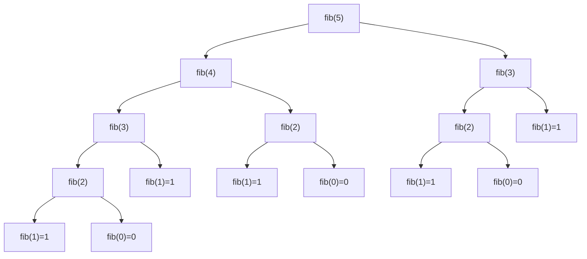

## 一、算法定位

| 维度 | 说明 |
|------|------|
| 所属分类 | 核心算法思想 / 基础范式 |
| 解决的问题 | 将大问题分解为结构相同的子问题，通过函数自身调用自身来逐层求解 |
| 典型场景 | 阶乘、斐波那契数列、汉诺塔、树的遍历、排列组合 |

---

## 二、一句话理解

> **递归就是"自己调用自己"，每次调用时问题规模变小，直到遇到最简单的情况直接返回。**

---

## 三、生活化比喻

**俄罗斯套娃（Matryoshka）：**

你拿到一个大套娃，打开它发现里面还有一个小套娃，再打开又有一个更小的……直到最后打开最小的那个，里面什么都没有（**基准情况**），然后你从最小的开始一层层装回去（**递归返回**）。

```
打开大套娃 → 打开中套娃 → 打开小套娃 → 发现空的（基准）
                                              ↓
装回小套娃 ← 装回中套娃 ← 装回大套娃 ← 开始返回
```

---

## 四、核心思想

### 4.1 递归三要素

| 要素 | 说明 | 阶乘示例 |
|------|------|----------|
| **基准情况（Base Case）** | 最小子问题，直接返回结果 | `n == 0` 时返回 `1` |
| **递归关系（Recursive Case）** | 如何把大问题拆成小问题 | `n! = n × (n-1)!` |
| **问题规模递减** | 每次调用都朝基准情况靠近 | `n → n-1 → n-2 → … → 0` |

### 4.2 为什么想到递归？

- 问题本身有 **自相似性**：大问题的结构和子问题完全一致
- 存在明确的 **终止条件**
- 用循环实现会非常复杂，但递归表达非常自然

### 4.3 调用栈原理

每次递归调用，系统会在 **调用栈** 中压入一个新的栈帧，保存局部变量和返回地址。当到达基准情况后，栈帧依次弹出，结果逐层返回。

---

## 五、图解推演

### 5.1 阶乘递归调用栈

计算 `factorial(4)` 的过程：

```
调用栈（从下往上生长）：

  ┌─────────────────────┐
  │ factorial(0) = 1    │  ← 基准情况，开始返回
  ├─────────────────────┤
  │ factorial(1) = 1×1  │  ← 等待 factorial(0) 的结果
  ├─────────────────────┤
  │ factorial(2) = 2×1  │  ← 等待 factorial(1) 的结果
  ├─────────────────────┤
  │ factorial(3) = 3×2  │  ← 等待 factorial(2) 的结果
  ├─────────────────────┤
  │ factorial(4) = 4×6  │  ← 等待 factorial(3) 的结果
  └─────────────────────┘

递推阶段（向下）：  4! → 3! → 2! → 1! → 0!
回归阶段（向上）：  1  → 1  → 2  → 6  → 24
```

### 5.2 斐波那契递归树

计算 `fib(5)` 的递归树：



> 注意：`fib(3)` 被计算了 2 次，`fib(2)` 被计算了 3 次 —— 这就是为什么朴素递归效率低，需要用**记忆化**或**动态规划**优化。

---

## 六、执行步骤

以阶乘 `factorial(n)` 为例：

1. **检查基准情况**：如果 `n == 0`，直接返回 `1`
2. **分解问题**：将 `n!` 分解为 `n × (n-1)!`
3. **递归调用**：调用 `factorial(n-1)`，等待返回结果
4. **合并结果**：将返回值乘以 `n`，得到当前层的结果
5. **逐层返回**：当所有递归调用都返回后，最终得到 `factorial(n)` 的值

---

## 七、C# 实现

### 7.1 阶乘（基础递归）

```csharp
using System;

class Program
{
    /// <summary>
    /// 递归计算阶乘
    /// 基准情况：0! = 1
    /// 递归关系：n! = n × (n-1)!
    /// </summary>
    static long Factorial(int n)
    {
        // 基准情况：0的阶乘为1
        if (n == 0) return 1;

        // 递归情况：n! = n * (n-1)!
        return n * Factorial(n - 1);
    }

    static void Main()
    {
        // 测试阶乘
        for (int i = 0; i <= 10; i++)
        {
            Console.WriteLine($"{i}! = {Factorial(i)}");
        }
        // 输出：0! = 1, 1! = 1, 2! = 2, ..., 10! = 3628800
    }
}
```

### 7.2 斐波那契数列（朴素递归 vs 记忆化递归）

```csharp
using System;
using System.Collections.Generic;

class Program
{
    // ========== 方法一：朴素递归（效率极低） ==========
    /// <summary>
    /// 朴素递归求斐波那契数
    /// 时间复杂度：O(2^n)，存在大量重复计算
    /// </summary>
    static long FibNaive(int n)
    {
        // 基准情况
        if (n <= 1) return n;

        // fib(n) = fib(n-1) + fib(n-2)
        return FibNaive(n - 1) + FibNaive(n - 2);
    }

    // ========== 方法二：记忆化递归（自顶向下） ==========
    static Dictionary<int, long> memo = new Dictionary<int, long>();

    /// <summary>
    /// 记忆化递归求斐波那契数
    /// 用字典缓存已计算的结果，避免重复计算
    /// 时间复杂度：O(n)
    /// </summary>
    static long FibMemo(int n)
    {
        // 基准情况
        if (n <= 1) return n;

        // 检查缓存：如果已经算过，直接返回
        if (memo.ContainsKey(n)) return memo[n];

        // 计算并缓存结果
        memo[n] = FibMemo(n - 1) + FibMemo(n - 2);
        return memo[n];
    }

    static void Main()
    {
        Console.WriteLine("=== 朴素递归 ===");
        for (int i = 0; i <= 10; i++)
        {
            Console.Write($"fib({i})={FibNaive(i)}  ");
        }

        Console.WriteLine("\n\n=== 记忆化递归 ===");
        Console.WriteLine($"fib(50) = {FibMemo(50)}");
        // 输出：fib(50) = 12586269025
        // 朴素递归根本算不出 fib(50)，但记忆化瞬间完成
    }
}
```

### 7.3 汉诺塔（经典递归问题）

```csharp
using System;

class Program
{
    static int moveCount = 0; // 记录移动次数

    /// <summary>
    /// 汉诺塔递归解法
    /// 将 n 个盘子从 source 柱移到 target 柱，借助 auxiliary 柱
    /// 
    /// 递归思路：
    /// 1. 把上面 n-1 个盘子从 source 移到 auxiliary（借助 target）
    /// 2. 把最大的盘子从 source 移到 target
    /// 3. 把 n-1 个盘子从 auxiliary 移到 target（借助 source）
    /// </summary>
    static void Hanoi(int n, char source, char target, char auxiliary)
    {
        // 基准情况：只有1个盘子，直接移动
        if (n == 1)
        {
            moveCount++;
            Console.WriteLine($"  第{moveCount}步：将盘子 1 从 {source} 移到 {target}");
            return;
        }

        // 第1步：将上面 n-1 个盘子从 source 移到 auxiliary
        Hanoi(n - 1, source, auxiliary, target);

        // 第2步：将最大的盘子从 source 移到 target
        moveCount++;
        Console.WriteLine($"  第{moveCount}步：将盘子 {n} 从 {source} 移到 {target}");

        // 第3步：将 n-1 个盘子从 auxiliary 移到 target
        Hanoi(n - 1, auxiliary, target, source);
    }

    static void Main()
    {
        int n = 3; // 3个盘子
        Console.WriteLine($"汉诺塔（{n}个盘子）的移动过程：");
        Hanoi(n, 'A', 'C', 'B');
        Console.WriteLine($"\n总共移动了 {moveCount} 次（公式：2^{n}-1 = {(1 << n) - 1}）");

        // 输出：
        // 第1步：将盘子 1 从 A 移到 C
        // 第2步：将盘子 2 从 A 移到 B
        // 第3步：将盘子 1 从 C 移到 B
        // 第4步：将盘子 3 从 A 移到 C
        // 第5步：将盘子 1 从 B 移到 A
        // 第6步：将盘子 2 从 B 移到 C
        // 第7步：将盘子 1 从 A 移到 C
        // 总共移动了 7 次
    }
}
```

### 7.4 尾递归优化

```csharp
using System;

class Program
{
    /// <summary>
    /// 普通递归：每层递归返回后还要做乘法运算
    /// 调用栈深度：O(n)
    /// </summary>
    static long FactorialNormal(int n)
    {
        if (n == 0) return 1;
        return n * FactorialNormal(n - 1); // 返回后还要乘以 n
    }

    /// <summary>
    /// 尾递归：递归调用是函数的最后一个操作
    /// 累积结果通过参数传递，不需要回溯时再计算
    /// 理论上编译器可以将其优化为循环，避免栈溢出
    /// 注意：C# 编译器不保证尾递归优化，但 .NET JIT 在某些情况下会优化
    /// </summary>
    static long FactorialTail(int n, long accumulator = 1)
    {
        // 基准情况：直接返回累积值
        if (n == 0) return accumulator;

        // 尾递归：结果在参数中累积，调用是最后一步操作
        return FactorialTail(n - 1, n * accumulator);
    }

    /// <summary>
    /// 手动将递归转为迭代（最可靠的优化方式）
    /// </summary>
    static long FactorialIterative(int n)
    {
        long result = 1;
        for (int i = 2; i <= n; i++)
        {
            result *= i;
        }
        return result;
    }

    static void Main()
    {
        Console.WriteLine($"普通递归：10! = {FactorialNormal(10)}");
        Console.WriteLine($"尾递归：  10! = {FactorialTail(10)}");
        Console.WriteLine($"迭代：    10! = {FactorialIterative(10)}");

        // 对比调用栈
        // 普通递归：factorial(4) → 4 * factorial(3) → 4 * (3 * factorial(2)) → ...
        // 尾递归：  factorial(4, 1) → factorial(3, 4) → factorial(2, 12) → factorial(1, 24) → factorial(0, 24) → 24
    }
}
```

---

## 八、示例演示

### 手动推演 `Factorial(4)` 的完整过程

```
调用：Factorial(4)
  └─ n=4, 不是基准情况
  └─ 需要计算 4 * Factorial(3)
     └─ 调用：Factorial(3)
        └─ n=3, 不是基准情况
        └─ 需要计算 3 * Factorial(2)
           └─ 调用：Factorial(2)
              └─ n=2, 不是基准情况
              └─ 需要计算 2 * Factorial(1)
                 └─ 调用：Factorial(1)
                    └─ n=1, 不是基准情况
                    └─ 需要计算 1 * Factorial(0)
                       └─ 调用：Factorial(0)
                          └─ n=0, 命中基准情况！
                          └─ 返回 1
                       └─ 1 * 1 = 1，返回 1
                    └─ 2 * 1 = 2，返回 2
                 └─ 3 * 2 = 6，返回 6
              └─ 4 * 6 = 24，返回 24

最终结果：Factorial(4) = 24
```

---

## 九、复杂度分析

| 问题 | 时间复杂度 | 空间复杂度（栈深度） | 说明 |
|------|-----------|---------------------|------|
| 阶乘 | O(n) | O(n) | 线性递归，每层只调用一次 |
| 朴素斐波那契 | O(2^n) | O(n) | 指数爆炸，大量重复计算 |
| 记忆化斐波那契 | O(n) | O(n) | 每个子问题只算一次 |
| 汉诺塔 | O(2^n) | O(n) | 移动次数 2^n - 1 |
| 二叉树遍历 | O(n) | O(h)，h为树高 | 每个节点访问一次 |

---

## 十、易错点

| 易错点 | 后果 | 正确做法 |
|--------|------|----------|
| 忘记写基准情况 | **栈溢出（StackOverflow）** | 永远先写基准情况 |
| 基准情况写错 | 结果错误或无限递归 | 手动验证最小输入 |
| 问题规模没有递减 | 无限递归 → 栈溢出 | 确保每次递归都朝基准靠近 |
| 重复计算子问题 | 效率极低（指数级） | 用记忆化或转为动态规划 |
| 递归层数过深 | 栈溢出 | 改为迭代或增大栈空间 |
| 混淆参数和返回值 | 逻辑错误 | 画递归树，明确每层的输入输出 |

---

## 十一、相似算法对比

| 对比项 | 递归 | 迭代（循环） | 动态规划 |
|--------|------|-------------|----------|
| 思维方式 | 自顶向下 | 自底向上 | 两种都可 |
| 代码风格 | 简洁直观 | 可能冗长 | 需要设计状态 |
| 空间开销 | 调用栈 O(n) | 通常 O(1) | 通常 O(n) |
| 重复计算 | 可能有 | 无 | 无（表格存储） |
| 适用场景 | 树/图遍历、分治 | 简单线性问题 | 有重叠子问题 |
| 栈溢出风险 | 有 | 无 | 无 |

---

## 十二、前置知识与延伸学习

### 前置知识
- **函数调用栈**：理解栈帧的压入和弹出
- **数学归纳法**：递归的数学基础

### 延伸学习
- **分治法**：递归的重要应用，将问题分成多个子问题
- **动态规划**：递归 + 记忆化的系统化方法
- **回溯法**：递归 + 撤销选择
- **树与图的遍历**：递归的经典应用场景

---

## 十三、记忆口诀

```
递归三要素，牢记不能忘：
基准情况先写好，
递归调用往下缩，
规模递减才收敛。

写递归，分两步：
一想出口在哪里，
二想如何缩问题。
```

---

## 十四、面试常问点

1. **什么是递归？递归的三要素是什么？**
   - 函数调用自身；基准情况、递归关系、问题规模递减

2. **递归和迭代的优缺点对比？**
   - 递归代码简洁但有栈溢出风险，迭代安全但可能代码复杂

3. **如何避免栈溢出？**
   - 尾递归优化、转为迭代、增大栈空间、限制递归深度

4. **什么是尾递归？C# 支持尾递归优化吗？**
   - 递归调用是函数最后一步操作；C# 编译器不保证优化，但 JIT 在特定情况下可能优化

5. **递归转迭代的通用方法？**
   - 使用显式栈模拟调用栈

---

## 十五、一页总结

```
┌──────────────────────────────────────────────────┐
│                     递 归                         │
├──────────────────────────────────────────────────┤
│  核心：函数调用自身，逐层分解直到基准情况          │
│                                                    │
│  三要素：                                          │
│    ① 基准情况（出口）                              │
│    ② 递归关系（如何拆）                            │
│    ③ 规模递减（能收敛）                            │
│                                                    │
│  经典问题：                                        │
│    · 阶乘 / 斐波那契                              │
│    · 汉诺塔                                        │
│    · 树的遍历（前/中/后序）                        │
│    · 排列组合                                      │
│                                                    │
│  优化手段：                                        │
│    · 记忆化（避免重复计算）                        │
│    · 尾递归（减少栈帧）                            │
│    · 转为迭代（彻底消除栈溢出风险）                │
│                                                    │
│  复杂度：时间取决于递归次数，空间 O(递归深度)      │
│                                                    │
│  口诀：先写出口再递归，规模递减才安全              │
└──────────────────────────────────────────────────┘
```
