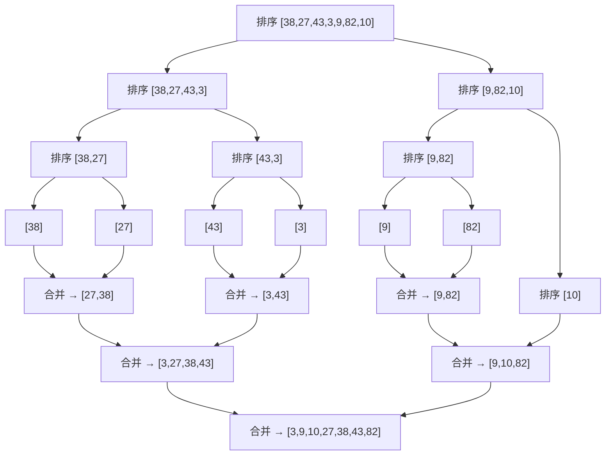

## 一、算法定位

| 维度 | 说明 |
|------|------|
| 所属分类 | 核心算法思想 / 分而治之 |
| 解决的问题 | 将一个大问题拆分成若干个结构相同的子问题，递归求解后合并结果 |
| 典型场景 | 归并排序、快速排序、最大子数组、最近点对、矩阵乘法（Strassen） |

---

## 二、一句话理解

> **分治法就是"大事化小，小事化了"——把大问题拆成小问题，分别解决，再把答案拼起来。**

---

## 三、生活化比喻

**大型歌唱比赛的评选：**

假设有 1000 名选手参加歌唱比赛，要选出冠军：
1. **分（Divide）**：把 1000 人分成 10 个小组，每组 100 人
2. **治（Conquer）**：每个小组内部比赛，选出小组冠军
3. **合（Combine）**：10 个小组冠军再比一次，选出总冠军

```
        1000人
       /  |  \
   100人 100人 ... 100人    ← 分
    ↓      ↓       ↓
  冠军A  冠军B  ... 冠军J   ← 治（各组独立解决）
    \      |       /
     总决赛 10人              ← 合
         ↓
      总冠军
```

---

## 四、核心思想

### 4.1 分治法三步骤

| 步骤 | 英文 | 说明 |
|------|------|------|
| **分（Divide）** | Divide | 将原问题分解为若干个规模更小的子问题 |
| **治（Conquer）** | Conquer | 递归地求解每个子问题；若子问题足够小则直接求解 |
| **合（Combine）** | Combine | 将子问题的解合并为原问题的解 |

### 4.2 适用条件

分治法适用的问题必须满足以下特征：

1. **可分解性**：问题可以分解为若干个规模较小的相同问题
2. **子问题独立**：子问题之间互不依赖（否则考虑动态规划）
3. **可合并性**：子问题的解可以合并为原问题的解
4. **基准情况**：存在最小规模的子问题可以直接求解

### 4.3 分治法通用框架

```
function DivideAndConquer(problem):
    if problem 足够小:
        return 直接求解(problem)
    
    子问题列表 = 分解(problem)
    
    for each 子问题 in 子问题列表:
        子解 = DivideAndConquer(子问题)
    
    return 合并(所有子解)
```

---

## 五、图解推演

### 5.1 归并排序的分治过程

对数组 `[38, 27, 43, 3, 9, 82, 10]` 进行归并排序：

```
分解阶段（自顶向下拆分）：
[38, 27, 43, 3, 9, 82, 10]
       /                \
[38, 27, 43, 3]    [9, 82, 10]
   /        \        /       \
[38, 27]  [43, 3]  [9, 82]  [10]
 /   \    /   \    /    \      |
[38] [27] [43] [3] [9] [82]  [10]   ← 基准情况

合并阶段（自底向上合并）：
[27, 38] [3, 43] [9, 82]  [10]      ← 两两合并并排序
   \        /       \       /
[3, 27, 38, 43]  [9, 10, 82]        ← 继续合并
       \              /
[3, 9, 10, 27, 38, 43, 82]          ← 最终有序数组
```

### 5.2 递归树（Mermaid）



---

## 六、执行步骤

以**归并排序**为例：

1. **基准判断**：如果数组长度 ≤ 1，直接返回（已经有序）
2. **分（Divide）**：找到数组中点 `mid`，将数组分为左右两半
3. **治（Conquer）**：递归对左半部分排序，递归对右半部分排序
4. **合（Combine）**：使用双指针将两个有序数组合并为一个有序数组
5. **返回结果**：合并后的有序数组

---

## 七、C# 实现

### 7.1 归并排序（分治经典）

```csharp
using System;

class Program
{
    /// <summary>
    /// 归并排序主函数
    /// 分治思想：将数组一分为二，分别排序，再合并
    /// </summary>
    static void MergeSort(int[] arr, int left, int right)
    {
        // 基准情况：只有一个元素或为空，无需排序
        if (left >= right) return;

        // 【分】找到中点，将数组分为两半
        int mid = left + (right - left) / 2;

        // 【治】递归排序左半部分和右半部分
        MergeSort(arr, left, mid);
        MergeSort(arr, mid + 1, right);

        // 【合】将两个有序部分合并
        Merge(arr, left, mid, right);
    }

    /// <summary>
    /// 合并两个有序子数组 arr[left..mid] 和 arr[mid+1..right]
    /// </summary>
    static void Merge(int[] arr, int left, int mid, int right)
    {
        // 创建临时数组保存合并结果
        int[] temp = new int[right - left + 1];
        int i = left;      // 左半部分的指针
        int j = mid + 1;   // 右半部分的指针
        int k = 0;         // 临时数组的指针

        // 双指针比较，将较小的元素放入临时数组
        while (i <= mid && j <= right)
        {
            if (arr[i] <= arr[j])
                temp[k++] = arr[i++];
            else
                temp[k++] = arr[j++];
        }

        // 左半部分剩余元素放入临时数组
        while (i <= mid) temp[k++] = arr[i++];

        // 右半部分剩余元素放入临时数组
        while (j <= right) temp[k++] = arr[j++];

        // 将临时数组的结果拷贝回原数组
        Array.Copy(temp, 0, arr, left, temp.Length);
    }

    static void Main()
    {
        int[] arr = { 38, 27, 43, 3, 9, 82, 10 };
        Console.WriteLine("排序前：" + string.Join(", ", arr));

        MergeSort(arr, 0, arr.Length - 1);

        Console.WriteLine("排序后：" + string.Join(", ", arr));
        // 输出：排序后：3, 9, 10, 27, 38, 43, 82
    }
}
```

### 7.2 快速排序（分治 + 分区）

```csharp
using System;

class Program
{
    /// <summary>
    /// 快速排序主函数
    /// 核心思想：选一个基准元素，将数组分为"小于基准"和"大于基准"两部分
    /// </summary>
    static void QuickSort(int[] arr, int left, int right)
    {
        // 基准情况
        if (left >= right) return;

        // 【分 + 治】分区操作，返回基准元素的最终位置
        int pivotIndex = Partition(arr, left, right);

        // 递归排序基准元素左边和右边的部分
        QuickSort(arr, left, pivotIndex - 1);
        QuickSort(arr, pivotIndex + 1, right);
    }

    /// <summary>
    /// 分区函数：选最后一个元素为基准
    /// 将小于基准的放左边，大于基准的放右边
    /// 返回基准元素最终所在的位置
    /// </summary>
    static int Partition(int[] arr, int left, int right)
    {
        int pivot = arr[right]; // 选最后一个元素为基准
        int i = left - 1;      // i 指向"小于基准"区域的最后一个元素

        for (int j = left; j < right; j++)
        {
            // 如果当前元素小于基准，放到左边区域
            if (arr[j] < pivot)
            {
                i++;
                // 交换 arr[i] 和 arr[j]
                (arr[i], arr[j]) = (arr[j], arr[i]);
            }
        }

        // 将基准元素放到正确位置（i+1）
        (arr[i + 1], arr[right]) = (arr[right], arr[i + 1]);

        return i + 1;
    }

    static void Main()
    {
        int[] arr = { 10, 80, 30, 90, 40, 50, 70 };
        Console.WriteLine("排序前：" + string.Join(", ", arr));

        QuickSort(arr, 0, arr.Length - 1);

        Console.WriteLine("排序后：" + string.Join(", ", arr));
        // 输出：排序后：10, 30, 40, 50, 70, 80, 90
    }
}
```

### 7.3 最大子数组和（分治解法）

```csharp
using System;

class Program
{
    /// <summary>
    /// 用分治法求最大子数组和
    /// 思路：最大子数组要么在左半边，要么在右半边，要么横跨中点
    /// </summary>
    static int MaxSubArray(int[] arr, int left, int right)
    {
        // 基准情况：只有一个元素
        if (left == right) return arr[left];

        int mid = left + (right - left) / 2;

        // 【情况1】最大子数组完全在左半部分
        int leftMax = MaxSubArray(arr, left, mid);

        // 【情况2】最大子数组完全在右半部分
        int rightMax = MaxSubArray(arr, mid + 1, right);

        // 【情况3】最大子数组横跨中点
        int crossMax = MaxCrossingSubArray(arr, left, mid, right);

        // 返回三种情况的最大值
        return Math.Max(Math.Max(leftMax, rightMax), crossMax);
    }

    /// <summary>
    /// 计算横跨中点的最大子数组和
    /// 从中点向左扩展 + 从中点向右扩展
    /// </summary>
    static int MaxCrossingSubArray(int[] arr, int left, int mid, int right)
    {
        // 从 mid 向左扩展，找到左边的最大和
        int leftSum = int.MinValue;
        int sum = 0;
        for (int i = mid; i >= left; i--)
        {
            sum += arr[i];
            leftSum = Math.Max(leftSum, sum);
        }

        // 从 mid+1 向右扩展，找到右边的最大和
        int rightSum = int.MinValue;
        sum = 0;
        for (int i = mid + 1; i <= right; i++)
        {
            sum += arr[i];
            rightSum = Math.Max(rightSum, sum);
        }

        // 横跨中点的最大和 = 左边最大和 + 右边最大和
        return leftSum + rightSum;
    }

    static void Main()
    {
        int[] arr = { -2, 1, -3, 4, -1, 2, 1, -5, 4 };
        Console.WriteLine("数组：" + string.Join(", ", arr));

        int result = MaxSubArray(arr, 0, arr.Length - 1);
        Console.WriteLine($"最大子数组和 = {result}");
        // 输出：最大子数组和 = 6
        // 最大子数组为 [4, -1, 2, 1]
    }
}
```

---

## 八、示例演示

### 手动推演归并排序 `[38, 27, 43, 3]`

```
第1层：MergeSort([38, 27, 43, 3], 0, 3)
  mid = 1
  ├─ 左：MergeSort([38, 27], 0, 1)
  │   mid = 0
  │   ├─ 左：MergeSort([38], 0, 0) → 基准情况，返回
  │   ├─ 右：MergeSort([27], 1, 1) → 基准情况，返回
  │   └─ Merge([38], [27]) → [27, 38]  ✓
  │
  ├─ 右：MergeSort([43, 3], 2, 3)
  │   mid = 2
  │   ├─ 左：MergeSort([43], 2, 2) → 基准情况，返回
  │   ├─ 右：MergeSort([3], 3, 3) → 基准情况，返回
  │   └─ Merge([43], [3]) → [3, 43]  ✓
  │
  └─ Merge([27, 38], [3, 43])
     i=0,j=0: 27 vs 3  → 取3   结果：[3]
     i=0,j=1: 27 vs 43 → 取27  结果：[3, 27]
     i=1,j=1: 38 vs 43 → 取38  结果：[3, 27, 38]
     剩余 43                     结果：[3, 27, 38, 43]  ✓
```

---

## 九、复杂度分析

| 算法 | 时间复杂度 | 空间复杂度 | 说明 |
|------|-----------|-----------|------|
| 归并排序 | O(n log n) | O(n) | 稳定排序，需要额外空间 |
| 快速排序 | 平均 O(n log n)，最差 O(n^2) | O(log n) | 原地排序，最差情况需随机化避免 |
| 最大子数组（分治） | O(n log n) | O(log n) | 每层 O(n)，共 log n 层 |
| 二分查找 | O(log n) | O(1) | 每次问题规模减半 |

### 主定理（Master Theorem）

分治法递推关系：`T(n) = a·T(n/b) + O(n^d)`

| 条件 | 时间复杂度 |
|------|-----------|
| d > log_b(a) | O(n^d) |
| d = log_b(a) | O(n^d · log n) |
| d < log_b(a) | O(n^(log_b(a))) |

归并排序：`T(n) = 2T(n/2) + O(n)` → a=2, b=2, d=1 → d = log_2(2) = 1 → **O(n log n)**

---

## 十、易错点

| 易错点 | 后果 | 正确做法 |
|--------|------|----------|
| 分解不均匀 | 退化为 O(n^2) | 快排用随机基准；归并取中点 |
| 合并逻辑写错 | 排序结果不正确 | 仔细处理边界和剩余元素 |
| 忘记基准情况 | 无限递归 | 子问题规模为 0 或 1 时直接返回 |
| 中点计算溢出 | 大数组时整数溢出 | 用 `left + (right - left) / 2` |
| 子问题不独立时用分治 | 大量重复计算 | 应该用动态规划 |

---

## 十一、相似算法对比

| 对比项 | 分治法 | 动态规划 | 贪心算法 |
|--------|--------|----------|----------|
| 子问题关系 | 互相独立 | 有重叠 | 无需回顾 |
| 求解方式 | 递归 + 合并 | 填表 / 记忆化 | 逐步选最优 |
| 合并步骤 | 必须有 | 通过状态转移 | 无需合并 |
| 最优性 | 不一定最优 | 保证最优 | 不一定最优 |
| 典型问题 | 排序、查找 | 背包、最长序列 | 活动选择、找零 |

---

## 十二、前置知识与延伸学习

### 前置知识
- **递归**：分治法是递归的典型应用
- **复杂度分析**：需要用主定理分析分治的复杂度

### 延伸学习
- **归并排序的变体**：逆序对计数（利用归并过程统计）
- **快排优化**：三路快排、随机化、小数组切换为插入排序
- **Strassen 矩阵乘法**：将 O(n^3) 降为 O(n^2.807)
- **最近点对问题**：平面上 n 个点中距离最近的两个点
- **Karatsuba 大数乘法**：将 O(n^2) 降为 O(n^1.585)

---

## 十三、记忆口诀

```
分治三步记心间：
分——大问题拆小块，
治——小问题各个破，
合——子答案拼完整。

适用条件要牢记：
可分、独立、能合并，
子问题结构和父同。
```

---

## 十四、面试常问点

1. **分治法的三个步骤是什么？**
   - 分（Divide）、治（Conquer）、合（Combine）

2. **归并排序和快速排序的区别？**
   - 归并：先递归后合并，稳定，O(n)额外空间；快排：先分区后递归，不稳定，原地

3. **分治法和动态规划的区别？**
   - 分治的子问题独立，DP 的子问题有重叠

4. **如何用分治法求逆序对数量？**
   - 在归并排序的合并过程中统计逆序对

5. **快排最差情况是什么？如何避免？**
   - 每次选到最大/最小元素做基准，退化为 O(n^2)；用随机化选基准

---

## 十五、一页总结

```
┌──────────────────────────────────────────────────┐
│                    分 治 法                        │
├──────────────────────────────────────────────────┤
│  核心：分解 → 递归求解 → 合并                      │
│                                                    │
│  三步骤：                                          │
│    ① 分（Divide）  — 拆成子问题                    │
│    ② 治（Conquer） — 递归/直接解决                 │
│    ③ 合（Combine） — 合并子问题的解                │
│                                                    │
│  适用条件：                                        │
│    · 子问题结构相同                                │
│    · 子问题相互独立（否则用DP）                    │
│    · 子问题的解可合并                              │
│                                                    │
│  经典问题：                                        │
│    · 归并排序 O(n log n)                           │
│    · 快速排序 O(n log n) 平均                      │
│    · 最大子数组和                                  │
│    · 逆序对计数                                    │
│                                                    │
│  复杂度：用主定理 T(n)=aT(n/b)+O(n^d) 分析        │
└──────────────────────────────────────────────────┘
```
