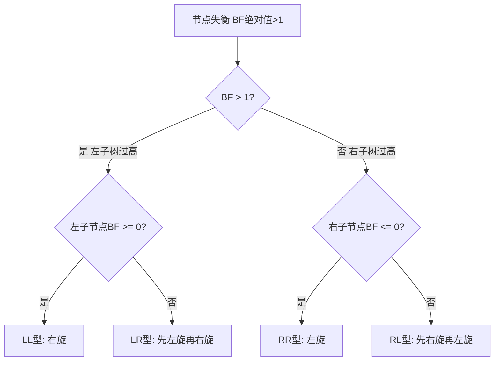

## 1. 算法定位

平衡树是对BST的优化，通过**自动调整结构**保持树的高度为O(log n)，避免退化为链表。AVL树是严格平衡的代表，红黑树是工程实践中最常用的平衡树（C# SortedDictionary/SortedSet底层实现）。

## 2. 一句话理解

> AVL树通过**旋转**保证任意节点左右子树高度差不超过1；红黑树通过**颜色规则**保证最长路径不超过最短路径的两倍。

## 3. 生活化比喻

- **AVL树**：像一个严格的图书管理员，每放入一本书都确保书架完全平衡，效率最高但整理频繁
- **红黑树**：像一个务实的管理员，允许书架稍微倾斜（不完全平衡），但保证不会太离谱，整理次数更少

## 4. 核心思想

### AVL树核心

| 概念 | 说明 |
|------|------|
| 平衡因子 | Balance Factor = 左子树高度 - 右子树高度 |
| 平衡条件 | 每个节点的平衡因子 ∈ {-1, 0, 1} |
| 失衡修复 | 通过旋转操作恢复平衡 |

### 红黑树五大性质

1. 每个节点是**红色**或**黑色**
2. 根节点是**黑色**
3. 所有叶节点（NIL）是**黑色**
4. 红色节点的子节点必须是**黑色**（不能有连续红节点）
5. 从任一节点到其所有叶节点的路径包含**相同数目的黑色节点**

## 5. 图解推演

### AVL树四种旋转

#### LL型失衡（左左）— 右旋

```
失衡前:          右旋后:
      30(BF=2)         20
      /               /  \
    20(BF=1)        10    30
    /
  10

操作：以30为轴，将20提升为根，30变为20的右子节点
```

#### RR型失衡（右右）— 左旋

```
失衡前:          左旋后:
  10(BF=-2)          20
    \               /  \
    20(BF=-1)     10    30
      \
      30

操作：以10为轴，将20提升为根，10变为20的左子节点
```

#### LR型失衡（左右）— 先左旋再右旋

```
失衡前:        左旋20后:        右旋30后:
    30(BF=2)      30(BF=2)         25
    /              /               /  \
  20(BF=-1)     25(BF=1)        20    30
    \            /
    25         20

操作：先对20左旋，变成LL型，再对30右旋
```

#### RL型失衡（右左）— 先右旋再左旋

```
失衡前:        右旋20后:        左旋10后:
  10(BF=-2)    10(BF=-2)         15
    \            \              /  \
    20(BF=1)    15(BF=-1)    10    20
    /              \
  15               20

操作：先对20右旋，变成RR型，再对10左旋
```

### 红黑树示意

```
        (8,黑)
       /      \
    (3,红)    (10,红)
    /   \        \
 (1,黑) (6,黑)  (14,黑)
         / \     /
      (4,红)(7,红)(13,红)

验证性质5：任意路径黑色节点数 = 2（不含根/叶NIL）
路径 8→3→1→NIL: 黑色数 = 2 (1, NIL)  ✓
路径 8→3→6→4→NIL: 黑色数 = 2 (6, NIL) ✓
路径 8→10→14→13→NIL: 黑色数 = 2 (14, NIL) ✓
```

### 判断旋转类型的流程



## 6. 执行步骤

### AVL插入步骤
1. 按BST规则插入新节点
2. 回溯更新路径上每个节点的高度
3. 计算平衡因子
4. 如果|BF| > 1，判断失衡类型并执行对应旋转
5. 继续回溯直到根节点

### AVL删除步骤
1. 按BST规则删除节点
2. 从删除位置向上回溯
3. 更新高度，检查平衡
4. 失衡时执行旋转（可能需要多次旋转）

### 红黑树插入步骤（概念）
1. 按BST规则插入，新节点染红色
2. 如果父节点是黑色 → 无需调整
3. 如果父节点是红色 → 违反性质4，需要调整
4. 根据叔节点颜色决定：变色 或 旋转+变色

## 7. C# 实现

```csharp
using System;
using System.Collections.Generic;

/// <summary>
/// AVL树节点定义
/// </summary>
public class AVLNode
{
    public int Val;       // 节点值
    public AVLNode Left;  // 左子节点
    public AVLNode Right; // 右子节点
    public int Height;    // 节点高度

    public AVLNode(int val)
    {
        Val = val;
        Left = null;
        Right = null;
        Height = 1;  // 新节点高度为1
    }
}

/// <summary>
/// AVL树完整实现
/// </summary>
public class AVLTree
{
    private AVLNode _root;

    /// <summary>
    /// 获取节点高度（空节点高度为0）
    /// </summary>
    private int GetHeight(AVLNode node)
    {
        return node == null ? 0 : node.Height;
    }

    /// <summary>
    /// 计算平衡因子：左子树高度 - 右子树高度
    /// </summary>
    private int GetBalanceFactor(AVLNode node)
    {
        if (node == null) return 0;
        return GetHeight(node.Left) - GetHeight(node.Right);
    }

    /// <summary>
    /// 更新节点高度
    /// </summary>
    private void UpdateHeight(AVLNode node)
    {
        node.Height = 1 + Math.Max(GetHeight(node.Left), GetHeight(node.Right));
    }

    /// <summary>
    /// 右旋操作（处理LL型失衡）
    ///     y              x
    ///    / \            / \
    ///   x   T3  →    T1   y
    ///  / \                / \
    /// T1  T2            T2  T3
    /// </summary>
    private AVLNode RotateRight(AVLNode y)
    {
        AVLNode x = y.Left;
        AVLNode T2 = x.Right;

        // 执行旋转
        x.Right = y;
        y.Left = T2;

        // 更新高度（先更新y，因为y现在是x的子节点）
        UpdateHeight(y);
        UpdateHeight(x);

        return x;  // 返回新的根节点
    }

    /// <summary>
    /// 左旋操作（处理RR型失衡）
    ///   x                y
    ///  / \              / \
    /// T1   y    →     x   T3
    ///     / \        / \
    ///    T2  T3    T1  T2
    /// </summary>
    private AVLNode RotateLeft(AVLNode x)
    {
        AVLNode y = x.Right;
        AVLNode T2 = y.Left;

        // 执行旋转
        y.Left = x;
        x.Right = T2;

        // 更新高度
        UpdateHeight(x);
        UpdateHeight(y);

        return y;  // 返回新的根节点
    }

    /// <summary>
    /// 对节点进行平衡调整
    /// </summary>
    private AVLNode Balance(AVLNode node)
    {
        UpdateHeight(node);
        int bf = GetBalanceFactor(node);

        // LL型：左子树过高，且左子节点的左子树更高
        if (bf > 1 && GetBalanceFactor(node.Left) >= 0)
            return RotateRight(node);

        // RR型：右子树过高，且右子节点的右子树更高
        if (bf < -1 && GetBalanceFactor(node.Right) <= 0)
            return RotateLeft(node);

        // LR型：左子树过高，但左子节点的右子树更高
        if (bf > 1 && GetBalanceFactor(node.Left) < 0)
        {
            node.Left = RotateLeft(node.Left);  // 先对左子节点左旋
            return RotateRight(node);            // 再对当前节点右旋
        }

        // RL型：右子树过高，但右子节点的左子树更高
        if (bf < -1 && GetBalanceFactor(node.Right) > 0)
        {
            node.Right = RotateRight(node.Right);  // 先对右子节点右旋
            return RotateLeft(node);                // 再对当前节点左旋
        }

        return node;  // 无需调整
    }

    /// <summary>
    /// 插入节点
    /// </summary>
    public void Insert(int val)
    {
        _root = InsertHelper(_root, val);
    }

    private AVLNode InsertHelper(AVLNode node, int val)
    {
        // 标准BST插入
        if (node == null)
            return new AVLNode(val);

        if (val < node.Val)
            node.Left = InsertHelper(node.Left, val);
        else if (val > node.Val)
            node.Right = InsertHelper(node.Right, val);
        else
            return node;  // 不允许重复值

        // 回溯时进行平衡调整
        return Balance(node);
    }

    /// <summary>
    /// 删除节点
    /// </summary>
    public void Delete(int val)
    {
        _root = DeleteHelper(_root, val);
    }

    private AVLNode DeleteHelper(AVLNode node, int val)
    {
        if (node == null) return null;

        // 标准BST删除
        if (val < node.Val)
            node.Left = DeleteHelper(node.Left, val);
        else if (val > node.Val)
            node.Right = DeleteHelper(node.Right, val);
        else
        {
            // 找到待删除节点
            if (node.Left == null || node.Right == null)
            {
                // 0个或1个子节点
                node = node.Left ?? node.Right;
                if (node == null) return null;
            }
            else
            {
                // 2个子节点：找中序后继
                AVLNode successor = FindMin(node.Right);
                node.Val = successor.Val;
                node.Right = DeleteHelper(node.Right, successor.Val);
            }
        }

        // 回溯时进行平衡调整
        return Balance(node);
    }

    private AVLNode FindMin(AVLNode node)
    {
        while (node.Left != null)
            node = node.Left;
        return node;
    }

    /// <summary>
    /// 中序遍历（验证有序性）
    /// </summary>
    public List<int> InorderTraversal()
    {
        var result = new List<int>();
        Inorder(_root, result);
        return result;
    }

    private void Inorder(AVLNode node, List<int> result)
    {
        if (node == null) return;
        Inorder(node.Left, result);
        result.Add(node.Val);
        Inorder(node.Right, result);
    }

    /// <summary>
    /// 打印树的结构信息
    /// </summary>
    public void PrintTree()
    {
        PrintHelper(_root, "", true);
    }

    private void PrintHelper(AVLNode node, string prefix, bool isLast)
    {
        if (node == null) return;
        Console.WriteLine($"{prefix}{(isLast ? "└── " : "├── ")}{node.Val}(h={node.Height},bf={GetBalanceFactor(node)})");
        string newPrefix = prefix + (isLast ? "    " : "│   ");
        PrintHelper(node.Left, newPrefix, node.Right == null);
        PrintHelper(node.Right, newPrefix, true);
    }

    public AVLNode Root => _root;
}

/// <summary>
/// 测试程序
/// </summary>
public class Program
{
    public static void Main()
    {
        var avl = new AVLTree();

        // 按顺序插入，验证不会退化
        Console.WriteLine("=== AVL树演示 ===");
        Console.WriteLine("依次插入: 1, 2, 3, 4, 5, 6, 7");

        for (int i = 1; i <= 7; i++)
        {
            avl.Insert(i);
        }

        Console.WriteLine("\n树结构（普通BST会退化为链表，AVL保持平衡）:");
        avl.PrintTree();

        Console.WriteLine("\n中序遍历: " + string.Join(", ", avl.InorderTraversal()));
        Console.WriteLine($"根节点: {avl.Root.Val}（平衡BST的根应接近中间值）");

        // 删除测试
        Console.WriteLine("\n删除节点 4:");
        avl.Delete(4);
        avl.PrintTree();
        Console.WriteLine("中序遍历: " + string.Join(", ", avl.InorderTraversal()));

        // 演示C# SortedDictionary（底层红黑树）
        Console.WriteLine("\n=== C# SortedDictionary 演示（底层红黑树）===");
        var sortedDict = new SortedDictionary<int, string>();
        sortedDict.Add(5, "五");
        sortedDict.Add(2, "二");
        sortedDict.Add(8, "八");
        sortedDict.Add(1, "一");
        sortedDict.Add(3, "三");

        Console.WriteLine("SortedDictionary 自动排序输出:");
        foreach (var kvp in sortedDict)
        {
            Console.WriteLine($"  键={kvp.Key}, 值={kvp.Value}");
        }
    }
}
```

## 8. 示例演示

```
=== AVL树演示 ===
依次插入: 1, 2, 3, 4, 5, 6, 7

树结构（普通BST会退化为链表，AVL保持平衡）:
└── 4(h=3,bf=0)
    ├── 2(h=2,bf=0)
    │   ├── 1(h=1,bf=0)
    │   └── 3(h=1,bf=0)
    └── 6(h=2,bf=0)
        ├── 5(h=1,bf=0)
        └── 7(h=1,bf=0)

中序遍历: 1, 2, 3, 4, 5, 6, 7
根节点: 4（平衡BST的根应接近中间值）

删除节点 4:
└── 5(h=3,bf=0)
    ├── 2(h=2,bf=0)
    │   ├── 1(h=1,bf=0)
    │   └── 3(h=1,bf=0)
    └── 6(h=2,bf=-1)
        └── 7(h=1,bf=0)
中序遍历: 1, 2, 3, 5, 6, 7
```

## 9. 复杂度分析

| 操作 | AVL树 | 红黑树 | 普通BST(最差) |
|------|-------|--------|-------------|
| 查找 | O(log n) | O(log n) | O(n) |
| 插入 | O(log n) | O(log n) | O(n) |
| 删除 | O(log n) | O(log n) | O(n) |
| 旋转次数(插入) | 最多2次 | 最多2次 | - |
| 旋转次数(删除) | 最多O(log n)次 | 最多3次 | - |

> AVL树高度严格 ≤ 1.44 * log₂(n)，红黑树高度 ≤ 2 * log₂(n+1)

## 10. 易错点

1. **旋转方向混淆**：LL用右旋，RR用左旋（旋转方向与失衡方向相反）
2. **LR/RL需要双旋**：先将子节点旋转为同向，再旋转当前节点
3. **更新高度顺序**：旋转后必须先更新下层节点高度，再更新上层
4. **删除后可能多次旋转**：AVL删除可能导致路径上多个节点失衡
5. **红黑树不需要手写**：面试一般只要求理解概念，不要求实现

## 11. 对比表

| 对比维度 | AVL树 | 红黑树 |
|---------|-------|--------|
| 平衡严格度 | 严格（高度差≤1） | 宽松（最长≤2倍最短） |
| 查找效率 | 略优（树更矮） | 略差 |
| 插入效率 | 略差（旋转多） | 略优（旋转少） |
| 删除效率 | 较差（可能多次旋转） | 较好（最多3次旋转） |
| 实现复杂度 | 中等 | 很高 |
| 适用场景 | 读多写少 | 读写均衡 |
| 工程应用 | 数据库索引 | STL map/C# SortedDictionary |

## 12. 前置知识与延伸

### 前置知识
- 二叉搜索树（BST）
- 递归和树的高度概念
- 旋转操作的几何直觉

### 延伸学习
- **红黑树详细实现** → Linux内核、Java TreeMap
- **B树/B+树** → 磁盘友好的平衡多路树
- **Treap** → 随机化平衡BST
- **伸展树 (Splay Tree)** → 自适应平衡

### C# 中的平衡树应用

| C# 类型 | 底层结构 | 用途 |
|---------|---------|------|
| SortedDictionary<K,V> | 红黑树 | 有序键值对 |
| SortedSet<T> | 红黑树 | 有序不重复集合 |
| ImmutableSortedDictionary | AVL树 | 不可变有序字典 |

## 13. 记忆口诀

```
AVL树要平衡，左右高差不过一。
LL右旋RR左，LR先左后右旋，RL先右后左旋。
红黑树五性质：
  根黑叶黑红无邻，
  黑色同高是关键。
AVL读多写少用，红黑增删更均衡。
C#字典底层就是它，SortedDictionary红黑树。
```

## 14. 面试常问点

1. **AVL树的平衡因子是什么？** → 左子树高度减右子树高度
2. **四种旋转分别对应什么情况？** → LL右旋/RR左旋/LR双旋/RL双旋
3. **红黑树的五个性质？** → 背诵五条性质
4. **为什么C#用红黑树而不是AVL树？** → 红黑树插入删除旋转次数少，适合频繁修改
5. **AVL和红黑树的高度差异？** → AVL≤1.44logn，红黑≤2log(n+1)
6. **什么时候选AVL，什么时候选红黑树？** → 读多选AVL，增删多选红黑

## 15. 一页总结

```
┌─────────────────────────────────────────────────────┐
│           平衡树与红黑树 · 一页总结                     │
├─────────────────────────────────────────────────────┤
│ AVL树：严格平衡，|BF| ≤ 1                             │
│ · LL→右旋  RR→左旋  LR→左右双旋  RL→右左双旋          │
│ · 适合读多写少场景                                    │
├─────────────────────────────────────────────────────┤
│ 红黑树：弱平衡，五大性质保证                           │
│ · 最长路径 ≤ 2倍最短路径                              │
│ · 插入删除旋转次数少，适合频繁修改                     │
│ · C# SortedDictionary/SortedSet 底层实现             │
├─────────────────────────────────────────────────────┤
│ 两者查找/插入/删除均为 O(log n)                       │
├─────────────────────────────────────────────────────┤
│ 面试要求：AVL需会写，红黑树理解概念即可                 │
└─────────────────────────────────────────────────────┘
```
