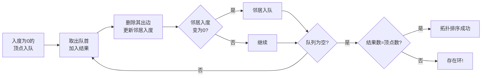

## 1. 算法定位

拓扑排序是针对**有向无环图（DAG）**的线性排序算法，将所有顶点排成一个序列，使得每条有向边 (u, v) 中 u 都排在 v 前面。广泛应用于任务调度、课程安排、编译依赖等场景。

## 2. 一句话理解

> 在保证"先修课程先修完"的前提下，将所有课程排成一个**合理的学习顺序**。

## 3. 生活化比喻

想象大学选课：
- 学"数据结构"之前必须先学"程序设计"
- 学"算法"之前必须先学"数据结构"和"离散数学"
- 拓扑排序就是帮你找到一个**合法的选课顺序**，确保每门课的前置课程都已修完

## 4. 核心思想

**前提条件：** 图必须是DAG（有向无环图），有环则无法拓扑排序。

**两种实现方式：**

| 方法 | 核心思想 | 复杂度 |
|------|---------|--------|
| Kahn算法（BFS） | 不断移除入度为0的顶点 | O(V+E) |
| DFS后序法 | DFS完成后逆序即为拓扑序 | O(V+E) |

**入度**：指向某顶点的边数（有多少个前置依赖）

## 5. 图解推演

### 示例：课程依赖关系

```
课程依赖图:
  0(程序设计) → 1(数据结构) → 3(算法)
                    ↑            ↑
  2(离散数学) ──────┘────────────┘
                    |
                    → 4(编译原理)

边: 0→1, 1→3, 2→1, 2→3, 2→4
```

### Kahn算法执行过程

```
初始入度: 顶点0=0, 顶点1=2, 顶点2=0, 顶点3=2, 顶点4=1

步骤1: 入度为0的顶点: {0, 2}, 选择0
  移除0及其出边(0→1)
  更新入度: 顶点1=1
  结果: [0]

步骤2: 入度为0的顶点: {2}, 选择2
  移除2及其出边(2→1, 2→3, 2→4)
  更新入度: 顶点1=0, 顶点3=1, 顶点4=0
  结果: [0, 2]

步骤3: 入度为0的顶点: {1, 4}, 选择1
  移除1及其出边(1→3)
  更新入度: 顶点3=0
  结果: [0, 2, 1]

步骤4: 入度为0的顶点: {4, 3}, 选择4
  移除4（无出边）
  结果: [0, 2, 1, 4]

步骤5: 入度为0的顶点: {3}, 选择3
  移除3（无出边）
  结果: [0, 2, 1, 4, 3]

最终拓扑序: 0 → 2 → 1 → 4 → 3
（即：程序设计 → 离散数学 → 数据结构 → 编译原理 → 算法）
```

### 有环检测

```
如果存在环: A → B → C → A

入度永远不会变为0，最终队列为空但未处理完所有顶点
→ 检测到环！
```



## 6. 执行步骤

### Kahn算法步骤
1. 计算所有顶点的入度
2. 将所有入度为0的顶点加入队列
3. 循环：取出队首顶点，加入结果
4. 遍历该顶点的所有出边，将目标顶点入度减1
5. 如果目标顶点入度变为0，加入队列
6. 直到队列为空
7. 如果结果长度 ≠ 顶点数 → 存在环

### DFS法步骤
1. 对每个未访问的顶点执行DFS
2. DFS中先递归处理所有邻居
3. 邻居全部处理完后，将当前顶点压入栈
4. 最终栈中弹出顺序即为拓扑序

## 7. C# 实现

```csharp
using System;
using System.Collections.Generic;

/// <summary>
/// 拓扑排序算法实现
/// </summary>
public class TopologicalSort
{
    /// <summary>
    /// Kahn算法（BFS方式）
    /// 核心思想：不断移除入度为0的顶点
    /// </summary>
    /// <param name="numVertices">顶点数量</param>
    /// <param name="edges">边的列表，每条边为(from, to)</param>
    /// <returns>拓扑排序结果，如果有环返回空列表</returns>
    public List<int> KahnSort(int numVertices, List<(int from, int to)> edges)
    {
        // 构建邻接表和计算入度
        var adjList = new List<List<int>>();
        var inDegree = new int[numVertices];

        for (int i = 0; i < numVertices; i++)
            adjList.Add(new List<int>());

        foreach (var (from, to) in edges)
        {
            adjList[from].Add(to);
            inDegree[to]++;  // 目标顶点入度+1
        }

        // 将所有入度为0的顶点加入队列
        var queue = new Queue<int>();
        for (int i = 0; i < numVertices; i++)
        {
            if (inDegree[i] == 0)
                queue.Enqueue(i);
        }

        var result = new List<int>();

        while (queue.Count > 0)
        {
            int vertex = queue.Dequeue();
            result.Add(vertex);  // 加入拓扑序列

            // 移除该顶点的所有出边
            foreach (int neighbor in adjList[vertex])
            {
                inDegree[neighbor]--;  // 邻居入度减1

                // 如果邻居入度变为0，加入队列
                if (inDegree[neighbor] == 0)
                    queue.Enqueue(neighbor);
            }
        }

        // 检查是否所有顶点都已处理（检测环）
        if (result.Count != numVertices)
        {
            Console.WriteLine("警告：图中存在环，无法完成拓扑排序！");
            return new List<int>();  // 有环，返回空
        }

        return result;
    }

    /// <summary>
    /// DFS方式的拓扑排序
    /// 核心思想：DFS后序的逆序就是拓扑序
    /// </summary>
    public List<int> DFSSort(int numVertices, List<(int from, int to)> edges)
    {
        // 构建邻接表
        var adjList = new List<List<int>>();
        for (int i = 0; i < numVertices; i++)
            adjList.Add(new List<int>());

        foreach (var (from, to) in edges)
            adjList[from].Add(to);

        var visited = new int[numVertices];  // 0:未访问 1:访问中 2:已完成
        var stack = new Stack<int>();        // 存储拓扑序（逆序）
        bool hasCycle = false;

        // 对每个未访问的顶点执行DFS
        for (int i = 0; i < numVertices; i++)
        {
            if (visited[i] == 0)
            {
                if (!DFSHelper(i, adjList, visited, stack))
                {
                    hasCycle = true;
                    break;
                }
            }
        }

        if (hasCycle)
        {
            Console.WriteLine("警告：图中存在环，无法完成拓扑排序！");
            return new List<int>();
        }

        // 栈中弹出顺序就是拓扑序
        var result = new List<int>();
        while (stack.Count > 0)
            result.Add(stack.Pop());

        return result;
    }

    /// <summary>
    /// DFS辅助函数
    /// </summary>
    /// <returns>是否无环（true=无环）</returns>
    private bool DFSHelper(int vertex, List<List<int>> adjList, int[] visited, Stack<int> stack)
    {
        visited[vertex] = 1;  // 标记为"访问中"

        foreach (int neighbor in adjList[vertex])
        {
            if (visited[neighbor] == 1)
                return false;  // 发现"访问中"的节点 → 有环！

            if (visited[neighbor] == 0)
            {
                if (!DFSHelper(neighbor, adjList, visited, stack))
                    return false;
            }
        }

        visited[vertex] = 2;   // 标记为"已完成"
        stack.Push(vertex);     // 完成后压入栈
        return true;
    }

    /// <summary>
    /// 实际应用：课程表问题
    /// 给定课程数和先修关系，判断能否完成所有课程
    /// </summary>
    public bool CanFinish(int numCourses, int[][] prerequisites)
    {
        var inDegree = new int[numCourses];
        var adjList = new List<List<int>>();

        for (int i = 0; i < numCourses; i++)
            adjList.Add(new List<int>());

        // prerequisites[i] = [course, prerequisite]
        // 即 prerequisite → course
        foreach (var pair in prerequisites)
        {
            adjList[pair[1]].Add(pair[0]);
            inDegree[pair[0]]++;
        }

        var queue = new Queue<int>();
        for (int i = 0; i < numCourses; i++)
        {
            if (inDegree[i] == 0)
                queue.Enqueue(i);
        }

        int count = 0;
        while (queue.Count > 0)
        {
            int course = queue.Dequeue();
            count++;

            foreach (int next in adjList[course])
            {
                inDegree[next]--;
                if (inDegree[next] == 0)
                    queue.Enqueue(next);
            }
        }

        return count == numCourses;  // 所有课程都能修完
    }
}

/// <summary>
/// 测试程序
/// </summary>
public class Program
{
    public static void Main()
    {
        var topo = new TopologicalSort();

        // 示例：课程依赖关系
        // 0:程序设计 1:数据结构 2:离散数学 3:算法 4:编译原理
        Console.WriteLine("=== 课程依赖关系 ===");
        Console.WriteLine("0(程序设计)→1(数据结构)");
        Console.WriteLine("2(离散数学)→1(数据结构)");
        Console.WriteLine("1(数据结构)→3(算法)");
        Console.WriteLine("2(离散数学)→3(算法)");
        Console.WriteLine("2(离散数学)→4(编译原理)");

        var edges = new List<(int, int)>
        {
            (0, 1), (2, 1), (1, 3), (2, 3), (2, 4)
        };

        Console.WriteLine("\nKahn算法结果: " + string.Join(" → ", topo.KahnSort(5, edges)));
        Console.WriteLine("DFS算法结果: " + string.Join(" → ", topo.DFSSort(5, edges)));

        // 有环测试
        Console.WriteLine("\n=== 有环图测试 ===");
        var cycleEdges = new List<(int, int)>
        {
            (0, 1), (1, 2), (2, 0)  // 形成环: 0→1→2→0
        };
        topo.KahnSort(3, cycleEdges);

        // 课程表问题
        Console.WriteLine("\n=== 课程表问题 ===");
        var prereqs1 = new int[][] { new[] {1, 0}, new[] {2, 1} };
        Console.WriteLine($"课程[0→1→2]: 能否完成? {topo.CanFinish(3, prereqs1)}");

        var prereqs2 = new int[][] { new[] {1, 0}, new[] {0, 1} };
        Console.WriteLine($"课程[0↔1互为前置]: 能否完成? {topo.CanFinish(2, prereqs2)}");
    }
}
```

## 8. 示例演示

```
=== 课程依赖关系 ===
0(程序设计)→1(数据结构)
2(离散数学)→1(数据结构)
1(数据结构)→3(算法)
2(离散数学)→3(算法)
2(离散数学)→4(编译原理)

Kahn算法结果: 0 → 2 → 1 → 4 → 3
DFS算法结果: 2 → 4 → 0 → 1 → 3

=== 有环图测试 ===
警告：图中存在环，无法完成拓扑排序！

=== 课程表问题 ===
课程[0→1→2]: 能否完成? True
课程[0↔1互为前置]: 能否完成? False
```

## 9. 复杂度分析

| 算法 | 时间复杂度 | 空间复杂度 | 说明 |
|------|-----------|-----------|------|
| Kahn (BFS) | O(V+E) | O(V+E) | 邻接表+入度数组+队列 |
| DFS后序法 | O(V+E) | O(V+E) | 邻接表+visited+栈 |

> 两种方法复杂度相同，选择取决于实际需求

## 10. 易错点

1. **忘记检测环**：Kahn算法中结果数量≠顶点数说明有环
2. **DFS环检测**：需要三种状态(未访问/访问中/已完成)，仅用visited不够
3. **拓扑序不唯一**：同一个图可能有多种合法拓扑序
4. **边的方向**：依赖关系A→B表示"A是B的前置"，别搞反
5. **孤立顶点**：入度为0且出度为0的顶点，可以放在拓扑序的任何位置

## 11. 对比表

| 对比维度 | Kahn算法(BFS) | DFS后序法 |
|---------|--------------|----------|
| 实现方式 | BFS + 入度数组 | DFS + 栈 |
| 直观性 | 直观（逐步移除） | 较抽象 |
| 环检测 | 结果数≠顶点数 | 遇到"访问中"节点 |
| 输出顺序 | 直接得到正序 | 需要反转（栈） |
| 并行度 | 可以发现可并行任务 | 不容易 |
| 实际应用 | 任务调度首选 | 学术/竞赛常见 |

## 12. 前置知识与延伸

### 前置知识
- 有向图的概念
- BFS和DFS遍历
- 入度/出度概念

### 延伸学习
- **关键路径（CPM）** → 拓扑排序 + 最长路径
- **强连通分量** → Tarjan算法处理有环图
- **DAG最短/最长路径** → 拓扑序上DP
- **并行任务调度** → 拓扑排序确定可并行的任务组

### 实际应用场景

| 场景 | 说明 |
|------|------|
| 课程安排 | 确保先修课程在前 |
| 编译顺序 | 确保依赖模块先编译 |
| 任务调度 | 确保前置任务先执行 |
| 包管理 | npm/Maven依赖解析 |
| 电子表格 | 计算单元格依赖顺序 |

## 13. 记忆口诀

```
拓扑排序DAG用，有环一定排不通。
Kahn算法数入度，入度为零先入队。
取出一个减邻居，变零再入继续选。
DFS后序反过来，同样得到拓扑序。
结果不唯一正常，多种合法都算对。
```

## 14. 面试常问点

1. **什么是拓扑排序？适用条件？** → DAG的线性排序
2. **如何检测图中是否有环？** → Kahn结果数≠V，或DFS发现回边
3. **拓扑排序的时间复杂度？** → O(V+E)
4. **课程表问题怎么解？** → 建图 + 拓扑排序（LeetCode 207/210）
5. **拓扑排序是否唯一？** → 不一定，取决于图结构
6. **Kahn和DFS方法各自优缺点？** → Kahn更直观可发现并行度

## 15. 一页总结

```
┌─────────────────────────────────────────────────────┐
│              拓扑排序 · 一页总结                       │
├─────────────────────────────────────────────────────┤
│ 适用：有向无环图(DAG) 的线性排序                      │
│ 含义：每条边(u,v)中 u 排在 v 前面                     │
├─────────────────────────────────────────────────────┤
│ Kahn算法：入度为0 → 入队 → 取出 → 邻居入度减1        │
│ DFS法：后序遍历逆序 = 拓扑序                          │
├─────────────────────────────────────────────────────┤
│ 复杂度：O(V+E) 时间，O(V+E) 空间                     │
├─────────────────────────────────────────────────────┤
│ 环检测：结果数 ≠ 顶点数 → 存在环                     │
├─────────────────────────────────────────────────────┤
│ 应用：课程安排、编译依赖、任务调度                     │
└─────────────────────────────────────────────────────┘
```
