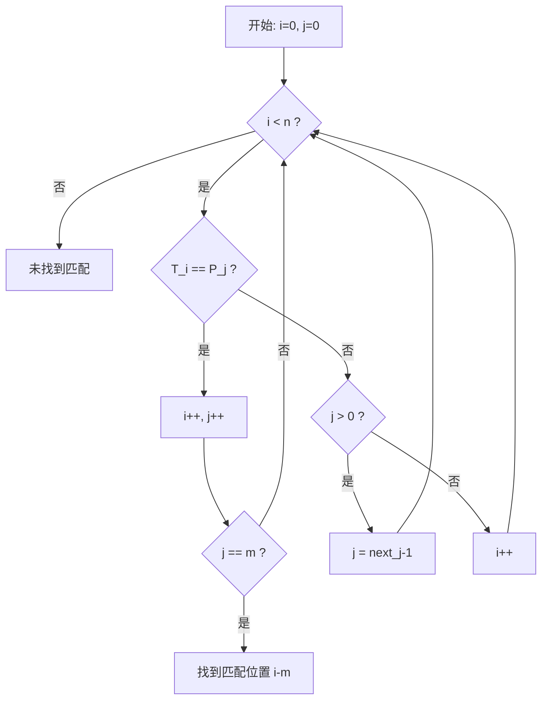

## 1. 算法定位

KMP（Knuth-Morris-Pratt）算法是字符串匹配的经典算法，通过预处理模式串构建**失败函数（next数组）**，在匹配失败时避免文本串指针回退，实现O(n+m)的高效匹配。是面试和竞赛中的高频考点。

## 2. 一句话理解

> 利用模式串自身的**前缀和后缀的重复信息**，在匹配失败时将模式串**智能跳转**而非回到起点，文本串指针永远不回退。

## 3. 生活化比喻

你在一本书里找"ABCABD"这个词：
- 读到"ABCAB"时发现下一个字符不是"D"
- 朴素方法：从第2个字符重新开始
- KMP方法：你注意到已读的"ABCAB"中，结尾"AB"和开头"AB"相同，所以直接从模式串第3个字符"C"继续比对，不需要回头重读

就像一个聪明的读者，**记住已经读过的信息**，避免重复阅读。

## 4. 核心思想

### 关键概念：前缀函数（next数组）

对于模式串P的每个位置j，next[j]表示P[0..j]这个子串中，**最长的相等真前缀和真后缀的长度**。

```
模式串: A B C A B D
位置:   0 1 2 3 4 5

next[0] = 0  (单个字符无真前缀/后缀)
next[1] = 0  "AB" → 前缀{A}, 后缀{B}, 无相等
next[2] = 0  "ABC" → 前缀{A,AB}, 后缀{C,BC}, 无相等
next[3] = 1  "ABCA" → 前缀{A,AB,ABC}, 后缀{A,CA,BCA}, A=A ✓
next[4] = 2  "ABCAB" → 前缀{A,AB,ABC,ABCA}, 后缀{B,AB,CAB,BCAB}, AB=AB ✓
next[5] = 0  "ABCABD" → 无相等前后缀

next = [0, 0, 0, 1, 2, 0]
```

### 核心原理

```
当P[j]与T[i]不匹配时：
  → 不回退i（文本串指针不动）
  → 将j跳转到next[j-1]（利用已匹配部分的前后缀信息）

为什么可以跳？因为P[0..next[j-1]-1] = P[j-next[j-1]..j-1] = T[i-next[j-1]..i-1]
即模式串的前缀等于当前匹配窗口的后缀，不需要重新比较
```

## 5. 图解推演

### next数组构建详解

以模式串 P = "ABABC" 为例：

```
构建过程（自匹配过程）:
P: A B A B C
   ↑
j=0: next[0] = 0 (定义)

j=1: P[1]='B', 比较P[1]与P[0]='A'
     'B' ≠ 'A' → next[1] = 0

j=2: P[2]='A', 比较P[2]与P[0]='A'
     'A' = 'A' → next[2] = 0 + 1 = 1

j=3: P[3]='B', 上次len=1, 比较P[3]与P[1]='B'
     'B' = 'B' → next[3] = 1 + 1 = 2

j=4: P[4]='C', 上次len=2, 比较P[4]与P[2]='A'
     'C' ≠ 'A' → len = next[len-1] = next[1] = 0
     比较P[4]与P[0]='A'
     'C' ≠ 'A' → next[4] = 0

最终: next = [0, 0, 1, 2, 0]
```

### 更复杂的例子：P = "AABAABAAA"

```
P:    A  A  B  A  A  B  A  A  A
位置: 0  1  2  3  4  5  6  7  8

j=0: next[0] = 0

j=1: P[1]='A' vs P[0]='A' → 匹配! next[1] = 1

j=2: P[2]='B' vs P[1]='A' → 失配
     len = next[0] = 0
     P[2]='B' vs P[0]='A' → 失配
     next[2] = 0

j=3: P[3]='A' vs P[0]='A' → 匹配! next[3] = 1

j=4: P[4]='A' vs P[1]='A' → 匹配! next[4] = 2

j=5: P[5]='B' vs P[2]='B' → 匹配! next[5] = 3

j=6: P[6]='A' vs P[3]='A' → 匹配! next[6] = 4

j=7: P[7]='A' vs P[4]='A' → 匹配! next[7] = 5

j=8: P[8]='A' vs P[5]='B' → 失配
     len = next[4] = 2
     P[8]='A' vs P[2]='B' → 失配
     len = next[1] = 1
     P[8]='A' vs P[1]='A' → 匹配! next[8] = 2

最终: next = [0, 1, 0, 1, 2, 3, 4, 5, 2]
```

### KMP匹配过程

文本串 T = "ABABDABABC"，模式串 P = "ABABC"，next = [0, 0, 1, 2, 0]

```
步骤1: i=0, j=0
  T: A B A B D A B A B C
     ↑
  P: A B A B C
     ↑
  T[0]='A' = P[0]='A' → 匹配, i=1, j=1

步骤2: i=1, j=1
  T[1]='B' = P[1]='B' → 匹配, i=2, j=2

步骤3: i=2, j=2
  T[2]='A' = P[2]='A' → 匹配, i=3, j=3

步骤4: i=3, j=3
  T[3]='B' = P[3]='B' → 匹配, i=4, j=4

步骤5: i=4, j=4  ← 关键步骤！
  T[4]='D' ≠ P[4]='C' → 失配!
  j = next[j-1] = next[3] = 2  ← 跳到位置2（利用"AB"="AB"的信息）
  注意: i保持不动! 不回退!

  相当于模式串右移了:
  T: A B A B D A B A B C
         ↑
  P:     A B A B C    ← 模式串滑动后,已知P[0..1]="AB"与T[2..3]匹配
             ↑ j=2

步骤6: i=4, j=2
  T[4]='D' ≠ P[2]='A' → 失配!
  j = next[j-1] = next[1] = 0

步骤7: i=4, j=0
  T[4]='D' ≠ P[0]='A' → 失配!
  j已经是0了, i++, i=5

步骤8: i=5, j=0
  T[5]='A' = P[0]='A' → 匹配, i=6, j=1

步骤9: i=6, j=1
  T[6]='B' = P[1]='B' → 匹配, i=7, j=2

步骤10: i=7, j=2
  T[7]='A' = P[2]='A' → 匹配, i=8, j=3

步骤11: i=8, j=3
  T[8]='B' = P[3]='B' → 匹配, i=9, j=4

步骤12: i=9, j=4
  T[9]='C' = P[4]='C' → 匹配, i=10, j=5

j = m = 5 → 完全匹配！匹配位置 = i - m = 10 - 5 = 5
```

### 对比朴素算法

```
朴素算法: 总比较次数 ≈ 16次（含回退重比）
KMP算法:  总比较次数 = 12次（i从不回退）

关键区别：
朴素: 失配后 → i回退到i-j+1, j=0
KMP:  失配后 → i不动, j=next[j-1]
```

### 流程图



## 6. 执行步骤

### next数组构建步骤
1. next[0] = 0（第一个字符无真前后缀）
2. 用双指针：len表示当前最长匹配前缀长度，i遍历模式串
3. 如果 P[i] == P[len] → next[i] = len + 1, len++, i++
4. 如果不匹配且 len > 0 → len = next[len-1]（回溯到更短的前缀）
5. 如果不匹配且 len == 0 → next[i] = 0, i++

### 匹配步骤
1. 同时用指针 i（文本）和 j（模式）
2. 如果 T[i] == P[j] → 两者同时前进
3. 如果不匹配且 j > 0 → j = next[j-1]（模式串跳转）
4. 如果不匹配且 j == 0 → i++（文本串前进一位）
5. 如果 j == m → 找到匹配

## 7. C# 实现

```csharp
using System;
using System.Collections.Generic;

/// <summary>
/// KMP字符串匹配算法
/// </summary>
public class KMPAlgorithm
{
    /// <summary>
    /// 构建next数组（部分匹配表 / 失败函数）
    /// next[i] = P[0..i] 中最长相等真前缀和真后缀的长度
    /// 时间复杂度: O(m)
    /// </summary>
    public int[] BuildNext(string pattern)
    {
        int m = pattern.Length;
        var next = new int[m];
        next[0] = 0;  // 第一个字符的最长前后缀长度为0

        int len = 0;  // 当前最长匹配前缀的长度
        int i = 1;    // 从第二个字符开始计算

        while (i < m)
        {
            if (pattern[i] == pattern[len])
            {
                // 当前字符与前缀的下一个字符匹配
                len++;
                next[i] = len;
                i++;
            }
            else
            {
                if (len > 0)
                {
                    // 不匹配，但之前有匹配的前缀
                    // 回退到上一个可能的前缀位置
                    len = next[len - 1];
                    // 注意：这里i不增加，继续比较
                }
                else
                {
                    // len=0，没有匹配的前缀了
                    next[i] = 0;
                    i++;
                }
            }
        }

        return next;
    }

    /// <summary>
    /// KMP搜索：查找第一个匹配位置
    /// 时间复杂度: O(n + m)
    /// </summary>
    public int SearchFirst(string text, string pattern)
    {
        if (string.IsNullOrEmpty(pattern)) return 0;
        if (string.IsNullOrEmpty(text)) return -1;

        int n = text.Length;
        int m = pattern.Length;
        int[] next = BuildNext(pattern);

        int i = 0;  // 文本串指针（永不回退）
        int j = 0;  // 模式串指针

        while (i < n)
        {
            if (text[i] == pattern[j])
            {
                // 字符匹配，两个指针同时前进
                i++;
                j++;

                if (j == m)
                {
                    // 模式串完全匹配
                    return i - m;
                }
            }
            else
            {
                if (j > 0)
                {
                    // 利用next数组跳转模式串指针
                    // 已知P[0..next[j-1]-1] = T[i-next[j-1]..i-1]
                    j = next[j - 1];
                }
                else
                {
                    // j=0还不匹配，文本串前进一位
                    i++;
                }
            }
        }

        return -1;  // 未找到匹配
    }

    /// <summary>
    /// KMP搜索：查找所有匹配位置
    /// </summary>
    public List<int> SearchAll(string text, string pattern)
    {
        var result = new List<int>();
        if (string.IsNullOrEmpty(pattern)) return result;

        int n = text.Length;
        int m = pattern.Length;
        int[] next = BuildNext(pattern);

        int i = 0, j = 0;

        while (i < n)
        {
            if (text[i] == pattern[j])
            {
                i++;
                j++;

                if (j == m)
                {
                    result.Add(i - m);   // 记录匹配位置
                    j = next[j - 1];     // 继续寻找下一个匹配（允许重叠）
                }
            }
            else
            {
                if (j > 0)
                    j = next[j - 1];
                else
                    i++;
            }
        }

        return result;
    }

    /// <summary>
    /// 带详细过程输出的KMP搜索（教学用）
    /// </summary>
    public int SearchWithTrace(string text, string pattern)
    {
        int n = text.Length;
        int m = pattern.Length;
        int[] next = BuildNext(pattern);

        Console.WriteLine($"文本串 T: {text}");
        Console.WriteLine($"模式串 P: {pattern}");
        Console.WriteLine($"next数组: [{string.Join(", ", next)}]");
        Console.WriteLine();

        int i = 0, j = 0;
        int step = 0;

        while (i < n)
        {
            step++;
            if (text[i] == pattern[j])
            {
                Console.WriteLine($"步骤{step}: T[{i}]='{text[i]}' == P[{j}]='{pattern[j]}' → 匹配, i={i + 1}, j={j + 1}");
                i++;
                j++;
                if (j == m)
                {
                    Console.WriteLine($"\n匹配成功！位置 = {i - m}");
                    return i - m;
                }
            }
            else
            {
                if (j > 0)
                {
                    Console.WriteLine($"步骤{step}: T[{i}]='{text[i]}' ≠ P[{j}]='{pattern[j]}' → j跳转到next[{j - 1}]={next[j - 1]}");
                    j = next[j - 1];
                }
                else
                {
                    Console.WriteLine($"步骤{step}: T[{i}]='{text[i]}' ≠ P[0]='{pattern[0]}' → i前进, i={i + 1}");
                    i++;
                }
            }
        }

        Console.WriteLine("\n未找到匹配");
        return -1;
    }
}

/// <summary>
/// 测试程序
/// </summary>
public class Program
{
    public static void Main()
    {
        var kmp = new KMPAlgorithm();

        // 示例1: next数组构建演示
        Console.WriteLine("=== next数组构建 ===");
        string[] patterns = { "ABABC", "ABCABD", "AABAABAAA" };
        foreach (var p in patterns)
        {
            var next = kmp.BuildNext(p);
            Console.WriteLine($"模式串 \"{p}\"");
            Console.Write("  位置:  ");
            for (int i = 0; i < p.Length; i++) Console.Write($"{i} ");
            Console.Write("\n  字符:  ");
            for (int i = 0; i < p.Length; i++) Console.Write($"{p[i]} ");
            Console.Write("\n  next:  ");
            for (int i = 0; i < next.Length; i++) Console.Write($"{next[i]} ");
            Console.WriteLine("\n");
        }

        // 示例2: 匹配过程演示
        Console.WriteLine("=== KMP匹配过程 ===");
        kmp.SearchWithTrace("ABABDABABC", "ABABC");

        // 示例3: 查找所有匹配
        Console.WriteLine("\n=== 查找所有匹配位置 ===");
        string text = "ABABABABC";
        string pattern = "ABAB";
        var positions = kmp.SearchAll(text, pattern);
        Console.WriteLine($"文本: \"{text}\"");
        Console.WriteLine($"模式: \"{pattern}\"");
        Console.WriteLine($"匹配位置: [{string.Join(", ", positions)}]");

        // 示例4: 与朴素算法对比
        Console.WriteLine("\n=== 复杂度对比 ===");
        string longText = new string('A', 10000) + "B";
        string longPattern = new string('A', 100) + "B";
        Console.WriteLine($"文本长度: {longText.Length}, 模式长度: {longPattern.Length}");

        var sw = System.Diagnostics.Stopwatch.StartNew();
        kmp.SearchFirst(longText, longPattern);
        sw.Stop();
        Console.WriteLine($"KMP耗时: {sw.ElapsedTicks} ticks");
    }
}
```

## 8. 示例演示

```
=== next数组构建 ===
模式串 "ABABC"
  位置:  0 1 2 3 4
  字符:  A B A B C
  next:  0 0 1 2 0

模式串 "ABCABD"
  位置:  0 1 2 3 4 5
  字符:  A B C A B D
  next:  0 0 0 1 2 0

模式串 "AABAABAAA"
  位置:  0 1 2 3 4 5 6 7 8
  字符:  A A B A A B A A A
  next:  0 1 0 1 2 3 4 5 2

=== KMP匹配过程 ===
文本串 T: ABABDABABC
模式串 P: ABABC
next数组: [0, 0, 1, 2, 0]

步骤1: T[0]='A' == P[0]='A' → 匹配, i=1, j=1
步骤2: T[1]='B' == P[1]='B' → 匹配, i=2, j=2
步骤3: T[2]='A' == P[2]='A' → 匹配, i=3, j=3
步骤4: T[3]='B' == P[3]='B' → 匹配, i=4, j=4
步骤5: T[4]='D' ≠ P[4]='C' → j跳转到next[3]=2
步骤6: T[4]='D' ≠ P[2]='A' → j跳转到next[1]=0
步骤7: T[4]='D' ≠ P[0]='A' → i前进, i=5
步骤8: T[5]='A' == P[0]='A' → 匹配, i=6, j=1
步骤9: T[6]='B' == P[1]='B' → 匹配, i=7, j=2
步骤10: T[7]='A' == P[2]='A' → 匹配, i=8, j=3
步骤11: T[8]='B' == P[3]='B' → 匹配, i=9, j=4
步骤12: T[9]='C' == P[4]='C' → 匹配, i=10, j=5

匹配成功！位置 = 5

=== 查找所有匹配位置 ===
文本: "ABABABABC"
模式: "ABAB"
匹配位置: [0, 2, 4]
```

## 9. 复杂度分析

| 阶段 | 时间复杂度 | 空间复杂度 | 说明 |
|------|-----------|-----------|------|
| 构建next数组 | O(m) | O(m) | m为模式串长度 |
| 匹配过程 | O(n) | O(1) | n为文本串长度，i永不回退 |
| 总体 | O(n+m) | O(m) | 预处理+匹配 |

### 为什么是O(n)？

```
关键观察：在匹配过程中
- i只会增加，不会减少（最多增加n次）
- j虽然可能跳转回退，但j的总增加量 ≤ n（因为j每增加一次i也增加一次）
- j的总减少量 ≤ j的总增加量 ≤ n
- 所以总操作次数 ≤ 2n = O(n)
```

## 10. 易错点

1. **next数组的定义**：有的教材从-1开始（next[0]=-1），有的从0开始（next[0]=0），注意区分
2. **len的回溯**：构建next时，`len = next[len-1]` 而不是 `len--`
3. **匹配成功后继续**：找到匹配后 `j = next[j-1]` 继续搜索，不是j=0
4. **边界条件**：空串和单字符串的处理
5. **next数组理解**：next[j]不是"跳到哪个位置"，而是"已匹配的前缀长度"，跳转目标就是next[j-1]

### 常见错误对比

```csharp
// 错误写法：构建next时直接len--
if (pattern[i] != pattern[len])
{
    len--;  // 错误！应该是 len = next[len-1]
}

// 正确写法：利用已有next信息跳转
if (pattern[i] != pattern[len])
{
    if (len > 0)
        len = next[len - 1];  // 正确：跳到更短的匹配前缀
    else
    {
        next[i] = 0;
        i++;
    }
}
```

## 11. 对比表

| 对比维度 | 朴素匹配 | KMP |
|---------|---------|-----|
| 文本指针 | 会回退 | 不回退 |
| 时间(最差) | O(n*m) | O(n+m) |
| 空间 | O(1) | O(m) |
| 预处理 | 无 | O(m)构建next |
| 核心思想 | 暴力枚举 | 利用前缀信息 |
| 实现难度 | 简单 | 中等偏难 |
| 适用场景 | 简单情况 | 长文本/重复模式 |

### next数组不同写法对比

| 写法 | next[0] | 含义 | 跳转方式 |
|------|---------|------|---------|
| 本文写法 | 0 | 最长前后缀长度 | j = next[j-1] |
| 教材写法(-1) | -1 | 失败时跳转位置 | j = next[j] |

## 12. 前置知识与延伸

### 前置知识
- 朴素字符串匹配
- 字符串前缀/后缀概念
- 双指针技巧

### 延伸学习
- **扩展KMP (Z算法)** → 求每个位置与整个串的最长公共前缀
- **AC自动机** → KMP的多模式串推广（Trie + 失败指针）
- **后缀数组** → 更强大的字符串匹配工具
- **Boyer-Moore** → 另一种高效匹配算法

### KMP的应用场景

| 应用 | 说明 |
|------|------|
| 文本编辑器查找 | Ctrl+F 的底层实现 |
| 重复子串检测 | 利用next数组判断周期 |
| 最短循环节 | 如果 m % (m - next[m-1]) == 0，则循环节长度为 m - next[m-1] |
| DNA序列匹配 | 生物信息学中的基因查找 |

### 利用next数组的妙用

```
判断字符串是否有循环结构：
P = "ABCABCABC"
next = [0,0,0,1,2,3,4,5,6]

循环节长度 = m - next[m-1] = 9 - 6 = 3
m % 3 == 0 → "ABC"重复3次

P = "ABCABD"
next = [0,0,0,1,2,0]
循环节长度 = 6 - 0 = 6
6 % 6 == 0，但循环节=整个串 → 没有更短循环
```

## 13. 记忆口诀

```
KMP三步走：
一、建next看前后缀，最长相等记长度。
二、匹配时i不回退，失配j跳next去。
三、j为零i才加一，j到m就是答案。

next数组怎么建：
len记录匹配长，P[i]等P[len]就加一。
不等就回退，len跳到next[len-1]。
len为零记零走下一。

口诀总结：
前缀后缀找最长，失配跳转不回头。
时间复杂n加m，空间只要m就够。
```

## 14. 面试常问点

1. **KMP算法的核心思想？** → 预处理模式串前缀信息，失配时智能跳转
2. **next数组的含义？** → P[0..j]的最长相等真前缀和真后缀长度
3. **为什么KMP是O(n+m)？** → 文本指针不回退，模式指针总跳转次数有界
4. **手写next数组构建** → 核心：匹配时len++，不匹配时len=next[len-1]
5. **手写KMP匹配过程** → i不回退，j按next跳转
6. **KMP与朴素算法的区别？** → 文本指针不回退，利用已匹配信息
7. **如何判断字符串的最短循环节？** → m - next[m-1]
8. **next数组的-1写法和0写法有什么区别？** → 本质相同，跳转方式不同

## 15. 一页总结

```
┌─────────────────────────────────────────────────────────────┐
│                    KMP算法 · 一页总结                          │
├─────────────────────────────────────────────────────────────┤
│ 核心：构建next数组 + 失配时模式串指针智能跳转                   │
├─────────────────────────────────────────────────────────────┤
│ next[j] = P[0..j]最长相等真前缀和真后缀的长度                  │
│                                                               │
│ 构建: len=0, i=1                                              │
│   P[i]==P[len] → next[i]=++len, i++                          │
│   P[i]≠P[len] → len>0? len=next[len-1] : next[i]=0,i++      │
├─────────────────────────────────────────────────────────────┤
│ 匹配: i=0(文本), j=0(模式)                                    │
│   T[i]==P[j] → i++,j++; j==m则找到                           │
│   T[i]≠P[j] → j>0? j=next[j-1] : i++                       │
├─────────────────────────────────────────────────────────────┤
│ 复杂度: 时间O(n+m)  空间O(m)                                  │
├─────────────────────────────────────────────────────────────┤
│ 关键: i永不回退 | next是自匹配过程 | 可求循环节                 │
└─────────────────────────────────────────────────────────────┘
```
