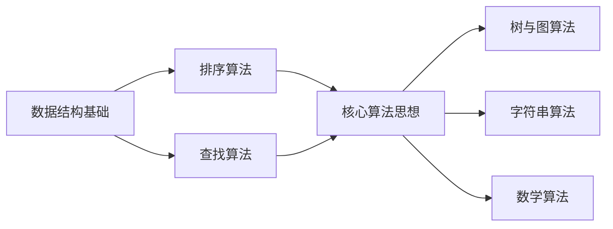

# C# 算法知识库

从零开始，系统化掌握算法与数据结构。不是零散的刷题笔记，而是一套可反复复习、持续扩展的 C# 算法知识体系。

## 学习路线

> 建议按编号顺序学习，每个模块的前置知识已在文中标注。

---

## 01. 数据结构基础

万丈高楼平地起，数据结构是算法的地基。

- [数组](01_数据结构基础/01.数组.md) —— 最基础的线性结构，随机访问 O(1)
- [链表](01_数据结构基础/02.链表.md) —— 动态存储，插入删除 O(1)
- [栈](01_数据结构基础/03.栈.md) —— 后进先出，函数调用的底层原理
- [队列](01_数据结构基础/04.队列.md) —— 先进先出，BFS 的核心容器
- [双端队列](01_数据结构基础/05.双端队列.md) —— 两头都能进出，滑动窗口的利器
- [哈希表](01_数据结构基础/06.哈希表.md) —— O(1) 查找的秘密武器
- [堆](01_数据结构基础/07.堆.md) —— 优先队列，TopK 问题必备
- [并查集](01_数据结构基础/08.并查集.md) —— 高效处理集合合并与查询

## 02. 排序算法

排序是算法入门的第一课，也是面试的常客。

- [冒泡排序](02_排序算法/01.冒泡排序.md) —— 最直观的排序，理解交换思想
- [选择排序](02_排序算法/02.选择排序.md) —— 每次找最小，简单但低效
- [插入排序](02_排序算法/03.插入排序.md) —— 像打扑克牌一样排序
- [希尔排序](02_排序算法/04.希尔排序.md) —— 插入排序的进化版
- [快速排序](02_排序算法/05.快速排序.md) —— 分治思想的经典代表
- [归并排序](02_排序算法/06.归并排序.md) —— 稳定的 O(n log n) 排序
- [堆排序](02_排序算法/07.堆排序.md) —— 利用堆结构的原地排序
- [计数排序](02_排序算法/08.计数排序.md) —— 非比较排序，突破 O(n log n) 下界
- [桶排序](02_排序算法/09.桶排序.md) —— 分桶思想，均匀分布的最优解
- [基数排序](02_排序算法/10.基数排序.md) —— 按位排序，多关键字排序

## 03. 查找算法

查找是编程中最高频的操作，选对算法效率天差地别。

- [线性查找](03_查找算法/01.线性查找.md) —— 最朴素的逐个比较
- [二分查找](03_查找算法/02.二分查找.md) —— 有序数组的杀手锏
- [哈希查找](03_查找算法/03.哈希查找.md) —— O(1) 的极致查找
- [深度优先搜索 DFS](03_查找算法/04.深度优先搜索DFS.md) —— 一条路走到黑，不到头不回头
- [广度优先搜索 BFS](03_查找算法/05.广度优先搜索BFS.md) —— 层层推进，最短路径的首选

## 04. 核心算法思想

掌握这些思想，你就拥有了解题的"武器库"。

- [递归](04_核心算法思想/01.递归.md) —— 自己调用自己，化繁为简的魔法
- [分治法](04_核心算法思想/02.分治法.md) —— 分而治之，大问题拆成小问题
- [贪心算法](04_核心算法思想/03.贪心算法.md) —— 每步最优，局部最优到全局最优
- [动态规划](04_核心算法思想/04.动态规划.md) —— 记住历史，避免重复计算
- [回溯法](04_核心算法思想/05.回溯法.md) —— 试错前进，此路不通就退回
- [双指针](04_核心算法思想/06.双指针.md) —— 两个指针协同工作的艺术
- [滑动窗口](04_核心算法思想/07.滑动窗口.md) —— 固定或可变窗口，连续子序列问题克星
- [前缀和与差分](04_核心算法思想/08.前缀和与差分.md) —— 区间求和的 O(1) 方案
- [位运算](04_核心算法思想/09.位运算.md) —— 二进制层面的极致效率
- [单调栈与单调队列](04_核心算法思想/10.单调栈与单调队列.md) —— 维护单调性的高效数据结构

## 05. 树与图算法

树和图是现实世界关系的抽象，也是算法竞赛的重头戏。

- [二叉树遍历](05_树与图算法/01.二叉树遍历.md) —— 前序/中序/后序/层序，树的基础操作
- [二叉搜索树](05_树与图算法/02.二叉搜索树.md) —— 有序的二叉树，查找插入删除全解
- [平衡树与红黑树](05_树与图算法/03.平衡树与红黑树.md) —— 保持平衡，避免退化成链表
- [Trie 字典树](05_树与图算法/04.Trie字典树.md) —— 字符串检索的专用数据结构
- [图的存储与遍历](05_树与图算法/05.图的存储与遍历.md) —— 邻接表/邻接矩阵 + DFS/BFS
- [拓扑排序](05_树与图算法/06.拓扑排序.md) —— 有向无环图的线性排序
- [最短路径算法](05_树与图算法/07.最短路径算法.md) —— Dijkstra / Bellman-Ford / Floyd
- [最小生成树](05_树与图算法/08.最小生成树.md) —— Prim / Kruskal，用最小代价连通所有点

## 06. 字符串算法

字符串处理在实际开发和面试中都极其常见。

- [朴素字符串匹配](06_字符串算法/01.朴素字符串匹配.md) —— 暴力匹配的思路与局限
- [KMP 算法](06_字符串算法/02.KMP算法.md) —— 利用已匹配信息，避免重复比较
- [Manacher 算法](06_字符串算法/03.Manacher算法.md) —— O(n) 求最长回文子串

## 07. 数学算法

算法竞赛和面试中常见的数学技巧。

- [最大公约数与最小公倍数](07_数学算法/01.最大公约数与最小公倍数.md) —— 欧几里得算法
- [素数筛](07_数学算法/02.素数筛.md) —— 埃氏筛 / 线性筛
- [快速幂](07_数学算法/03.快速幂.md) —— O(log n) 求大数幂
- [组合数学基础](07_数学算法/04.组合数学基础.md) —— 排列组合 + 杨辉三角

---

## 十大排序算法对比

| 算法 | 平均时间 | 最坏时间 | 空间 | 稳定性 |
|------|---------|---------|------|--------|
| 冒泡排序 | O(n²) | O(n²) | O(1) | 稳定 |
| 选择排序 | O(n²) | O(n²) | O(1) | 不稳定 |
| 插入排序 | O(n²) | O(n²) | O(1) | 稳定 |
| 希尔排序 | O(n log n) | O(n²) | O(1) | 不稳定 |
| 快速排序 | O(n log n) | O(n²) | O(log n) | 不稳定 |
| 归并排序 | O(n log n) | O(n log n) | O(n) | 稳定 |
| 堆排序 | O(n log n) | O(n log n) | O(1) | 不稳定 |
| 计数排序 | O(n+k) | O(n+k) | O(k) | 稳定 |
| 桶排序 | O(n+k) | O(n²) | O(n+k) | 稳定 |
| 基数排序 | O(n×k) | O(n×k) | O(n+k) | 稳定 |

---

## 学习建议

::: tip 学习路径建议
1. **第一阶段**：先学数据结构基础（数组、链表、栈、队列、哈希表）
2. **第二阶段**：掌握基础排序和查找算法，建立算法思维
3. **第三阶段**：学习核心算法思想（递归、分治、贪心、动态规划、回溯）
4. **第四阶段**：挑战树、图、字符串等进阶算法
5. **第五阶段**：通过刷题巩固，重点练习动态规划和图算法
:::

::: warning 学习误区
- 不要只背代码，要理解每一步"为什么这么做"
- 不要跳过基础直接刷难题，地基不牢地动山摇
- 不要只看不写，算法必须亲手实现才能真正掌握
:::
