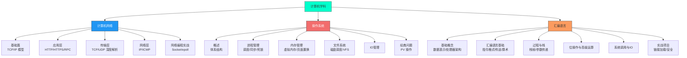

# 计算机学科

> 计算机科学的三大基石：网络、系统、底层语言。

## 专栏导航

| 专栏 | 说明 | 原著参考 |
|------|------|----------|
| [计算机网络](计算机网络/) | 从协议原理到编程实战，覆盖应用层/传输层/网络层 + Socket 编程 | 小林coding《图解网络》· 尹圣雨《TCP/IP网络编程》 |
| [汇编语言](汇编语言/) | 基于 Linux 环境的 x86 汇编，从指令到系统调用 | 《汇编语言：基于Linux环境（第3版）》 |
| [操作系统](操作系统/) | 进程/内存/文件系统/IO 全覆盖，含经典 PV 问题 | 小林coding《图解操作系统》· 王道《操作系统》· CSAPP |
