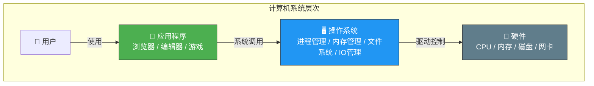
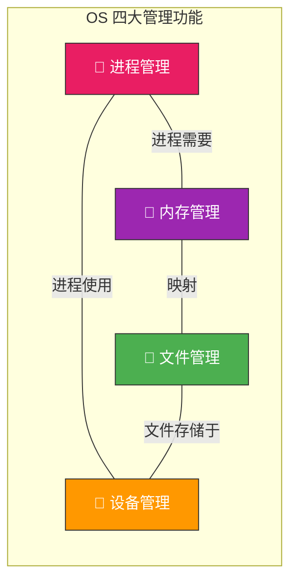
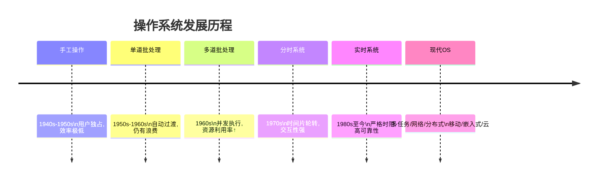
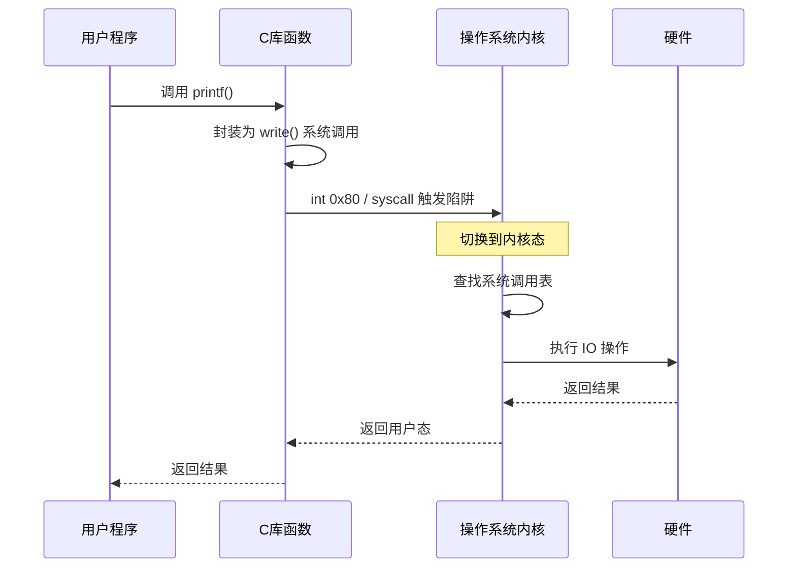

# 操作系统概述

> 如果把计算机比作一个公司，操作系统就是那个事无巨细的"大管家"——它管理所有的资源（CPU、内存、磁盘、外设），调度所有的"员工"（进程），确保每个人都能各司其职、互不干扰。

## 一、什么是操作系统？

操作系统（Operating System, OS）是**控制和管理整个计算机硬件与软件资源**的系统软件，它为用户和应用程序提供一个统一的接口，屏蔽了底层硬件的复杂性。



::: important 核心定位
操作系统是**资源管理者**和**抽象提供者**的双重角色：
- **向下**：管理硬件资源，让多个程序公平、高效地使用 CPU、内存和设备
- **向上**：提供抽象接口（系统调用），让应用程序无需关心硬件细节
:::

---

## 二、操作系统的四大功能

| 功能 | 职责 | 类比 |
|------|------|------|
| **进程管理** | 进程创建/撤销、调度、同步与通信、死锁处理 | 公司的人事调度 |
| **内存管理** | 内存分配/回收、地址映射、内存保护与共享、虚拟内存 | 公司的办公空间分配 |
| **文件管理** | 文件存储/检索、目录管理、文件共享与保护 | 公司的档案室 |
| **设备管理** | 设备分配/回收、缓冲管理、中断处理、SPOOLing | 公司的设备借用处 |



---

## 三、操作系统的发展历程

### 3.1 手工操作阶段

用户独占全机，CPU 利用率极低。人机速度差距巨大——人操作卡片读入的时间，CPU 全在空等。

### 3.2 批处理系统

- **单道批处理**：内存中只有一道程序，自动转入下一道，但 CPU 仍有大量空闲（等 IO 时）
- **多道批处理**：内存中同时放多道程序，**一道等 IO 时切换到另一道**，CPU 利用率大幅提升

::: tip 多道程序设计的精髓
多道程序设计是操作系统发展的分水岭。它让"并发"成为可能——宏观上多道程序同时运行，微观上 CPU 仍在交替执行。这就好比一个厨师同时照看多个锅，哪个锅需要翻炒就翻哪个。
:::

### 3.3 分时操作系统

将 CPU 时间划分为时间片，多个用户轮流使用。特点是**交互性强**，每个用户都觉得自己独占机器。

### 3.4 实时操作系统

在严格的时间限制内完成任务。硬实时（如工业控制）绝对不能超时，软实时（如视频播放）偶尔超时可容忍。



---

## 四、操作系统的基本特征

### 4.1 并发（Concurrency）

并发是指**宏观上**多个事件同时发生，**微观上**交替执行。与之区分：

| 概念 | 含义 | CPU 要求 |
|------|------|---------|
| **并发** | 同一时间段内多道程序执行 | 单核即可 |
| **并行** | 同一时刻多道程序同时执行 | 需要多核/多CPU |

### 4.2 共享（Sharing）

系统资源被多个进程共同使用，分为两种方式：

- **互斥共享**：一段时间内只允许一个进程访问（如打印机）
- **同时共享**：允许多个进程"同时"访问（如磁盘文件读）

::: warning 并发与共享互为条件
没有并发就无需共享，没有共享并发也无法实现。两者是操作系统最基本的特征，相辅相成。
:::

### 4.3 虚拟（Virtual）

把一个物理实体变为多个逻辑上的对应物。例如：
- 虚拟内存：把磁盘空间"变"成内存用
- 虚拟处理器：每个进程以为自己独占 CPU（通过分时实现）

### 4.4 异步（Asynchronism）

进程以不可预知的速度推进——走走停停。由于资源竞争，进程的执行顺序和速度都无法提前确定，但操作系统必须保证**最终结果与执行顺序无关**。

```c
// 异步的体现：两个进程交替执行，结果可能不同
// 但最终的计算结果必须一致
void process_A() {
    // 可能执行到一半就被抢占
    x = x + 1;    // 非原子操作
    printf("A: x=%d\n", x);
}

void process_B() {
    // 可能在任意时刻被调度
    x = x + 1;
    printf("B: x=%d\n", x);
}
```

---

## 五、系统调用——用户态与内核态的桥梁

### 5.1 为什么需要系统调用？

用户程序不能直接操作硬件，否则一个恶意程序就能让整个系统崩溃。操作系统通过**特权级**机制保护自己：

| 特权级 | 名称 | 能做什么 |
|--------|------|---------|
| Ring 0 | 内核态 | 访问所有硬件、执行特权指令 |
| Ring 3 | 用户态 | 只能执行非特权指令 |

### 5.2 系统调用的过程



::: important 系统调用与库函数的区别
- **系统调用**：操作系统提供的最底层接口，涉及用户态→内核态的切换，开销较大
- **库函数**：在用户态运行的函数，可能封装了系统调用（如 `printf` 内部调 `write`），也可能不涉及内核（如 `strlen`）
:::

### 5.3 系统调用的分类

| 类别 | 示例 |
|------|------|
| 进程控制 | `fork()`, `exec()`, `exit()`, `wait()` |
| 文件操作 | `open()`, `read()`, `write()`, `close()` |
| 设备管理 | `ioctl()`, `read()`, `write()` |
| 信息维护 | `getpid()`, `alarm()`, `gettimeofday()` |
| 通信 | `pipe()`, `shmget()`, `mmap()` |

---

## 六、中断——操作系统的"脉搏"

中断是操作系统得以运行的核心机制。没有中断，就没有多道程序并发。

### 6.1 中断的分类

| 类型 | 来源 | 举例 |
|------|------|------|
| **外中断（中断）** | CPU 外部 | 时钟中断、IO完成中断 |
| **内中断（异常）** | CPU 内部 | 除零错误、缺页中断、系统调用 |

### 6.2 中断处理流程

```c
// 中断处理的简化伪代码
void interrupt_handler(int interrupt_id) {
    // 1. 保存现场
    save_context(current_process);

    // 2. 查找中断向量表，转到对应处理程序
    handler = interrupt_vector_table[interrupt_id];

    // 3. 执行中断处理
    handler();

    // 4. 恢复现场
    restore_context(current_process);

    // 5. 可能进行进程调度
    if (need_reschedule) {
        schedule();
    }
}
```

::: tip 面试速查
1. **操作系统最基本特征**：并发、共享（互斥共享 + 同时共享）、虚拟、异步
2. **并发 vs 并行**：并发是宏观同时微观交替（单核即可），并行是真同时（需多核）
3. **系统调用**是用户态→内核态的唯一合法入口，通过中断/陷阱指令实现
4. **内核态与用户态切换**有开销，频繁系统调用影响性能
5. **中断**是操作系统工作的驱动力——时钟中断驱动调度，IO中断驱动设备管理
:::

---

::: info 原著参考
- 小林 coding《图解操作系统》——操作系统概述篇
- 王道考研《操作系统》——第一章 操作系统概述
- CSAPP 第九章《虚拟内存》、第八章《异常控制流》
:::
